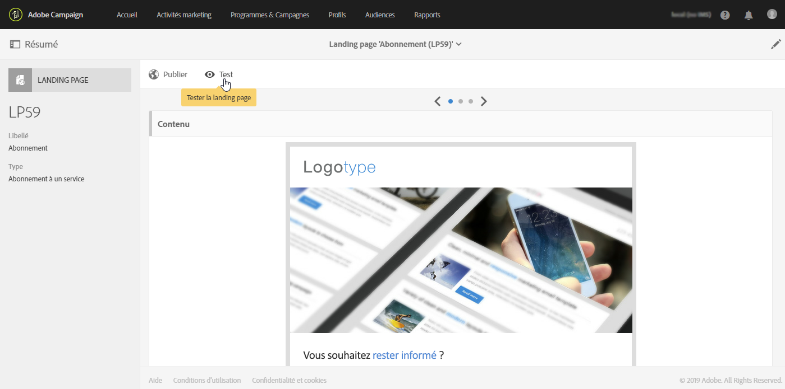

# Etapes principales pour configurer une landing page {#main-steps-create-a-landing-page}

## A propos de la création de la page d’entrée

Les principales étapes de configuration des pages d’entrée sont les suivantes :

Cette page contient des informations sur chacune de ces étapes, ainsi que des références aux documentations dédiées pour plus de détails.

## Configuration du modèle de page d’entrée {#configure-the-landing-page-template}

Avant de configurer une page d’entrée, vous devez d’abord configurer un modèle de page d’entrée correspondant à vos besoins. Une fois le modèle prêt, toutes les pages d’entrée en fonction seront préconfigurées avec les paramètres souhaités.

1. From the advanced menu, via the Adobe Campaign logo, select **[!UICONTROL Resources]** / **[!UICONTROL Templates]** / **[!UICONTROL Landing page templates]**, then duplicate the template that you want to use.
1. Dans les propriétés du modèle, spécifiez tous les paramètres que vos pages d'entrée doivent avoir en commun. Par exemple : la dimension de ciblage, les paramètres d’accès aux pages pour les visiteurs identifiés ou non, les actions spécifiques à la validation de formulaire par un visiteur, la marque/le logo à utiliser dans le contenu, etc.
1. Enregistrez vos modifications.

Pour plus d'informations sur les modèles de page d'entrée, reportez-vous à [cette section](../../channels/using/about-landing-pages.md).

## Création et configuration de la page d’entrée {#create-and-configure-the-landing-page}

Créez une nouvelle landing page dans le programme ou la campagne de votre choix, à partir du modèle défini à l'étape précédente.

1. Créez la page d’entrée en fonction du modèle souhaité.
1. Entrez les paramètres généraux de la page d'entrée (étiquette, description, etc.).
1. Vous accéderez ensuite au tableau de bord de la page d’entrée. Si nécessaire, modifiez les propriétés de la page d’entrée. Par défaut, les propriétés sont celles configurées dans le modèle de page d’entrée.
Pour des raisons de sécurité et de performances des plateformes, nous vous recommandons vivement de définir une date d’expiration dans les propriétés de la page d’entrée. Une fois cette opération terminée, la page d’entrée est automatiquement annulée à la date sélectionnée. For more on validity parameters, refer to [this section](../../channels/using/sharing-a-landing-page.md#setting-up-validity-parameters).

   

   >[!NOTE]
   >
   >Vos modifications sont effectives uniquement pour la landing page en cours d'édition. Si vous souhaitez appliquer ces modifications à d'autres landing pages, vous pouvez les effectuer dans un modèle dédié et créer d'autres landing pages à partir de ce modèle.

## Conception de la page d’entrée {#design-the-landing-page}

Vous pouvez désormais définir le contenu de la page d’entrée. Par défaut, la page d’entrée contient trois pages accessibles par des flèches de défilement : la page de contenu principale, une page de confirmation et une page d’erreur.

Plusieurs champs sont configurés par défaut sur chaque page. Si nécessaire, vous pouvez modifier leurs propriétés et leur mappage.

Vous pouvez également configurer le comportement du bouton de confirmation lorsqu’un profil clique dessus et personnaliser le contenu selon vos besoins (image, champs de personnalisation, etc.). Par exemple, vous pouvez insérer le prénom d’un profil dans la page de confirmation de la page d’entrée pour les remercier de s’être inscrit.

Pour plus d'informations sur la conception de la page d'entrée, reportez-vous à [cette section](../../channels/using/designing-a-landing-page.md).

## Test de la page d’entrée {#test-the-landing-page}

Une fois la page d'entrée définie, vous pouvez simuler son exécution et son comportement lorsqu'elle est disponible en ligne.

>[!CAUTION]
>
>Les tests de page d’entrée ne peuvent être effectués qu’avec des profils, et non avec des profils de test. Lors de l’envoi du formulaire, les données du profil sélectionné seront mises à jour en temps réel. Pour éviter de modifier des profils réels, utilisez un faux profil de client.

Si vous êtes satisfait du comportement de la page d’entrée, vous pouvez la publier pour la rendre disponible en ligne.

Pour plus d'informations sur le test d'une page d'entrée, reportez-vous à [cette section](../../channels/using/sharing-a-landing-page.md#testing-the-landing-page-).

## Publication de la page d’entrée {#publish-the-landing-page}

Une fois les tests terminés, vous pouvez publier la page d’entrée à l’aide du bouton **[!UICONTROL Publier]** de la barre d’actions du tableau de bord. Un bloc de surveillance indique la progression et l’état de la publication.

La publication de la landing page permet de la rendre accessible en ligne. Une fois publiée, vous pouvez toujours la mettre à jour : pour cela, vous devez la publier de nouveau après chaque modification. Vous pouvez également annuler la publication d’une page d’entrée à tout moment afin qu’elle ne soit plus disponible.

Une fois publiée, votre landing page est prête à être utilisée. Vous pouvez alors mettre en place différents mécanismes permettant d'y accéder afin d'acquérir de nouveaux profils dans votre base ou d'obtenir des informations complémentaires sur les profils existants.

Pour plus d’informations sur la publication des pages d’entrée, reportez-vous à [cette section](../../channels/using/sharing-a-landing-page.md#publishing-a-landing-page).
