# Gérer les SMS entrants{#managing-incoming-sms}

## Gérer les SMS STOP {#managing-stop-sms}

Lorsqu'un profil répond à un SMS envoyé par le biais de Campaign, vous pouvez configurer les messages qui lui sont automatiquement renvoyés, ainsi que l'action à exécuter.

Cette configuration est définie dans la section **[!UICONTROL Réponse automatique aux MO]** du [compte externe de routage des SMS](../../administration/using/configuring-sms-channel.md#defining-an-sms-routing). MO est l'acronyme de « Mobile Originated », ce qui signifie que vous pouvez configurer une réponse automatique au téléphone mobile qui a envoyé le SMS.

Pour ce faire :

1. Dans le menu avancé, via le logo Adobe Campaign, sélectionnez **[!UICONTROL Administration &gt; Paramétrage de l'application &gt; Comptes externes]**, puis le compte externe **[!UICONTROL Routage des SMS par SMPP]**.
1. Dans la catégorie **[!UICONTROL Réponse automatique aux MO]**, cliquez sur **[!UICONTROL Créer un élément]** pour commencer à configurer votre réponse automatique.

   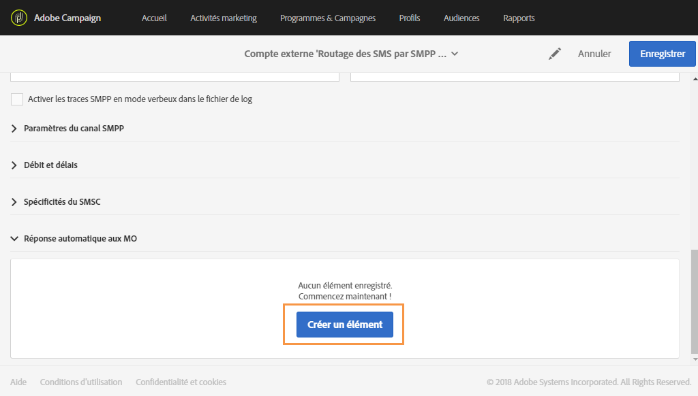

1. Sélectionnez le mot-clé qui déclenchera cette réponse automatique. Les mots-clés ne respectent pas la casse. Dans le cas présent, si les destinataires envoient le mot-clé "STOP", ils recevront la réponse automatique.

   Laissez cette colonne vide si vous souhaitez envoyer la même réponse quel que soit le mot-clé.

   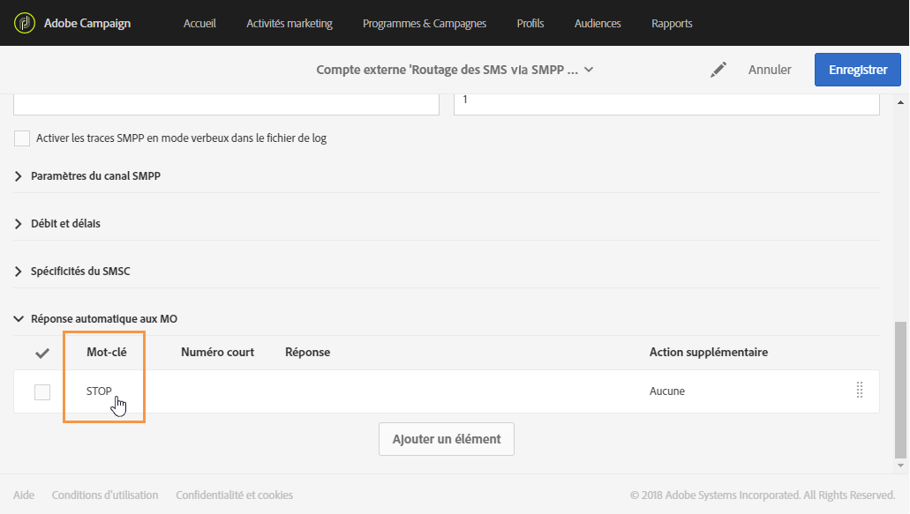

1. Dans le champ **[!UICONTROL Numéro court]**, indiquez un numéro généralement utilisé pour l'envoi des diffusions qui servira de nom d'expéditeur. Vous pouvez également laisser le champ **[!UICONTROL Numéro court]** vide pour envoyer la même réponse quel que soit le numéro court.

   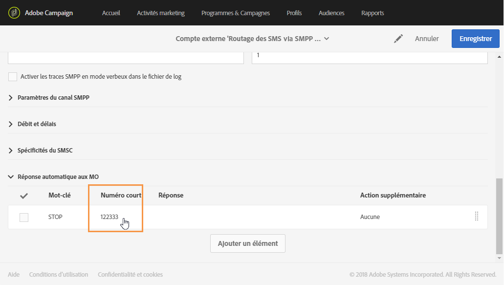

1. Saisissez la réponse à envoyer aux destinataires dans le champ **[!UICONTROL Répondre]**.

   Pour effectuer une action sans envoyer de réponse, laissez la colonne **[!UICONTROL Réponse]** vide. Cela permet par exemple de retirer de la quarantaine le numéro de téléphone d'un utilisateur qui envoie un message autre que "STOP".

   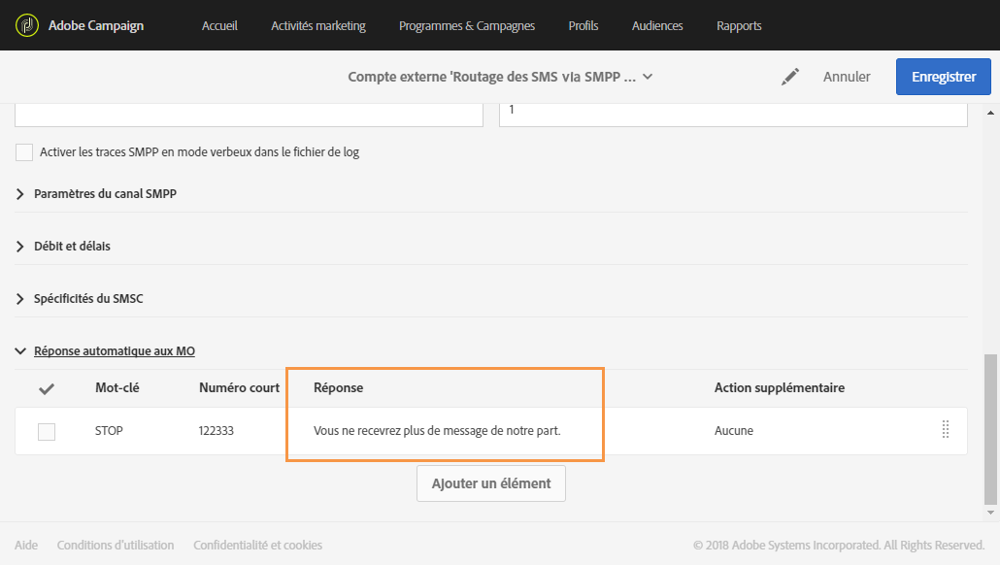

1. Dans le champ **[!UICONTROL Action supplémentaire]**, associez une action à votre réponse automatique :

   * L'action **[!UICONTROL Envoyer en quarantaine]** permet de mettre automatiquement en quarantaine le numéro de téléphone du profil.
   * L'action **[!UICONTROL Supprimer de la quarantaine]** retire de la quarantaine le numéro de téléphone du profil.
   * L'action **[!UICONTROL Aucune]** permet d'envoyer uniquement le message aux destinataires sans effectuer d'action.
   Par exemple, dans la configuration ci-dessous, si les destinataires envoient le mot-clé "STOP", ils reçoivent automatiquement une confirmation de désinscription et leur numéro de téléphone est mis en quarantaine, avec le statut **[!UICONTROL Blacklisté]**. Ce statut se rapporte uniquement au numéro de téléphone. Le profil n’est pas blacklisté afin que l’utilisateur puisse continuer à recevoir des emails.

   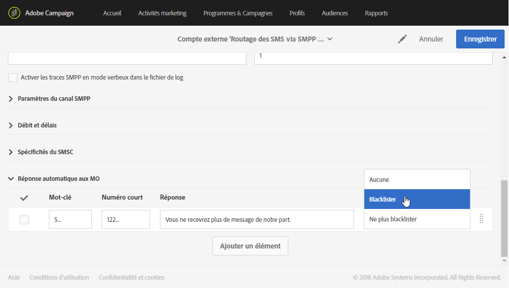

Les destinataires peuvent maintenant être automatiquement désabonnés de vos messages et mis en quarantaine avec cette réponse automatique. Les destinataires en quarantaine sont répertoriés dans la table **[!UICONTROL Adresses]** accessible via le menu **[!UICONTROL Administration]** &gt; **[!UICONTROL Canaux]** &gt; **[!UICONTROL Quarantaines]**. Pour plus d'informations sur les quarantaines, consultez cette [section](../../sending/using/understanding-quarantine-management.md).

Au besoin, ces SMS entrants peuvent être stockés. Voir à ce propos cette [section](../../channels/using/managing-incoming-sms.md#storing-incoming-sms).

## Stocker les SMS entrants  {#storing-incoming-sms}

Dans le compte externe **[!UICONTROL Routage des SMS par SMPP]**, vous pouvez choisir de stocker les messages entrants, par exemple lorsqu'un abonné répond "STOP" à un message SMS afin d'être retiré de la liste des destinataires.

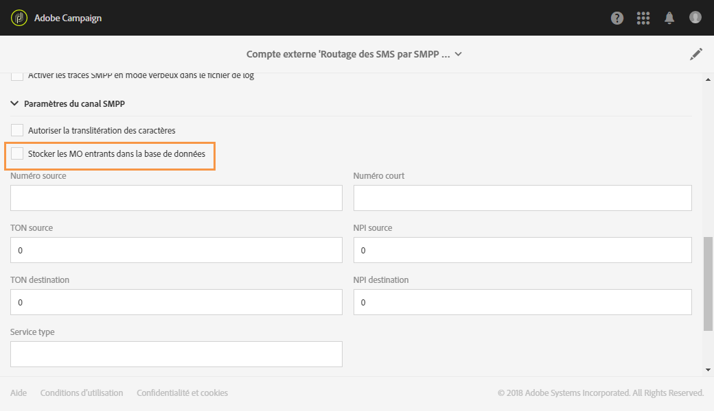

Si vous cochez **[!UICONTROL Stocker les MO entrants dans la base de données]** dans la catégorie **[!UICONTROL Paramètres du canal SMPP]**, tous les SMS seront stockés dans la table SMS entrants et peuvent être récupérés à l'aide d'une activité de requête dans un workflow.

Pour ce faire :

1. Dans le champ **[!UICONTROL Paramètres du canal SMPP]**, cochez **[!UICONTROL Stocker les MO entrants dans la base de données]**.

   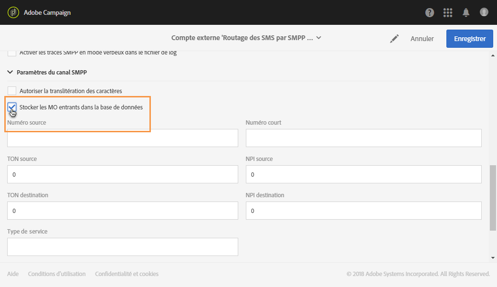

1. Dans l'onglet **[!UICONTROL Activités marketing]**, cliquez sur **[!UICONTROL Créer]**, puis sélectionnez **[!UICONTROL Workflow]**.

   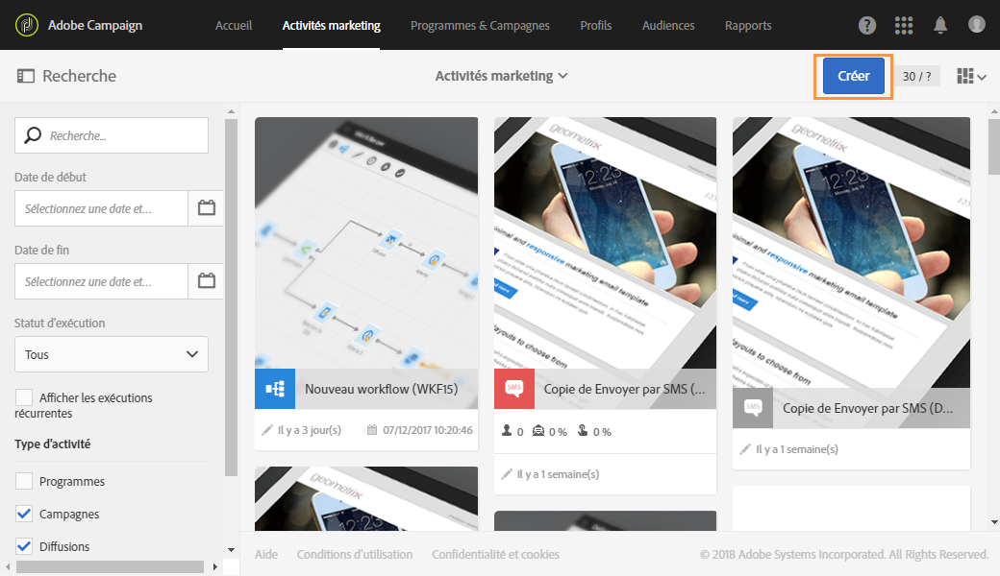

1. Sélectionnez votre type de workflow.
1. Editez les propriétés de votre workflow, puis cliquez sur **[!UICONTROL Créer]**. Pour plus d'informations sur la création de workflows, reportez-vous à cette [section](../../automating/using/building-a-workflow.md).
1. Placez une activité **[!UICONTROL Requête]** dans un workflow, puis double-cliquez sur l'activité.
1. Dans l'onglet **[!UICONTROL Propriétés]** de la requête, sélectionnez **[!UICONTROL SMS entrants]** dans le champ **[!UICONTROL Ressource]**.

   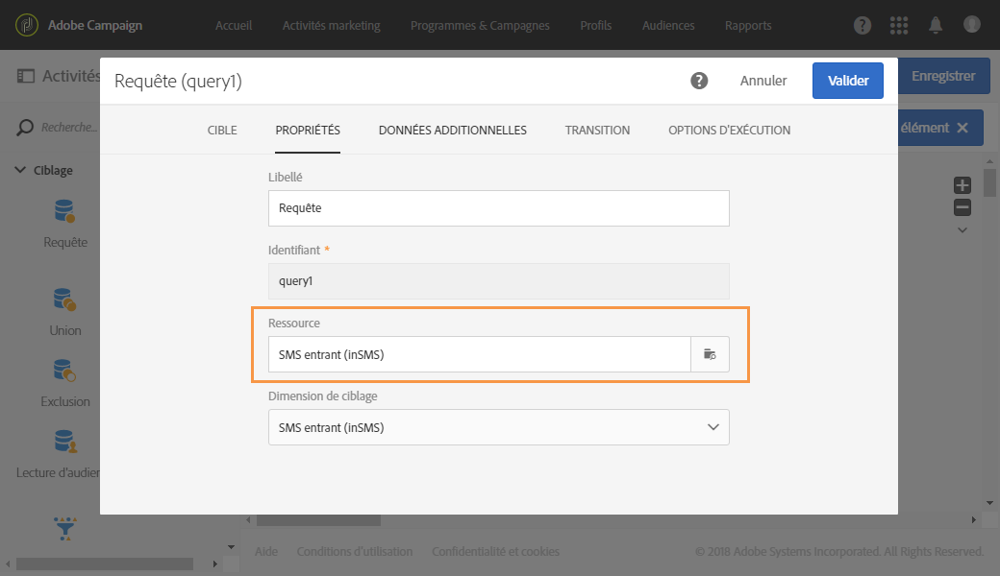

1. Ensuite, dans l'onglet **[!UICONTROL Cible]**, placez la règle **[!UICONTROL Attributs de SMS entrants]**.

   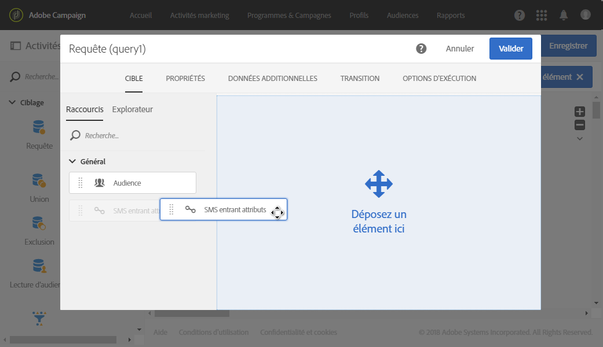

1. Nous voulons cibler ici chaque message entrant du jour précédent. Dans la catégorie **[!UICONTROL Champ]**, sélectionnez **[!UICONTROL Date de création (créé)]**.
1. Dans **[!UICONTROL Type de filtre]**, sélectionnez **[!UICONTROL Relatif]**, puis dans le **[!UICONTROL Niveau de précision]**, choisissez **[!UICONTROL Jour]**.

   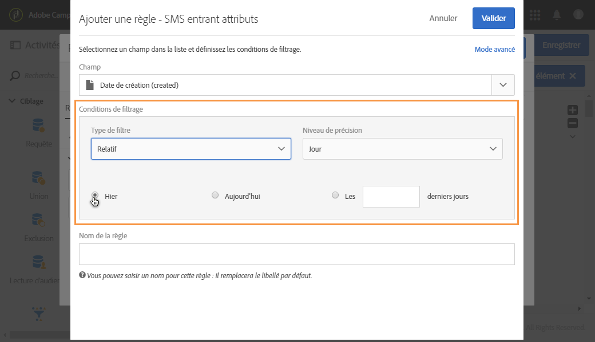

1. Vous pouvez ensuite choisir de récupérer les données à partir d'aujourd'hui, d'hier ou des derniers jours. Une fois votre requête configurée, cliquez sur **[!UICONTROL Confirmer]**.

Cette requête récupérera chaque message STOP reçu selon la période sélectionnée.

L'activité vous permet, par exemple, de créer une population et d'améliorer la personnalisation de vos diffusions.
