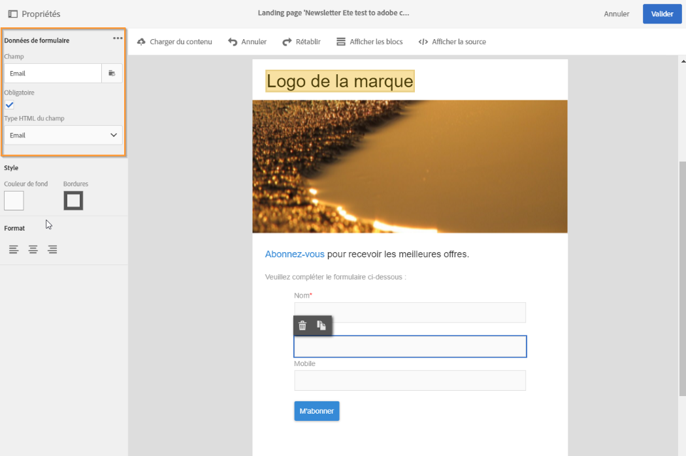

# Gestion des données de formulaire de landing page{#managing-landing-page-form-data}

## Modifier les propriétés des données d&#39;un formulaire pour une landing page{#changing-a-landing-page-form-data-properties}

Vous pouvez associer des champs de la base à des blocs de type zone de saisie, bouton radio ou case à cocher. Pour cela, sélectionnez le bloc et renseignez la partie **[!UICONTROL Données du formulaire]** dans la palette.

* La zone de sélection **Champ** permet de sélectionner un champ de la base de données à associer avec le champ du formulaire.
* L&#39;option **Obligatoire** permet de n&#39;autoriser la validation de la page que si l&#39;utilisateur a renseigné le champ. Si un champ obligatoire n&#39;est pas renseigné, un message d&#39;erreur sera affiché.

## Association des champs de formulaire     {#mapping-form-fields}

Les champs de saisie sont utilisés pour stocker ou mettre à jour les données dans la base de données Campaign. Pour cela, vous devez associer des champs de la base de données à des blocs de type zone de saisie, bouton radio ou case à cocher. Pour cela :

1. Sélectionnez un bloc dans la landing page.
1. Renseignez la partie **[!UICONTROL Données de formulaire]** de la palette.

   

1. Sélectionnez un champ de base de données à associer au champ de formulaire dans la zone de sélection **[!UICONTROL Champ.]** Les landing pages peuvent seulement être mappées avec des **profils**.

1. Si nécessaire, cochez l’option **[!UICONTROL Obligatoire]**. La page ne peut être envoyée que si l’utilisateur a renseigné ce champ. Si un champ obligatoire n&#39;est pas renseigné, un message d&#39;erreur s&#39;affiche lorsque l&#39;utilisateur valide la page.

1. Il est enfin possible de définir le type du champ en choisissant par exemple **[!UICONTROL Texte]**, **[!UICONTROL Nombre]** ou **[!UICONTROL Date]** dans la zone de sélection **[!UICONTROL Type HTML du champ.]**
Si vous sélectionnez une **[!UICONTROL case à cocher]** obligatoire, assurez-vous qu’elle est de type **[!UICONTROL Champ]**.

>[!NOTE]
>
>Les champs par défaut des landing pages intégrées sont préconfigurés. Vous pouvez les modifier si nécessaire.

## Réconciliation et stockage des données{#data-storage-and-reconciliation}

Les paramètres de réconciliation permettent de définir le mode de gestion des données entrées dans la landing page lors de sa validation par un visiteur.

Pour cela :

1. Editez les propriétés de la landing page accessibles via l&#39;icône  dans le tableau de bord de la landing page, puis affichez les paramètres **[!UICONTROL Traitement]**.

   

1. Sélectionnez la **[!UICONTROL Clé de réconciliation]** : ces champs de la base (par exemple : email, nom, prénom, etc.) sont utilisés pour déterminer si le visiteur a déjà un profil connu dans la base Adobe Campaign. Cela permet de mettre à jour ou de créer un profil, en fonction des paramètres de stratégie de mise à jour définis.
1. Définissez la **[!UICONTROL Correspondance des paramètres du formulaire]** : cette section permet de mettre en correspondance les paramètres des champs de la landing page et ceux utilisés dans la clé de réconciliation.
1. Sélectionnez la **[!UICONTROL Stratégie de mise à jour]** : si la clé de réconciliation permet de retrouver un profil existant en base, vous pouvez mettre à jour ce profil avec les données entrées dans le formulaire ou bien empêcher cette mise à jour.
