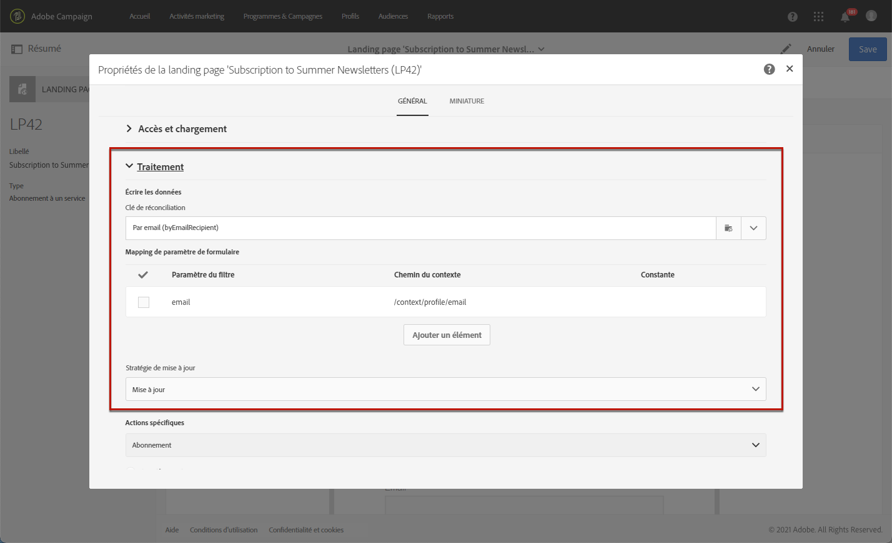
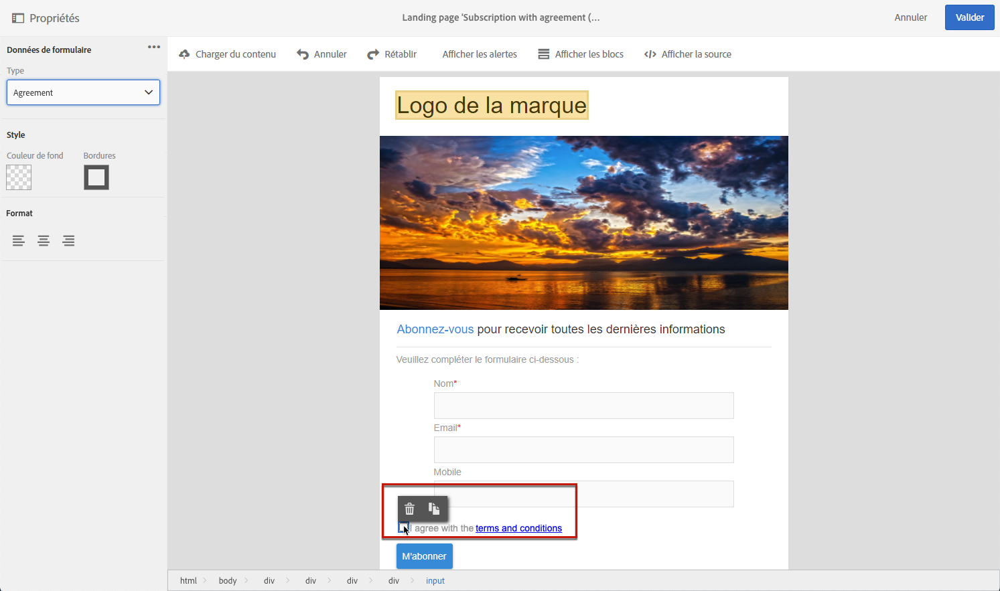

# Gestion des données de formulaire de landing page{#managing-landing-page-form-data}

Dans le contenu de la landing page, les champs de saisie sont utilisés pour stocker ou mettre à jour les données de la base de données Campaign.

Pour cela, ces champs doivent être mappés aux champs de la base de données.

Vous pouvez définir et gérer leur mappage à l’aide de la section **[!UICONTROL Données du formulaire]** de la palette de gauche.

## Association des champs de formulaire  {#mapping-form-fields}

Pour mettre à jour la base de données Campaign selon vos besoins, associez les champs de la base pertinents aux blocs de type zone de saisie, bouton radio ou case à cocher de votre landing page.

Pour ce faire, procédez comme suit :

1. Sélectionnez un bloc dans le contenu de la landing page.

   >[!NOTE]
   >
   >Les champs par défaut des landing pages intégrées sont préconfigurés. Vous pouvez les modifier si nécessaire.

1. Accédez à la section **[!UICONTROL Données de formulaire]** de la palette de gauche.

1. Pour modifier le type du champ, sélectionnez une valeur dans la liste déroulante **[!UICONTROL Type HTML du champ]** .

   

   >[!NOTE]
   >
   >Pour plus d’informations sur l’utilisation du type de case à cocher dans une landing page, reportez-vous aux sections [Mise à jour de plusieurs abonnements aux services](#multiple-subscriptions) et [Case à cocher Contrat](#agreement-checkbox) .

1. Si vous sélectionnez un type de champ non compatible avec le champ de base de données actuellement sélectionné dans la zone **[!UICONTROL Champ]** , un message d’avertissement s’affiche. Pour un mappage optimal, sélectionnez une valeur appropriée.

   

1. Utilisez la zone **[!UICONTROL Champ]** pour sélectionner un champ de la base de données qui sera associé au champ du formulaire.

   

   >[!NOTE]
   >
   >Les landing pages peuvent uniquement être mappées avec les ressources **[!UICONTROL Profils]** ou **[!UICONTROL Service]**.

   Dans cet exemple, mappez le champ **Nom** de votre landing page avec le champ **[!UICONTROL Nom]** de la ressource **[!UICONTROL Profils]** .

   

1. Si nécessaire, cochez l&#39;option **[!UICONTROL Obligatoire]**. Dans ce cas, la landing page ne peut être envoyée que si l&#39;utilisateur a renseigné ce champ.

   

   Si un champ obligatoire n’est pas renseigné, un message d’erreur s’affiche lorsque l’utilisateur envoie la page.

1. Cliquez sur **[!UICONTROL Confirmer]** pour enregistrer vos modifications.

<!--If you choose a mandatory **[!UICONTROL Checkbox]**, make sure that it is of **[!UICONTROL Field]** type.-->

## Réconciliation et stockage des données{#data-storage-and-reconciliation}

Les paramètres de réconciliation permettent de définir le mode de gestion des données entrées dans la landing page lors de sa validation par un visiteur.

Pour cela :

1. Editez les propriétés de la landing page accessibles via l&#39;icône  dans le tableau de bord de la landing page, puis affichez les paramètres **[!UICONTROL Traitement]**.

   

1. Sélectionnez la **[!UICONTROL Clé de réconciliation]** : ce champ de base de données permet de déterminer si le visiteur possède un profil déjà connu dans la base de données Adobe Campaign. Il peut s’agir par exemple d’un email, d’un prénom ou d’un nom. La clé de réconciliation permet de mettre à jour ou créer un profil, en fonction du paramètre **[!UICONTROL Stratégie de mise à jour]** défini ci-dessous.

1. Définissez la **[!UICONTROL Correspondance des paramètres du formulaire]** : cette section permet de mettre en correspondance les paramètres des champs de la landing page et ceux utilisés dans la clé de réconciliation.

1. Sélectionnez la **[!UICONTROL Stratégie de mise à jour]** : si la clé de réconciliation permet de récupérer un profil de base existant, vous pouvez choisir de mettre à jour ce profil avec les données saisies dans le formulaire, ou au contraire empêcher cette mise à jour.

   

## Abonnements multiples à des services {#multiple-subscriptions}

Vous pouvez utiliser plusieurs cases à cocher sur une seule page d’entrée pour permettre aux utilisateurs de s’abonner ou de se désabonner de plusieurs services.

Pour ce faire, procédez comme suit :

1. Lors de la conception de la landing page :

   * Sélectionnez un bloc et, dans la section **[!UICONTROL Données du formulaire]**, sélectionnez **[!UICONTROL Case à cocher]** comme type de champ.

      

   * Si vous maîtrisez le langage HTML, vous pouvez également insérer manuellement une case à cocher à l’aide du bouton **[!UICONTROL Afficher la source]**.

      

      Vous pouvez ainsi insérer la case à cocher là où cela vous convient dans la page.

      

1. Assurez-vous que la case est cochée dans votre contenu. La liste déroulante **[!UICONTROL Type]** s’affiche dans la section **[!UICONTROL Données du formulaire]** de la palette gauche. Sélectionnez **[!UICONTROL Service et abonnement]** dans la liste.

   

1. Choisissez une option dans la liste déroulante **[!UICONTROL Comportement]** .

   

1. Sélectionnez un [service](../../audiences/using/creating-a-service.md) dans la liste correspondante.

   

1. Assurez-vous que l’option **[!UICONTROL Obligatoire]** n’est pas cochée. Sinon, vos utilisateurs n’auront pas le choix.

   

1. Pour ajouter d’autres cases à cocher permettant de s’abonner à d’autres services, répétez les étapes ci-dessus autant de fois que nécessaire.

   

Une fois la landing page publiée, les utilisateurs peuvent cocher plusieurs cases pour s’inscrire à plusieurs newsletters de la même page.

## Case à cocher Accord {#agreement-checkbox}

Vous pouvez ajouter une case à cocher que le profil doit vérifier avant d&#39;envoyer la landing page.

Cela vous permet, par exemple, de demander le consentement des utilisateurs pour la politique de confidentialité ou de les obliger à accepter vos conditions générales avant d&#39;envoyer le formulaire.

>[!IMPORTANT]
>
>La sélection de cette case à cocher est obligatoire pour vos utilisateurs. Si elle n&#39;est pas sélectionnée, ils ne pourront pas envoyer la landing page.

Pour insérer et configurer cette case à cocher, procédez comme suit :

1. Lors de la conception de la landing page :

   * Sélectionnez un bloc et, dans la section **[!UICONTROL Données du formulaire]**, sélectionnez **[!UICONTROL Case à cocher]** comme type de champ.

      

   * Si vous maîtrisez le langage HTML, vous pouvez également insérer manuellement une case à cocher à l’aide du bouton **[!UICONTROL Afficher la source]**.

      

      <!--Manually insert a checkbox, such as in the example below:

      <!--Click **[!UICONTROL Hide source]**.-->

1. Assurez-vous que la case est cochée.

   

1. La liste déroulante **[!UICONTROL Type]** s’affiche dans la section **[!UICONTROL Données du formulaire]** de la palette gauche. Sélectionnez **[!UICONTROL Accord]** dans la liste.

   

   >[!NOTE]
   >
   >L&#39;élément **[!UICONTROL Accord]** n&#39;est pas mappé à un champ de la base de données Campaign.

1. Cliquez sur l&#39;icône  en regard de **[!UICONTROL Données de formulaire]** pour accéder aux propriétés avancées de la case à cocher.

1. Si besoin, vous pouvez modifier le message.

   

   Ce texte s&#39;affiche sous forme d&#39;avertissement si l&#39;utilisateur ne coche pas la case avant d&#39;envoyer le formulaire.

   >[!NOTE]
   >
   >Cette action est obligatoire par défaut et ne peut pas être modifiée.

1. Cliquez sur **[!UICONTROL Confirmer]**.

Désormais, chaque fois que la landing page s&#39;affiche, l&#39;utilisateur doit cocher cette case avant d&#39;envoyer le formulaire. Si ce n&#39;est pas le cas, l&#39;avertissement s&#39;affiche et l&#39;utilisateur ne peut pas envoyer le formulaire tant que la case à cocher n&#39;est pas activée.