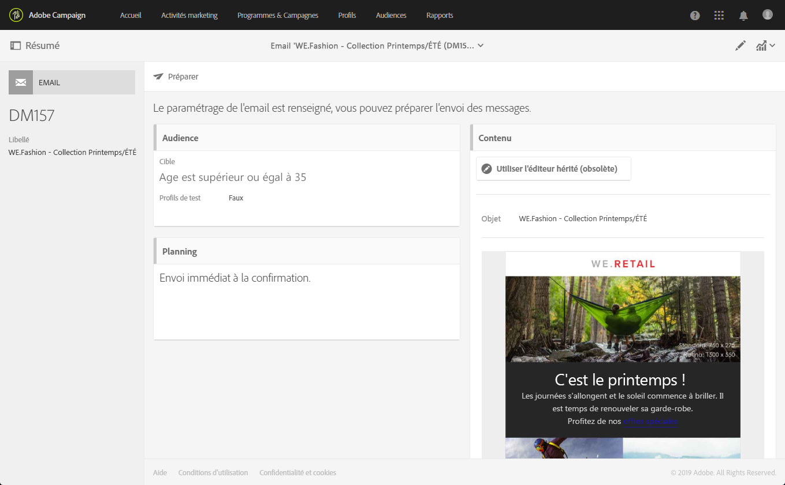
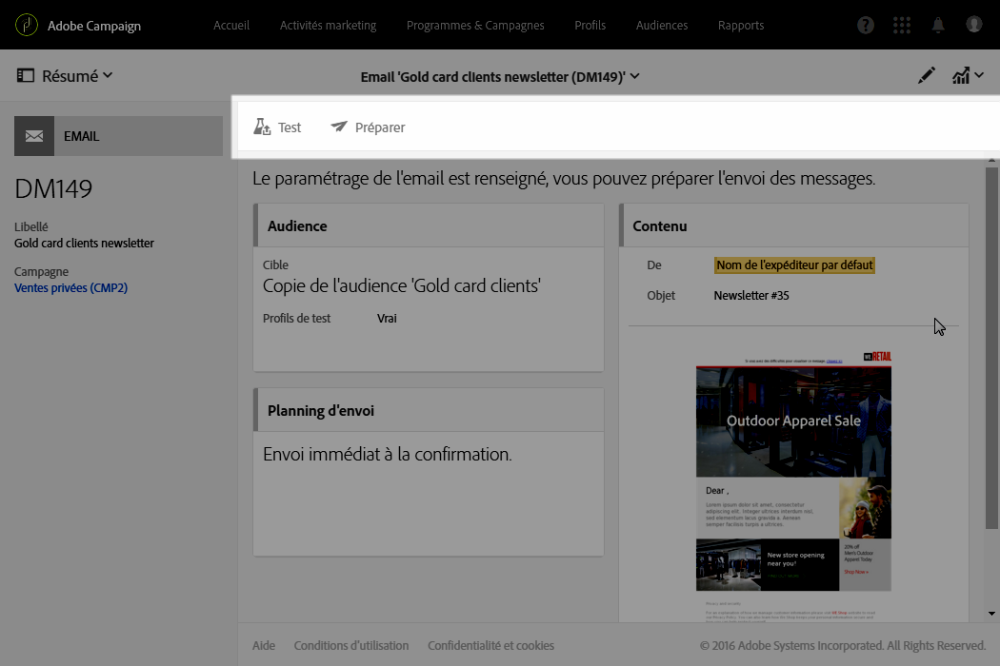
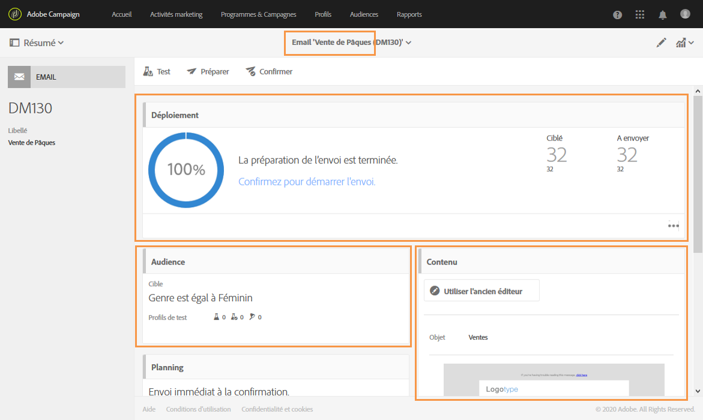

# Tableau de bord des messages{#message-dashboard}

Le tableau de bord d'un message est un espace de travail composé de différentes icônes - regroupées dans une barre d'actions - et de différents blocs fonctionnels vous permettant de définir les paramètres de votre message et d'exécuter son envoi. Ces éléments sont présentés ci-après.

## Barre grise {#gray-bar}

La barre grise regroupe différentes icônes en lien avec votre message.

* **[!UICONTROL Afficher le résumé]** : affiche/masque les informations principales relatives au message.
* **[!UICONTROL Editer les propriétés]** : permet d'accéder à l'écran d'édition des paramètres avancés du message.
* **[!UICONTROL Rapports]** : permet d'accéder à la liste des rapports relatifs au message.

**Rubriques connexes :**

* [Configuration des canaux](../../administration/using/about-channel-configuration.md)
* [Accéder aux rapports](../../reporting/using/about-dynamic-reports.md)

## La barre d'actions {#action-bar}

La barre d'actions contient différentes icônes permettant d'agir sur votre message.

Selon les paramètres renseignés et l'avancement du processus de création, certaines d'entre elles peuvent ne pas être disponibles.

* **[!UICONTROL Afficher les bons à tirer]** : affiche/masque la liste des bons à tirer envoyés, s'ils existent. Ce bouton n'est actif que lorsque vous avez envoyé des bons à tirer.

   Pour plus d'informations sur les bons à tirer, voir la section [Gérer les profils de test et envoyer un bon à tirer](../../sending/using/managing-test-profiles-and-sending-proofs.md).

* **[!UICONTROL Envoyer un test]**: vous permet de sélectionner le mode d'approbation à utiliser : **[!UICONTROL Rendu par courrier électronique]**, **[!UICONTROL Preuve]** ou les deux pour un courriel. Pour plus d'informations sur les profils de test, voir la section [Envoyer un bon à tirer](../../sending/using/managing-test-profiles-and-sending-proofs.md#sending-proofs).

   Ce bouton n'est actif que lorsque vous avez défini des profils de test.

   >[!NOTE]
   >
   >Dans le cas d'un SMS, ce choix n'est pas possible : il s'agit automatiquement d'un **[!UICONTROL Bon à tirer]**.

* **[!UICONTROL Préparer l'envoi]** : lance la préparation de l'envoi. Le bloc **[!UICONTROL Déploiement]apparaît et affiche le résultat de la préparation.** Ce bouton n'apparaît que lorsque la cible a été renseignée. Vous pouvez arrêter à tout moment la préparation via le bouton correspondant.

   Pour plus d'informations sur la préparation, voir la section [Préparer l'envoi](../../sending/using/preparing-the-send.md).

* **[!UICONTROL Confirmer l'envoi]** : confirme l'envoi définitif du message. Le résultat de l'envoi apparaît dans le bloc **[!UICONTROL Déploiement.]** Ce bouton n'apparaît qu'après la préparation de l'envoi. Vous pouvez, à tout moment, arrêter ou mettre en pause l'envoi à l'aide des boutons **Arrêter l'envoi** et **[!UICONTROL Mettre en pause].**

   Pour plus d'informations sur la validation d'un envoi, voir la section [Envoyer les messages](../../sending/using/confirming-the-send.md).

## Blocs {#blocks}

L'écran principal est composé de différents blocs. Cliquez dans un bloc pour accéder à l'écran de paramètres correspondant :

* **[!UICONTROL Déploiement]** : permet de tracker l'état d'avancement de la préparation ou de l'envoi du message. Cliquez sur le bouton situé en bas à droite du bloc pour accéder aux logs d'analyse et d'envoi. Ce bloc n'apparaît qu'après la préparation de l'envoi. Voir à ce propos la section [Confirmer l'envoi](../../sending/using/confirming-the-send.md).
* **[!UICONTROL Audience]** : permet de définir la cible principale du message ainsi que les profils de test. Voir [Créer une audience](../../audiences/using/creating-audiences.md).
* **[!UICONTROL Planning]** : permet de définir la date d'envoi du message. Voir [Planning](../../sending/using/about-scheduling-messages.md).
* **[!UICONTROL Contenu]** : permet de définir le contenu du message et de le prévisualiser. Voir [Définir le contenu](../../designing/using/designing-content-in-adobe-campaign.md).

