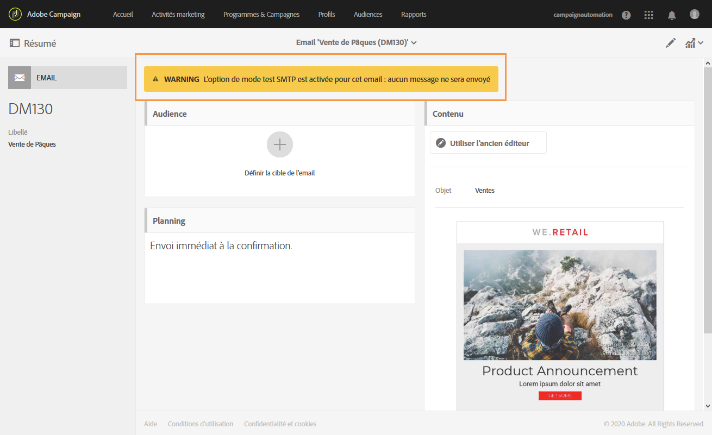

# Tableau de bord des messages{#message-dashboard}

Le tableau de bord d’un message est un espace de travail composé de différentes icônes - regroupées dans une barre d’actions - et de différents blocs fonctionnels vous permettant de définir les paramètres de votre message et d’exécuter son envoi. Ces éléments sont présentés ci-après.

## Barre grise       {#gray-bar}

La barre grise regroupe différentes icônes en lien avec votre message.

* **[!UICONTROL Afficher le résumé]** : affiche/masque les informations principales relatives au message.
* **[!UICONTROL Editer les propriétés]**[ : permet d’accéder à l’écran d’édition des paramètres avancés du message](../../administration/using/configuring-email-channel.md#list-of-email-properties).
* **[!UICONTROL Rapports]** : permet d’accéder à la liste des rapports relatifs au message.

**Rubriques connexes :**

* [Configuration des canaux](../../administration/using/about-channel-configuration.md)
* [Accéder aux rapports](../../reporting/using/about-dynamic-reports.md)

## La barre d’actions {#action-bar}

La barre d’actions contient différentes icônes permettant d’agir sur votre message.

Selon les paramètres renseignés et l’avancement du processus de création, certaines d’entre elles peuvent ne pas être disponibles.

* **[!UICONTROL Afficher les bons à tirer]** : affiche/masque la liste des bons à tirer envoyés, s’ils existent. Ce bouton n’est actif que lorsque vous avez envoyé des bons à tirer.

   Pour plus d’informations sur les bons à tirer, voir la section [Envoyer un bon à tirer](../../sending/using/sending-proofs.md).

* **[!UICONTROL Envoyer un test]** : vous permet de sélectionner le mode de validation à utiliser : **[!UICONTROL Rendu des emails]** (email uniquement), **[!UICONTROL Bon à tirer]** ou les deux. Pour plus d’informations sur les profils de test, voir la section [Envoyer un bon à tirer](../../sending/using/sending-proofs.md). Ce bouton n’est actif que lorsque vous avez créé des profils de test.

* **[!UICONTROL Préparer l’envoi]** : lance la préparation de l’envoi. Le bloc **[!UICONTROL Déploiement]** apparaît et affiche le résultat de la préparation. Ce bouton n’apparaît que lorsque la cible a été renseignée. Vous pouvez arrêter à tout moment la préparation via le bouton correspondant. Pour plus d&#39;informations sur la préparation de messages, consultez la section [Préparer l&#39;envoi](../../sending/using/preparing-the-send.md).

* **[!UICONTROL Confirmer l’envoi]** : confirme l’envoi définitif du message. Le résultat de l’envoi apparaît dans le bloc **[!UICONTROL Déploiement]**. Ce bouton n’apparaît qu’après la préparation de l’envoi. Vous pouvez, à tout moment, arrêter ou mettre en pause l’envoi à l’aide des boutons **Arrêter l’envoi** et **[!UICONTROL Mettre en pause.]** Pour plus d’informations sur la validation d’un envoi, consultez la section [Envoyer les messages](../../sending/using/confirming-the-send.md).

## Blocs       {#blocks}

L’écran principal est composé de différents blocs. Cliquez dans un bloc pour accéder à l’écran de paramètres correspondant :

* **[!UICONTROL Déploiement]** : permet de tracker l’état d’avancement de la préparation ou de l’envoi du message. Cliquez sur le bouton situé en bas à droite du bloc pour accéder aux logs d’analyse et d’envoi. Ce bloc n’apparaît qu’après la préparation de l’envoi. Voir à ce propos la section [Confirmer l’envoi](../../sending/using/confirming-the-send.md).
* **[!UICONTROL Audience]** : permet de définir la cible principale du message ainsi que les profils de test. Voir [Créer une audience](../../audiences/using/creating-audiences.md).
* **[!UICONTROL Planning]** : permet de définir la date d’envoi du message. Voir [Planning](../../sending/using/about-scheduling-messages.md).
* **[!UICONTROL Contenu]** : permet de définir le contenu du message et de le prévisualiser. Voir [Principales étapes pour envoyer un message](../../channels/using/key-steps-to-send-a-message.md).

## Avertissements {#warnings}

Dans certains cas, un avertissement peut apparaître dans une bannière jaune au-dessus du tableau de bord des messages.

Vous trouverez ci-dessous une liste des messages pouvant être affichés :

* *&quot;L’option de mode test SMTP est activée pour cet email : aucun message ne sera envoyé.&quot;*

   Voir à ce propos [cette section](../../administration/using/configuring-email-channel.md#smtp-test-mode).

* *&quot;Le compte externe de routage a été désactivé.&quot;*

   Pour plus d’informations, voir [Comptes externes](../../administration/using/external-accounts.md).

* *« Les messages ne peuvent pas être envoyés, car l’affinité IP actuelle n’est gérée par aucun processus d’envoi. »*

   Si ce message s’affiche, un problème s’est produit au niveau de la définition de l’affinité IP ou du processus d’envoi. Contactez votre administrateur Adobe.

* *« Ce message transactionnel est un modèle de message transactionnel d’usine. Si vous souhaitez le modifier, vous devez le dupliquer et utiliser votre copie. »*

   Certains de ces modèles de message transactionnel d’usine sont des modèles de landing page intégrés. Voir à ce propos [cette section](../../channels/using/landing-page-templates.md).

* *&quot;Ce message est un modèle de message transactionnel technique. Vous ne pouvez pas le modifier ni le publier.&quot;*

   Cet avertissement s’affiche dans des modèles de message transactionnel vides ne pouvant pas être modifiés. Pour plus d’informations sur les messages transactionnels, voir [cette section](../../channels/using/getting-started-with-transactional-msg.md).
