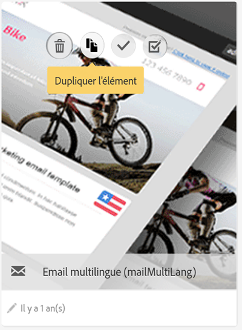
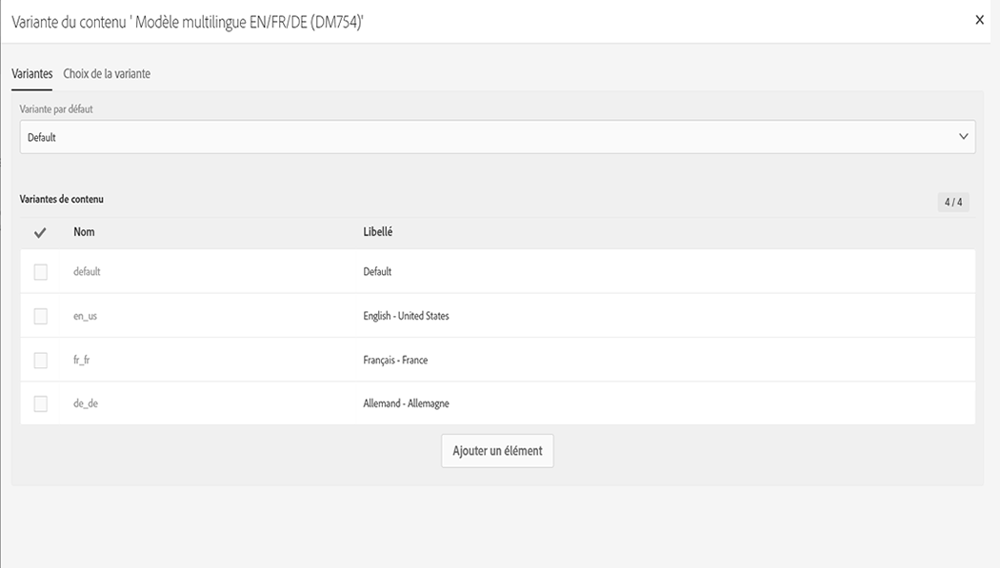
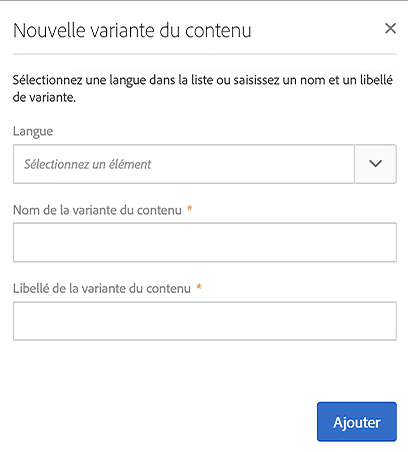

# Modèles de messages multilingues {#multilingual-messages-template}

Un modèle multilingue est un modèle spécifique qui permet de gérer les messages multilingues. Ce type de modèle est disponible pour les **** emails et SMS **et peut être utilisé en mode autonome, dans un workflow ou dans une diffusion récurrente.**

Dans les modèles multilingues, la gestion des langues repose sur les variantes. **Chaque variante représente une langue**. Il est possible de configurer jusqu&#39;à 40 variantes dans Adobe Campaign Standard.

Adobe Campaign est livré avec une langue par défaut définie sur **EN**. La langue par défaut peut être remplacée par une autre variante, mais ne doit jamais être supprimée.

Pendant la création du modèle, vous pouvez ajouter le nombre de variantes qui correspond à celui des langues dont vous avez besoin pour le message.

Pour créer un modèle d’email ou de SMS, procédez comme suit :

1. Dupliquez un modèle multilingue existant (SMS ou Email).

   

   >[!NOTE]
   >
   >Vous pouvez également modifier un modèle standard existant dans un modèle multilingue en cliquant sur le bouton **[!UICONTROL Initialiser la variante du contenu]** dans les propriétés du modèle.

1. Modifiez les propriétés pour personnaliser le libellé, le tracking, etc.

1. Changez le nombre de variantes en cliquant sur la vignette des variantes. La fenêtre des variantes s&#39;affiche,

   

   dans laquelle vous pouvez ajouter ou supprimer des variantes. Pour ajouter une variante, renseignez la fenêtre **[!UICONTROL Nouvelle variante du contenu]**.

   

   >[!NOTE]
   >
   >Ne supprimez pas la variante &quot;default&quot;, car il s&#39;agit de la variante envoyée aux profils lorsqu&#39;aucun paramètre de préférence linguistique n&#39;est indiqué.

1. Au besoin, personnalisez la variante du libellé et cliquez sur **[!UICONTROL Confirmer]**.

1. Vous pouvez aussi ajouter directement le contenu pour chaque variante.

Vous êtes maintenant prêt à créer un email ou un SMS à partir de ce modèle multilingue.

**Rubriques connexes :**

* [Créer un email multilingue](../../channels/using/creating-a-multilingual-email.md)
* [Créer un profil](../../audiences/using/creating-profiles.md)
