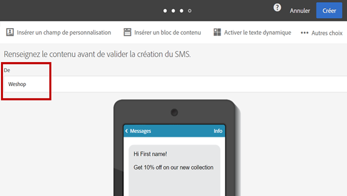

# Personnaliser un SMS{#personalizing-sms-messages}

Les principes de personnalisation des SMS sont les mêmes que pour les [e-mails](../../designing/using/personalization.md#inserting-a-personalization-field). Vous devez toutefois être attentif aux options de translittération car elles peuvent faire changer l&#39;encodage et donc le nombre de SMS à envoyer. Pour plus d&#39;informations, consultez la section [Translittération et longueur des SMS](../../administration/using/configuring-sms-channel.md#sms-encoding--length-and-transliteration).

Voici l&#39;exemple d&#39;un SMS contenant des champs de personnalisation qui, selon l&#39;option de translittération choisie, ne générera pas le même nombre d&#39;envois :

**Bonjour &lt;Prénom> &lt;Nom>, de nouveaux produits sont disponibles. Venez les découvrir en magasin !**

* Pour un destinataire nommé « Jean Dupont », aucun caractère spécial n’étant présent, Adobe Campaign choisira l’encodage GSM qui autorise jusqu’à 160 caractères par SMS. Le message sera donc envoyé en une seule partie.
* Pour un destinataire nommé &#39;Raphaël Laforêt&#39;, les caractères &#39;ë&#39; et &#39;ê&#39; ne peuvent pas être encodés en GSM. Selon le paramétrage choisi pour la translittération, Adobe Campaign a le choix entre deux comportements :

   * Si la translittération est autorisée, &#39;ë&#39; et &#39;ê&#39; seront remplacés par &#39;e&#39;, ce qui permet d&#39;utiliser l&#39;encodage GSM et autorise 160 caractères dans le SMS. Ce message sera envoyé en un seul SMS, mais il sera légèrement altéré.
   * Si la translittération n&#39;est pas autorisée, Adobe Campaign choisira d&#39;envoyer le message en Unicode et tous les caractères seront envoyés tels quels. Comme les SMS en Unicode sont limités à 70 caractères, Adobe Campaign devra envoyer le message en deux parties.

>[!NOTE]
>
>L&#39;algorithme qui choisit automatiquement le meilleur encodage est effectué indépendamment pour chaque message, au cas par cas. Ainsi, seuls les messages personnalisés nécessitant un encodage Unicode seront envoyés en Unicode ; les autres utiliseront l&#39;encodage GSM.

## Expéditeur des SMS {#sms-sender}

>[!IMPORTANT]
>
>Vérifiez la loi en vigueur dans votre pays concernant la modification de l&#39;adresse de l&#39;expéditeur. Vérifiez également auprès de votre fournisseur de service SMS s’il propose cette fonctionnalité.

L’option **[!UICONTROL De]** vous permet de personnaliser le nom de la personne qui envoie le SMS à l’aide d’une chaîne de caractères. C’est le nom qui s’affichera dans le champ correspondant à l’expéditeur ou l’expéditrice du SMS sur le téléphone mobile de la personne destinataire.

Si ce champ est vide, c’est le numéro source renseigné dans le compte externe qui sera utilisé. Si aucun numéro source n’y figure, c’est le numéro court qui sera utilisé. Le compte externe spécifique aux diffusions SMS est présenté dans la section [Définir un routage SMS](../../administration/using/configuring-sms-channel.md#defining-an-sms-routing).

