# Préparation et envoi d'une notification push{#preparing-and-sending-a-push-notification}

## Préparation de la notification {#preparing-the-notification}

Les étapes de création d'une notification push avec Adobe Campaign sont les suivantes :

1. Depuis la fenêtre **[!UICONTROL Activités marketing]**, [créez une activité marketing](../../start/using/marketing-activities.md#creating-a-marketing-activity).

   Il est également possible de créer une notification push unique depuis une [campagne](../../start/using/marketing-activities.md#creating-a-marketing-activity) ou à partir de la [page d'accueil](../../start/using/interface-description.md#home-page) Adobe Campaign.

   Vous pouvez également utiliser une activité de diffusion notification push dans un workflow. Cette activité est présentée dans la section [Diffusion d'une notification push](../../automating/using/push-notification-delivery.md).

1. Sélectionnez **[!UICONTROL Notification push]**.
1. Choisissez un modèle.

   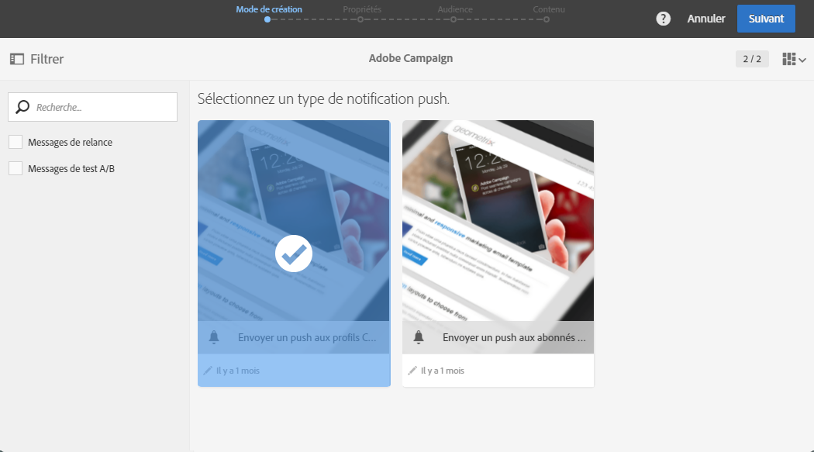

   Par défaut, vous avez le choix entre deux modèles :

   * **[!UICONTROL Envoyer un push aux profils Campaign]** : utilisez ce modèle pour cibler les profils CRM Adobe Campaign qui se sont abonnés à votre application mobile et ont choisi de recevoir des notifications push. Vous pouvez insérer des champs de [personnalisation](../../designing/using/inserting-a-personalization-field.md), tels que le prénom du destinataire, dans votre notification push.
   * **[!UICONTROL Envoyer un push aux abonnés de l'application]** : utilisez ce modèle pour envoyer une notification push à tous les utilisateurs anonymes ou connus qui ont accepté de recevoir des notifications en provenance de vos applications. Vous pouvez personnaliser ces messages avec les données collectées à partir de votre application mobile.
   Vous pouvez également sélectionner des modèles multilingues. Pour plus d'informations, consultez la section [Création d'une notification push multilingue](../../channels/using/creating-a-multilingual-push-notification.md).

   Pour plus d'informations sur les modèles, reportez-vous à la section [Gestion des modèles](../../start/using/about-templates.md).

1. Renseignez les propriétés de la notification push et sélectionnez votre application mobile dans le champ **[!UICONTROL Associer une application mobile à une diffusion].**

   La liste déroulante contiendra les applications des SDK V4 et Experience Platform.

   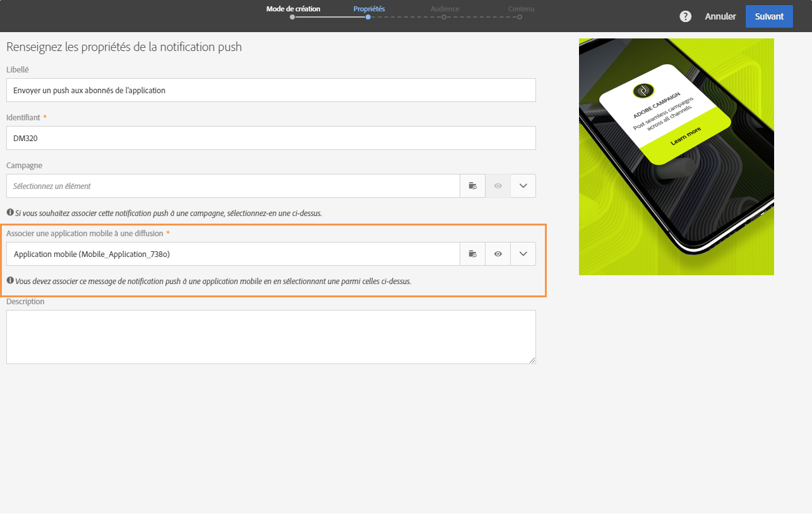

   Vous pouvez associer la notification push à une campagne. Pour cela, sélectionnez celle-ci parmi les campagnes déjà créées.

1. Dans l'écran suivant, vous pouvez spécifier une audience (tous les clients VIP qui se sont abonnés à une application mobile spécifique, par exemple). Voir à ce propos la section [Créer une audience](../../audiences/using/creating-audiences.md).

   Votre audience sera automatiquement filtrée en fonction de l'application mobile sélectionnée à l'étape précédente.

   

1. Vous pouvez maintenant personnaliser votre notification push. First, choose the message style: **[!UICONTROL Alert/Message/Badge]** or **[!UICONTROL Silent push]**. Les types de notifications push sont présentés dans la section [A propos des notifications push](../../channels/using/about-push-notifications.md).

   Editez le contenu de votre notification push et définissez les options avancées. Voir la section [Personnaliser une notification push](../../channels/using/customizing-a-push-notification.md).

   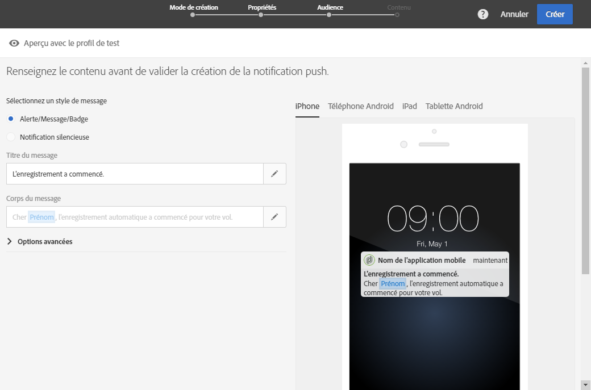

   Les options et le contenu de la notification push configurés ici sont transmis à votre application mobile sous la forme d'une payload. La structure détaillée de la payload est présentée dans la technote de [présentation de la structure de la payload des notifications push ACS](https://helpx.adobe.com/campaign/kb/understanding-campaign-standard-push-notifications-payload-struc.html).

1. Cliquez sur **[!UICONTROL Créer]**.

   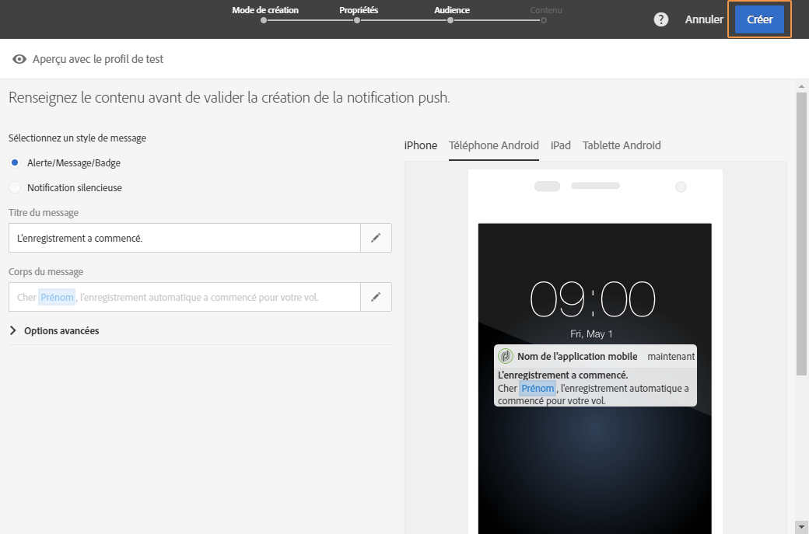

1. Avant d'envoyer la notification, vous pouvez la tester avec des profils de test puis voir exactement à quoi elle ressemblera avant d'envoyer la diffusion. Sélectionnez **[!UICONTROL Audiences]** dans la synthèse de la diffusion, puis cliquez sur l'onglet **Profils de test[!UICONTROL .]**

   Pour plus d'informations sur les tests d'envoi, reportez-vous à la section [Profils de test](../../sending/using/managing-test-profiles-and-sending-proofs.md).

1. Sélectionnez les profils de test et cliquez sur **[!UICONTROL Prévisualiser]pour afficher la notification : le contenu est personnalisé avec les données de profil de test.**
1. Vérifiez la présentation de la notification push sur différents appareils : sélectionnez iPhone, téléphone Android, tablette Android ou iPad pour prévisualiser le rendu.

   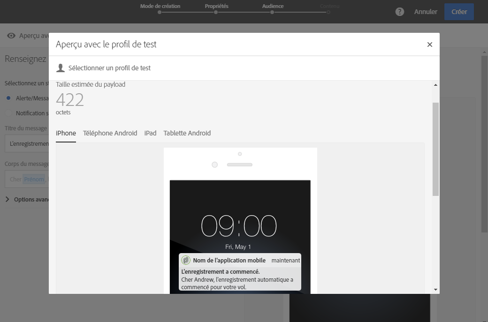

1. La **[!UICONTROL Taille estimée du payload]est une estimation reposant sur les données du profil de test.** La taille réelle du contenu peut varier. Chaque message peut aller jusqu'à 4 Ko.

   >[!CAUTION]
   >
   >Si la taille du payload dépasse la limite de 4 Ko, le message n'est pas envoyé. Les données de personnalisation ont un impact sur la taille du message.

## Envoyer la notification {#sending-the-notification}

Il est possible d’envoyer les notifications push à une audience sélectionnée dans Adobe Campaign en définissant les critères de l’audience. Pour l’exemple qui suit, l’audience sélectionnée est composée de 4 abonnés à des applications mobiles ciblés.

1. Cliquez sur **[!UICONTROL Préparer]pour calculer la cible et générer les notifications.**

   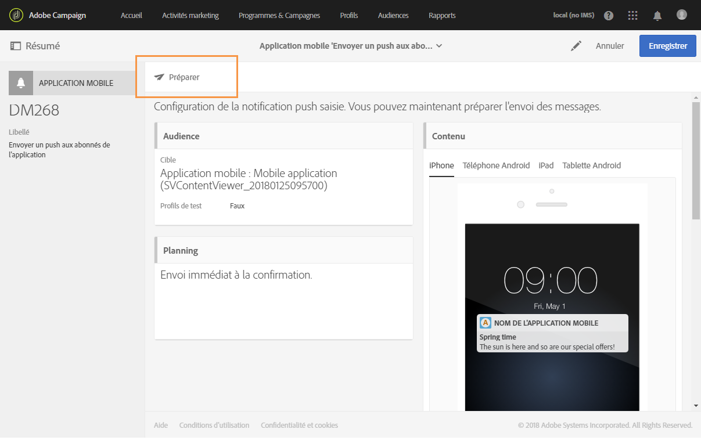

1. Dès que la préparation est terminée, la fenêtre **[!UICONTROL Déploiement]** présente les KPI suivants : **[!UICONTROL Cible]** et **[!UICONTROL A envoyer]**. Notez que la valeur **[!UICONTROL A envoyer]** est inférieure à la valeur **[!UICONTROL Cible]** en raison des exclusions. Celles-ci peuvent être consultées en cliquant sur le bouton  en bas de la fenêtre **[!UICONTROL Déploiement]**.

   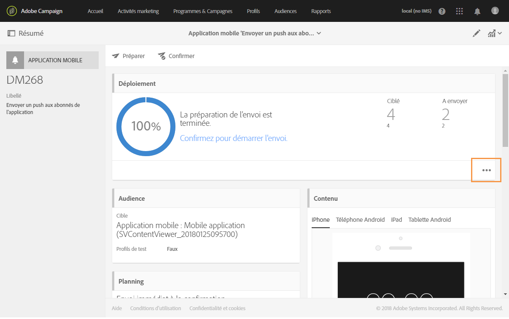

1. Dans l’onglet **[!UICONTROL Exclus], vous trouverez la liste de tous les messages exclus de la cible envoyés, ainsi que la raison de cette exclusion.**

   Ici, nous pouvons constater que l’un de nos abonnés aux applications mobiles a été exclu parce que l’adresse était blacklistée, et que les autres abonnés l’ont été parce que le profil était un doublon.

   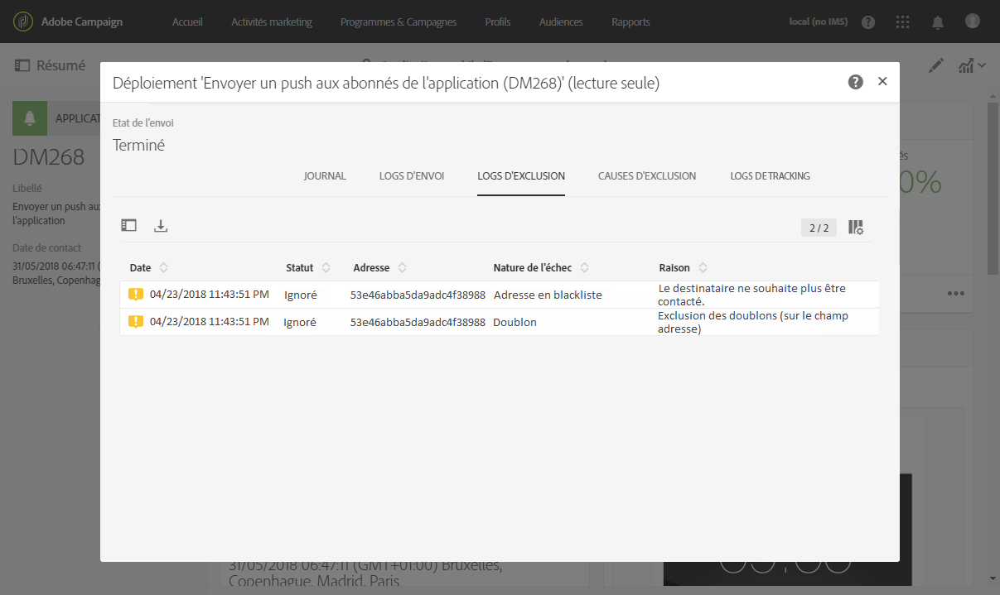

1. Cliquez sur l’onglet **[!UICONTROL Exclusions appliquées]pour afficher le volume des messages exclus.**

   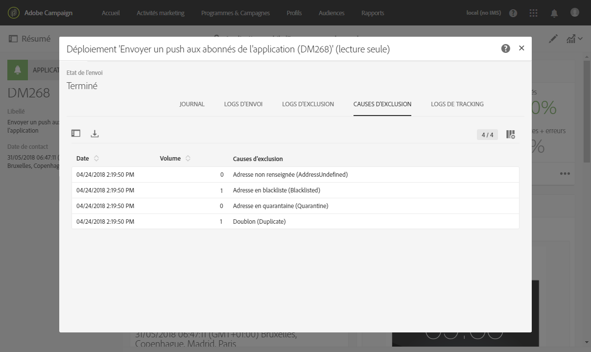

1. Cliquez maintenant sur **[!UICONTROL Confirmer]pour commencer à envoyer des notifications push.**
1. Vérifiez le statut de votre diffusion par le biais du tableau de bord du message et des logs. Pour plus d’informations à ce sujet, consultez [Envoi de messages](../../sending/using/confirming-the-send.md) et [Logs de diffusion](../../sending/using/monitoring-a-delivery.md#delivery-logs).

   Dans cet exemple, le tableau de bord du message indique qu’Adobe Campaign a tenté d’envoyer deux notifications push : l’une a été envoyée au périphérique avec succès, mais l’autre a échoué. Pour savoir pourquoi la diffusion a échoué, cliquez sur le bouton  en bas de la fenêtre **Déploiement[!UICONTROL .]**

   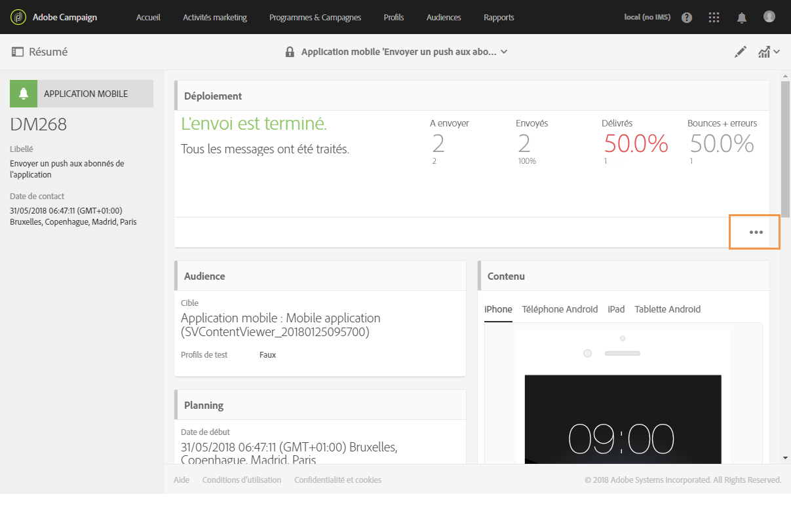

1. Dans la fenêtre **[!UICONTROL Déploiement]**, cliquez sur l’onglet **Envois]pour accéder à la liste des notifications push envoyées et à leurs statuts.[!UICONTROL ** Pour cette diffusion, une notification push a été envoyée avec succès, tandis que l’autre a échoué en raison d’un token de périphérique erroné. Cet abonné sera alors blacklisté des diffusions ultérieures.

   >[!NOTE]
   >
   >Des défaillances en aval d’Adobe Campaign peuvent en être la cause. Cela peut également être lié à des défaillances des fournisseurs comme apns et fcm. Pour plus d’informations sur les défaillances des fournisseurs, consultez la documentation d’[Apple](https://developer.apple.com/library/content/documentation/NetworkingInternet/Conceptual/RemoteNotificationsPG/CommunicatingwithAPNs.html) et d’[Android](https://firebase.google.com/docs/cloud-messaging/http-server-ref).

   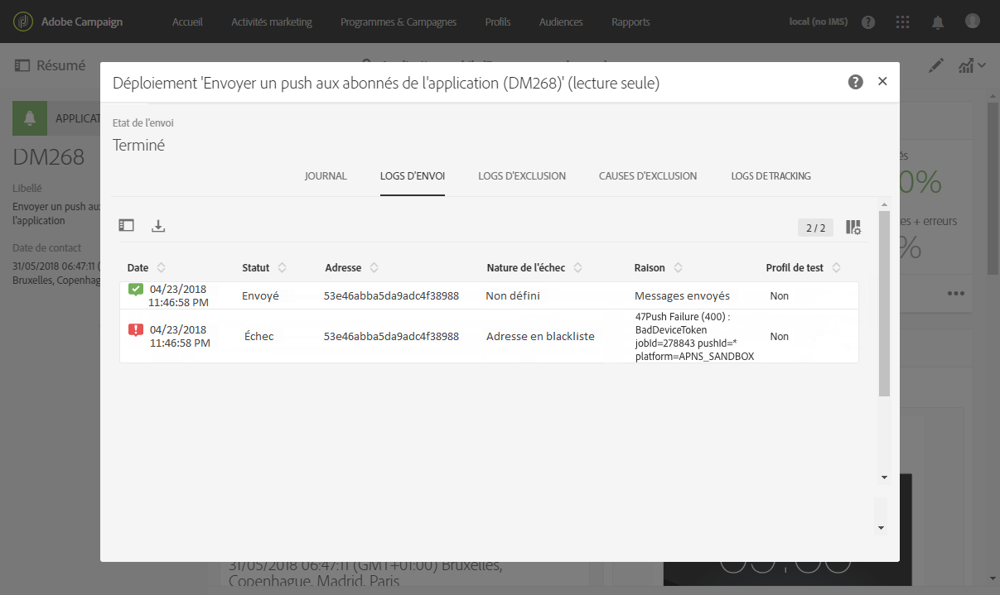

Vous pouvez maintenant mesurer la portée de la diffusion de votre notification push grâce aux rapports dynamiques.

**Rubriques connexes :**

* [Rapport des notifications push (Push notification)](../../reporting/using/push-notification-report.md)
* [Envoi d'une notification push dans un workflow](../../automating/using/push-notification-delivery.md)

