# Préparation et envoi d'un message In-App{#preparing-and-sending-an-in-app-message}

>[!NOTE]
>
>La personnalisation In-App s'appuie sur un champ de liaison qui est généralement un identifiant CRM et/ou un identifiant de connexion d'application mobile. Vous êtes seul responsable de la sécurisation de ce champ de liaison lorsqu'il est utilisé avec Adobe Campaign. Si vous ne parvenez pas à sécuriser vos champs de liaison, votre message personnalisé peut être vulnérable. Si vous ne suivez pas les pratiques en matière de protection, de gestion et de composition de champs de liaison sécurisés, Adobe ne peut être tenue responsable des dommages causés par un accès ou une utilisation non autorisés des données de profil.

Dans Adobe Campaign, trois types de messages In-App sont disponibles :

* **[!UICONTROL Cibler les utilisateurs en fonction de leur profil Campaign (inAppProfile)]** : ce type de message permet de cibler les profils Adobe Campaign (profils CRM) abonnés à votre application mobile. Ce type de message peut être personnalisé avec tous les attributs de profil disponibles dans Adobe Campaign. Il nécessite toutefois l'établissement d'une liaison sécurisée entre le SDK Mobile et le service de messagerie In-App de Campaign pour s'assurer que les messages contenant des informations personnelles et sensibles ne sont utilisés que par des utilisateurs autorisés.

   Pour télécharger ce type de message sur les appareils des utilisateurs, le SDK Mobile doit envoyer les champs de liaison utilisés pour associer un profil mobile à un profil CRM dans Adobe Campaign. Pour plus d'informations sur les API de SDK nécessaires pour la prise en charge des messages In-App, consultez cette [page](https://aep-sdks.gitbook.io/docs/using-mobile-extensions/adobe-campaign-standard/adobe-campaign-standard-api-reference).

* **[!UICONTROL Cibler tous les utilisateurs d'une application mobile (inAppBroadcast)]** : ce type de message vous permet d'envoyer des messages à tous les utilisateurs (actuels ou futurs) de votre application mobile, même s'ils ne disposent pas d'un profil existant dans Adobe Campaign. La personnalisation n'est donc pas possible lors de la personnalisation des messages, car le profil de l'utilisateur peut ne pas exister dans Adobe Campaign.
* **[!UICONTROL Cibler les utilisateurs en fonction de leur profil Mobile (inApp)]** : ce type de message permet de cibler tous les utilisateurs connus ou anonymes d'une application mobile ayant un profil mobile dans Adobe Campaign. Ce type de message peut être personnalisé à l'aide d'attributs qui ne sont pas personnels ni sensibles. Il n'est pas nécessaire d'établir une liaison sécurisée entre le SDK Mobile et le service de messagerie In-App d'Adobe Campaign.

   Pour plus d'informations sur la gestion des données personnelles et sensibles, reportez-vous à la section [Gestion des champs de profil mobile avec des données personnelles et sensibles](../../channels/using/preparing-and-sending-an-in-app-message.md#handling-mobile-profile-fields-with-personal-and-sensitive-data).

## Gestion des champs de profil mobile avec des données personnelles et sensibles {#handling-mobile-profile-fields-with-personal-and-sensitive-data}

Dans Adobe Campaign, les données d'attributs de profil mobile envoyées depuis un appareil mobile sont stockées dans la ressource **[!UICONTROL Abonnements à une application (appSubscriptionRcp)]** qui permet de définir les données que vous souhaitez collecter auprès des abonnés de vos applications.

Cette ressource doit être étendue pour collecter les données que vous avez l'intention d'envoyer depuis d'appareil mobile vers Adobe Campaign. Consultez à ce propos cette [page](../../developing/using/extending-the-subscriptions-to-an-application-resource.md).

Pour permettre une personnalisation plus sécurisée de vos messages In-App, les champs de profil mobile de cette ressource doivent être configurés en conséquence. Dans vos **[!UICONTROL Abonnements à une application (appSubscriptionRcp)]**, lors de la création de vos champs de profils mobiles, cochez **[!UICONTROL Personnel et sensible]** pour les rendre non disponibles durant la personnalisation des messages In-App.

>[!NOTE]
>
>Si une implémentation existe avec une extension de ressource personnalisée sur cette table, nous vous conseillons de libeller les champs de manière adéquate avant de les utiliser pour la personnalisation des messages In-App.

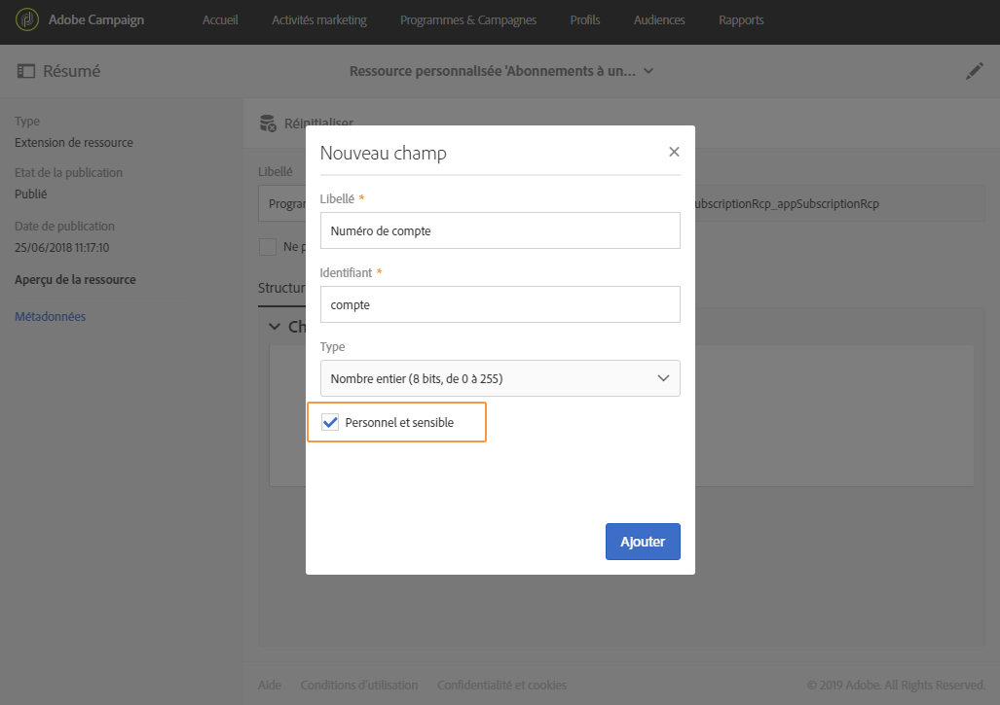

Une fois la ressource personnalisée **[!UICONTROL Abonnements à une application]** configurée et personnalisée, vous pouvez commencer à préparer la diffusion In-App à l'aide du modèle **Cibler les utilisateurs en fonction de leur profil Mobile (inApp)[!UICONTROL .]** Seuls les champs qui ne sont pas personnels ni sensibles sont disponibles pour la personnalisation depuis la ressource **[!UICONTROL Abonnements à une application (appSubscriptionRcp)].**

Si vous devez effectuer une personnalisation avec les champs **Personal and Sensitive**, il est recommandé d'utiliser le modèle **[!UICONTROL Cibler les utilisateurs en fonction de leur profil Campaign (inAppProfile)]qui possède un mécanisme de sécurité supplémentaire pour veiller à ce que les informations PII de vos utilisateurs restent protégées.**

## Préparation de votre message In-App {#preparing-your-in-app-message}

Les étapes de création d'un message In-App autonome avec Adobe Campaign sont les suivantes :

1. Depuis la page d'accueil d'Adobe Campaign, cliquez sur la vignette **[!UICONTROL Messagerie In-App].**

   Vous pouvez également créer un message In-App depuis l'onglet **Activités marketing**, en cliquant sur le bouton **[!UICONTROL Créer].**

   Il est également possible de créer un message in-app depuis une campagne, à partir de la page d'accueil Adobe Campaign ou dans un workflow.

1. Sélectionnez **Message In-App**.

   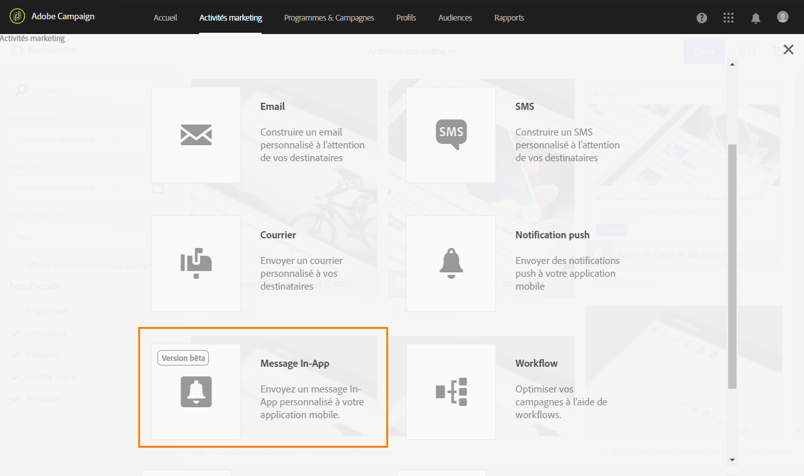

1. Sélectionnez un modèle adéquat en fonction de vos besoins en matière de ciblage d'audience.

   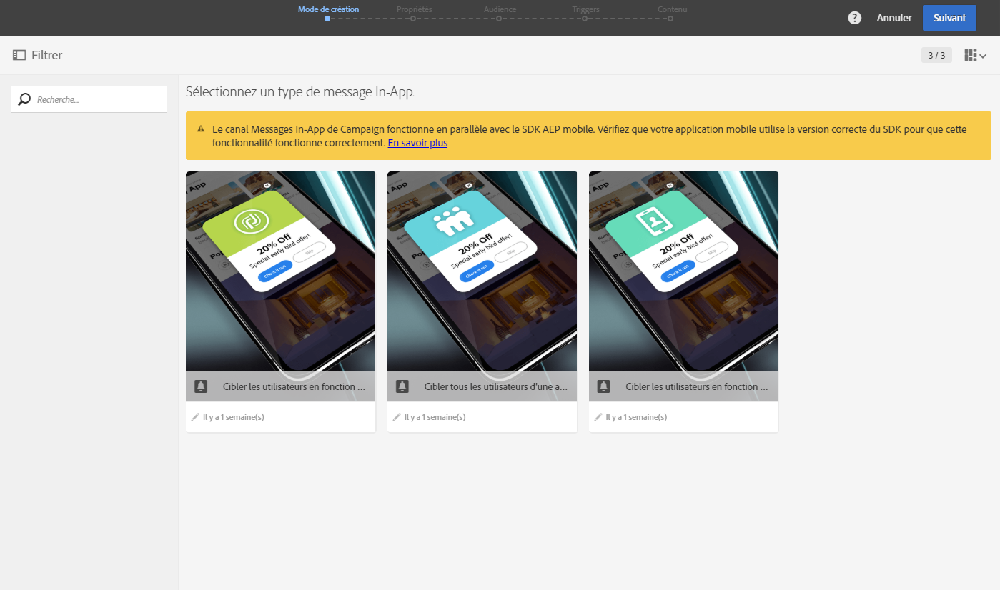

   Par défaut, vous avez le choix entre trois modèles d'usine :

   * **[!UICONTROL Cibler les utilisateurs en fonction de leur profil CRM Campaign (inAppProfile)]**
   * **[!UICONTROL Cibler tous les utilisateurs d'une application mobile (inAppBroadcast)]**
   * **[!UICONTROL Cibler les utilisateurs en fonction de leur profil Mobile (inApp)]**

1. Renseignez les propriétés du message in-app et sélectionnez votre application mobile dans le champ **[!UICONTROL Associer une application mobile à une diffusion].**

   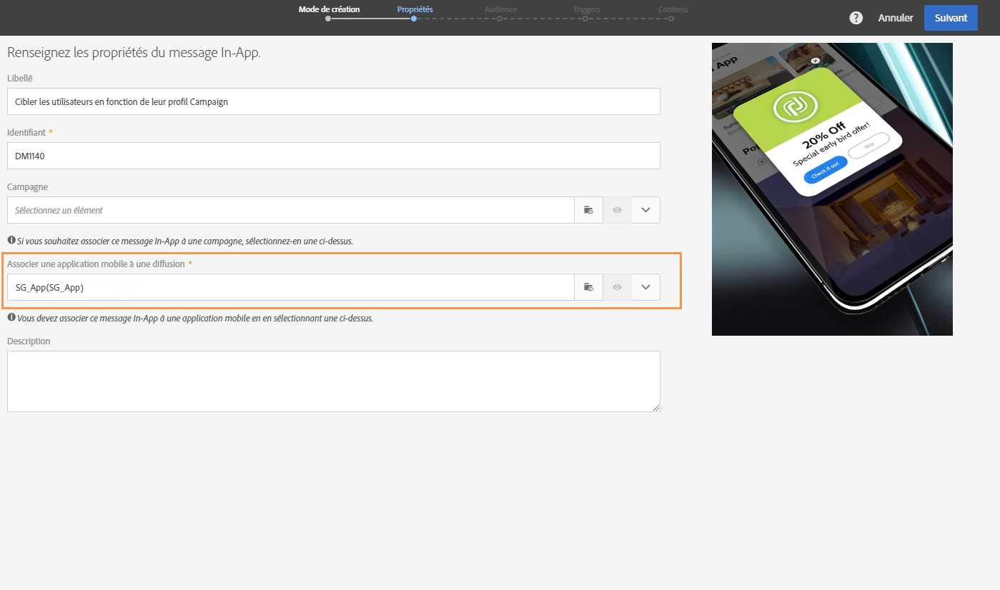

1. Sélectionnez l'audience que vous souhaitez cibler pour votre message in-app. Votre audience est préfiltrée selon l'application mobile associée à cette diffusion.

   Cette étape n'est pas nécessaire avec le modèle **[!UICONTROL Diffuser comme message In-App (inAppBroadcast)], car il cible tous les utilisateurs d'une application mobile.**

   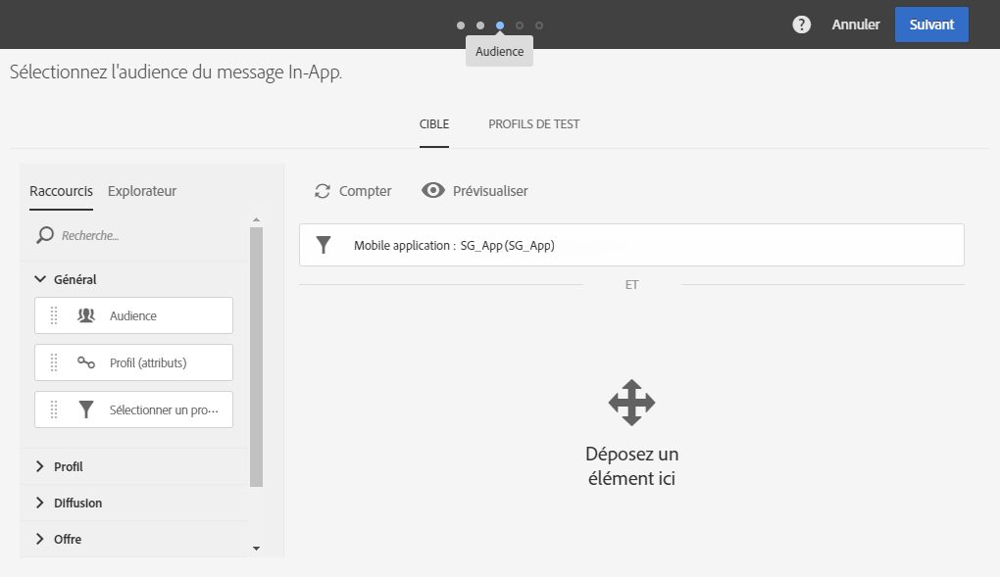

1. Dans l'onglet **[!UICONTROL Triggers], placez l'événement qui déclenchera votre message.** En choisissant un trigger, vous choisissez une action effectuée par les utilisateurs qui entraînera l'affichage du message in-app.

   Quatre catégories d'événements sont disponibles :

   * **[!UICONTROL Evénements d'application mobile]** : événements personnalisés implémentés dans votre application mobile.

      Pour plus d'informations sur la création d'événements, consultez cette [page](https://helpx.adobe.com/campaign/kb/configuring-app-sdk.html).

   * **[!UICONTROL Evénements de cycle de vie]** : événements de cycle de vie d'usine pris en charge par le SDK Adobe Mobile.

      Pour plus d'informations sur les événements de cycle de vie, consultez cette [page](https://marketing.adobe.com/resources/help/en_US/mobile/android/metrics.html).

   * **[!UICONTROL Evénements Analytics]** : les trois catégories suivantes sont prises en charge en fonction de ce qui est instrumenté dans votre application mobile : Adobe Analytics, Données de contexte ou Etat d'affichage.

      Ces événements ne sont disponibles que si vous possédez une licence Adobe Analytics.

   * **[!UICONTROL Places]** : les trois catégories suivantes tirent parti de données de localisation en temps réel de façon à diffuser des expériences mobiles pertinentes : données contextuelles de Places, métadonnées personnalisées de Places ou type d'événement Places.

      Pour plus d'informations sur Adobe Places, consultez la [documentation relative à Places](https://placesdocs.com/).
   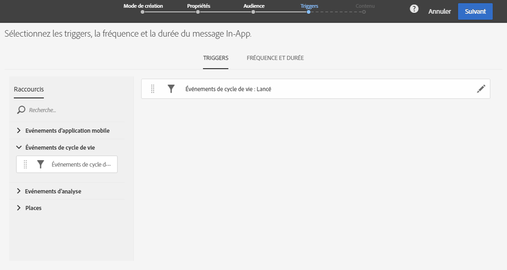

1. If you use an **[!UICONTROL Analytics Events]**, Adobe Analytics and View state events will be automatically populated based on the report suites configured in the Analytics extension in Adobe Experience Platform Launch whereas Context data events have to be manually added.

   Ces événements ne sont disponibles que si vous possédez une licence Adobe Analytics.

   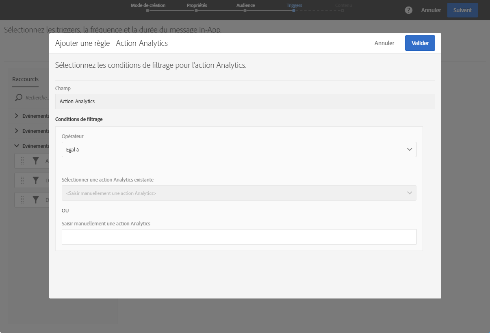

1. Si vous utilisez un trigger **[!UICONTROL Places], des données contextuelles de Places, des métadonnées personnalisées de Places ou un type d'événement Places seront automatiquement renseignés d'après l'ensemble des bibliothèques et leurs points d'intérêt créés dans Adobe Places.**

   Notez que ce déclencheur sera appliqué sur le périphérique uniquement pour les points ciblés des bibliothèques sélectionnées dans l'extension Lieux dans le lancement de la plateforme Experience. Pour plus d'informations sur l'extension Places et son installation, consultez cette [documentation](https://aep-sdks.gitbook.io/docs/using-mobile-extensions/places-extension-1/places-extension).

1. Dans l'onglet **[!UICONTROL Fréquence et durée], sélectionnez la fréquence du trigger, la date de début et de fin, le jour de la semaine et l'heure du jour auxquels le message in-app sera actif.**

   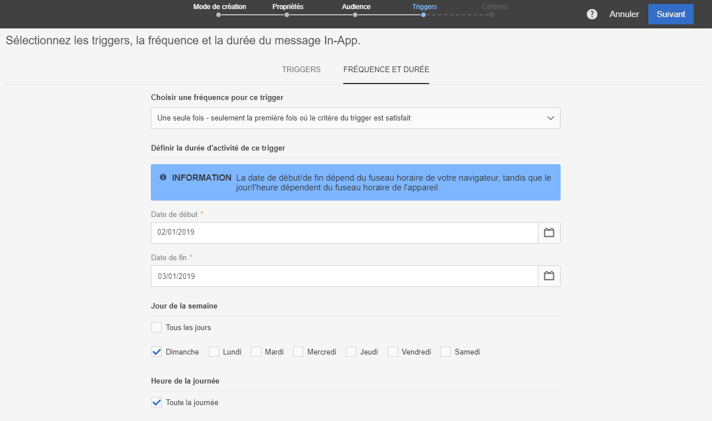

1. Editez le contenu de votre message et définissez les options avancées. Voir [Personnalisation d'un message in-app](https://helpx.adobe.com/campaign/standard/channels/using/customizing-a-push-notification.html).

   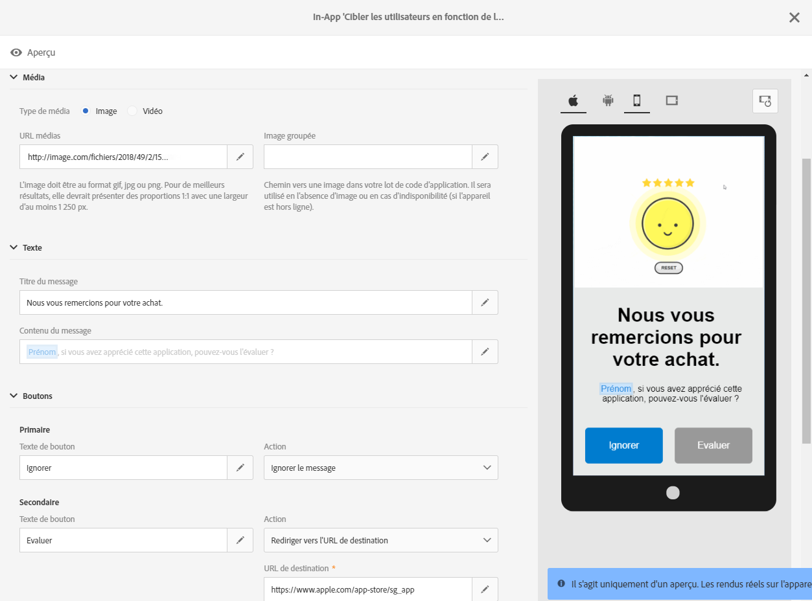

1. Cliquez sur **[!UICONTROL Créer]**.

Votre message in-app est maintenant prêt à être envoyé à votre audience cible.

**Rubriques connexes :**

* [Personnalisation d'un message in-app](../../channels/using/customizing-an-in-app-message.md)
* [Rapport In-App](../../reporting/using/in-app-report.md)
* [Envoi d'un message In-App dans un workflow](../../automating/using/in-app-delivery.md)

## Envoi de votre message in-app {#sending-your-in-app-message}

Une fois que la préparation de votre diffusion est terminée et que les étapes de validation ont été réalisées, vous pouvez envoyer votre message.

1. Cliquez sur **[!UICONTROL Préparer]pour calculer la cible et générer les messages.**

   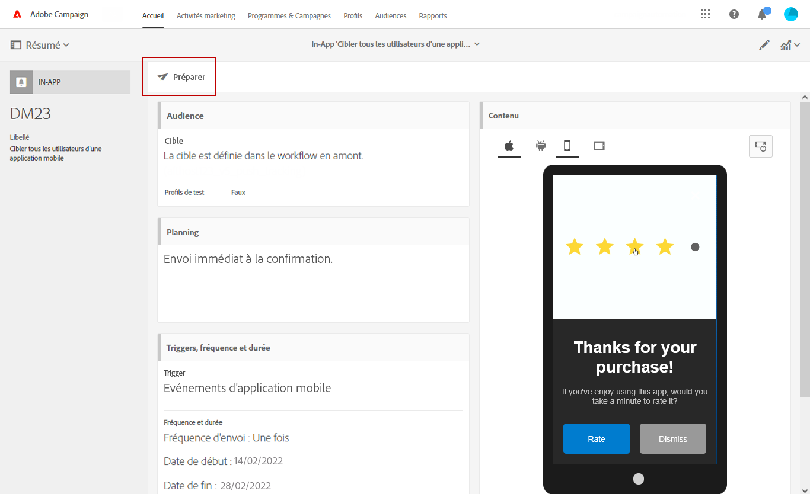

1. Dès que la préparation est terminée, la fenêtre **Déploiement** présente les KPI suivants : **Cible** et **A envoyer**.

   Dans la fenêtre Déploiement, vous pouvez afficher les exclusions ou les erreurs potentielles dans votre diffusion en cliquant sur le bouton 

   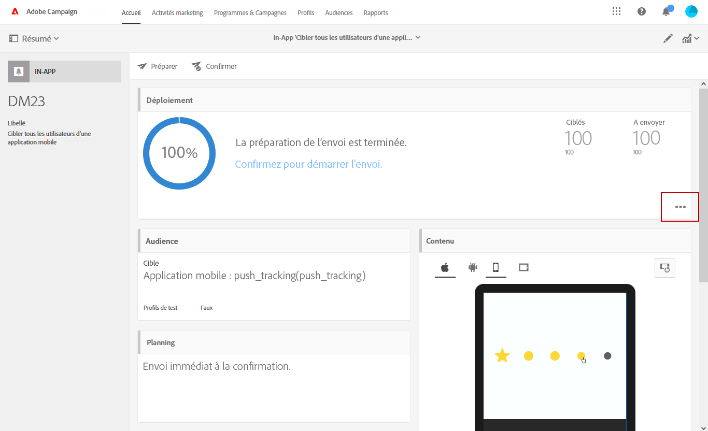

1. Cliquez sur **[!UICONTROL Confirmer]pour commencer l'envoi de votre message in-app.**

   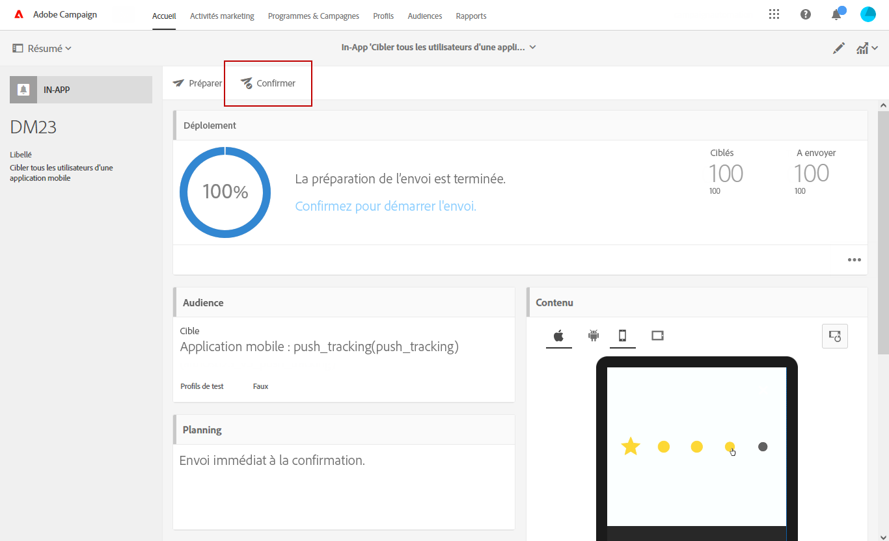

1. Vérifiez le statut de votre diffusion par le biais du tableau de bord du message et des logs. Voir à ce propos cette [section](../../sending/using/monitoring-a-delivery.md).

   **[!UICONTROL Les chiffres des KPI Délivrés]** et **[!UICONTROL Envoyés]reposent sur les éléments envoyés avec succès par Campaign au service de diffusion des messages.** Ces KPI ne constituent pas une indication du nombre d'appareils mobiles ayant reçu ou téléchargé le message avec succès depuis le service de diffusion des messages. 

   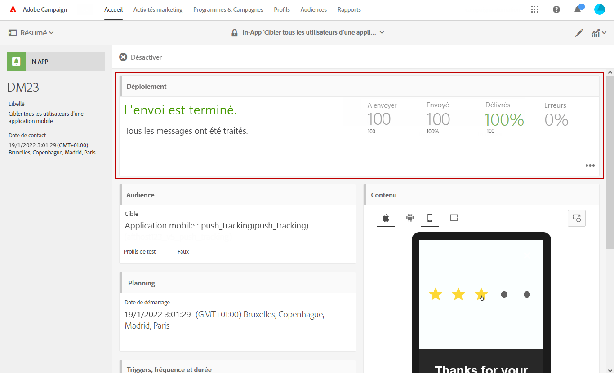

1. Mesurez l'impact de vos messages In-App avec des rapports de diffusion. Pour plus d'informations sur le reporting, consultez [cette section](../../reporting/using/in-app-report.md).

**Rubriques connexes :**

* [Rapport In-App](../../reporting/using/in-app-report.md)
* [Envoi d'un message In-App dans un workflow](../../automating/using/in-app-delivery.md)

