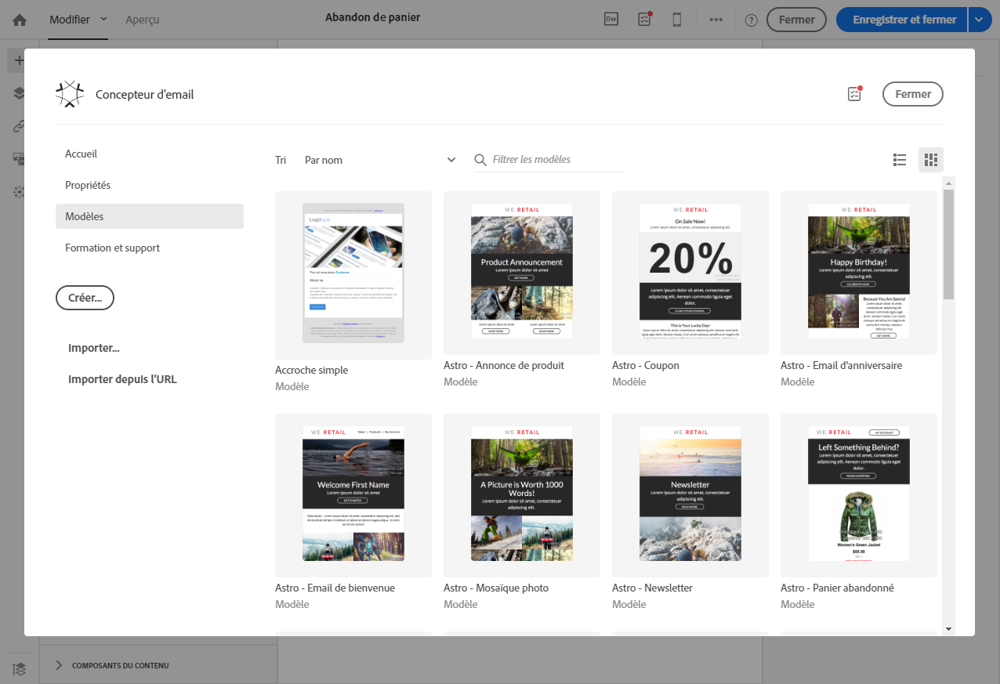
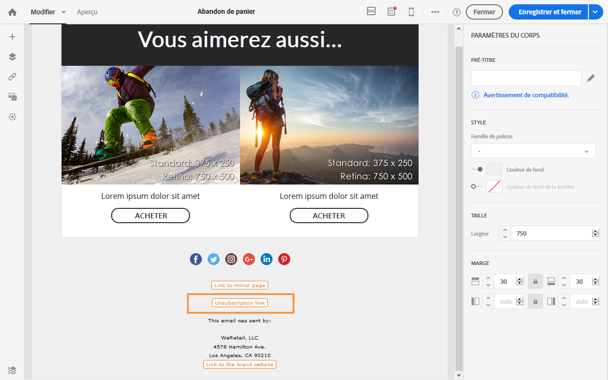
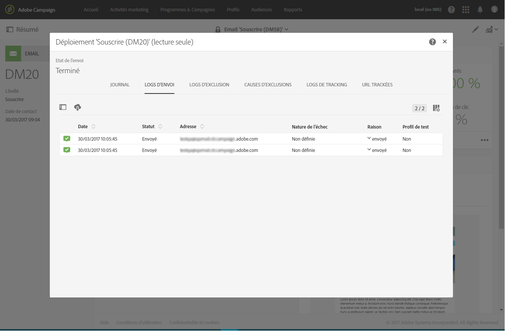
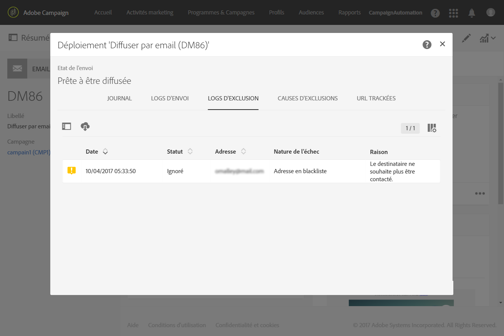
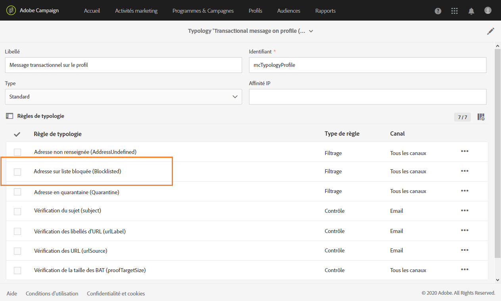

# Messages transactionnels basés sur un profil{#profile-transactional-messages}

Vous avez la possibilité d'envoyer des messages transactionnels selon les profils marketing des utilisateurs, ce qui vous permet de réaliser les actions suivantes :

* appliquer des règles de typologie marketing telles que **[!UICONTROL Adresse en blackliste]** ou des [règles de fatigue](../../administration/using/fatigue-rules.md) ;
* inclure le lien de désinscription dans les messages ;
* ajouter les messages transactionnels au reporting de diffusion globale ;
* utiliser les messages transactionnels dans le parcours client.

Une fois que vous avez créé et publié l'événement de votre choix (dans l'[exemple](../../channels/using/about-transactional-messaging.md#transactional-messaging-operating-principle) ci-dessus, l'abandon de panier), le message transactionnel correspondant est automatiquement créé.

Les étapes de configuration sont présentées dans la section [Configurer un événement pour envoyer un message transactionnel basé sur un profil](../../administration/using/configuring-transactional-messaging.md#use-case--configuring-an-event-to-send-a-transactional-message).

Pour que l'événement entraîne l'envoi d'un message transactionnel, vous devez personnaliser le message, le tester et le publier.

>[!NOTE]
>
>To access the transactional messages, you must have administration rights or appear in the **[!UICONTROL Message Center agents]** (mcExec) security group. Les règles de fatigue sont compatibles avec les messages transactionnels basés sur un profil. Voir [Règles de fatigue](../../administration/using/fatigue-rules.md).

## Envoyer un message transactionnel basé sur un profil {#sending-a-profile-transactional-message}

Les étapes pour créer, personnaliser et publier un message transactionnel de profil sont les mêmes que pour un message transactionnel d'événement. Voir [Messages transactionnels basés sur un événement](../../channels/using/event-transactional-messages.md).

Les différences sont énumérées ci-dessous.

1. Accédez au message transactionnel qui a été créé afin de l'éditer.
1. Dans le message transactionnel, cliquez sur la section **[!UICONTROL Contenu.]** Outre le modèle transactionnel, vous pouvez également choisir le modèle d'email par défaut qui cible **[!UICONTROL Profil]**.

   

1. Sélectionnez le modèle d'email par défaut.

   Comme tous les emails marketing, il contient un lien de désinscription.

   

   De plus, contrairement aux configurations reposant sur des événements temps réel, vous disposez d'un accès direct à toutes les informations de profil pour personnaliser votre message. Voir [Insertion d'un champ de personnalisation](../../designing/using/inserting-a-personalization-field.md).

1. Enregistrez vos modifications et publiez le message. Voir [Publier un message transactionnel](../../channels/using/event-transactional-messages.md#publishing-a-transactional-message).

## Contrôler la diffusion d'un message transactionnel selon les profils {#monitoring-a-profile-transactional-message-delivery}

Une fois le message publié et l'intégration à un site effectuée, vous pouvez contrôler la diffusion.

1. Pour visualiser le log de diffusion du message, cliquez sur l'icône située en bas à droite du bloc **[!UICONTROL Déploiement].**

   Pour plus d'informations sur l'accès aux logs, voir [Contrôler la diffusion](../../sending/using/monitoring-a-delivery.md).

1. Sélectionnez l'onglet **[!UICONTROL Envois].** Dans la colonne **[!UICONTROL Statut]**, la mention **Envoyé]indique qu'un profil s'est inscrit.[!UICONTROL **

   

1. Sélectionnez l'onglet **[!UICONTROL Logs d'exclusion]pour visualiser les destinataires qui ont été exclus de la cible du message, par exemple les adresses en blackliste.**

   

Pour un profil qui s'est désinscrit, la règle de typologie **[!UICONTROL Adresse en blackliste]a exclu le destinataire correspondant.**

Cette règle fait partie d'une typologie spécifique qui s'applique à tous les messages transactionnels qui reposent sur la table **[!UICONTROL Profile].**

**Rubriques connexes** :

* [Intégration à un site](../../administration/using/configuring-transactional-messaging.md#integrating-the-triggering-of-the-event-in-a-website)
* [Typologies](../../administration/using/about-typology-rules.md)

