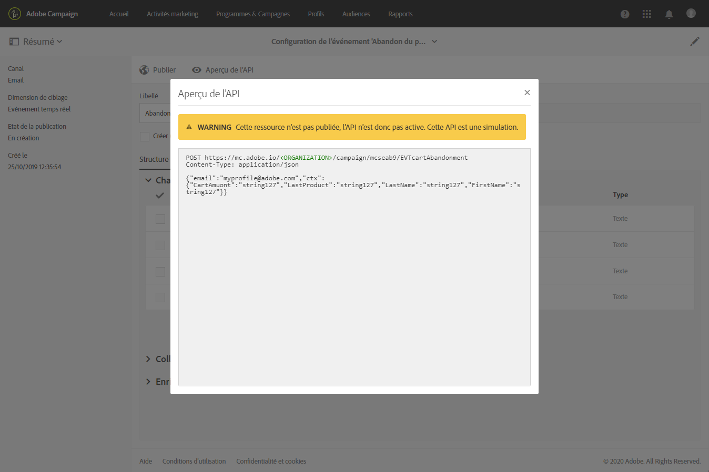
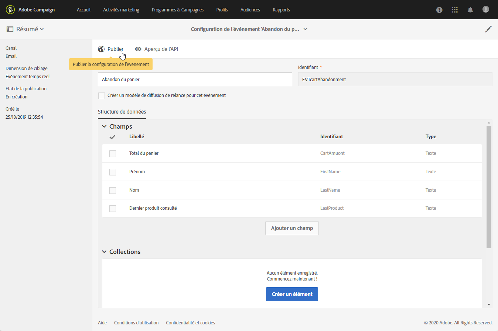
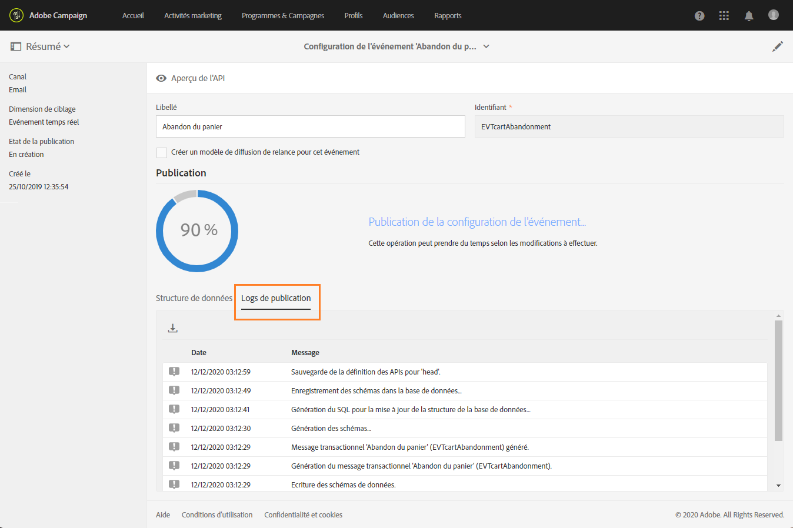
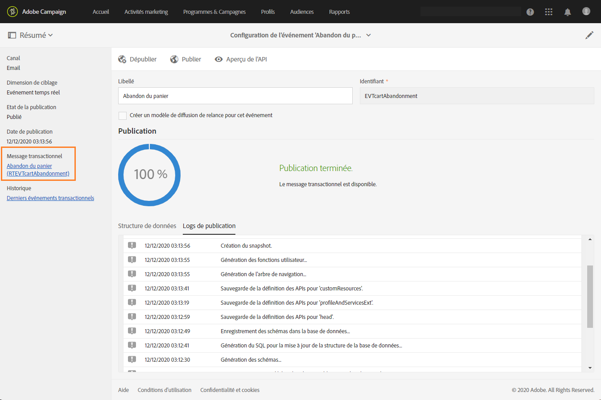
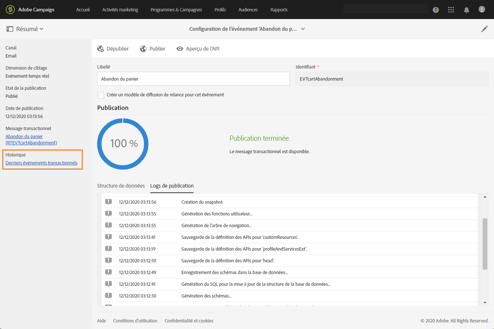
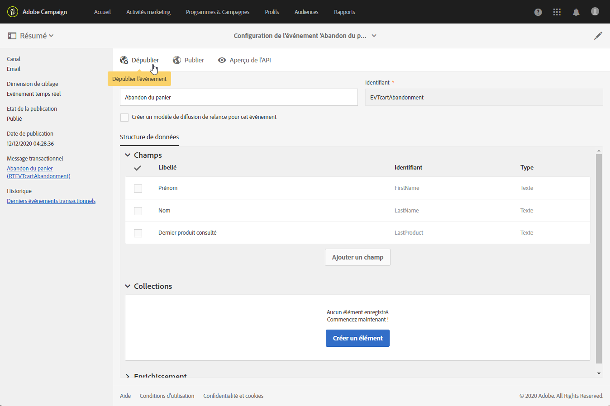
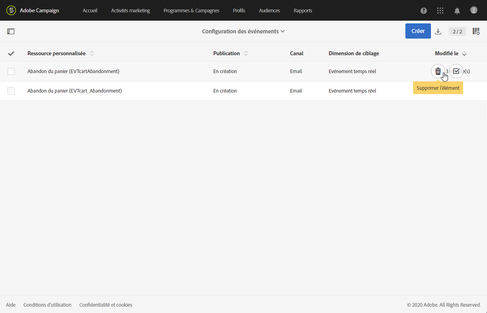
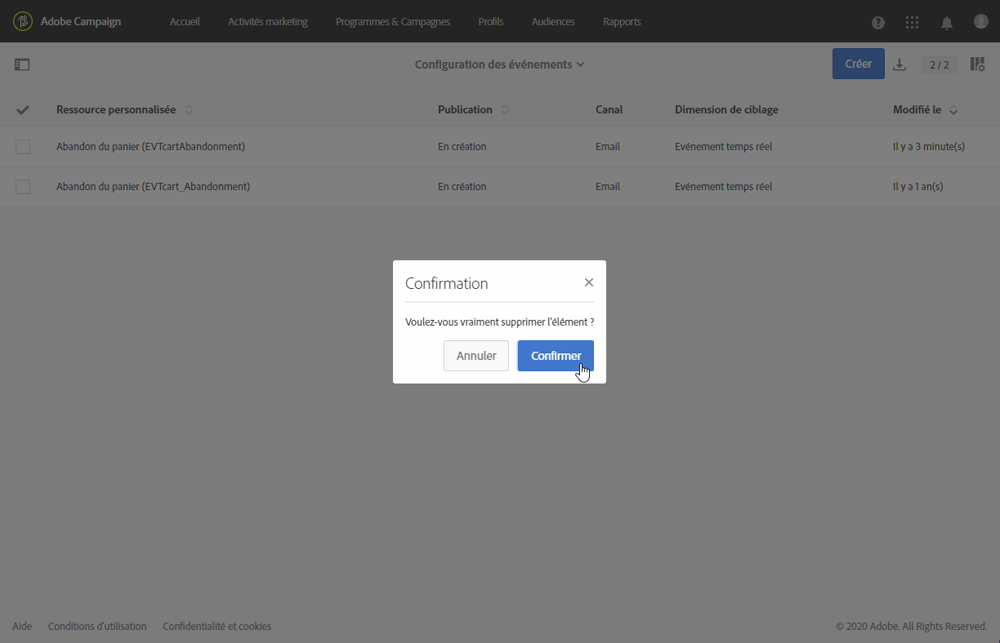

# Publication d’un événement transactionnel {#publishing-transactional-event}

Une fois la [configuration](../../channels/using/configuring-transactional-event.md) terminée, le événement est prêt à être publié. Les étapes de prévisualisation, de publication, d’annulation de publication et de suppression d’un événement sont décrites ci-dessous.

>[!IMPORTANT]
>
>Seuls les [administrateurs fonctionnels](../../administration/using/users-management.md#functional-administrators) <!--being part of the **[!UICONTROL All]** [organizational unit](../../administration/using/organizational-units.md) -->disposent des droits appropriés pour publier les configurations de événement.

Un graphique illustrant l&#39;ensemble du processus de publication des messages transactionnels, y compris les configurations de événement de publication et d&#39;annulation de publication, est disponible dans [cette section](../../channels/using/publishing-transactional-message.md).

Une fois la publication terminée :
* Le message transactionnel correspondant est automatiquement créé. Voir [Modification des messages transactionnels](../../channels/using/editing-transactional-message.md).
* L’API qui sera utilisée par le développeur de votre site web est déployée et les événements transactionnels peuvent désormais être envoyés. Voir [Intégrer le déclenchement du événement](../../channels/using/getting-started-with-transactional-msg.md#integrate-event-trigger).

## Aperçu et publication d’un événement {#previewing-and-publishing-the-event}

Avant de pouvoir utiliser l’événement, vous devez le prévisualiser et le publier.

1. Cliquez sur le bouton **[!UICONTROL Aperçu de l’API]** pour visualiser une simulation de l’API REST, qui sera utilisée par le développeur de votre site web, avant qu’elle ne soit publiée.

   Une fois l’événement publié, ce bouton permet également d’obtenir un aperçu de l’API en production. Voir [Intégrer le déclenchement du événement](../../channels/using/getting-started-with-transactional-msg.md#integrate-event-trigger).

   

   >[!NOTE]
   >
   >L’API REST varie en fonction du canal sélectionné et de la dimension de ciblage sélectionnée. Pour plus d&#39;informations sur les différentes configurations, consultez [cette section](../../channels/using/configuring-transactional-event.md#transactional-event-specific-configurations).

1. Cliquez sur le bouton **[!UICONTROL Publier]** pour lancer la publication.

   

   L’API qui sera utilisée par le développeur de votre site web est déployée et les événements transactionnels peuvent désormais être envoyés.

1. Vous pouvez visualiser les logs de publication dans l’onglet correspondant.

   

   >[!IMPORTANT]
   >
   >Chaque fois que vous modifiez l’événement, vous devez à nouveau cliquer sur **[!UICONTROL Publier]** pour générer l’API REST mise à jour qui sera utilisée par le développeur de votre site web.

   Une fois le événement publié, un [message transactionnel](../../channels/using/editing-transactional-message.md) lié au nouveau événement est automatiquement créé.

1. Vous pouvez accéder directement à ce message transactionnel par le biais du lien situé dans la zone de gauche.

   

   >[!NOTE]
   >
   >Pour que le événement déclenche l’envoi d’un message transactionnel, vous devez modifier et publier le message qui vient d’être créé. Voir les sections [Modification](../../channels/using/editing-transactional-message.md) et [Publication d’un message transactionnel](../../channels/using/publishing-transactional-message.md). Vous devez également [intégrer ce événement de déclenchement](../../channels/using/getting-started-with-transactional-msg.md#integrate-event-trigger) dans votre site Web.

1. Une fois que les débuts Adobe Campaign reçoivent des événements liés à cette configuration de événement, vous pouvez cliquer sur le lien **[!UICONTROL Derniers événements transactionnels]** sous la section **[!UICONTROL Historique]** pour accéder aux derniers événements envoyés par votre service tiers et traités par Adobe Campaign.

Les événements (au format JSON) sont répertoriés du plus récent au plus ancien. Cette liste vous permet de vérifier des données telles que le contenu ou le statut d’un événement, à des fins de contrôle et de correction d’erreurs.

## Dépublier un événement     {#unpublishing-an-event}

Le bouton **[!UICONTROL Dépublier]** permet d’annuler la publication de l’événement, ce qui supprime de l’API REST la ressource correspondant à l’événement précédemment créé.

Désormais, même si l’événement est déclenché via votre site web, les messages correspondants ne sont plus envoyés et ils ne sont pas stockés dans la base de données.

>[!NOTE]
>
>Si vous avez déjà publié le message transactionnel correspondant, la publication du message est également annulée. Voir [Dépublier un message transactionnel](../../channels/using/publishing-transactional-message.md#unpublishing-a-transactional-message).

Cliquez sur le bouton **[!UICONTROL Publier]** pour générer une nouvelle API REST.

<!--## Transactional messaging publication process {#transactional-messaging-pub-process}

The chart below illustrates the transactional messaging publication process.

For more on publishing, pausing and unpublishing a transactional message, see [this section](../../channels/using/publishing-transactional-message.md).-->

## Suppression d’un événement {#deleting-an-event}

Lorsqu’un événement a été dépublié ou qu’il n’a pas encore été publié, vous pouvez le supprimer de la liste de configuration d’événement. Pour cela :

1. Cliquez sur le logo **[!UICONTROL Adobe Campaign]**, en haut à gauche, puis sélectionnez **[!UICONTROL Plans marketing]** > **[!UICONTROL Messages transactionnels]** > **[!UICONTROL Configuration des événements]**.
1. Pointez sur la configuration de l’événement de votre choix et sélectionnez le bouton **[!UICONTROL Supprimer l’élément]** .

   

   >[!NOTE]
   >
   >Vérifiez que la configuration de l’événement a le statut **[!UICONTROL En création]**, sinon vous ne pourrez pas le supprimer. Le statut **[!UICONTROL En création]** s’applique à un événement qui n’a pas encore été publié ou qui a été [dépublié](#unpublishing-an-event).

1. Cliquez sur le bouton **[!UICONTROL Confirmer.]**

   

>[!IMPORTANT]
>
>La suppression d’une configuration d’événement qui a été publiée et déjà utilisée entraînera celle du ou des messages transactionnels correspondants, ainsi que de ses logs d’envoi et de tracking.
