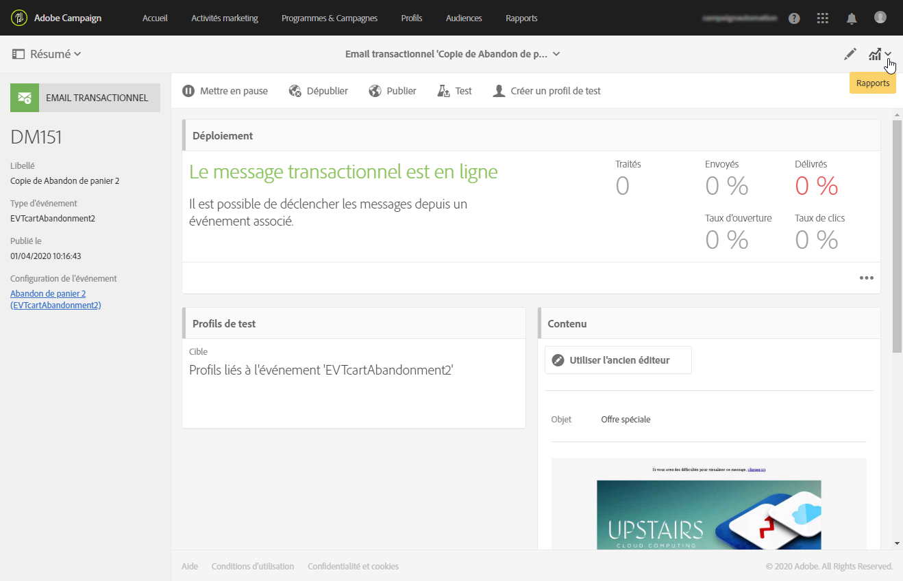

# Cycle de vie du message transactionnel {#publishing-transactional-message}

Lorsque le [message transactionnel](../../channels/using/editing-transactional-message.md) est prêt à être envoyé, il peut être publié.

Les étapes pour tester, publier, suspendre, annuler la publication et supprimer un événement sont décrites en détail ci-dessous. Cette section décrit également le processus de nouvelle tentative de messagerie transactionnelle.

## Processus de publication de messages transactionnels {#transactional-messaging-pub-process}

Le graphique ci-dessous illustre le processus global de publication des messages transactionnels.

Pour plus d’informations sur la publication d’un message transactionnel, voir [cette section](#publishing-a-transactional-message).
Pour plus d’informations sur la suspension d’un message transactionnel, voir [cette section](#suspending-a-transactional-message-publication).
Pour plus d’informations sur l’annulation de publication d’un message transactionnel, voir [cette section](#unpublishing-a-transactional-message).

Pour plus d’informations sur la publication et l’annulation de publication d’un événement, voir [cette section](../../channels/using/publishing-transactional-event.md).

## Tester un message transactionnel {#testing-a-transactional-message}

Vous devez d’abord créer un profil de test spécifique qui vous permettra de vérifier correctement le message transactionnel.

### Définition d’un profil de test spécifique {#defining-specific-test-profile}

Définissez un profil de test qui sera lié à votre événement, ce qui vous permettra de prévisualiser votre message et d’envoyer un BAT approprié.

1. Dans le tableau de bord du message transactionnel, cliquez sur le bouton **[!UICONTROL Créer un profil de test]**.

   

1. Indiquez les informations à transmettre au format JSON dans la section **[!UICONTROL Données de l’événement utilisées pour la personnalisation]**. C’est le contenu qui sera utilisé lors de la prévisualisation du message et que recevra le profil de test à l’envoi du BAT.

   

   >[!NOTE]
   >
   >Vous pouvez également saisir les informations associées à la table des profils. Voir [Enrichissement du événement](../../channels/using/configuring-transactional-event.md#enriching-the-transactional-message-content)<!--and [Personalizing a transactional message](../../channels/using/editing-transactional-message.md#personalizing-a-transactional-message)-->.

1. Une fois créé, le profil de test est pré-renseigné dans le message transactionnel. Cliquez sur le bloc **[!UICONTROL Profils de test]** du message pour vérifier la cible de votre BAT.

   

Vous pouvez également créer un profil de test ou en utiliser un existant depuis le menu **[!UICONTROL Profils de test.]** Pour cela :

1. Cliquez sur le logo **[!UICONTROL Adobe Campaign]**, en haut à gauche, puis sélectionnez **[!UICONTROL Profils &amp; audiences]** > **[!UICONTROL Profils de test]**.
1. Dans la section **[!UICONTROL Événement]**, sélectionnez l’événement que vous venez de créer. Dans cet exemple, choisissez &quot;Abandon de panier (EVTcartAbandonment)&quot;.
1. Indiquez les informations à transmettre au format JSON dans la zone de texte **[!UICONTROL Données de l’événement]**.

   

1. Enregistrez vos modifications.
1. Accédez au message que vous avez créé et sélectionner le profil de test mis à jour.

**Rubriques connexes :**

* [Gestion des profils de test](../../audiences/using/managing-test-profiles.md)
* [Création d’une audience](../../audiences/using/creating-audiences.md)

### Envoyer le BAT {#sending-proof}

Une fois que vous avez créé un ou plusieurs profils de test spécifiques et enregistré votre message transactionnel, vous pouvez envoyer un BAT pour le tester.

Les étapes d&#39;envoi d&#39;un BAT sont détaillées dans la section [Envoi de BAT](../../sending/using/sending-proofs.md).

## Publier un message transactionnel          {#publishing-a-transactional-message}

Une fois que vous avez validé le message transactionnel, vous pouvez le publier.

A présent, dès que l’événement &quot;Abandon de panier&quot; est déclenché, il entraîne automatiquement l’envoi d’un message contenant la civilité et le nom du destinataire, l’URL du panier, le dernier produit consulté ou la liste des produits si vous avez défini une liste de produits et le montant total du panier.

Pour accéder aux rapports relatifs à votre message transactionnel, utilisez le bouton **[!UICONTROL Rapports]**. Voir [Rapports dynamiques](../../reporting/using/about-dynamic-reports.md).

### Suspendre la publication d’un message transactionnel           {#suspending-a-transactional-message-publication}

Vous pouvez suspendre la publication de votre message transactionnel en utilisant le bouton **[!UICONTROL Mettre en pause]**, afin de modifier les données contenues dans le message par exemple. Les événements ne sont alors plus traités, mais ils sont conservés dans une file d’attente, dans la base de données Adobe Campaign.

Les événements placés en file d&#39;attente sont conservés pendant une période définie dans l&#39;API REST (voir la [documentation de l&#39;API REST](../../api/using/managing-transactional-messages.md) ou dans le événement de déclenchement si vous utilisez le service principal Triggers (voir [À propos de Adobe Experience Cloud Triggers](../../integrating/using/about-adobe-experience-cloud-triggers.md)).

Lorsque vous cliquez sur **[!UICONTROL Reprendre]**, tous les événements placés dans la file d’attente sont envoyés (à condition qu’ils n’aient pas expiré). Ils contiennent alors les modifications effectuées tant que la publication du modèle était suspendue.

### Dépublier un message transactionnel           {#unpublishing-a-transactional-message}

Cliquez sur **[!UICONTROL Dépublier]** pour annuler la publication du message transactionnel. L’événement correspondant est également dépublié, ce qui supprime de l’API REST la ressource correspondant à l’événement précédemment créé.

Désormais, même si l’événement est déclenché via votre site web, les messages correspondants ne sont plus envoyés et ils ne sont pas stockés dans la base de données.

>[!NOTE]
>
>Pour publier à nouveau le message, vous devez revenir à la configuration de événement correspondante, [publier le événement](../../channels/using/publishing-transactional-event.md), puis [publier le message](#publishing-a-transactional-message).

Si vous dépubliez un message transactionnel mis en pause, vous devrez attendre jusqu’à 24 heures avant de pouvoir le republier. Ce délai permet au workflow **[!UICONTROL Nettoyage de la base]** de nettoyer tous les événements qui ont été envoyés dans la file d’attente.

Les étapes de mise en pause d’un message sont présentées dans la section [Suspendre la publication d’un message transactionnel](#suspending-a-transactional-message-publication).

Le workflow **[!UICONTROL Nettoyage de la base]**, qui s’exécute tous les jours à 4h00, est accessible via **[!UICONTROL Administration]** > **[!UICONTROL Paramétrage de l’application]** > **[!UICONTROL Workflows]**.

### Supprimer un message transactionnel {#deleting-a-transactional-message}

Lorsqu’un message transactionnel a été dépublié ou qu’il n’a pas encore été publié, vous pouvez le supprimer de la liste des messages transactionnels. Pour cela :

1. Cliquez sur le logo **[!UICONTROL Adobe Campaign]**, en haut à gauche, puis sélectionnez **[!UICONTROL Plans marketing]** > **[!UICONTROL Messages transactionnels]** > **[!UICONTROL Diffusions]**.
1. Passez la souris sur le message de votre choix.
1. Cliquez sur le bouton **[!UICONTROL Supprimer l’élément]**.

La suppression d’un message transactionnel ne peut toutefois être effectuée que sous certaines conditions :

* Vérifiez que le message transactionnel a le statut **[!UICONTROL En création]**, sinon vous ne pourrez pas le supprimer. Le statut **[!UICONTROL En création]** s’applique à un message qui n’a pas encore été publié ou qui a été [dépublié](#unpublishing-a-transactional-message) (et non [mis en pause](#suspending-a-transactional-message-publication)).

* **Messages transactionnels** : À moins qu’un autre message transactionnel ne soit lié à l’événement correspondant, si le message transactionnel est dépublié, la configuration de l’événement doit également être dépubliée pour que la suppression de votre message transactionnel soit réussie. Voir à ce propos [Dépublier un événement](../../channels/using/publishing-transactional-event.md#unpublishing-an-event).

   >[!IMPORTANT]
   >
   >La suppression d’un message transactionnel ayant déjà envoyé des notifications entraîne celle de ses logs d’envoi et du tracking.

* **Messages transactionnels issus d’un modèle d’événement d’usine (messages transactionnels internes)** : Si un message transactionnel interne est le seul associé à l’événement interne correspondant, il ne peut pas être supprimé. Vous devez tout d’abord créer un autre message transactionnel en le dupliquant ou à travers le menu **[!UICONTROL Ressources]** > **[!UICONTROL Modèles]** > **[!UICONTROL Modèles de messages transactionnels]**.

## Processus de reprise d’un message transactionnel           {#transactional-message-retry-process}

Un message transactionnel temporairement non diffusé fait l’objet de reprises automatiques jusqu’à l’expiration de la diffusion. Pour plus d’informations sur la durée de diffusion, voir [Paramètres de période de validité](../../administration/using/configuring-email-channel.md#validity-period-parameters).

En cas d’échec de l’envoi d’un message transactionnel, il existe deux systèmes de reprise :

* Au niveau des messages transactionnels, un message transactionnel peut échouer avant que l’événement ne soit assigné à une diffusion d’exécution, c’est-à-dire entre la réception de l’événement et la préparation de la diffusion. Voir [Processus de reprise du traitement d’un événement](#event-processing-retry-process).
* Au niveau du processus d’envoi, une fois l’événement assigné à une diffusion d’exécution, le message transactionnel peut échouer en raison d’une erreur temporaire. Voir [Processus de reprise de l’envoi d’un message](#message-sending-retry-process).

### Processus de reprise du traitement d’un événement           {#event-processing-retry-process}

Si l’événement ne peut pas être assigné à une diffusion d’exécution, son traitement est reporté. Des reprises sont ensuite effectuées jusqu’à ce qu’il soit assigné à une nouvelle diffusion d’exécution.

>[!NOTE]
>
>Un événement reporté n’apparaît pas dans les logs d’envoi de messages transactionnels, car il n’est pas encore assigné à une diffusion d’exécution.

Par exemple, l’événement ne pourrait pas être assigné à une diffusion d’exécution, en raison d’un contenu incorrect, d’un problème de droits d’accès ou de branding, d’une erreur détectée lors de l’application des règles de typologie, etc. Dans ce cas, vous pouvez mettre le message en pause, l’éditer pour résoudre le problème et le publier à nouveau. Le système de reprise l’assignera ensuite à une nouvelle diffusion d’exécution.

### Processus de reprise de l’envoi d’un message           {#message-sending-retry-process}

Une fois que l’événement a été assigné à une diffusion d’exécution, le message transactionnel peut échouer en raison d’une erreur temporaire, par exemple si la boîte du destinataire est pleine. Voir à ce propos [Reprises après un échec temporaire de diffusion](../../sending/using/understanding-delivery-failures.md#retries-after-a-delivery-temporary-failure).

>[!NOTE]
>
>Lorsqu’un événement est assigné à une diffusion d’exécution, il apparaît dans les logs d’envoi de cette diffusion d’exécution, et uniquement à ce moment. Les diffusions en échec sont affichées dans l’onglet **[!UICONTROL Liste des exécutions]** des logs d’envoi des messages transactionnels.

### Limitations du processus de reprise {#limitations}

**Mise à jour des logs d’envoi**

Dans le processus de reprise, les logs d’envoi de la nouvelle diffusion d’exécution ne sont pas immédiatement mis à jour (la mise à jour est réalisée via un workflow planifié). Cela signifie que le message peut être à l’état **[!UICONTROL En attente]**, même si l’événement transactionnel a été traité par la nouvelle diffusion d’exécution.

**Diffusion d’exécution en échec**

Vous ne pouvez pas arrêter une diffusion d’exécution. Cependant, si la diffusion d’exécution actuelle échoue, une nouvelle est créée dès qu’un nouvel événement est reçu, et tous les nouveaux événements sont traités par cette nouvelle diffusion d’exécution. Aucun nouvel événement n’est traité par la diffusion d’exécution en échec.

Si certains événements déjà assignés à une diffusion d’exécution ont été reportés et si cette diffusion d’exécution échoue, le système de reprise n’assigne pas les événements reportés à la nouvelle diffusion d’exécution, ce qui signifie que ces événements sont perdus.
