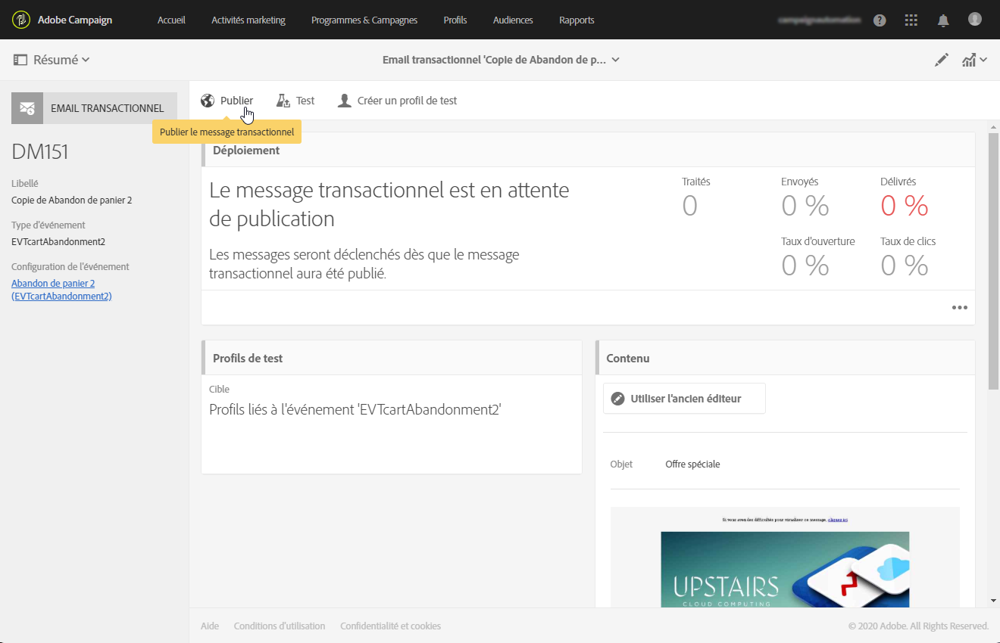
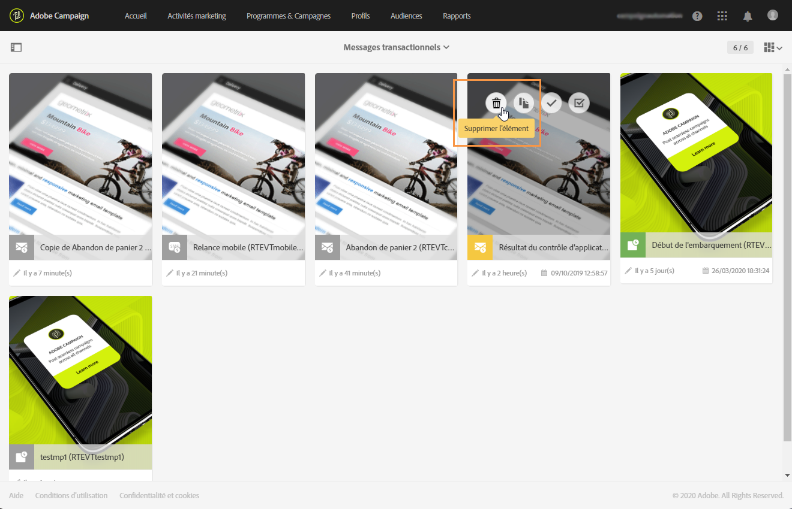

# Cycle de vie du message transactionnel {#publishing-transactional-message}

Lorsque le [message transactionnel](../../channels/using/editing-transactional-message.md) est prêt à être envoyé, il peut être publié.

Les étapes de publication, de mise en pause, d’annulation de publication et de suppression d’un message transactionnel sont détaillées ci-dessous.

>[!IMPORTANT]
>
>Seuls les utilisateurs dotés du rôle [Administration](../../administration/using/users-management.md#functional-administrators) peuvent accéder aux messages transactionnels et les publier.

## Processus de publication de messages transactionnels {#transactional-messaging-pub-process}

Le graphique ci-dessous illustre le processus global de publication des messages transactionnels.

**Rubriques connexes :**
* [Publier un message transactionnel         ](#publishing-a-transactional-message)
* [Suspension d&#39;un message transactionnel](#suspending-a-transactional-message-publication)
* [Dépublier un message transactionnel         ](#unpublishing-a-transactional-message)
* [Publication d’un événement](../../channels/using/publishing-transactional-event.md)

<!--## Testing a transactional message {#testing-a-transactional-message}

You first need to create a specific test profile that will allow you to properly check the transactional message.

### Defining a specific test profile {#defining-specific-test-profile}

Define a test profile that will be linked to your event, which will allow you to preview your message and send a relevant proof.

1. From the transactional message dashboard, click the **[!UICONTROL Create test profile]** button.

   

1. Specify the information to send in JSON format in the **[!UICONTROL Event data used for personalization]** section. This is the content that will be used when previewing the message and when the test profile receives the proof.

   

   >[!NOTE]
   >
   >You can also enter the information relating to the profile table. See [Enriching the event](../../channels/using/configuring-transactional-event.md#enriching-the-transactional-message-content) and [Personalizing a transactional message](../../channels/using/editing-transactional-message.md#personalizing-a-transactional-message).

1. Once created, the test profile will be pre-specified in the transactional message. Click the **[!UICONTROL Test profiles]** block of the message to check the target of your proof.

   

You can also create a new test profile or use one that already exists in the **[!UICONTROL Test profiles]** menu. To do this:

1. Click the **[!UICONTROL Adobe Campaign]** logo, in the top left corner, then select **[!UICONTROL Profiles & audiences]** > **[!UICONTROL Test profiles]**.
1. In the **[!UICONTROL Event]** section, select the event that you have just created. In this example, select "Cart abandonment (EVTcartAbandonment)".
1. Specify the information to send in JSON format in the **[!UICONTROL Event data]** text box.

   

1. Save your changes.
1. Access the message that you created and select the updated test profile.

**Related topics:**

* [Managing test profiles](../../audiences/using/managing-test-profiles.md)
* [Creating audiences](../../audiences/using/creating-audiences.md)

### Sending the proof {#sending-proof}

Once you have created one or more specific test profiles and saved your transactional message, you can send a proof to test it.

The steps for sending a proof are detailed in the [Sending proofs](../../sending/using/sending-proofs.md) section.-->

## Publier un message transactionnel          {#publishing-a-transactional-message}

Une fois votre message transactionnel modifié et testé, vous pouvez le publier. Cliquez simplement sur le bouton **[!UICONTROL Publier]**.

A présent, dès que l’événement &quot;Abandon de panier&quot; est déclenché, il entraîne automatiquement l’envoi d’un message contenant la civilité et le nom du destinataire, l’URL du panier, le dernier produit consulté ou la liste des produits si vous avez défini une liste de produits et le montant total du panier.

Pour accéder aux rapports relatifs à votre message transactionnel, utilisez le bouton **[!UICONTROL Rapports]**. Voir [Rapports dynamiques](../../reporting/using/about-dynamic-reports.md).

**Rubriques connexes** :
* [Modifier un message transactionnel](../../channels/using/editing-transactional-message.md)
* [Tester un message transactionnel](../../channels/using/testing-transactional-message.md)
* [Intégrer le déclenchement du événement](../../channels/using/getting-started-with-transactional-msg.md#integrate-event-trigger)

## Suspendre la publication d’un message transactionnel           {#suspending-a-transactional-message-publication}

Vous pouvez suspendre la publication de votre message transactionnel en utilisant le bouton **[!UICONTROL Mettre en pause]**, afin de modifier les données contenues dans le message par exemple. Les événements ne sont alors plus traités, mais ils sont conservés dans une file d’attente, dans la base de données Adobe Campaign.

Les événements placés en file d&#39;attente sont conservés pendant une période définie dans l&#39;API REST (voir la [documentation de l&#39;API REST](../../api/using/managing-transactional-messages.md)) ou dans le événement de déclenchement si vous utilisez le service principal Triggers (voir [À propos de Adobe Experience Cloud Triggers](../../integrating/using/about-adobe-experience-cloud-triggers.md)).

Lorsque vous cliquez sur **[!UICONTROL Reprendre]**, tous les événements placés dans la file d’attente sont envoyés (à condition qu’ils n’aient pas expiré). Ils contiennent alors les modifications effectuées tant que la publication du modèle était suspendue.

## Dépublier un message transactionnel           {#unpublishing-a-transactional-message}

Cliquez sur **[!UICONTROL Dépublier]** pour annuler la publication du message transactionnel. L’événement correspondant est également dépublié, ce qui supprime de l’API REST la ressource correspondant à l’événement précédemment créé.

Désormais, même si l’événement est déclenché via votre site web, les messages correspondants ne sont plus envoyés et ils ne sont pas stockés dans la base de données.

>[!NOTE]
>
>Pour publier à nouveau le message, vous devez revenir à la configuration de événement correspondante, [publier le événement](../../channels/using/publishing-transactional-event.md), puis [publier le message](#publishing-a-transactional-message).

Si vous dépubliez un message transactionnel mis en pause, vous devrez attendre jusqu’à 24 heures avant de pouvoir le republier. Ce délai permet au workflow **[!UICONTROL Nettoyage de la base]** de nettoyer tous les événements qui ont été envoyés dans la file d’attente.

Les étapes de mise en pause d’un message sont présentées dans la section [Suspendre la publication d’un message transactionnel](#suspending-a-transactional-message-publication).

Le workflow **[!UICONTROL Nettoyage de la base]**, qui s’exécute tous les jours à 4h00, est accessible via **[!UICONTROL Administration]** > **[!UICONTROL Paramétrage de l’application]** > **[!UICONTROL Workflows]**.

## Supprimer un message transactionnel {#deleting-a-transactional-message}

Lorsqu’un message transactionnel a été dépublié ou qu’il n’a pas encore été publié, vous pouvez le supprimer de la liste des messages transactionnels. Pour cela :

1. Cliquez sur le logo **[!UICONTROL Adobe Campaign]**, en haut à gauche, puis sélectionnez **[!UICONTROL Plans marketing]** > **[!UICONTROL Messages transactionnels]** > **[!UICONTROL Diffusions]**.
1. Passez la souris sur le message de votre choix.
1. Cliquez sur le bouton **[!UICONTROL Supprimer l’élément]**.

La suppression d’un message transactionnel ne peut toutefois être effectuée que sous certaines conditions :

* Vérifiez que le message transactionnel a le statut **[!UICONTROL En création]**, sinon vous ne pourrez pas le supprimer. Le statut **[!UICONTROL En création]** s’applique à un message qui n’a pas encore été publié ou qui a été [dépublié](#unpublishing-a-transactional-message) (et non [mis en pause](#suspending-a-transactional-message-publication)).

* **Messages transactionnels** : À moins qu’un autre message transactionnel ne soit lié à l’événement correspondant, si le message transactionnel est dépublié, la configuration de l’événement doit également être dépubliée pour que la suppression de votre message transactionnel soit réussie. Voir à ce propos [Dépublier un événement](../../channels/using/publishing-transactional-event.md#unpublishing-an-event).

   >[!IMPORTANT]
   >
   >La suppression d’un message transactionnel ayant déjà envoyé des notifications entraîne celle de ses logs d’envoi et du tracking.

* **Messages transactionnels issus d’un modèle d’événement d’usine (messages transactionnels internes)** : Si un message transactionnel interne est le seul associé à l’événement interne correspondant, il ne peut pas être supprimé. Vous devez tout d’abord créer un autre message transactionnel en le dupliquant ou à travers le menu **[!UICONTROL Ressources]** > **[!UICONTROL Modèles]** > **[!UICONTROL Modèles de messages transactionnels]**.

<!--## Monitoring transactional message delivery {#monitoring-transactional-message-delivery}

Once the message is published and your site integration is done, you can monitor the delivery.

To monitor transactional messaging, you need to access **execution deliveries**. An execution delivery is a non-actionable and non-functional technical message created once a month for each transactional message, and each time a transactional message is edited and published again.

1. To view the message delivery log, click the icon at the bottom right of the **[!UICONTROL Deployment]** block.

   

1. Click the **[!UICONTROL Execution list]** tab.

   

1. Select the execution delivery of your choice.

   

1. Click again the icon at the bottom right of the **[!UICONTROL Deployment]** block.

   

   For each execution delivery, you can consult the delivery logs as you would do for a standard delivery. For more on accessing and using the logs, see [Monitoring a delivery](../../sending/using/monitoring-a-delivery.md).

**Related topics**:
* [Publishing a transactional message](#publishing-a-transactional-message)
* [Integrate the event triggering](../../channels/using/getting-started-with-transactional-msg.md#integrate-event-trigger)

### Profile-based transactional message specificities {#profile-transactional-message-monitoring}

For profile-based transactional messages, you can monitor the following profile information.

Select the **[!UICONTROL Sending logs]** tab. In the **[!UICONTROL Status]** column, **[!UICONTROL Sent]** indicates that a profile has opted in.

Select the **[!UICONTROL Exclusions logs]** tab to view recipients who have been excluded from the message target, such as addresses on denylist.

For any profile that has opted out, the **[!UICONTROL Address on denylist]** typology rule excluded the corresponding recipient.

This rule is part of a specific typology that applies to all transactional messages based on the **[!UICONTROL Profile]** table.

**Related topics**:

* [About typologies and typology rules](../../sending/using/about-typology-rules.md)
* [Monitoring a delivery](../../sending/using/monitoring-a-delivery.md)

## Transactional message retry process {#transactional-message-retry-process}

A temporarily undelivered transactional message is subject to automatic retries that are performed until the delivery expires. For more on the delivery duration, see [Validity period parameters](../../administration/using/configuring-email-channel.md#validity-period-parameters).

When a transactional message fails to be sent, there are two retry systems:

* At the transactional messaging level, a transactional message can fail before the event is assigned to an execution delivery, meaning between the event reception and the delivery preparation. See [Event processing retry process](#event-processing-retry-process).
* At the sending process level, once the event has been assigned to an execution delivery, the transactional message can fail due to a temporary error. See [Message sending retry process](#message-sending-retry-process).

The definition of **execution delivery** can be found in the [Monitoring transactional message delivery](#monitoring-transactional-message-delivery) section.

### Event processing retry process {#event-processing-retry-process}

When an event is triggered, it is assigned to an execution delivery.

If the event cannot be assigned to an execution delivery, the event processing is postponed. Retries are then performed until it is assigned to a new execution delivery.

>[!NOTE]
>
>A postponed event does not appear in the transactional message sending logs, because it is not assigned to an execution delivery yet.

For example, the event could not be assigned to an execution delivery because its content was not correct, there was an issue with access rights or branding, an error was detected on applying typology rules, etc. In this case, you can pause the message, edit it to fix the problem and publish it again. The retry system will then assign it to a new execution delivery.

### Message sending retry process {#message-sending-retry-process}

Once the event has been assigned to an execution delivery, the transactional message can fail due to a temporary error, if the recipient's mailbox is full for example. For more on this, see [Retries after a delivery temporary failure](../../sending/using/understanding-delivery-failures.md#retries-after-a-delivery-temporary-failure).

>[!NOTE]
>
>When an event is assigned to an execution delivery, it appears in the sending logs of this execution delivery, and only at this time. The failed deliveries are displayed in the **[!UICONTROL Execution list]** tab of the transactional message sending logs.

### Retry process limitations {#limitations}

**Sending logs update**

In the retry process, the sending logs of the new execution delivery are not immediately updated (the update is performed through a scheduled workflow). It means that the message could be in **[!UICONTROL Pending]** status even if the transactional event has been processed by the new execution delivery.

**Failed execution delivery**

You cannot stop an execution delivery. However, if the current execution delivery fails, a new one is created as soon as a new event is received, and all new events are processed by this new execution delivery. No new events are processed by the failed execution delivery.

If some events already assigned to an execution delivery have been postponed as part of the retry process and if that execution delivery fails, the retry system does not assign the postponed events to the new execution delivery, which means that these events are lost. Check the [delivery logs](#monitoring-transactional-message-delivery) to see the recipients that may have been impacted.-->
