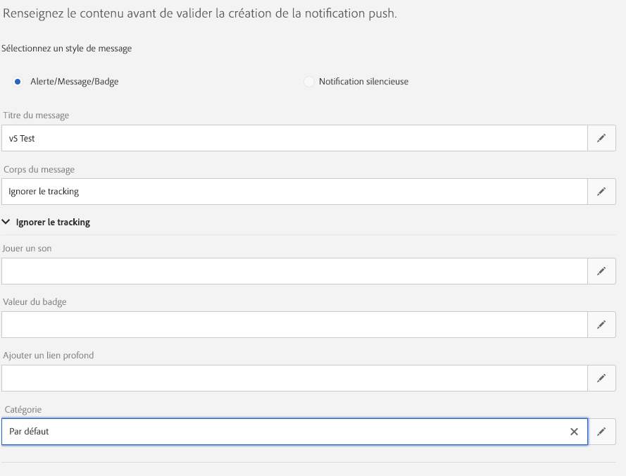

# Mise en oeuvre du suivi Push {#push-tracking}

## A propos du suivi Push {#about-push-tracking}

Pour vous assurer que la notification Push a été entièrement développée, vous devez vous assurer que la partie de suivi a été implémentée correctement.

Les étapes suivantes vous permettent de vous assurer que le suivi Push a été correctement implémenté. Cela suppose que vous avez déjà implémenté les premières parties de l’implémentation de la notification Push : Enregistrement de l’utilisateur de l’application et gestion d’un message de notification Push.

Le suivi Push est divisé en trois types :

* **Impressions** Push : lorsqu’une notification Push a été envoyée au périphérique et qu’elle se trouve sur le centre de notification, mais qu’elle n’a pas du tout été touchée.  C&#39;est considéré comme une impression.  Dans la plupart des cas, les nombres d’impressions doivent être similaires, voire identiques au nombre livré. Il s’assure que l’appareil a bien reçu le message et a transmis ces informations au serveur.

* **Clic** Push : lorsqu’une notification Push a été envoyée au périphérique et que l’utilisateur a cliqué sur ce dernier.  L’utilisateur voulait soit la notification (qui se déplacera ensuite vers le suivi Push Open), soit ignorer la notification.

* **Push Open** : lorsqu’une notification Push a été envoyée au périphérique et que l’utilisateur a cliqué sur la notification, l’application s’ouvre.  Cette mesure est similaire au Clic push, sauf qu&#39;une Ouverture push ne sera pas déclenchée si la notification a été ignorée.

Pour mettre en oeuvre le suivi pour Campaign Standard, l’application mobile doit inclure le SDK mobile. Ces kits SDK sont disponibles sur Adobe Mobile Services.

Pour envoyer des informations de suivi, trois variables doivent être envoyées. Deux font partie des données reçues de Campaign Standard et une variable d’action qui détermine s’il s’agit d’une **impression**, d’un **clic** ou d’une **ouverture**.

| Variable | Valeur |
|:-:|:-:|
| BroadlogId | _mId à partir des données |
| deliveryId | _dId à partir des données |
| action | 1 pour Open, 2 pour Click et 7 pour Impression |

## Mise en oeuvre pour Android {#implementation-android}

### Comment implémenter le suivi des impressions Push {#push-impression-tracking-android}

Pour le suivi des impressions, vous devez envoyer la valeur &quot;7&quot; pour l’action lors de l’appel de la fonction trackAction().

```
@Override
public void onMessageReceived(RemoteMessage remoteMessage) {
....{Handle push messages}....
  if (data.size() > 0) {
    String deliveryId = data.get("_dId");
    String messageId = data.get("_mId");
    HashMap<String, String> contextData = new HashMap<>();
    if (deliveryId != null && messageId != null) {
                contextData.put("deliveryId", deliveryId);
                contextData.put("broadlogId", messageId);
                contextData.put("action", "7");
                MobileCore.trackAction("tracking", contextData);
    }
  }
}
```

### Comment implémenter le suivi des clics {#push-click-tracking-android}

Pour le suivi des clics, vous devez envoyer la valeur &quot;2&quot; pour l’action lors de l’appel de la fonction trackAction().

Pour effectuer le suivi des clics, deux scénarios doivent être gérés :

* L’utilisateur voit la notification, mais l’efface.
* L’utilisateur voit la notification et clique dessus pour la transformer en un suivi ouvert.

Pour ce faire, vous devez utiliser deux modes : une pour cliquer sur la notification et une autre pour fermer la notification.

MyFirebaseMessagingService.java

```
private void sendNotification(Map<String, String> data) {
    Intent openIntent = new Intent(this, CollectPIIActivity.class);
    Intent dismissIntent = new Intent(this, NotificationDismissedReceiver.class);
    openIntent.addFlags(Intent.FLAG_ACTIVITY_CLEAR_TOP);
  
    //put the data map into the intent to track clickthroughs
    Bundle pushData = new Bundle();
    Set<String> keySet = data.keySet();
    for (String key : keySet) {
        pushData.putString(key, data.get(key));
    }
    openIntent.putExtras(pushData);
    dissmissIntent.putExtras(pushData);
  
  
    PendingIntent pendingIntent = PendingIntent.getActivity(this, 0, openIntent,
        PendingIntent.FLAG_UPDATE_CURRENT);
    PendingIntent onDismissPendingIntent = PendingIntent.getBroadcast(this.getApplicationContext(), 0, dismissIntent, 0);
  
    //<BUILD NOTIFICATION using notification builder>
    //Add both Intents to the notification
    notificationBuilder.setContentIntent(pendingIntent);
    notificationBuilder.setDeleteIntent(onDismissPendingIntent);
}
```

Pour que BroadcastReceiver fonctionne, vous devez l’enregistrer dans le fichier AndroidManifest.xml.

```
<manifest>
    <application>
        <receiver android:name=".NotificationDismissedReceiver">
        </receiver>
    </application>
</manifest>
```

NotificationDismessedReceiver.java

```
public class NotificationDismissedReceiver extends BroadcastReceiver {
    private static final String TAG = NotificationDismissedReceiver.class.getSimpleName();
    @Override
    public void onReceive(Context context, Intent intent) {
        Bundle data = intent.getExtras();
        String deliveryId = data.getString("_dId");
        String messageId = data.getString("_mId");
  
        HashMap<String, Object> contextData = new HashMap<>();
  
        //We only send the click tracking since the user dismissed the notification
        if (deliveryId != null && messageId != null) {
            contextData.put("deliveryId", deliveryId);
            contextData.put("broadlogId", messageId);
            contextData.put("action", "1");
            MobileCore.trackAction("tracking", contextData);
        }
    }
}
```

### Comment implémenter le suivi ouvert {#push-open-tracking-android}

Vous devez envoyer &quot;1&quot; et &quot;2&quot;, car l’utilisateur doit cliquer sur la notification pour ouvrir l’application. Si l’application n’est pas lancée/ouverte par le biais d’une notification Push, aucun de suivi ne se produit.

Pour effectuer le suivi de l’ouverture, vous devez créer l’intention. Les objets de mode permettent au système d’exploitation Android d’appeler votre méthode lorsque certaines actions sont effectuées. Dans ce cas, cliquez sur la notification pour ouvrir l’application.

Ce code est basé sur l’implémentation du suivi des impressions de clics. Lorsque l’option Mode est définie, vous devez maintenant renvoyer les informations de suivi à Campaign. Dans ce cas, si vous devez définir le mode d’ouverture pour qu’il s’ouvre sur un certain dans votre application, la méthode onResume sera appelée AVEC les données de notification dans l’objet Intent.

```
@Override
protected void onResume() {
    super.onResume();
    handleTracking();
}
  
  
private void handleTracking() {
    //Check to see if this view was opened based on a notification
    Intent intent = getIntent();
    Bundle data = intent.getExtras();
  
    if (data != null) {
        //Looks it was opened based on the notification, lets get the tracking we passed on.
        String deliveryId = data.getString("_dId");
        String messageId = data.getString("_mId");
  
        HashMap<String, Object> contextData = new HashMap<>();
  
        if (deliveryId != null && messageId != null) {
            contextData.put("deliveryId", deliveryId);
            contextData.put("broadlogId", messageId);
  
            //Send Click Tracking since the user did click on the notification
            contextData.put("action", "2");
            MobileCore.trackAction("tracking", contextData);
  
            //Send Open Tracking since the user opened the app
            contextData.put("action", "1");
            MobileCore.trackAction("tracking", contextData);
        }
    }
}
```

## Mise en oeuvre pour iOS {#implementation-iOS}

### Comment implémenter le suivi des impressions Push {#push-impression-tracking-iOS}

Pour le suivi des impressions, vous devez envoyer la valeur &quot;7&quot; pour l’action lors de l’appel de la fonction trackAction().

Pour comprendre le fonctionnement des notifications iOS, les trois états d’une application doivent être détaillés :

* **Premier plan**: lorsque l’application est actuellement active et se trouve actuellement à l’écran (en premier plan).
* **Contexte**: lorsque l’application n’est pas à l’écran mais que le processus n’est pas fermé. Lorsque vous -cliquez sur le bouton d’accueil, il présente généralement toutes les applications qui se trouvent en arrière-plan.
* **Désactivé/fermé**: une application dont le processus a été interrompu.

Si une application est fermée, Apple n’appellera pas l’application tant que celle-ci n’a pas été redémarrée. Cela signifie que vous ne pourrez pas savoir quand la notification a été reçue sur iOS.

Pour que le suivi des impressions fonctionne toujours lorsque l’application est en arrière-plan, nous devons envoyer **Content-Available** pour informer l’application qu’un suivi doit être effectué.

>[!CAUTION]
>
>Le suivi des impressions iOS n’est pas précis et ne doit pas être considéré comme fiable.

Le code suivant  l’application d’arrière-plan :

```
// In didReceiveRemoteNotification event handler in AppDelegate.m
  
//In order to handle push notification when only in background with content-available: 1
func application(_ application: UIApplication, didReceiveRemoteNotification userInfo: [AnyHashable : Any], fetchCompletionHandler completionHandler: @escaping (UIBackgroundFetchResult) -> Void) {
  
        //Check if the app is not in the foreground right now
        if(UIApplication.shared.applicationState != .active) {
            let deliveryId = userInfo["_dId"] as? String
            let broadlogId = userInfo["_mId"] as? String
            if (deliveryId != nil && broadlogId != nil) {
               ACPCore.trackAction("tracking", data: ["deliveryId": deliveryId!, "broadlogId": broadlogId!, "action":"7"])
            }
        }
        completionHandler(UIBackgroundFetchResult.noData)
    }
```

Le code suivant  l’application de premier plan :

```
// This will get called when the app is in the foreground
  
func userNotificationCenter(_ center: UNUserNotificationCenter, willPresent notification: UNNotification, withCompletionHandler completionHandler: @escaping (UNNotificationPresentationOptions) -> Void) {
  
  
        let userInfo = notification.request.content.userInfo
        let deliveryId = userInfo["_dId"] as? String
        let broadlogId = userInfo["_mId"] as? String
        if (deliveryId != nil && broadlogId != nil) {
             ACPCore.trackAction("tracking", data: ["deliveryId": deliveryId!, "broadlogId": broadlogId!, "action":"7"])
        }
        completionHandler([.alert,.sound])
    }
```

### Comment implémenter le suivi des clics {#push-click-tracking-iOS}

Pour le suivi des clics, vous devez envoyer la valeur &quot;2&quot; pour l’action lors de l’appel de la fonction trackAction().

```
// AppDelegate.swift
...
import os.log
import UserNotifications
...
  
func registerForPushNotifications() {
        let center = UNUserNotificationCenter.current()
        center.delegate = notificationDelegate
        //Here we are creating a new Category that allows us to handle Dismiss Actions
        let defaultCategory = UNNotificationCategory(identifier: "DEFAULT", actions: [], intentIdentifiers: [], options: .customDismissAction)
        //Add it to our array of Category, in this case we only have one
        center.setNotificationCategories([defaultCategory])
        center.requestAuthorization(options: [.alert, .sound, .badge]) {
            (granted, error) in
            os_log("Permission granted: %{public}@", type:. debug, granted.description)
            if error != nil {
                return
            }
            if granted {
                os_log("Notifications allowed", type: .debug)
            }
            else {
                os_log("Notifications denied", type: .debug)
            }
  
            // 2. Attempt registration for remote notifications on the main thread
            DispatchQueue.main.async {
                UIApplication.shared.registerForRemoteNotifications()
            }
        }
    }
```

Désormais, lorsque vous envoyez des notifications Push, vous devez ajouter un . Dans ce cas, nous l&#39;avons appelé &quot;DEFAULT&quot;.



Ensuite, pour gérer l’abandon et envoyer des informations de suivi, vous devez ajouter les éléments suivants :

```
func userNotificationCenter(_ center: UNUserNotificationCenter, didReceive response: UNNotificationResponse, withCompletionHandler completionHandler: @escaping () -> Void) {
        let userInfo = response.notification.request.content.userInfo
        switch response.actionIdentifier {
        case UNNotificationDismissActionIdentifier:
            print("Dismiss Action")
            let deliveryId = userInfo["_dId"] as? String
            let broadlogId = userInfo["_mId"] as? String
            if (deliveryId != nil && broadlogId != nil) {
                ADBMobile.trackAction("tracking", data: ["deliveryId": deliveryId!, "broadlogId": broadlogId!, "action":"2"])
            }
        default:
            ////MORE CODE
        }
        completionHandler()
    }
```

### Comment implémenter le suivi ouvert {#push-open-tracking-iOS}

Vous devez envoyer &quot;1&quot; et &quot;2&quot;, car l’utilisateur doit cliquer sur la notification pour ouvrir l’application. Si l’application n’est pas lancée/ouverte par le biais d’une notification Push, aucun de suivi ne se produit.

```
import Foundation
import UserNotifications
import UserNotificationsUI
  
class NotificationDelegate: NSObject, UNUserNotificationCenterDelegate {
  
    // Called when user clicks the push notification or also called from willPresent()
    func userNotificationCenter(_ center: UNUserNotificationCenter, didReceive response: UNNotificationResponse, withCompletionHandler completionHandler: @escaping () -> Void) {
  
        let userInfo = response.notification.request.content.userInfo
        os_log("App push data %{public}@, in userNotificationCenter:didReceive()", type: .debug, userInfo)
        switch response.actionIdentifier {
        case UNNotificationDismissActionIdentifier:
            //This is to handle the Dismiss Action
            let deliveryId = userInfo["_dId"] as? String
            let broadlogId = userInfo["_mId"] as? String
            if (deliveryId != nil && broadlogId != nil) {
                ACPCore.trackAction("tracking", data: ["deliveryId": deliveryId!, "broadlogId": broadlogId!, "action":"2"])
            }
        default:
            //This is to handle the tracking when the app opens
            let deliveryId = userInfo["_dId"] as? String
            let broadlogId = userInfo["_mId"] as? String
            if (deliveryId != nil && broadlogId != nil) {
                ACPCore.trackAction("tracking", data: ["deliveryId": deliveryId!, "broadlogId": broadlogId!, "action":"2"])
                ACPCore.trackAction("tracking", data: ["deliveryId": deliveryId!, "broadlogId": broadlogId!, "action":"1"])
            }
        }
        completionHandler()
    }
}
```
