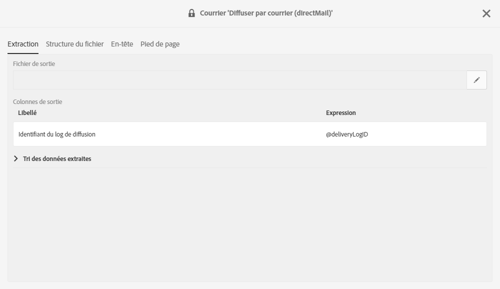
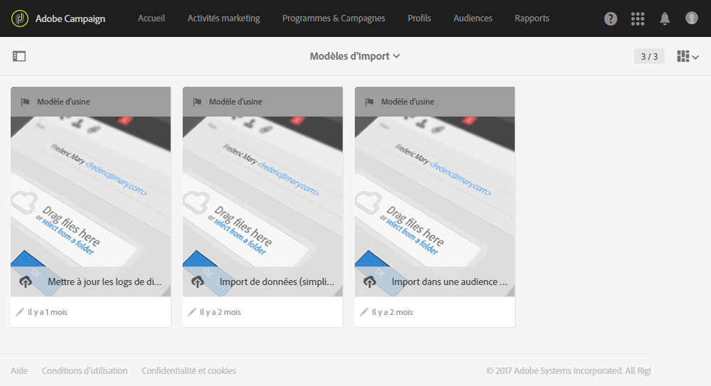

# Retour à l&#39;expéditeur{#return-to-sender}

Les échanges de fichiers plats avec les opérateurs de services postaux intégrant les informations de retour à l&#39;expéditeur sont pris en charge. Les adresses postales correspondantes peuvent être ainsi exclues des communications futures. Cela vous permet également d’être averti d’une adresse incorrecte et d’interagir avec le client via d’autres canaux ou de l’encourager à mettre à jour son adresse postale.

Par exemple, un contact a déménagé sans vous indiquer sa nouvelle adresse postale. L’opérateur récupère la liste des adresses erronées et l’envoie à Adobe Campaign qui place automatiquement ces adresses dans la liste bloquée.

Pour permettre cette fonctionnalité, le modèle de diffusion courrier par défaut inclut l&#39;identifiant du log de diffusion au sein du contenu. Adobe Campaign peut ainsi synchroniser le profil et les données de diffusion avec les informations renvoyées par l&#39;opérateur.

Un modèle d&#39;import est disponible sous **[!UICONTROL Adobe Campaign > Ressources > Modèles > Modèles d&#39;import > Mettre à jour les logs de diffusion et les mises en quarantaine Courrier]**. Dupliquez ce modèle de manière à créer le vôtre. Pour plus d&#39;informations sur l&#39;utilisation des modèles d&#39;import, voir [Utilisation des modèles d&#39;import](../../automating/using/importing-data-with-import-templates.md#setting-up-import-templates).

Une fois l&#39;import effectué, Adobe Campaign réalise automatiquement les actions suivantes :

* Les adresses incorrectes sont ajoutées à la liste bloquée au niveau du profil.
* Les principaux indicateurs de diffusion (KPI) sont mis à jour.
* Les logs de diffusion sont mis à jour.
