# Configuration d'un processus de double opt-in{#setting-up-a-double-opt-in-process}

## A propos du double opt-in {#about-double-opt-in}

Le mécanisme de double opt-in constitue une bonne pratique lors de l'envoi d'emails. Il protège la plate-forme des adresses email erronées ou non valides ainsi que des spammeurs, et empêche les éventuelles plaintes pour spam.

Le principe consiste à envoyer un email pour confirmer l'accord du visiteur avant de le stocker en tant que profil dans votre base de données Adobe Campaign : le visiteur remplit une landing page en ligne, il reçoit ensuite un email et doit cliquer sur le lien de confirmation afin de finaliser son abonnement.

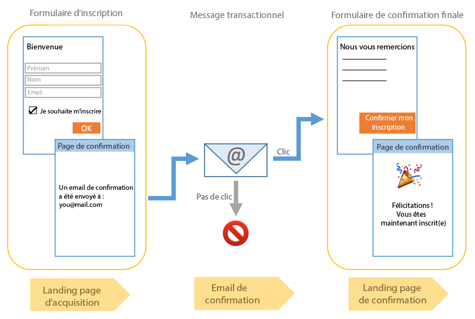

Pour mettre cela en place, vous devez :

1. Créer et publier une landing page qui permettra aux visiteurs de s'inscrire et de s'abonner. Cette landing page sera disponible à partir du site web. Les visiteurs qui remplissent cette landing page et la valident seront stockés dans la base de données, mais blacklistés, de façon à ce qu'ils ne reçoivent aucune communication avant validation finale (voir [Gestion du blacklistage dans Campaign](../../audiences/using/about-opt-in-and-opt-out-in-campaign.md)).
1. Créer et envoyer automatiquement l'email d'opt-in avec un lien de confirmation. Cet email ciblera la population qui a validé la landing page. Il sera basé sur un modèle d'email qui permet de cibler les profils Opt-out.
1. Rediriger les visiteurs vers une landing page de confirmation. Cette dernière landing page comprendra un bouton de confirmation sur lequel les visiteurs devront cliquer. Vous pouvez concevoir un email de bienvenue à envoyer au moment de la confirmation et ajouter, par exemple, une offre spéciale destinée aux nouveaux abonnés.

Ces étapes doivent être réalisées dans Adobe Campaign selon un ordre spécifique afin que tous les paramètres soient correctement activés.

## Etape 1 : création de la landing page de confirmation   {#step-1--create-the-confirmation-landing-page}

Le processus de configuration du mécanisme de double opt-in commence par la création de la landing page de confirmation. Cette page s'affichera lorsque les visiteurs cliqueront sur l'email de confirmation afin de s'inscrire.

Pour créer et configurer cette landing page, vous devez :

1. Concevoir une [landing page](../../channels/using/about-landing-pages.md) basée sur le modèle **[!UICONTROL Acquisition de profils (acquisition)]**. Saisir le libellé **CONFIRMATION**.

   Si vous devez faire appel à des [services](../../audiences/using/about-subscriptions.md), vous pouvez également utiliser le modèle **[!UICONTROL Abonnement (abo)]**.

1. Editez les propriétés de la landing page et sous la section **[!UICONTROL Accès &amp; chargement]**, désélectionnez l'option **[!UICONTROL Autoriser les visiteurs non identifiés]** et sélectionnez **[!UICONTROL Précharger les données des visiteurs]** (la sélection de cette option n'est toutefois pas obligatoire).

   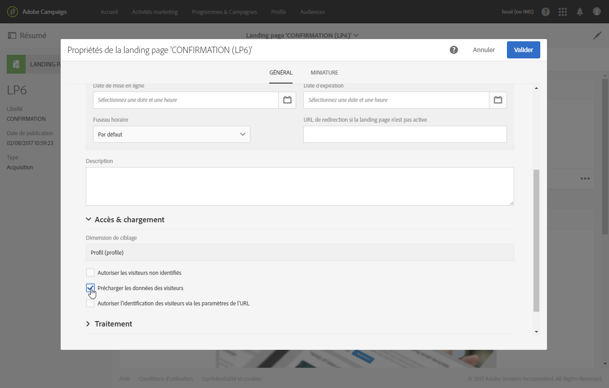

1. Dans la section **[!UICONTROL Traitement]** &gt; **[!UICONTROL Données additionnelles]**, cliquez sur **[!UICONTROL Ajouter un élément]** et saisissez le chemin du contexte suivant :

   /context/profile/blackList

   Définissez la valeur sur **faux** et cliquez sur **[!UICONTROL Ajouter]**.

   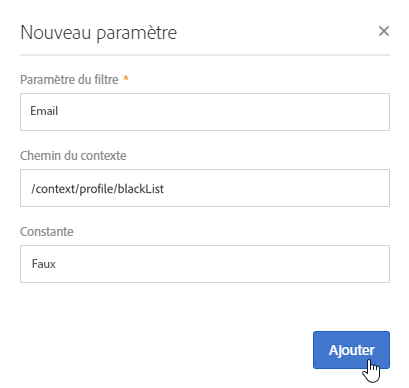

   Ce contexte retire le champ de blackliste pour permettre l'envoi d'emails. Nous verrons ultérieurement que la première landing page définissait ce champ sur **vrai** avant confirmation, en vue d'empêcher l'envoi d'emails aux profils non confirmés. Voir à ce propos [Etape 3 : créer la landing page d'acquisition](../../channels/using/setting-up-a-double-opt-in-process.md#step-3--create-the-acquisition-landing-page).

1. Personnalisez le contenu de la landing page : vous pouvez afficher les données personnalisées et modifier le libellé du bouton de confirmation, par exemple en « Cliquer ici pour confirmer mon inscription ».

   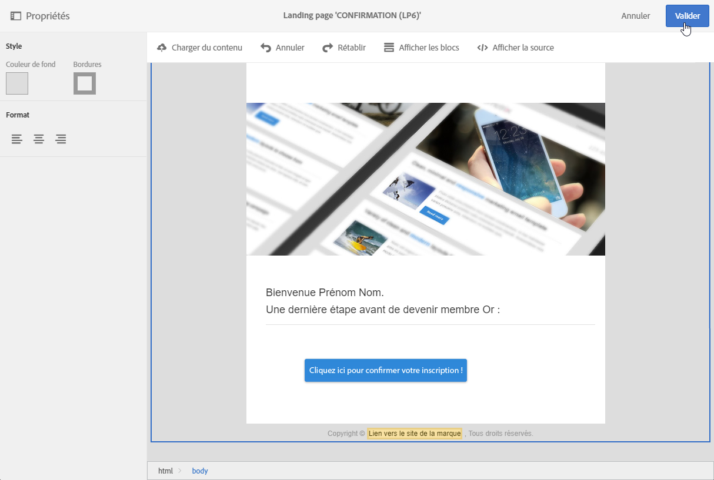

1. Adaptez le contenu de la page de confirmation pour informer vos abonnés qu'ils sont maintenant inscrits.

   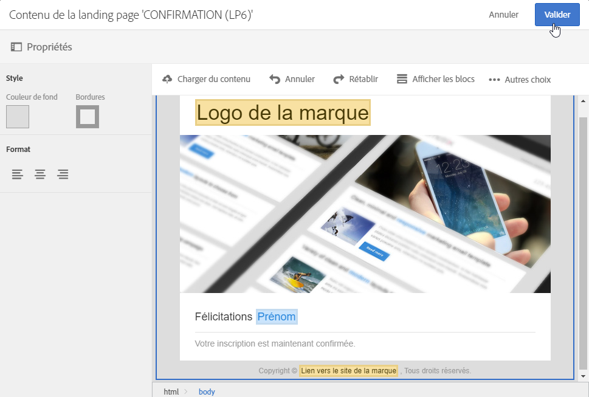

1. [Testez et publiez](../../channels/using/sharing-a-landing-page.md) la landing page.

## Etape 2 : création de l'email de confirmation   {#step-2--create-the-confirmation-email}

Une fois la landing page de confirmation créée, vous pouvez concevoir l'email de confirmation qui sera envoyé automatiquement à chaque visiteur qui valide la landing page d'acquisition. Cette validation est considérée comme un événement, et l'email est un message transactionnel, lié à une règle de typologie spécifique qui permet le ciblage des populations Opt-out.

Les étapes de création de ces éléments sont décrites ci-dessous. Vous devez les suivre avant de créer la landing page d'acquisition car celle-ci fera référence au modèle d'email.

### Création de l'événement   {#create-the-event}

L'email de confirmation est un [message transactionnel](../../channels/using/about-transactional-messaging.md) car il réagit à un événement : la validation du formulaire. Vous devez commencer par créer l'événement et ensuite le modèle du message transactionnel.

1. Créez un événement, à partir du menu **[!UICONTROL Plans marketing]** &gt; **[!UICONTROL Messages transactionnels]** &gt; **[!UICONTROL Configuration des événements]**, accessible par le biais du logo Adobe Campaign, et saisissez le libellé '**CONFIRMER**'.
1. Sélectionnez la dimension de ciblage **[!UICONTROL Profil]** et cliquez sur **[!UICONTROL Créer]**.

   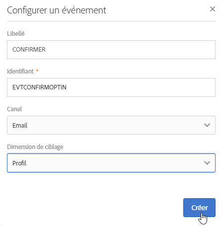

1. Dans la section **[!UICONTROL Champs]**, cliquez sur **[!UICONTROL Créer un élément]** et ajoutez l'**[!UICONTROL email]** dans la structure de données de façon à permettre la réconciliation.
1. Dans la section **[!UICONTROL Enrichissement]**, cliquez sur **[!UICONTROL Créer un élément]** et sélectionnez le **[!UICONTROL Profil]** de la ressource cible. Vous pouvez ensuite mapper l'**[!UICONTROL email]** dans la section **[!UICONTROL Définition de la jointure]**, ou toute autre clé de réconciliation, en fonction de vos besoins.

   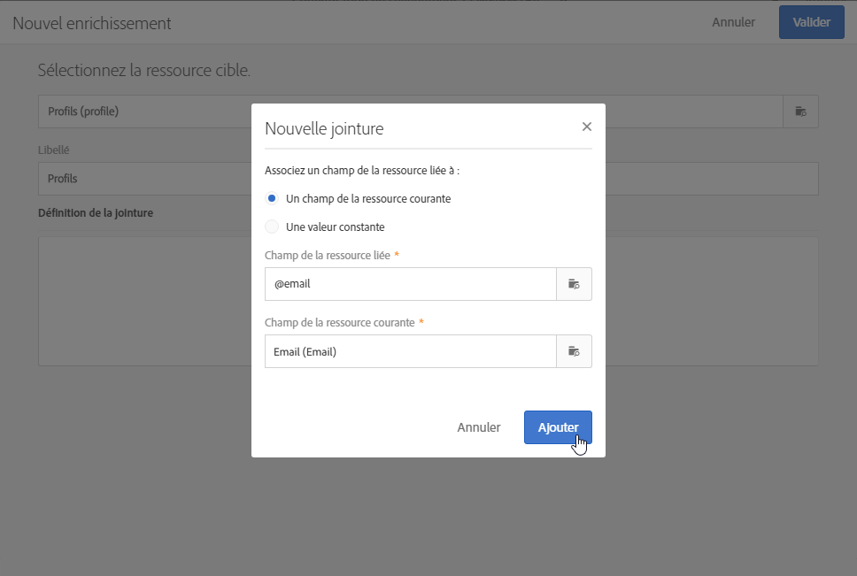

   Si vous devez utiliser des services, vous pouvez également ajouter le nom du service **[!UICONTROL serviceName]**.

1. Sélectionnez **[!UICONTROL Profil]** comme **[!UICONTROL Enrichissement du ciblage]** dans la liste déroulante.
1. Cliquez sur **[!UICONTROL Publier]** pour publier l'événement.

L'événement est prêt. Vous pouvez maintenant concevoir le modèle d'email. Ce modèle doit inclure un lien vers la landing page **CONFIRMATION** créée préalablement. Voir à ce propos [Concevoir le message de confirmation](../../channels/using/setting-up-a-double-opt-in-process.md#design-the-confirmation-message).

### Création de la règle de typologie {#create-the-typology-rule}

Vous devez créer une [règle de typologie](../../administration/using/about-typology-rules.md) spécifique, en dupliquant une règle d'usine. Cette règle permettra d'envoyer des messages aux profils qui n'ont pas encore confirmé leur accord et sont encore blacklistés. Par défaut, les règles de typologie excluent les profiles Opt-out (c'est-à-dire blacklistés). Pour créer cette règle de typologie, procédez comme suit :

1. Depuis le logo Adobe Campaign, sélectionnez **[!UICONTROL Administration]** &gt; **[!UICONTROL Canaux]** &gt; **[!UICONTROL Typologies]** et cliquez sur **[!UICONTROL Typologies]**.
1. Dupliquez la typologie d'usine **[!UICONTROL Message transactionnel sur le profil (mcTypologyProfile)]**.
1. Après confirmation de la duplication, éditez la nouvelle typologie et saisissez le libellé **TYPOLOGIE_PROFIL**.
1. Supprimez la règle des **adresses blacklistées**.
1. Cliquez sur **[!UICONTROL Enregistrer]**.

Cette typologie peut maintenant être associée à l'email de confirmation.

### Conception du message de confirmation   {#design-the-confirmation-message}

L'email de confirmation est un message transactionnel basé sur l'événement créé préalablement. Suivez les étapes ci-dessous pour créer ce message :

1. Depuis le logo Adobe Campaign, sélectionnez **[!UICONTROL Plans marketing]** &gt; **[!UICONTROL Messages transactionnels]** et cliquez sur **[!UICONTROL Messages transactionnels]**.
1. Personnalisez le modèle d'email **CONFIRMER**. Vous pouvez charger du contenu existant ou utiliser un modèle d'usine.
1. Ajoutez un lien vers la landing page **CONFIRMATION** et cliquez sur **[!UICONTROL Valider]** pour enregistrer les modifications.

   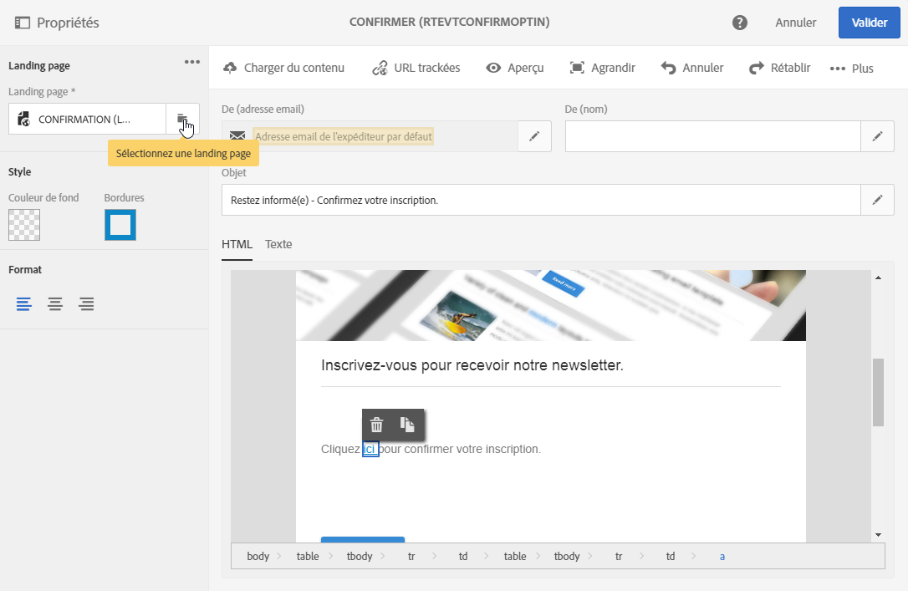

1. Editez les propriétés du modèle d'email. Dans la section **[!UICONTROL Paramètres avancés]** &gt; **[!UICONTROL Préparation]**, sélectionnez la typologie **TYPOLOGIE_PROFIL** créée préalablement.
1. Enregistrez le message transactionnel et publiez-le.

## Etape 3 : création de la landing page d'acquisition   {#step-3--create-the-acquisition-landing-page}

Vous devez créer la landing page d'acquisition initiale. Ce formulaire d'opt-in sera publié sur votre site web.

Pour créer et configurer cette landing page, vous devez :

1. Concevoir une [landing page](../../channels/using/about-landing-pages.md) basée sur le modèle **[!UICONTROL Acquisition de profils (acquisition)]**. Saisir le libellé **ACQUISITION**.
1. Editez les propriétés de la landing page : dans la section **[!UICONTROL Traitement]** &gt; **[!UICONTROL Données additionnelles]**, cliquez sur **[!UICONTROL Ajouter un élément]** et saisissez le chemin du contexte suivant :

   /context/profile/blackList

   puis définissez la valeur sur **vrai**.

   Cela est obligatoire pour forcer le blacklistage et éviter d'envoyer des messages aux visiteurs qui n'ont pas confirmé qu'ils donnaient leur accord. La validation de la landing page CONFIRMATION définira ce champ sur **faux** après confirmation. Voir à ce propos [Etape 1 : créer la landing page de confirmation](../../channels/using/setting-up-a-double-opt-in-process.md#step-1--create-the-confirmation-landing-page).

1. Dans la section **[!UICONTROL Traitement]** &gt; **[!UICONTROL Actions spécifiques]**, sélectionnez l'option **[!UICONTROL Déclencher l'envoi d'un message]**.
1. Dans la liste déroulante associée, sélectionnez le modèle de message transactionnel **CONFIRMER** que vous avez créé.

   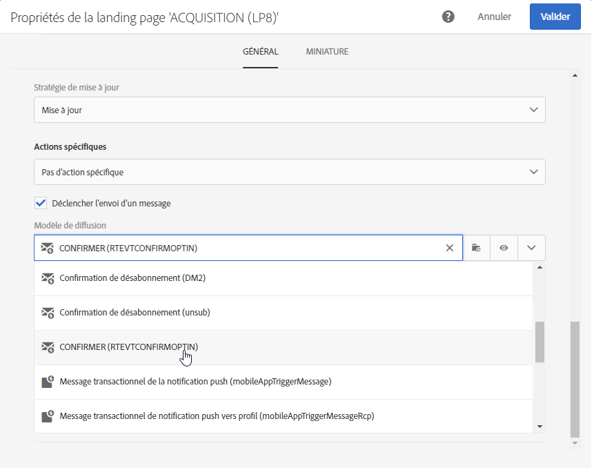

1. Personnalisez le contenu de la landing page, selon votre marque et les données qu'il vous faut acquérir. Vous pouvez afficher les données personnalisées et modifier le libellé du bouton de confirmation, par exemple en **Cliquez ici pour confirmer votre inscription !**.

   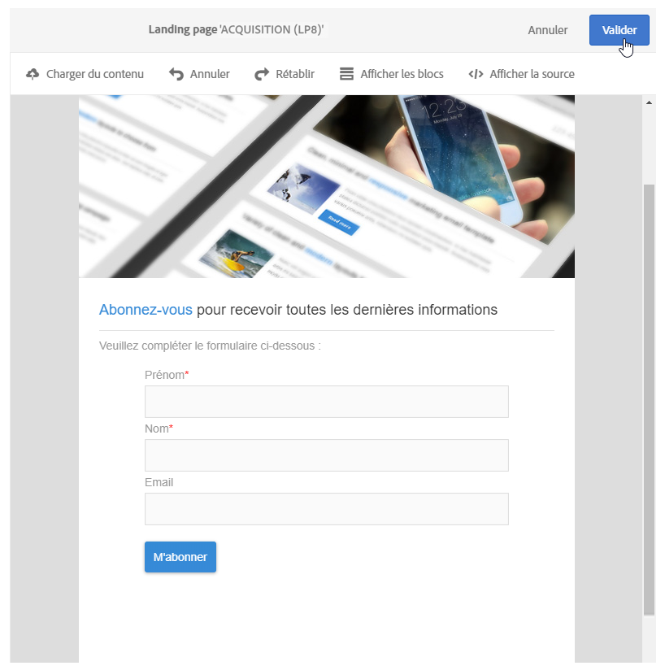

1. Personnalisez la page de confirmation afin d'informer le nouvel abonné qu'il doit valider son inscription.

   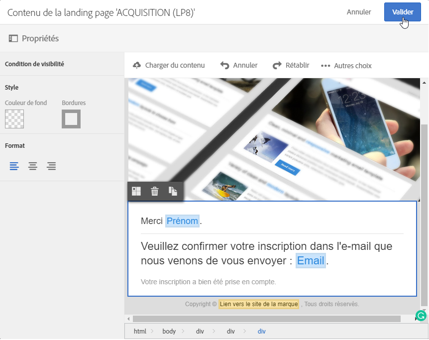

1. [Testez et publiez](../../channels/using/sharing-a-landing-page.md) la landing page.

Le mécanisme de double opt-in est maintenant configuré. Vous pouvez exécuter et tester la procédure de bout en bout, en commençant par l'URL publique de cette landing page **[!UICONTROL ACQUISITION]**. Cette URL est affichée dans le tableau de bord de la landing page.
