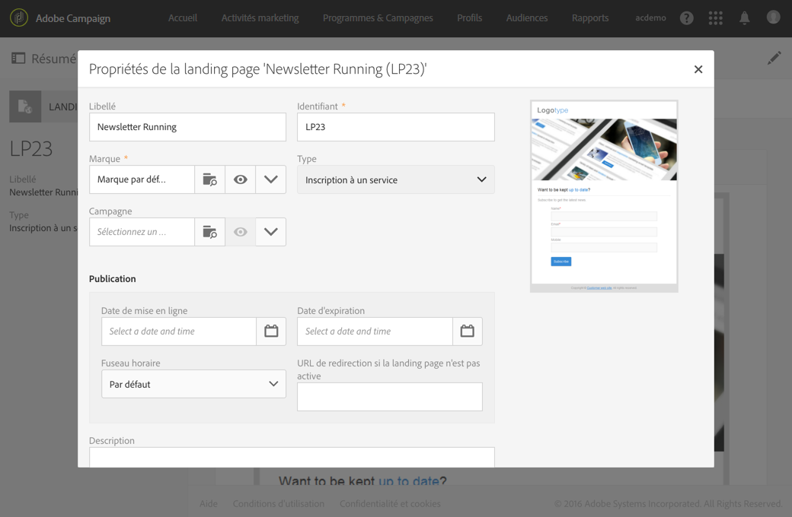

# Test et publication d&#39;une landing page{#testing-publishing--landing-page}

## A propos de la publication d&#39;une landing page {#about-landing-page-publication}

Avant de publier une landing page, vous devez effectuer des tests : valider l&#39;exécution, configurer l&#39;accès et définir la fin de vie de la landing page. Ces étapes sont des pré-requis et doivent être exécutées avec précaution.

## Tester la landing page       {#testing-the-landing-page-}

Comme la landing page aura un impact sur votre plateforme et les données, vous devez tester soigneusement son exécution. Pour cela :

1. Cliquez sur le bouton **[!UICONTROL Tester]** présent dans la barre d&#39;actions de la landing page.
1. Dans l&#39;écran de test, sélectionnez un profil de test et un service de test si la landing page a pour but de gérer les inscriptions.

   

1. Renseignez les champs et sélectionnez des options.
1. Validez la landing page et vérifiez les mises à jour dans la base de données.

   >[!IMPORTANT]
   >
   >Lorsque le formulaire est validé, le service et le profil utilisés sont mis à jour.

1. Répétez cette opération avec des profils et des données différents.

Vous pouvez également générer la miniature de la landing page depuis cet écran.

>[!NOTE]
>
>Pour afficher l’aperçu de la landing page dans l’interface utilisateur de Campaign, l’URL du serveur applicatif doit être sécurisée. Dans ce cas, utilisez https:// plutôt que http:// pour configurer cette URL lors de la [configuration de votre marque](../../administration/using/branding.md#configuring-and-using-brands).

## Configurer les paramètres de validité       {#setting-up-validity-parameters}

Avant de procéder à la publication, il est vivement recommandé, pour des raisons de sécurité et de performances de la plateforme, de définir une date d&#39;expiration dans les propriétés de la landing page. A la date choisie, la landing page est automatiquement dépubliée. Pour cela :

1. Modifiez les propriétés de la landing page accessibles via le bouton  dans le tableau de bord de la landing page.

   

1. Configurez la date et l&#39;heure d&#39;expiration dans la section **[!UICONTROL Publication]** : la landing page est automatiquement dépubliée à la date spécifiée et n&#39;est donc plus disponible.

   Vous pouvez sélectionner le fuseau horaire à prendre en compte pour cette date et cette heure.

1. Définissez une URL de redirection pour rediriger les visiteurs lorsqu&#39;ils tentent d&#39;accéder à une landing page inactive.

   

>[!IMPORTANT]
>
>Vous pouvez également définir une date et une heure de déploiement : la landing page sera alors automatiquement publiée à la date spécifiée.

## Publier une landing page       {#publishing-a-landing-page}

Lorsque vous publiez une landing page, elle est mise en ligne et devient accessible aux visiteurs.

Vous pouvez à tout moment dépublier ou mettre à jour et republier votre landing page via le bouton **[!UICONTROL Publier]**. Cependant, si la republication échoue et que vous n&#39;avez pas dépublié votre landing page auparavant, la première version reste en ligne.
