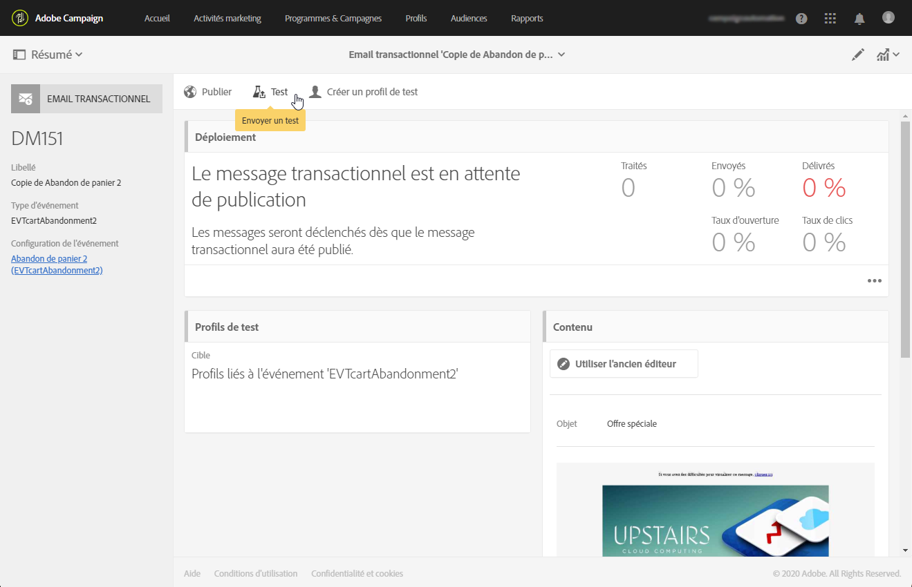

# Tester un message transactionnel {#testing-a-transactional-message}

Avant de publier votre message transactionnel, vous pouvez créer un profil de test spécifique qui vous permettra de vérifier correctement le message.

## Définition d’un profil de test spécifique {#defining-specific-test-profile}

Définissez un profil de test qui sera lié à votre événement, ce qui vous permettra de prévisualiser votre message et d’envoyer un BAT approprié.

1. Dans le [tableau de bord de message transactionnel](../../channels/using/editing-transactional-message.md#accessing-transactional-messages), cliquez sur le bouton **[!UICONTROL Créer un profil de test]**.

   

1. Indiquez les informations à transmettre au format JSON dans la section **[!UICONTROL Données de l’événement utilisées pour la personnalisation]**. C’est le contenu qui sera utilisé lors de la prévisualisation du message et que recevra le profil de test à l’envoi du BAT.

   

   >[!NOTE]
   >
   >Si vous avez enrichi votre message, vous pouvez également saisir des informations relatives à un autre tableau, tel que **[!UICONTROL Profil]**. Voir [Enrichissement du événement](../../channels/using/configuring-transactional-event.md#enriching-the-transactional-message-content) et [Personnalisation d’un message transactionnel](../../channels/using/editing-transactional-message.md#personalizing-a-transactional-message).

1. Une fois créé, le profil de test est pré-renseigné dans le message transactionnel. Cliquez sur le bloc **[!UICONTROL Profils de test]** du message pour vérifier la cible de votre BAT.

   

Vous pouvez également créer un profil de test ou en utiliser un existant depuis le menu **[!UICONTROL Profils de test.]** Pour cela :

1. Cliquez sur le logo **[!UICONTROL Adobe Campaign]**, en haut à gauche, puis sélectionnez **[!UICONTROL Profils &amp; audiences]** > **[!UICONTROL Profils de test]**.
1. Dans la section **[!UICONTROL Événement]**, sélectionnez l’événement que vous venez de créer. Dans cet exemple, choisissez &quot;Abandon de panier (EVTcartAbandonment)&quot;.
1. Indiquez les informations à transmettre au format JSON dans la zone de texte **[!UICONTROL Données de l’événement]**.

   

1. Enregistrez vos modifications.
1. [Accédez au message que vous avez créé et sélectionner le profil de test mis à jour.](../../channels/using/editing-transactional-message.md#accessing-transactional-messages)

**Rubriques connexes :**

* [Gestion des profils de test](../../audiences/using/managing-test-profiles.md)
* [Création d’une audience](../../audiences/using/creating-audiences.md)

## Envoyer le BAT {#sending-proof}

Une fois que vous avez créé un ou plusieurs profils de test spécifiques et enregistré votre message transactionnel, vous pouvez envoyer un BAT pour le tester.

Les étapes d&#39;envoi d&#39;un BAT sont détaillées dans la section [Envoi de BAT](../../sending/using/sending-proofs.md).
