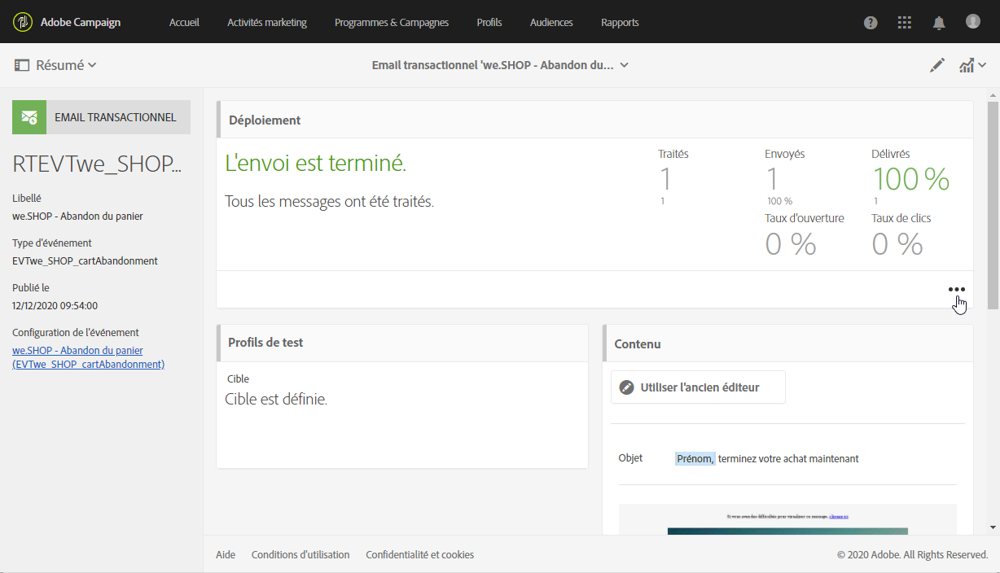
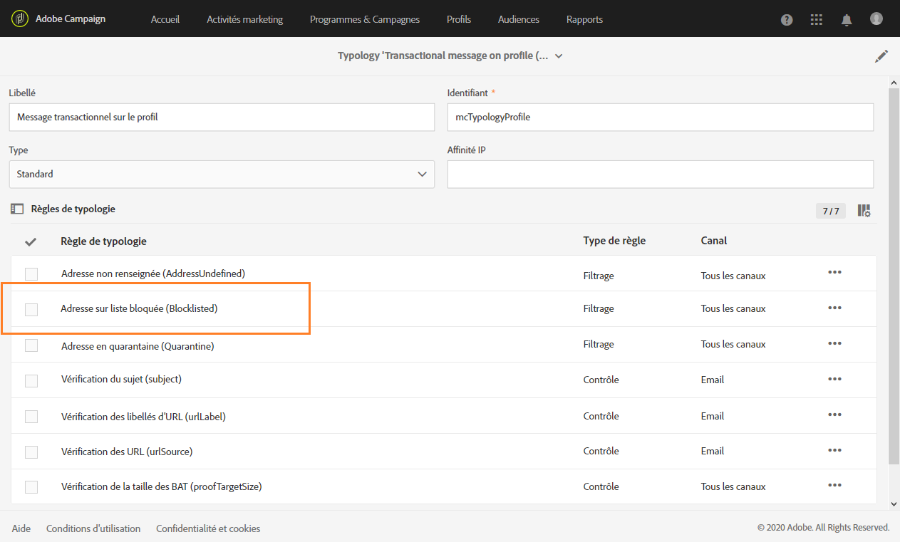

# Exécution et surveillance des messages transactionnels {#transactional-messaging-execution}

## Diffusion d’exécution du message transactionnel {#transactional-message-execution-delivery}

Une fois le message publié et l’intégration de votre site effectuée, lorsqu’un événement est déclenché, il est affecté à une diffusion d’exécution.

Une **diffusion d&#39;exécution** est un message technique non exploitable et non fonctionnel créé une fois par mois pour chaque message transactionnel, et chaque fois qu’un message transactionnel est modifié et publié de nouveau.

**Rubriques connexes** :
* [Publication d&#39;un message transactionnel](../../channels/using/publishing-transactional-message.md#publishing-a-transactional-message)
* [Intégrer le déclenchement de l&#39;événement](../../channels/using/getting-started-with-transactional-msg.md#integrate-event-trigger)

## Processus de reprise de la messagerie transactionnelle {#transactional-message-retry-process}

Un message transactionnel temporairement non diffusé fait l’objet de reprises automatiques jusqu’à l’expiration de la diffusion. Pour plus d’informations sur la durée de diffusion, voir [Paramètres de période de validité](../../administration/using/configuring-email-channel.md#validity-period-parameters).

En cas d’échec de l’envoi d’un message transactionnel, il existe deux systèmes de reprise :

* Au niveau des messages transactionnels, un message transactionnel peut échouer avant que l’événement ne soit assigné à une diffusion d’exécution, c’est-à-dire entre la réception de l’événement et la préparation de la diffusion. Voir [Processus de reprise du traitement d’un événement](#event-processing-retry-process).
* Au niveau du processus d’envoi, une fois l’événement assigné à une diffusion d’exécution, le message transactionnel peut échouer en raison d’une erreur temporaire. Voir [Processus de reprise de l’envoi d’un message](#message-sending-retry-process).

### Processus de reprise du traitement d’un événement           {#event-processing-retry-process}

Lorsqu’un événement est déclenché, il est affecté à une diffusion d’exécution. Si l’événement ne peut pas être assigné à une diffusion d’exécution, son traitement est reporté. Des reprises sont ensuite effectuées jusqu’à ce qu’il soit assigné à une nouvelle diffusion d’exécution.

>[!NOTE]
>
>Un événement reporté n’apparaît pas dans les logs d’envoi de messages transactionnels, car il n’est pas encore assigné à une diffusion d’exécution.

Par exemple, l’événement ne pourrait pas être assigné à une diffusion d’exécution, en raison d’un contenu incorrect, d’un problème de droits d’accès ou de branding, d’une erreur détectée lors de l’application des règles de typologie, etc. Dans ce cas, vous pouvez mettre le message en pause, l’éditer pour résoudre le problème et le publier à nouveau. Le système de reprise l’assignera ensuite à une nouvelle diffusion d’exécution.

### Processus de reprise de l’envoi d’un message            {#message-sending-retry-process}

Une fois que l’événement a été assigné à une diffusion d’exécution, le message transactionnel peut échouer en raison d’une erreur temporaire, par exemple si la boîte du destinataire est pleine. Voir à ce propos [Reprises après un échec temporaire de diffusion](../../sending/using/understanding-delivery-failures.md#retries-after-a-delivery-temporary-failure).

>[!NOTE]
>
>Lorsqu’un événement est assigné à une diffusion d’exécution, il apparaît dans les logs d’envoi de cette diffusion d’exécution, et uniquement à ce moment. Les diffusions en échec sont affichées dans l’onglet **[!UICONTROL Liste des exécutions]** des logs d’envoi des messages transactionnels.

### Limitations du processus de reprise {#limitations}

**Mise à jour des logs d’envoi**

Dans le processus de reprise, les logs d’envoi de la nouvelle diffusion d’exécution ne sont pas immédiatement mis à jour (la mise à jour est réalisée via un workflow planifié). Cela signifie que le message peut être à l’état **[!UICONTROL En attente]**, même si l’événement transactionnel a été traité par la nouvelle diffusion d’exécution.

**Diffusion d’exécution en échec**

Vous ne pouvez pas arrêter une diffusion d’exécution. Cependant, si la diffusion d’exécution actuelle échoue, une nouvelle est créée dès qu’un nouvel événement est reçu, et tous les nouveaux événements sont traités par cette nouvelle diffusion d’exécution. Aucun nouvel événement n’est traité par la diffusion d’exécution en échec.

Si certains événements déjà assignés à une diffusion d’exécution ont été reportés et si cette diffusion d’exécution échoue, le système de reprise n’assigne pas les événements reportés à la nouvelle diffusion d’exécution, ce qui signifie que ces événements sont perdus. Consultez les [logs de diffusion](#monitoring-transactional-message-delivery) pour voir les destinataires qui ont pu être touchés.

## Surveillance des messages transactionnels {#monitoring-transactional-message-delivery}

Pour surveiller un message transactionnel, vous devez accéder aux [diffusions d&#39;exécution ](#transactional-message-execution-delivery) correspondantes.

1. Pour visualiser le log de diffusion du message, cliquez sur l’icône située en bas à droite du bloc **[!UICONTROL Déploiement]**.

   

1. Cliquez sur l’onglet **[!UICONTROL Liste d&#39;exécution]**.

   

1. Sélectionnez la diffusion d’exécution de votre choix.

   

1. Cliquez de nouveau sur l’icône située en bas à droite du bloc **[!UICONTROL Déploiement]**.

   

   Pour chaque diffusion d’exécution, vous pouvez consulter les logs de diffusion comme vous le feriez pour une diffusion standard. Pour plus d’informations sur l’accès et l’utilisation des logs, voir [Surveillance d&#39;une diffusion](../../sending/using/monitoring-a-delivery.md).

### Caractéristiques des messages transactionnels basés sur un profil {#profile-transactional-message-monitoring}

Pour les messages transactionnels basés sur un profil, vous pouvez surveiller les informations de profil ci-après.

Sélectionnez l&#39;onglet **[!UICONTROL Envois]**. Dans la colonne **[!UICONTROL Statut]**, la mention **[!UICONTROL Envoyé]** indique qu&#39;un profil s&#39;est inscrit.

Sélectionnez l’onglet **[!UICONTROL Logs d’exclusion]** pour visualiser les destinataires qui ont été exclus de la cible du message, par exemple les adresses mises en liste bloquée.

Pour un profil qui s’est désinscrit, la règle de typologie **[!UICONTROL Adresse sur liste bloquée]** a exclu le destinataire correspondant.

Cette règle fait partie d&#39;une typologie spécifique qui s&#39;applique à tous les messages transactionnels qui reposent sur la table **[!UICONTROL Profile]**.

**Rubriques connexes** :

* [À propos des typologies et des règles de typologie](../../sending/using/about-typology-rules.md)
* [Contrôler une diffusion](../../sending/using/monitoring-a-delivery.md)
