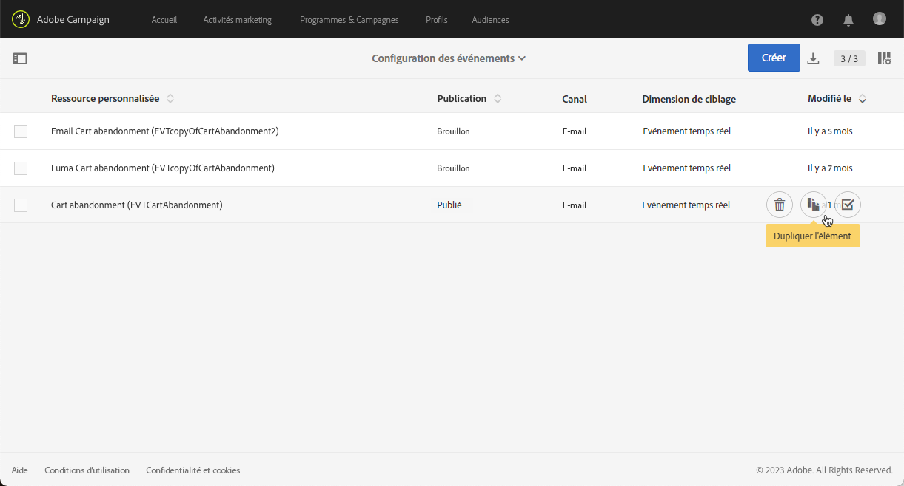

# Améliorations des événements transactionnels {#transactional-event-improvements}

>[!AVAILABILITY]
>
>Ces fonctionnalités ne sont actuellement disponibles que pour un ensemble d’organisations (disponibilité limitée). Pour plus d’informations, contactez votre représentant Adobe.

Actuellement, dans Adobe Campaign Standard, les utilisateurs et les utilisatrices non membres du groupe de sécurité d’administration ne peuvent pas accéder aux événements transactionnels, en créer ou en publier. Cela entraîne des problèmes pour les utilisateurs et utilisatrices professionnels qui doivent configurer et publier des événements, mais ne disposent pas des droits d’administration. En outre, il n’est pas possible de dupliquer des événements transactionnels.

Nous avons apporté les améliorations suivantes au contrôle d’accès des messages transactionnels :

* Ajout d’un nouveau **[!UICONTROL rôle]**, appelé **Utilisateur ou utilisatrice MC** afin de permettre aux personnes qui ne disposent pas du rôle d’administration de gérer les configurations de l’événement transactionnel. Le rôle **Utilisateur ou utilisatrice MC** permet aux utilisateurs et utilisatrices d’accéder aux événements et messages transactionnels, de les créer, de les publier et de les dépublier.

* Les diffusions d’exécution (c’est-à-dire les messages techniques créés chaque fois qu’un message transactionnel est modifié et publié de nouveau, ou une fois par mois par défaut) sont désormais définies sur l’**[!UICONTROL entité organisationnelle]** du groupe de sécurité auquel appartient l’utilisateur ou l’utilisatrice qui crée l’événement, au lieu de se limiter à l’**[!UICONTROL entité organisationnelle]** du groupe de sécurité **Agent Message Center (mcExec)**.

* Les **administrateurs et administratrices** peuvent désormais dupliquer les événements transactionnels publiés, ainsi que les utilisateurs et utilisatrices affectés au rôle **Utilisateur ou utilisatrice MC**, pourvu qu’ils soient dans la même hiérarchie d’**entité organisationnelle** que l’utilisateur ou l’utilisatrice qui a créé l’événement.

## Attribuer le rôle Utilisateur ou utilisatrice MC {#assign-role}

Pour attribuer le rôle **Utilisateur ou utilisatrice MC** à votre groupe de sécurité :

1. Créez un **[!UICONTROL Groupe de sécurité]** ou modifiez un groupe existant. [En savoir plus](../../administration/using/managing-groups-and-users.md).

1. Cliquez sur **[!UICONTROL Créer un élément]** pour affecter des rôles à votre groupe de sécurité.

   

1. Sélectionner le **[!UICONTROL Rôle]** Utilisateur/utilisatrice MC et cliquez sur **[!UICONTROL Confirmer]**.

   >[!IMPORTANT]
   >
   > Procédez avec précaution lorsque vous attribuez le rôle Utilisateur/utilisatrice MC aux opérateurs, car cela leur permet de dépublier des événements.

   

1. Une fois la configuration effectuée, cliquez sur **[!UICONTROL Enregistrer]**.

Les personnes appartenant à ce **[!UICONTROL groupe de sécurité]** peuvent désormais accéder aux événements et messages transactionnels, en créer et en publier.

## Attribuer un groupe de sécurité à l’utilisateur ou à l’utilisatrice MC {#assign-group}

1. Dans l’Admin Console, sélectionnez l’onglet **Produits**.

1. Sélectionnez **Adobe Campaign Standard** puis choisissez votre instance.

1. Dans la liste **Profils de produit**, sélectionnez le groupe **Utilisateur ou utilisatrice MC**.

1. Cliquez sur **Ajouter un utilisateur ou une utilisatrice** et saisissez le nom, le groupe d’utilisateurs et d’utilisatrices ou l’adresse e-mail du profil que vous souhaitez ajouter à ce profil de produit.

1. Une fois l’ajout effectué, cliquez sur **Enregistrer**.

Les personnes appartenant à ce **[!UICONTROL groupe de sécurité]** peuvent alors accéder aux événements et messages transactionnels, en créer et en publier.

## Dupliquer des événements transactionnels {#duplicate-transactional-events}

Un utilisateur ou une utilisatrice avec le **groupe de sécurité** d’Administration<!--([Functional administrators](../../administration/using/users-management.md#functional-administrators)?)--> peut désormais dupliquer une configuration d’événement si l’événement a été **publié**.

En outre, les utilisateurs et utilisatrices qui ne sont pas administrateurs ou administratrices et qui ont été affectés au rôle **Utilisateur ou utilisatrice MC** peuvent désormais accéder aux configurations d’événement, mais leur autorisation de duplication est déterminée par l’**entité organisationnelle** à laquelle ils appartiennent. Si la personne actuelle et celle qui a créé l’événement appartiennent à la même hiérarchie d’entité organisationnelle, la duplication est autorisée.

Par exemple, si un utilisateur ou une utilisatrice appartenant à l’entité organisationnelle « Ventes de France » crée une configuration d’événement :

* Un autre utilisateur ou une autre utilisatrice appartenant à l’entité organisationnelle « Ventes de Paris » peut dupliquer cet événement, car « Ventes de Paris » fait partie de l’entité organisationnelle « Ventes de France ».

* En revanche, un utilisateur ou une utilisatrice dont l’entité organisationnelle s’intitule « Ventes de San Francisco » ne pourra pas le faire, car « Ventes de San Francisco » fait partie de l’entité organisationnelle« Ventes des États-Unis », qui est indépendante de l’entité organisationnelle « Ventes de France ».

Pour dupliquer une configuration d’événement, procédez comme suit :

1. Cliquez sur le logo **Adobe**, en haut à gauche, puis sélectionnez **[!UICONTROL Plans marketing]** > **[!UICONTROL Messages transactionnels]** > **[!UICONTROL Configuration d’événements]**.

1. Passez la souris sur la configuration de l’événement de votre choix et sélectionnez le bouton **[!UICONTROL Dupliquer l’élément]**.

   

   >[!CAUTION]
   >
   >Vous ne pouvez pas dupliquer une configuration d’événement qui n’est pas publiée. [En savoir plus](publishing-transactional-event.md)

1. L’événement dupliqué s’affiche automatiquement. Il contient la même configuration que celle que vous avez définie pour l’événement d’origine, mais il présente le statut **[!UICONTROL Brouillon]**.

   

1. Le message transactionnel correspondant est automatiquement créé. Pour y accéder, accédez à **[!UICONTROL Messages transactionnels]** > **[!UICONTROL Messages transactionnels]**.

   

1. Ouvrez le message nouvellement dupliqué. Il contient la même conception que celle que vous avez définie pour le message d’origine, mais il comporte le statut **[!UICONTROL Brouillon]**, même si le message transactionnel d’origine a été publié.

   

1. Vous pouvez maintenant modifier et personnaliser ce message. Voir [Modifier des messages transactionnels](../../channels/using/editing-transactional-message.md).

## Impacts {#impacts}

Le tableau ci-dessous décrit l’impact de ces améliorations :

| Objets | Avant cette modification | Après cette modification |
|:-: | :--: | :-:|
| Événements transactionnels | Seules les personnes membres du groupe de sécurité **Administrateur** peuvent créer et publier des événements. | Le rôle **Utilisateur/utilisatrice MC** permet de créer et de publier des événements. |
| Messages transactionnels | Les message transactionnels sont définis sur l’**entité organisationnelle** du groupe de sécurité **Agent Message Center (mcExec)**. | Les messages transactionnels sont définis sur l’**entité organisationnelle** du groupe de sécurité auquel appartient l’utilisateur ou l’utilisatrice qui crée l’événement ou le message transactionnel. |
| Diffusions d’exécution | Les diffusions d’exécution sont définies sur l’**entité organisationnelle** du groupe de sécurité **Agent Message Center (mcExec)**. | Les diffusions d’exécution sont définies sur l’**entité organisationnelle** du groupe de sécurité auquel appartient l’utilisateur ou l’utilisatrice qui crée le message ou l’événement transactionnel. |
| Événements transactionnels publiés | La duplication est impossible. | <ul><li>Les utilisateurs et utilisatrices membres du groupe de sécurité d’**administration** peuvent dupliquer les événements publiés.</li> <li>Les utilisateurs et utilisatrices affectés au rôle **Utilisateur ou utilisatrice MC** peuvent dupliquer des événements publiés, pourvus qu’ils fassent partie de la même hiérarchie d’**entité organisationnelle** que l’utilisateur ou l’utilisatrice qui a créé l’événement.</li></ul> |

<!--Transactional Message Templates| Transactional Message templates are set to the Organizational unit **All**. | Transaction Message Template will be set to the **Organizational unit** of the security group to which the user creating the message template belongs.-->