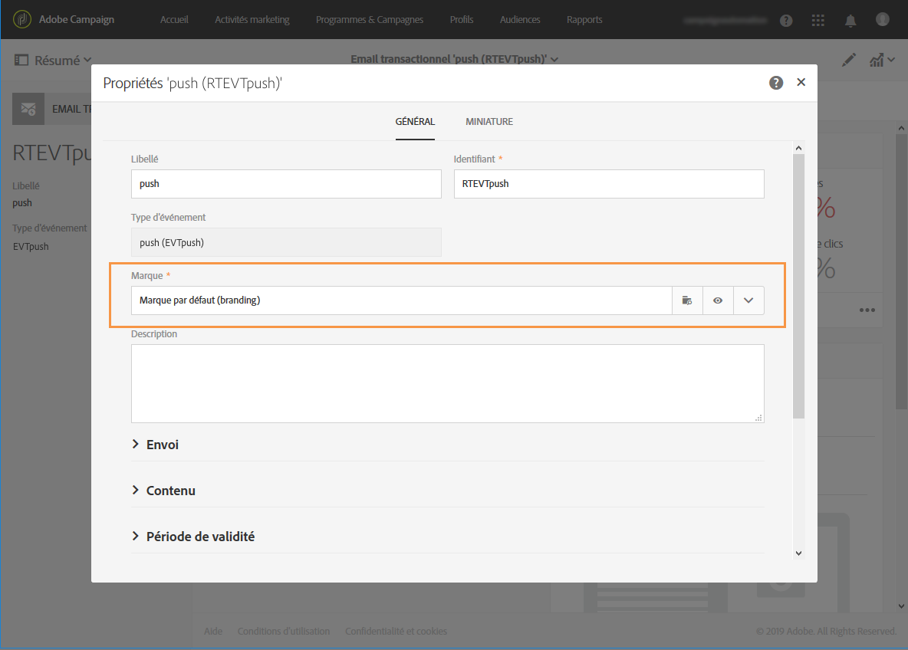

# Meilleures pratiques et limites de la messagerie transactionnelle {#transactional-messaging-limitations}

La section ci-dessous liste les meilleures pratiques et les limites que vous devez connaître avant de commencer à créer des messages transactionnels.

<!--For more on transactional messages, including on how to configure and create them, see [Getting started with transactional messaging](../../channels/using/getting-started-with-transactional-msg.md).-->

## Autorisations {#permissions}

Seuls les utilisateurs dotés du rôle [Administration](../../administration/using/users-management.md#functional-administrators) peuvent configurer des événements transactionnels et des messages transactionnels d’accès.

## Configuration et publication du événement {#design-and-publication}

Lorsque vous configurez et publiez des événements transactionnels, certaines des étapes que vous devez effectuer ne peuvent pas être annulées. Vous devez connaître les limites suivantes :

* Les canaux disponibles pour la messagerie transactionnelle sont les suivants : **[!UICONTROL Courriel]**, **[!UICONTROL Mobile (SMS)]** et **[!UICONTROL Notification Push]**.
* Un seul canal peut être utilisé pour chaque configuration d’événement. Voir la section [Créer un événement](../../channels/using/configuring-transactional-event.md#creating-an-event).
* Une fois l’événement créé, vous ne pouvez plus modifier le canal. Par conséquent, si un message n&#39;est pas envoyé avec succès, vous devez concevoir le mécanisme permettant de l&#39;envoyer depuis un autre canal à l&#39;aide d&#39;un workflow. Voir la section [Données de workflow et processus](../../automating/using/get-started-workflows.md).
* Une fois l&#39;événement créé, vous ne pouvez pas modifier la dimension de ciblage (**[!UICONTROL Evénement temps réel]** ou **[!UICONTROL Profil]**). Voir la section [Créer un événement](../../channels/using/configuring-transactional-event.md#creating-an-event).
* Il n&#39;est pas possible de restaurer une publication, mais vous pouvez dépublier un événement : cette opération rend l&#39;événement et le message transactionnel associé inaccessibles. Voir la section [Dépublier un événement](../../channels/using/publishing-transactional-event.md#unpublishing-an-event).
* Le seul message transactionnel pouvant être associé à un événement est le message créé automatiquement lors de la publication de cet événement. Voir la section [Prévisualiser et publier l&#39;événement](../../channels/using/publishing-transactional-event.md#previewing-and-publishing-the-event).

## Personnalisation        {#personalization}

La manière dont vous pouvez personnaliser le contenu d&#39;un message dépend du type du message transactionnel. Les spécificités sont répertoriées ci-dessous.

### Messages transactionnels basés sur un événement.

* les informations de personnalisation proviennent des données contenues dans l&#39;événement. Voir [Configuration des messages transactionnels basée sur le Événement](../../channels/using/configuring-transactional-event.md#event-based-transactional-messages).
* Vous ne **pouvez pas** utiliser les blocs de contenu **[!UICONTROL Lien de désabonnement]** dans un message transactionnel basé sur un événement.
* Les messages transactionnels basés sur un événement sont censés utiliser uniquement les données figurant dans l’événement envoyé pour définir le destinataire et la personnalisation du contenu du message. Il est toutefois possible d’enrichir le contenu de votre message transactionnel en utilisant des informations de la base de données Adobe Campaign. Voir [Enrichissement d’un événement](../../channels/using/configuring-transactional-event.md#enriching-the-transactional-message-content) et [Personnalisation d’un message transactionnel](../../channels/using/editing-transactional-message.md#personalizing-a-transactional-message).
* Comme les messages transactionnels basés sur un événement ne contiennent pas d&#39;informations sur les profils, ils ne sont pas compatibles avec les règles de fatigue, même dans le cas d&#39;un enrichissement avec des profils.

### Messages transactionnels basés sur un profil  

* les informations de personnalisation peuvent provenir des données contenues dans l&#39;événement ou de l&#39;enregistrement de profil réconcilié. Voir [Configuration des messages transactionnels basée sur le Profil](../../channels/using/configuring-transactional-event.md#profile-based-transactional-messages) et [Spécifications des messages transactionnels basées sur le Profil](../../channels/using/editing-transactional-message.md#profile-transactional-message-specificities).
* Vous **pouvez** utiliser les blocs de contenu **[!UICONTROL Lien de désabonnement]** dans un message transactionnel basé sur un profil. Voir [Ajouter un bloc de contenu](../../designing/using/personalization.md#adding-a-content-block).
* Les règles de fatigue sont compatibles avec les messages transactionnels basés sur un profil. Voir [Règles de fatigue](../../sending/using/fatigue-rules.md).

### Listes de produits

Notez que les listes de produits sont disponibles uniquement dans les messages électroniques **transactionnels**. Voir [Utiliser des listes de produits dans un message transactionnel](../../channels/using/editing-transactional-message.md#using-product-listings-in-a-transactional-message).

## Marques {#permissions-and-branding}

En matière de gestion des [marques](../../administration/using/branding.md), les messages transactionnels offrent moins de souplesse que les messages standard. Adobe recommande de lier toutes les marques utilisées dans les messages transactionnels à l&#39;entité organisationnelle **** Tous. Pour plus d&#39;informations, lisez l&#39;explication détaillée ci-après.

Lorsque vous éditez un message transactionnel, vous pouvez le lier à une marque pour appliquer automatiquement certains paramètres tels que le nom ou le logo de la marque. La **[!UICONTROL Marque par défaut]** est sélectionnée par défaut dans les propriétés des messages transactionnels.

Tous les objets (notamment les marques) utilisés dans un message transactionnel doivent être visibles à partir de l&#39;entité organisationnelle **[!UICONTROL Message Center]**, ce qui signifie qu&#39;ils doivent figurer dans les entités organisationnelles **[!UICONTROL Message Center]** ou **[!UICONTROL Tous]**.

Si la marque sélectionnée dans les propriétés du message est liée à une entité organisationnelle autre que **[!UICONTROL Message Center]** ou **[!UICONTROL Tous]**, une erreur sera générée et vous ne pourrez pas envoyer le message transactionnel.

Par conséquent, si vous souhaitez utiliser le multi-branding dans le contexte des messages transactionnels, vous devez lier toutes les marques aux entités organisationnelles **[!UICONTROL Message Center]** ou **[!UICONTROL Tous]**.

## Exporter et importer des messages transactionnels {#exporting-and-importing-transactional-messages}

* Pour exporter un message transactionnel, vous devez inclure la configuration de l&#39;événement correspondante lors de la [création de l&#39;export de package](../../automating/using/managing-packages.md#creating-a-package).
* Une fois le message transactionnel [importé via un package](../../automating/using/managing-packages.md#importing-a-package); il n&#39;apparaît pas dans la liste de messages transactionnels. Il vous faut [publier](../../channels/using/publishing-transactional-event.md) la configuration de l&#39;événement afin de rendre le message transactionnel associé disponible.
