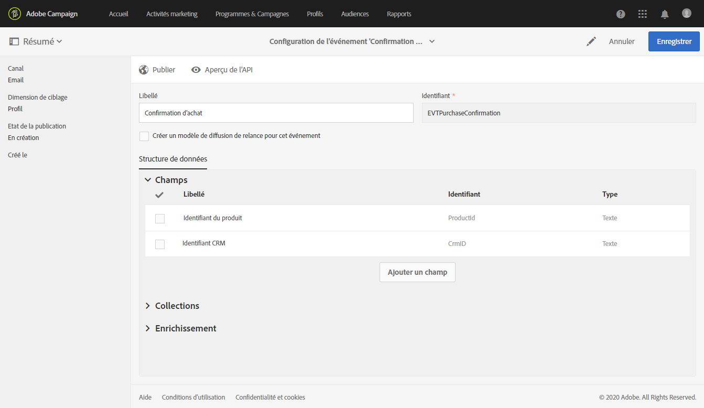
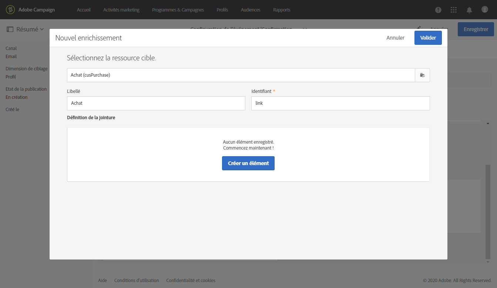
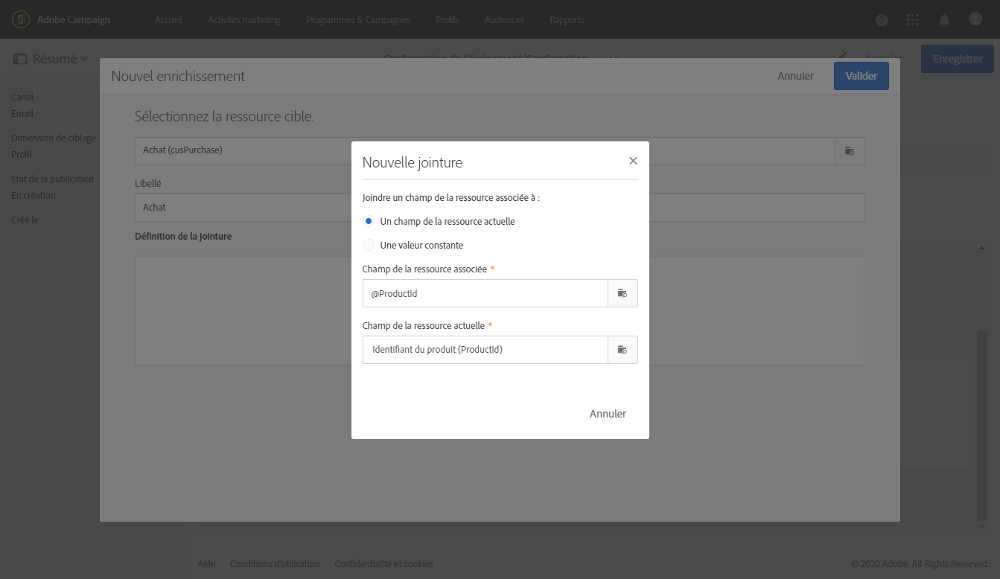
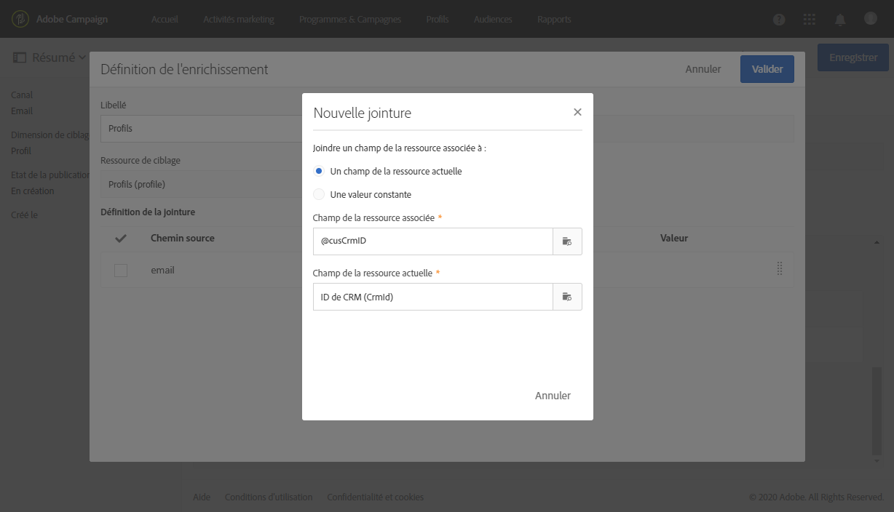
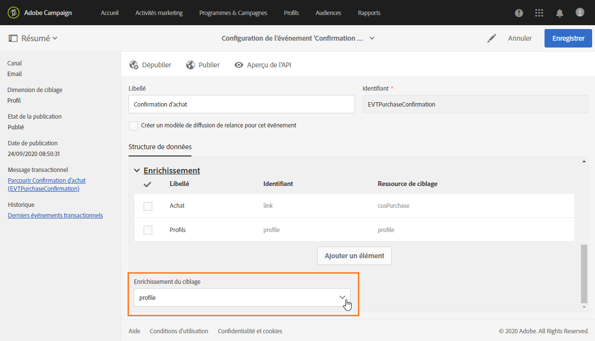
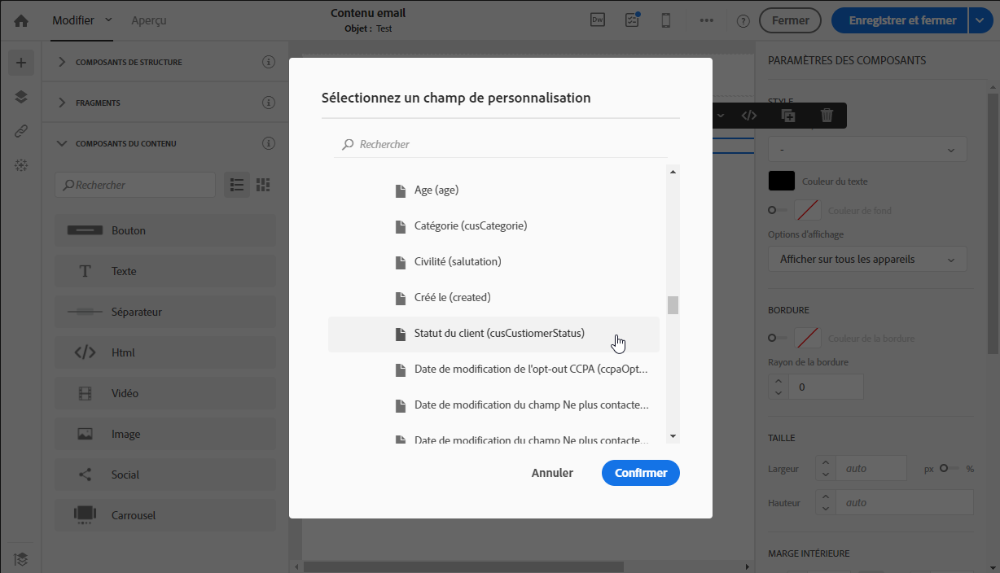
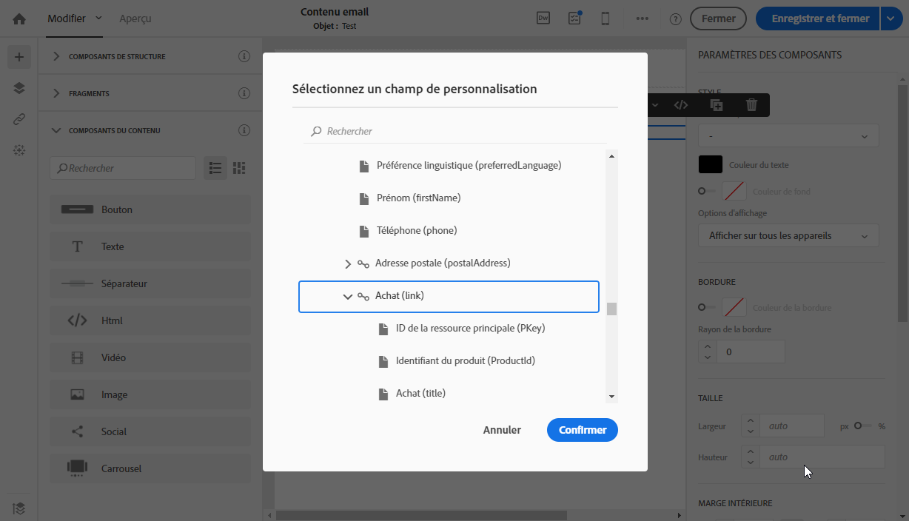

# Cas d’utilisation des messages transactionnels {#transactional-messaging-use-case}

Dans cet exemple, vous souhaitez utiliser la fonctionnalité de messagerie transactionnelle Adobe Campaign pour envoyer un courriel de confirmation après chaque achat sur votre site Web, identifiant vos clients par le biais de leur identifiant de gestion de la relation client.

Les conditions préalables sont les suivantes :

* Assurez-vous que la ressource **[!UICONTROL Profil]** a été étendue avec un nouveau champ correspondant à l’identifiant de gestion de la relation client.

* Créez et publiez une ressource personnalisée correspondant aux achats et liez-la à la ressource **[!UICONTROL Profil]**. De cette façon, vous pourrez récupérer les informations de cette ressource pour enrichir le contenu du message.

Pour plus d&#39;informations sur l&#39;extension, la création et la publication de ressources, voir [cette section](../../developing/using/key-steps-to-add-a-resource.md).

Les principales étapes de mise en oeuvre de ce cas d&#39;utilisation sont présentées ci-dessous.

>[!NOTE]
>
>Pour une représentation graphique du processus général de la messagerie transactionnelle, voir [ce schéma](../../channels/using/getting-started-with-transactional-msg.md#key-steps).

## Étape 1 - Créer et publier la configuration de l’événement {#create-event-configuration}

1. Créez un événement à l’aide du canal **[!UICONTROL Courriel]**. Voir [Création d&#39;un événement](../../channels/using/configuring-transactional-event.md#creating-an-event).

1. Sélectionnez la dimension de ciblage **[!UICONTROL Profil]** pour créer un message transactionnel [profil](../../channels/using/configuring-transactional-event.md#profile-based-transactional-messages).

1. Définissez les attributs qui seront disponibles pour personnaliser le message transactionnel. Dans cet exemple, ajoutez les champs &quot;CRM ID&quot; et &quot;Product identifier&quot;. Voir [Définition des attributs de événement](../../channels/using/configuring-transactional-event.md#defining-the-event-attributes).

   

1. Pour enrichir le contenu du message avec des informations sur les achats du client, créez un enrichissement ciblant la ressource **[!UICONTROL Achat]**. Voir [Enrichissement du événement](../../channels/using/configuring-transactional-event.md#enriching-the-transactional-message-content).

   

1. Créez une condition de jointure entre le champ &quot;Identifiant du produit&quot; précédemment ajouté au événement et le champ correspondant de la ressource **[!UICONTROL Achat]**.

   

1. Comme il est obligatoire pour les événements basés sur un profil, vous devez également créer un enrichissement ciblant la ressource **[!UICONTROL Profil]**.

1. Créez une condition de jointure entre le champ &quot;ID CRM&quot; précédemment ajouté au message et le champ correspondant de la ressource **[!UICONTROL Profil]** que vous avez étendue. <!--What's the purpose to have created a CRM ID for this event and to have the CRM ID as a join condition? could it be any other field provided you created it in the event?-->

   

1. Dans la section **[!UICONTROL enrichissement de ciblage]**, sélectionnez l&#39;enrichissement sur la ressource **[!UICONTROL Profil]**, qui sera utilisée comme cible de message lors de l&#39;exécution de la diffusion.

   

1. Prévisualisation et publication du événement. Voir [Prévisualisation et publication du événement](../../channels/using/publishing-transactional-event.md#previewing-and-publishing-the-event).

## Étape 2 - Modifier et publier le message transactionnel {#create-transactional-message}

1. Accédez au message transactionnel automatiquement créé lors de la publication du événement. Voir [Accès aux messages transactionnels](../../channels/using/editing-transactional-message.md#accessing-transactional-messages).

1. Modifiez et personnalisez le message. Voir [Modification d’un message transactionnel de profil](../../channels/using/editing-transactional-message.md#editing-profile-transactional-message).

1. Grâce au rapprochement avec le champ &quot;ID CRM&quot; que vous avez ajouté à la ressource **[!UICONTROL Profil]**, vous avez un accès direct à toutes les informations du profil pour [personnaliser](../../designing/using/personalization.md#inserting-a-personalization-field) votre message.

   

1. Grâce à la conciliation avec le champ &quot;Identifiant du produit&quot;, vous pouvez enrichir le contenu du message avec des informations sur les achats du client en ajoutant n&#39;importe quel champ de la ressource **[!UICONTROL Achat]**.

   

   Pour ce faire, sélectionnez **[!UICONTROL Insérer un champ de personnalisation]** dans la barre d’outils contextuelle. Dans le **[!UICONTROL Contexte]** > **[!UICONTROL événement transactionnel]** > **[!UICONTROL contexte de Événement]**, ouvrez le noeud correspondant à la ressource personnalisée **[!UICONTROL Achat]** et sélectionnez un champ.

1. Vous pouvez tester votre message à l’aide d’un profil de test spécifique. Voir [Test d&#39;un message transactionnel](../../channels/using/testing-transactional-message.md#testing-a-transactional-message).

1. Une fois votre contenu prêt, enregistrez vos modifications et publiez le message. Voir [Publier un message transactionnel](../../channels/using/publishing-transactional-message.md#publishing-a-transactional-message).

## Étape 3 - Intégrer le déclenchement de l’événement {#integrate-event-trigger}

Intégrez le événement à votre site Web. Voir [Intégrer le déclenchement du événement](../../channels/using/getting-started-with-transactional-msg.md#integrate-event-trigger).

## Étape 4 - Diffuser le message {#message-delivery}

Une fois toutes ces étapes effectuées, dès qu’un client achète des produits sur votre site Web, il reçoit un courriel de confirmation personnalisé contenant des informations sur son achat.