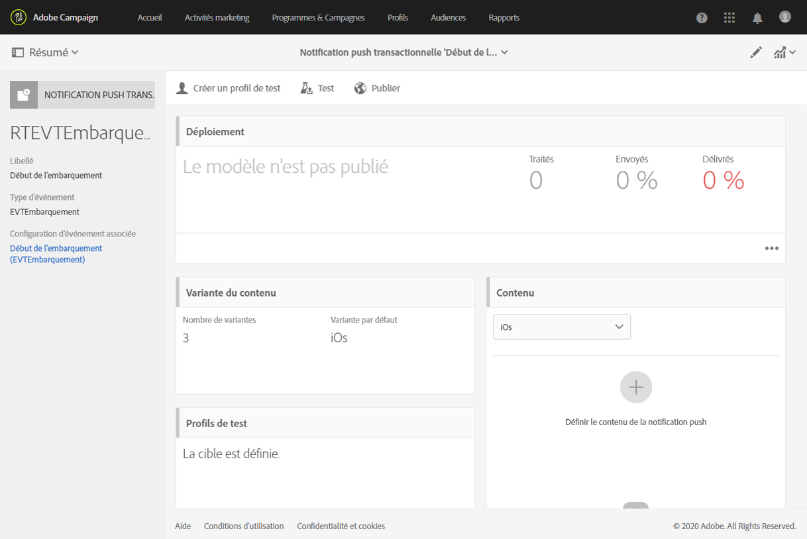
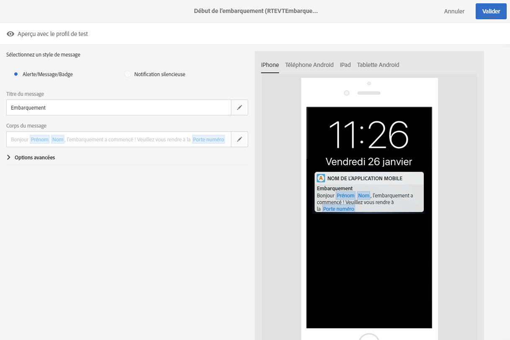
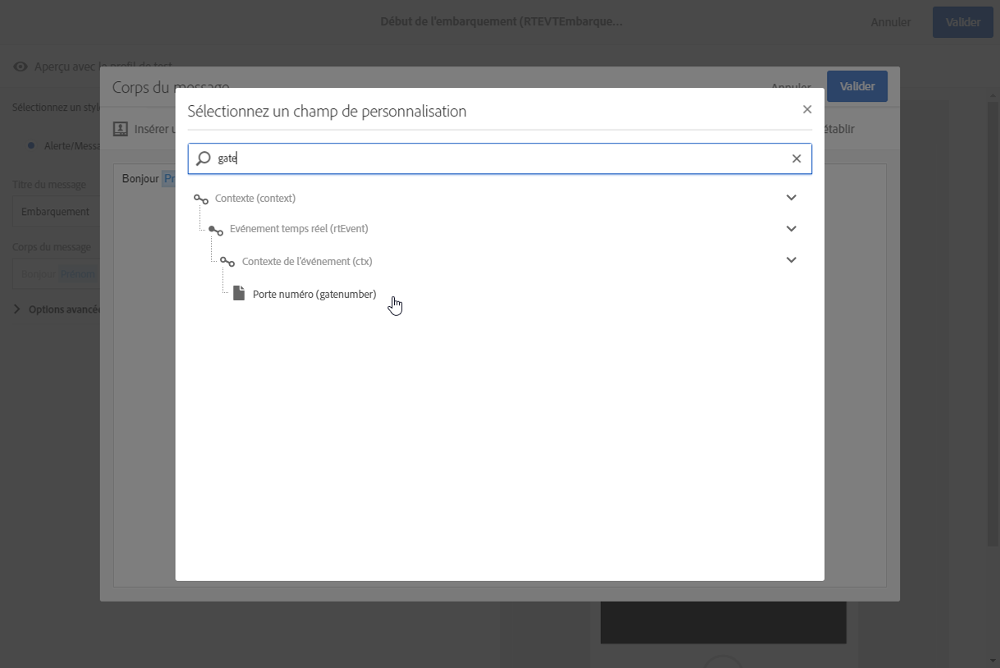
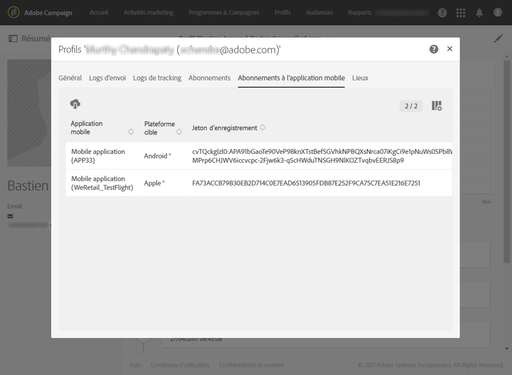
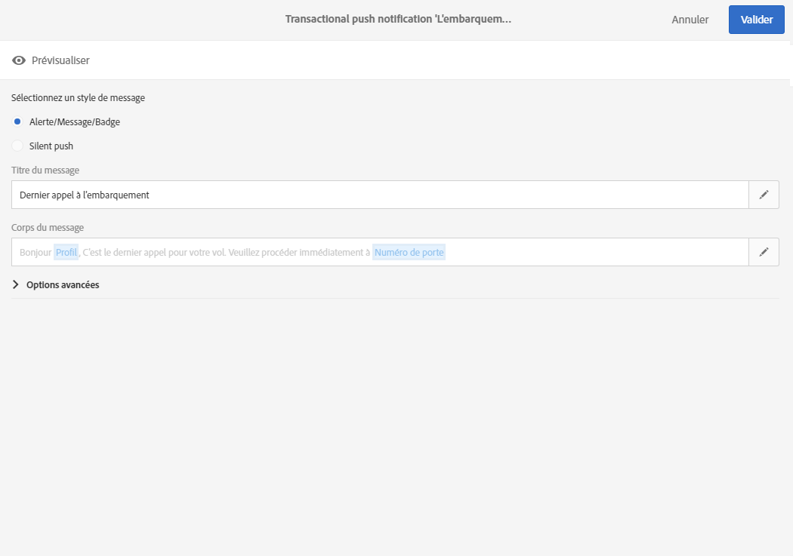

# Notifications push transactionnelles{#transactional-push-notifications}

Vous pouvez utiliser Adobe Campaign pour envoyer des notifications push transactionnelles sur des appareils mobiles iOS et Android. Ces messages sont reçus sur des applications mobiles que vous configurez dans Adobe Campaign à l'aide du SDK Experience Cloud Mobile.

>[!NOTE]
>
>Le canal des notifications push est en option. Veuillez vérifier votre accord de licence. Pour plus d'informations sur les notifications push standard, voir [Notifications push](../../channels/using/about-push-notifications.md).

Vous pouvez envoyer deux types de notification push transactionnelle :

* Notifications push transactionnelles ciblant un événement
* Notifications push transactionnelles ciblant des profils de la base de données Adobe Campaign

Une fois que vous avez créé et publié l'événement de votre choix (l'abandon de panier, comme expliqué dans [cette section](../../channels/using/about-transactional-messaging.md#transactional-messaging-operating-principle)), la notification push transactionnelle correspondante est automatiquement créée.

Les étapes de configuration sont présentées dans la section [Configurer un événement pour envoyer une notification push transactionnelle](../../administration/using/configuring-transactional-messaging.md#use-case--configuring-an-event-to-send-a-transactional-message).

Pour que l'événement entraîne l'envoi d'un message transactionnel, vous devez personnaliser le message, le tester et le publier.

>[!NOTE]
>
>To access the transactional messages, you must have administration rights or appear in the **[!UICONTROL Message Center agents]** (mcExec) security group.

## Notifications push transactionnelles ciblant un événement {#transactional-push-notifications-targeting-an-event}

Vous pouvez envoyer une notification push transactionnelle anonyme à tous les utilisateurs qui se sont inscrits pour recevoir des notifications de votre application mobile.

Dans ce cas, seules les données contenues dans l'événement sont utilisées pour définir la cible de la diffusion. Aucune donnée de la base de données de profils intégrée d'Adobe Campaign n'est utilisée.

### Envoyer une notification push transactionnelle ciblant un événement {#sending-a-transactional-push-notification-targeting-an-----------event}

Par exemple, une compagnie aérienne souhaite inviter les utilisateurs de son application mobile à se rendre à la porte adéquate pour l'embarquement.

Pour ce faire, la compagnie enverra une notification push transactionnelle par utilisateur (identifié avec un jeton d'enregistrement), à l'aide d'une application mobile sur un seul appareil.

1. Accédez au message transactionnel qui a été créé afin de l'éditer. Voir [Messages transactionnels basés sur un événement](../../channels/using/event-transactional-messages.md).

   

1. Cliquez sur le bloc **[!UICONTROL Contenu]pour modifier le titre et le corps de votre message.**

   Vous pouvez insérer des champs de personnalisation pour ajouter les éléments que vous avez définis lors de la création de votre événement.

   

   To find these fields, click the pencil next to an item, click **[!UICONTROL Insert personalization field]** and select **[!UICONTROL Transactional event]** &gt; **[!UICONTROL Event context]**.

   

   Pour plus d'informations sur l'édition du contenu d'une notification push, voir [Création d'une notification push](../../channels/using/preparing-and-sending-a-push-notification.md).

1. Enregistrez vos modifications et publiez le message. Voir [Publier un message transactionnel](../../channels/using/event-transactional-messages.md#publishing-a-transactional-message).
1. A l'aide de l'API REST Adobe Campaign Standard, envoyez un événement à un jeton d'enregistrement (ABCDEF123456789), à l'aide d'une application mobile (WeFlight) sur Android (gcm), contenant les informations d'embarquement.

   ```
   {
     "registrationToken":"ABCDEF123456789",
     "application":"WeFlight",
     "pushPlatform":"gcm",
     "ctx":
     {
       "gateNumber":"Gate B18",
       "lastname":"Green",
       "firstname":"Jane"
     }
   }
   ```

   Pour plus d'informations sur l'intégration du déclenchement d'un événement dans un système externe, voir [Intégration à un site](../../administration/using/configuring-transactional-messaging.md#integrating-the-triggering-of-the-event-in-a-website).

Si le jeton d'enregistrement existe, l'utilisateur correspondant reçoit une notification push transactionnelle comprenant le contenu suivant :

"Bonjour Jeanne Lambert, l'embarquement vient de commencer à la porte B18."

## Notifications push transactionnelles ciblant un profil {#transactional-push-notifications-targeting-a-profile}

Vous pouvez envoyer une notification push transactionnelle aux profils Adobe Campaign qui se sont abonnés à votre application mobile. Cette diffusion peut contenir des champs de [personnalisation](../../designing/using/inserting-a-personalization-field.md) comme le prénom du destinataire.

Dans ce cas, l'événement doit contenir certains champs permettant la réconciliation avec un profil de la base de données Adobe Campaign.

Lors du ciblage des profils, une notification push transactionnelle est envoyée par application mobile et par appareil. Par exemple, si un utilisateur Adobe Campaign s'est abonné à deux applications, il recevra deux notifications. Si un utilisateur s'est abonné à une même application à partir de deux appareils différents, il recevra une notification sur chaque appareil.

Les applications mobiles auxquelles un profil s'est abonné sont répertoriées dans l'onglet **[!UICONTROL Abonnements à l'application mobile]de ce profil.** Pour accéder à cet onglet, sélectionnez un profil et cliquez sur le bouton **[!UICONTROL Editer les propriétés du profil]à droite.**



Pour plus d'informations sur l'accès aux profils et leur édition, voir la section [Profils](../../audiences/using/creating-profiles.md).

### Envoyer une notification push transactionnelle ciblant un profil {#sending-a-transactional-push-notification-targeting-a-----------profile}

Par exemple, une compagnie aérienne souhaite envoyer un dernier appel pour l'embarquement à tous les utilisateurs Adobe Campaign qui se sont abonnés à son application mobile.

1. Accédez au message transactionnel qui a été créé afin de l'éditer. Voir [Messages transactionnels basés sur un événement](../../channels/using/event-transactional-messages.md).

   

1. Cliquez sur le bloc **[!UICONTROL Contenu]pour modifier le titre et le corps de votre message.**

   Contrairement aux configurations reposant sur des événements temps réel, vous disposez d'un accès direct à toutes les informations de profil pour personnaliser votre message. Voir [Insertion d'un champ de personnalisation](../../designing/using/inserting-a-personalization-field.md).

   

   Pour plus d'informations sur l'édition du contenu d'une notification push, voir la section [Création d'une notification push](../../channels/using/preparing-and-sending-a-push-notification.md).

1. Enregistrez vos modifications et publiez le message. Voir [Publier un message transactionnel](../../channels/using/event-transactional-messages.md#publishing-a-transactional-message).
1. A l'aide de l'API REST Adobe Campaign Standard, envoyez un événement à un profil.

   ```
   {
     "ctx":
     {
       "email":"janegreen@email.com",
       "gateNumber":"D16",
     }
   }
   ```

   Pour plus d'informations sur l'intégration du déclenchement d'un événement dans un système externe, voir [Intégration à un site](../../administration/using/configuring-transactional-messaging.md#integrating-the-triggering-of-the-event-in-a-website).

   >[!NOTE]
   >
   >Il n'y a pas de champ de jeton d'enregistrement, d'application ni de plate-forme push. Dans cet exemple, la réconciliation est effectuée avec le champ email.

