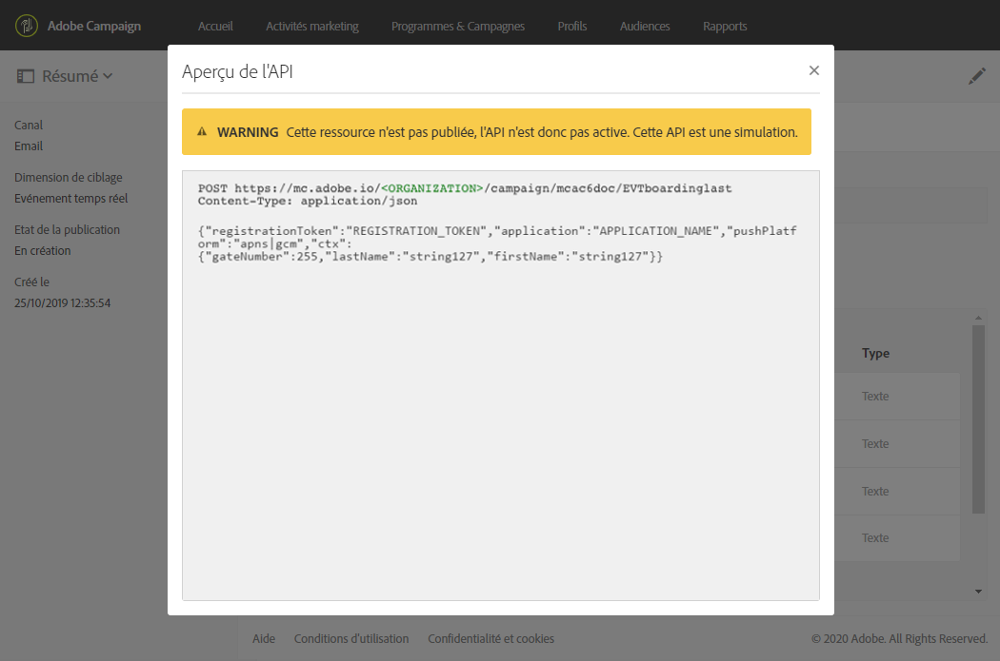
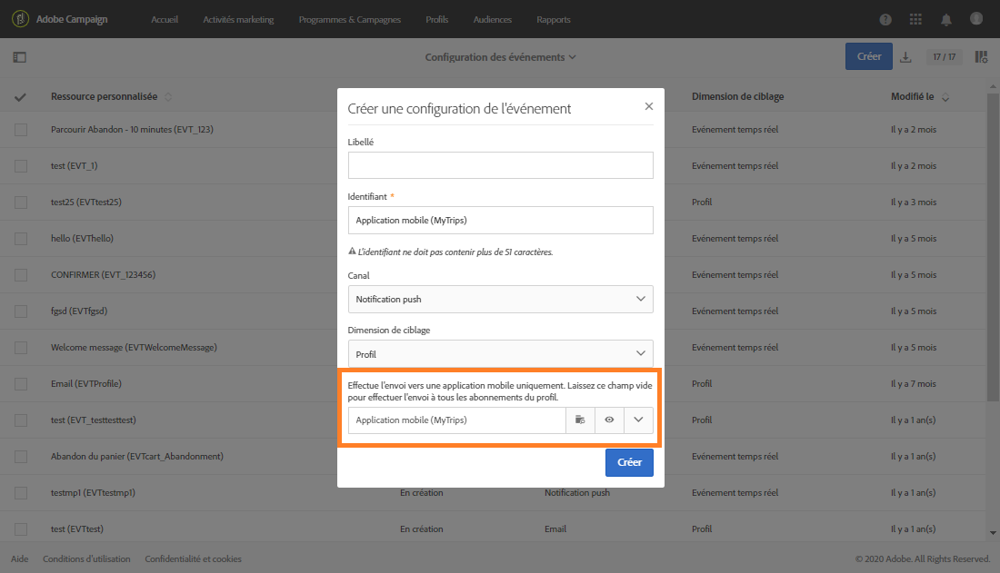

# Notifications push transactionnelles{#transactional-push-notifications}

Vous pouvez utiliser Adobe Campaign pour envoyer des notifications push transactionnelles sur des appareils mobiles iOS et Android. Ces messages sont reçus sur des applications mobiles que vous configurez dans Adobe Campaign à l&#39;aide du SDK Experience Cloud Mobile.

>[!NOTE]
>
>Le canal des notifications push est en option. Veuillez vérifier votre contrat de licence. Pour plus d’informations sur les notifications push standard, voir [À propos des notifications push](../../channels/using/about-push-notifications.md).

Pour pouvoir envoyer des notifications push transactionnelles, vous devez configurer Adobe Campaign en conséquence. Voir [Configuration d’une application mobile](../../administration/using/configuring-a-mobile-application.md).

Vous pouvez envoyer deux types de notification push transactionnelle :

* [Notifications push transactionnelles ciblant un événement](#transactional-push-notifications-targeting-an-event)
* [Notifications push transactionnelles ciblant des profils](#transactional-push-notifications-targeting-a-profile) de la base de données Adobe Campaign

## Notifications push transactionnelles ciblant un événement {#transactional-push-notifications-targeting-an-event}

Vous pouvez utiliser Adobe Campaign pour envoyer des **notifications push transactionnelles anonymes à tous les utilisateurs** qui se sont inscrits pour recevoir des notifications de votre application mobile.

Dans ce cas, seules **les données contenues dans l’événement sont utilisées pour définir la cible de la diffusion**. Aucune donnée de la base de données de profils intégrée d’Adobe Campaign n’est utilisée.

### Configuration d’une notification push transactionnelle basée sur un événement {#configuring-event-based-transactional-push-notification}

Pour envoyer une notification push transactionnelle anonyme à tous les utilisateurs qui se sont inscrits pour recevoir des notifications de votre application mobile, vous devez d’abord créer et configurer un événement ciblant les données contenues dans l’événement.

>[!NOTE]
>
>Vous pouvez toujours personnaliser le contenu d’une notification push transactionnelle basée sur un événement en utilisant des [attributs d&#39;événement](../../channels/using/configuring-transactional-event.md#defining-the-event-attributes) (données de l&#39;événement) et un [enrichissement d&#39;événement](../../channels/using/configuring-transactional-event.md#enriching-the-transactional-message-content) (données de la base de données Campaign). Voir [l’exemple ci-dessous](#sending-event-based-transactional-push-notification).

L’événement doit contenir les trois éléments suivants :

* Un **jeton d’enregistrement** qui est l’identifiant de l’utilisateur pour une application mobile et un appareil. Il peut ne pas correspondre à un profil de la base de données Adobe Campaign.
* Un **nom d’application mobile** (un pour tous les appareils : Android et iOS). Il s’agit de l’identifiant de l’application mobile configuré dans Adobe Campaign qui sera utilisé pour la réception des notifications push sur les appareils des utilisateurs. Voir à ce propos la section [Configurer une application mobile](../../administration/using/configuring-a-mobile-application.md).
* Une **plateforme push** (« gcm » pour Android et « apns » pour iOS).

Pour configurer l’événement, procédez comme suit :

1. Lors de la création de la configuration d’un événement, sélectionnez le canal **[!UICONTROL Notification push]** et la dimension de ciblage **[!UICONTROL Evénement temps réel]** (voir [Créer un événement](../../channels/using/configuring-transactional-event.md#creating-an-event)).
1. Ajoutez les champs à l’événement. Vous pourrez ainsi personnaliser le message transactionnel (voir [Définition des attributs d&#39;événement](../../channels/using/configuring-transactional-event.md#defining-the-event-attributes)). Dans cet exemple, définissez les champs « gateNumber », « lastname » et « firstname ».
1. Vous pouvez également enrichir le contenu de votre message. Pour ce faire, ajoutez les champs de la table que vous avez liée à votre configuration d&#39;événement (voir [Enrichir l&#39;événement](../../channels/using/configuring-transactional-event.md#enriching-the-transactional-message-content)).

   <!--Event-based transactional messaging is supposed to use only the data that are in the sent event to define the recipient and the message content personalization. However, you can enrich the content of your transactional message using information from the Adobe Campaign database.-->

1. [Prévisualisation et publication de l&#39;événement](../../channels/using/publishing-transactional-event.md#previewing-and-publishing-the-event).

   Lors de l’aperçu de l’événement, l’API REST contient les attributs &quot;registrationToken&quot;, &quot;application&quot; et &quot;pushPlatform&quot; qui seront utilisés pour cibler la diffusion.

   

   Une fois la publication effectuée, une notification push transactionnelle associée au nouvel événement est automatiquement créée. Vous pouvez maintenant modifier et publier le message qui vient d’être créé (voir [cette section](#sending-event-based-transactional-push-notification)).

1. Intégrez l’événement dans votre site web (voir [Intégration du déclenchement d&#39;événement](../../channels/using/getting-started-with-transactional-msg.md#integrate-event-trigger)).

### Envoi d’une notification push transactionnelle basée sur un événement {#sending-event-based-transactional-push-notification}

Par exemple, une compagnie aérienne souhaite inviter les utilisateurs de son application mobile à se rendre à la porte adéquate pour l&#39;embarquement.

Pour ce faire, la compagnie enverra une notification push transactionnelle par utilisateur (identifié avec un jeton d&#39;enregistrement), à l&#39;aide d&#39;une application mobile sur un seul appareil.

1. Accédez au message transactionnel qui a été créé afin de l’éditer. Voir [Accéder aux messages transactionnels](../../channels/using/editing-transactional-message.md#accessing-transactional-messages).

   

1. Cliquez sur le bloc **[!UICONTROL Contenu]** pour modifier le titre et le corps de votre message.

1. Vous pouvez insérer des champs de personnalisation pour ajouter les éléments que vous avez définis lors de la création de votre événement (voir [Définir les attributs d&#39;événement](../../channels/using/configuring-transactional-event.md#defining-the-event-attributes)).

   

   Pour trouver ces champs, cliquez sur le crayon situé en regard d’un élément, cliquez sur **[!UICONTROL Insérer un champ de personnalisation]** et sélectionnez **[!UICONTROL Contexte]** > **[!UICONTROL Événement en temps réel]** > **[!UICONTROL Contexte de l&#39;événement]**.

   

   Pour en savoir plus sur la modification du contenu d’une notification push, voir [Préparer et envoyer une notification push](../../channels/using/preparing-and-sending-a-push-notification.md).

1. Vous pouvez également enrichir le contenu du message transactionnel si vous souhaitez utiliser des informations supplémentaires de la base de données Adobe Campaign (voir [Enrichir l&#39;événement](../../channels/using/configuring-transactional-event.md#enriching-the-transactional-message-content)).

1. Enregistrez vos modifications et publiez le message. Voir [Publier un message transactionnel](../../channels/using/publishing-transactional-message.md#publishing-a-transactional-message).

1. À l&#39;aide de l&#39;API REST Adobe Campaign Standard, envoyez un événement à un jeton d&#39;enregistrement (ABCDEF123456789), à l&#39;aide d&#39;une application mobile (WeFlight) sur Android (gcm), contenant les informations d&#39;embarquement :

   ```
   {
     "registrationToken":"ABCDEF123456789",
     "application":"WeFlight",
     "pushPlatform":"gcm",
     "ctx":
     {
       "gateNumber":"Gate B18",
       "lastname":"Green",
       "firstname":"Jane"
     }
   }
   ```

   Pour en savoir plus sur l&#39;intégration du déclenchement d&#39;un événement dans un système externe, voir [Intégration du déclenchement d&#39;événement](../../channels/using/getting-started-with-transactional-msg.md#integrate-event-trigger).

Si le jeton d&#39;enregistrement existe, l&#39;utilisateur correspondant reçoit une notification push transactionnelle comprenant le contenu suivant :

*« Bonjour Jeanne Lambert, l&#39;embarquement vient de commencer !  Veuillez vous diriger vers la porte B18. »*

## Notifications push transactionnelles ciblant un profil     {#transactional-push-notifications-targeting-a-profile}

Vous pouvez envoyer une notification push transactionnelle **aux profils Adobe Campaign qui se sont abonnés à votre application mobile**. Cette diffusion peut contenir des [champs de personnalisation](../../designing/using/personalization.md#inserting-a-personalization-field), tels que le prénom du destinataire, directement récupérés de la base de données Adobe Campaign.

Dans ce cas, l’événement doit contenir certains champs **permettant la réconciliation avec un profil de la base de données Adobe Campaign**.

Lors du ciblage des profils, une notification push transactionnelle est envoyée par application mobile et par appareil. Par exemple, si un utilisateur Adobe Campaign s&#39;est abonné à deux applications, il recevra deux notifications. Si un utilisateur s&#39;est abonné à une même application à partir de deux appareils différents, il recevra une notification sur chaque appareil.

Les applications mobiles auxquelles un profil s’est abonné sont répertoriées dans l’onglet **[!UICONTROL Abonnements à l’application mobile]** de ce profil. Pour accéder à cet onglet, sélectionnez un profil et cliquez sur le bouton **[!UICONTROL Éditer les propriétés du profil]** à droite.


Pour plus d’informations sur l’accès aux profils et leur modification, voir la section [À propos des profils](../../audiences/using/about-profiles.md).

### Configuration d’une notification push transactionnelle basée sur un profil {#configuring-profile-based-transactional-push-notification}

Pour envoyer une notification push transactionnelle aux profils Adobe Campaign qui se sont inscrits à votre application mobile, vous devez d&#39;abord créer et configurer un événement ciblant la base de données Adobe Campaign.

1. Lors de la création de la configuration d&#39;un événement, sélectionnez le canal **[!UICONTROL Notification push]** et la dimension de ciblage **[!UICONTROL Profil]** (voir [Création d&#39;un événement](../../channels/using/configuring-transactional-event.md#creating-an-event)).

   La notification push transactionnelle sera envoyée, par défaut, à toutes les applications mobiles auxquelles les destinataires sont inscrits. Pour envoyer la notification push à une application mobile spécifique, sélectionnez-la dans la liste. Les autres applications mobiles seront ciblées par le message, mais seront exclues de l’envoi.

   

1. Ajoutez des champs à l’événement si vous voulez personnaliser le message transactionnel (voir [Définir les attributs d’événement](../../channels/using/configuring-transactional-event.md#defining-the-event-attributes)).

   >[!NOTE]
   >
   >Vous devez ajouter au moins un champ pour créer un enrichissement. Vous n’avez pas à créer des champs tels que **Prénom** et **Nom**, car vous pourrez utiliser les champs de personnalisation de la base de données Adobe Campaign.

1. Créez un enrichissement afin de lier l&#39;événement à la ressource **[!UICONTROL Profil]** (voir [Enrichir l&#39;événement](../../channels/using/configuring-transactional-event.md#enriching-the-transactional-message-content)) et sélectionnez cet enrichissement comme enrichissement de ciblage ****.

   >[!IMPORTANT]
   >
   >Cette étape est obligatoire pour les événements basés sur un profil.

1. [Prévisualisation et publication de l&#39;événement](../../channels/using/publishing-transactional-event.md#previewing-and-publishing-the-event).

   Lors de l’aperçu de l’événement, l’API REST ne contient pas d’attribut spécifiant le jeton d’enregistrement, le nom de l’application et la plateforme push, car ceux-ci seront récupérés dans la ressource **[!UICONTROL Profil]**.

   Une fois la publication effectuée, une notification push transactionnelle associée au nouvel événement est automatiquement créée. Vous pouvez maintenant modifier et publier le message qui vient d’être créé (voir [cette section](#sending-profile-based-transactional-push-notification)).

1. Intégrez l&#39;événement dans votre site web (voir [Intégration du déclenchement d&#39;événement](../../channels/using/getting-started-with-transactional-msg.md#integrate-event-trigger)).

### Envoi d&#39;une notification push transactionnelle basée sur un profil {#sending-profile-based-transactional-push-notification}

Par exemple, une compagnie aérienne souhaite envoyer un dernier appel pour l&#39;embarquement à tous les utilisateurs Adobe Campaign qui se sont abonnés à son application mobile.

1. Accédez au message transactionnel qui a été créé afin de l’éditer. Voir [Accéder aux messages transactionnels](../../channels/using/editing-transactional-message.md#accessing-transactional-messages).

1. Cliquez sur le bloc **[!UICONTROL Contenu]** pour modifier le titre et le corps de votre message.

   Contrairement aux configurations reposant sur des événements temps réel, vous disposez d&#39;un accès direct à toutes les informations de profil pour personnaliser votre message. Voir [Insertion d&#39;un champ de personnalisation](../../designing/using/personalization.md#inserting-a-personalization-field).

   Pour en savoir plus sur la modification du contenu d’une notification push, voir [Préparer et envoyer une notification push](../../channels/using/preparing-and-sending-a-push-notification.md).

1. Enregistrez vos modifications et publiez le message. Voir [Publier un message transactionnel](../../channels/using/publishing-transactional-message.md#publishing-a-transactional-message).
1. À l’aide de l&#39;API REST Adobe Campaign Standard, envoyez un événement à un profil :

   ```
   {
     "ctx":
     {
       "email":"janegreen@email.com",
       "gateNumber":"D16",
     }
   }
   ```

Pour en savoir plus sur l’intégration du déclenchement d’un événement dans un système externe, voir [Intégration du déclenchement d’événement](../../channels/using/getting-started-with-transactional-msg.md#integrate-event-trigger).

L’utilisateur correspondant reçoit une notification push transactionnelle comprenant tous les éléments de personnalisation récupérés de la base de données Adobe Campaign.

>[!NOTE]
>
>Il n&#39;y a pas de champ de jeton d&#39;enregistrement, d&#39;application ni de plateforme push. Dans cet exemple, la réconciliation est effectuée avec le champ email.
