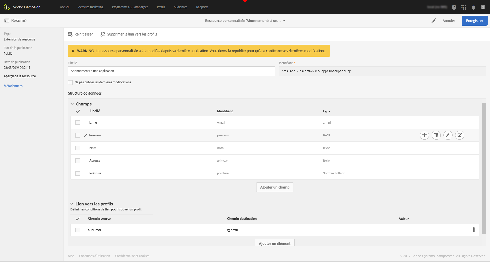
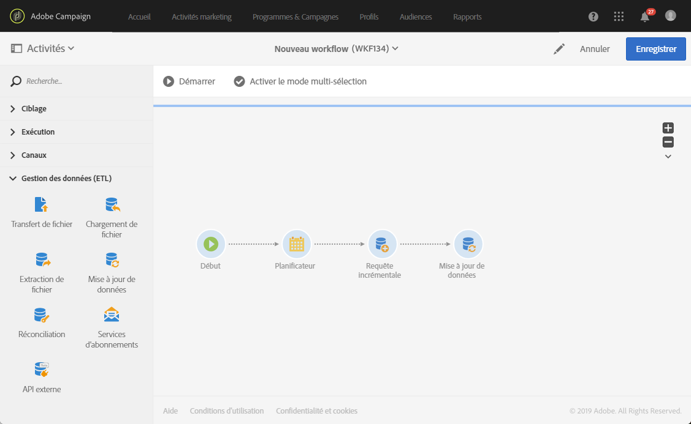
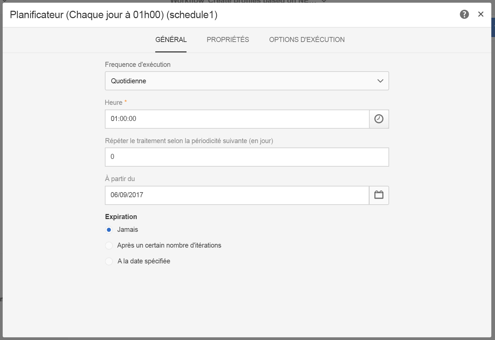
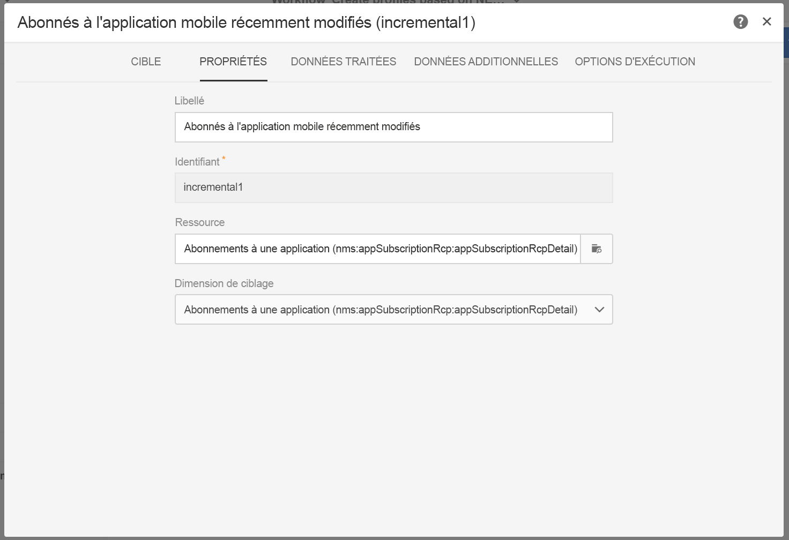
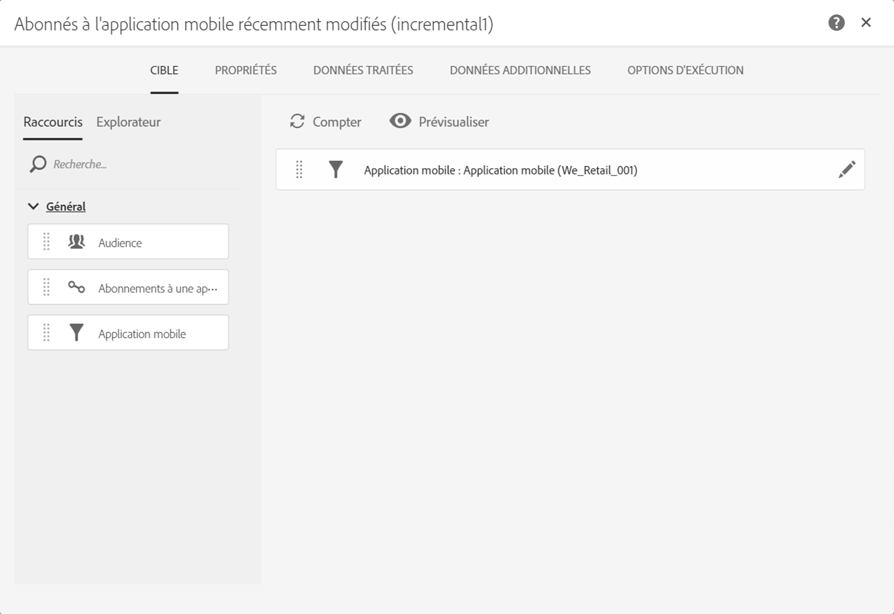
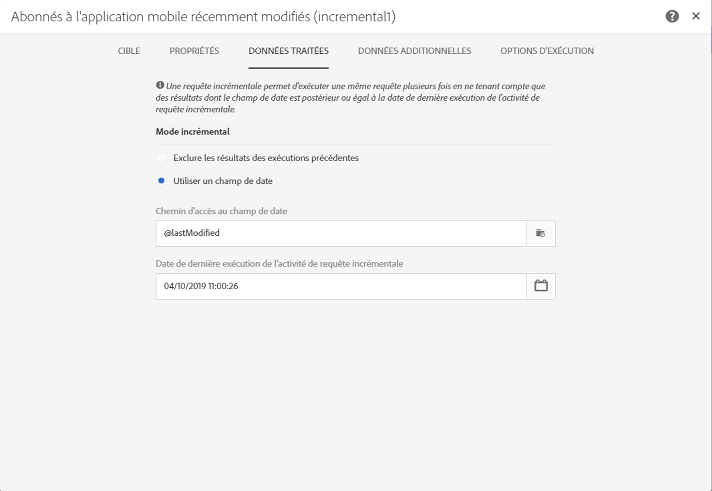
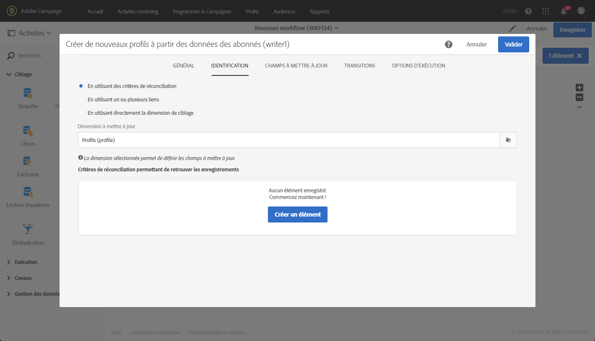
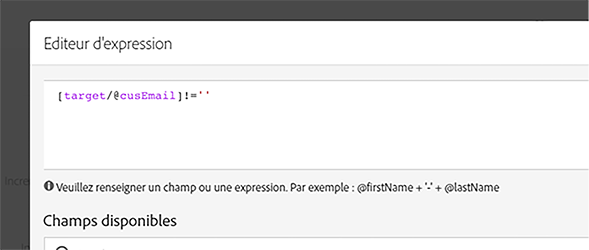
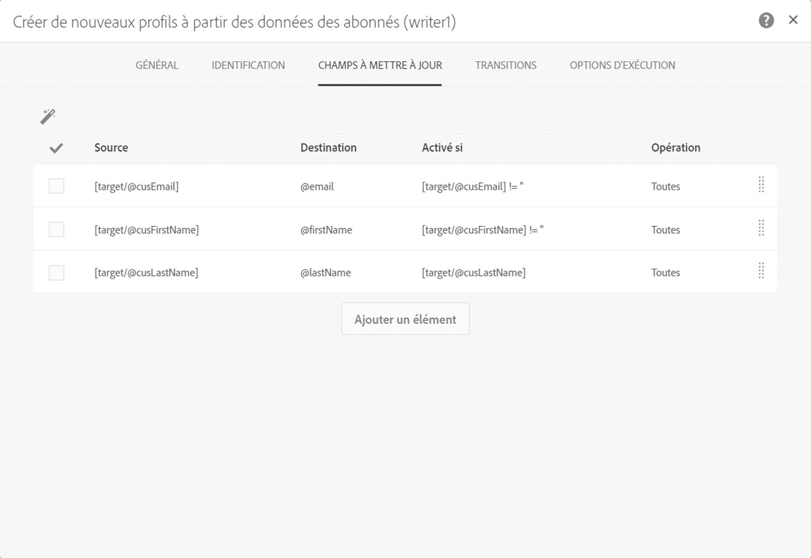
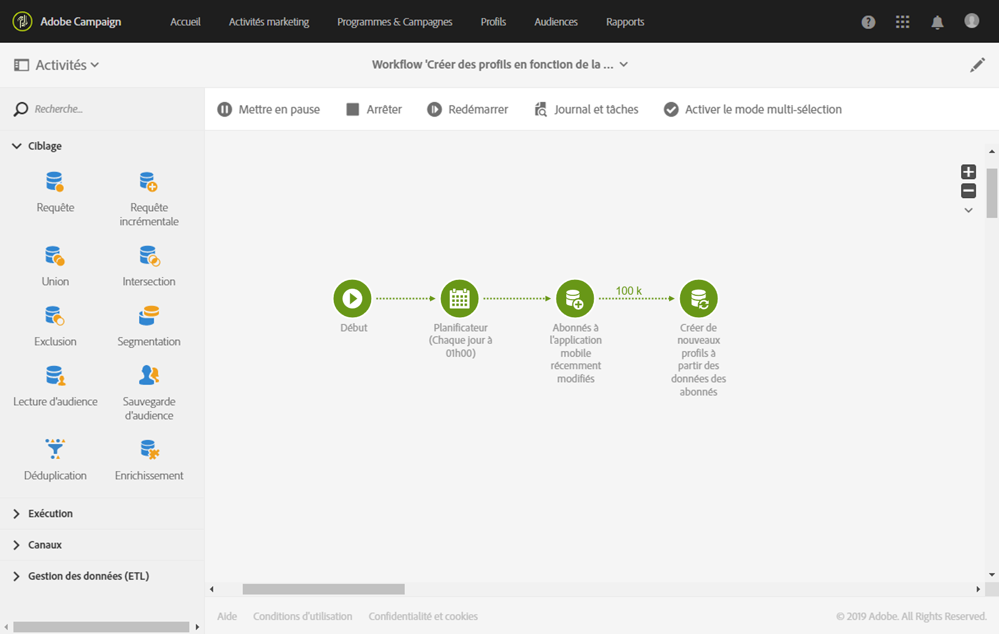

# Création et mise à jour d'informations sur le profil basées sur les données de l'application mobile

## Présentation

Cette page décrit les étapes d'élaboration d'un flux de travail qui crée/met à jour des données de profil après une application mobile envoyée sur une base régulière.

* **PII** signifie « Informations Personnelles Identifiables ». Il peut être n'importe quelle donnée, y compris des informations qui ne figurent pas dans le tableau Profil de votre base de données de Campagne comme, par exemple, Analytics pour les [points d'intérêt mobiles](../../integrating/using/about-campaign-points-of-interest-data-integration.md). Le PII est défini par le Développeur Mobile de l'App, habituellement avec un Marketer.
* **Collectionner PII** est une opération HTTP-POST à une API de repos en Adobe Campaign Standard depuis une application mobile.

L'objectif de cette affaire est de créer ou de mettre à jour un profil de la campagne de campagne si les données PII retournées par une application mobile contiennent des données relatives au profil.

## Prérequis

Il y a plusieurs étapes de configuration à suivre pour activer les notifications de la campagne de campagne, avant que les profils puissent être créés ou mis à jour en fonction des données de l'abonnement mobile :

1. [Créer une application mobile](../../administration/using/configuring-a-mobile-application.md)
1. [Intégrez le SDK Adobe Mobile avec votre application mobile](https://helpx.adobe.com/campaign/kb/integrate-mobile-sdk.html).
1. [Configurez la campagne Adobe pour envoyer des notifications](https://helpx.adobe.com/campaign/kb/configuring-app-sdkv4.html).

## Étape 1 - Extension de la ressource de profil pour les notifications/abonnements Push

Pour pouvoir créer ou mettre à jour la ressource Profil avec les données PII, vous devez d'abord étendre la ressource Profil avec les champs désirés. Pour cela :

* Identifiez les champs PII envoyés par l'application mobile.
* Identifier le champ à utiliser pour la réconciliation pour associer les données PII avec les données du profil.

Dans cet exemple, la **[!UICONTROL section Fields]** reflète les données PII envoyées par l'application mobile. La **[!UICONTROL section Lien vers les profils]** indique le champ utilisé pour associer les PII aux données du profil, où **les** cartes de cusemail à **@ e-mail**.

La cartographie des données de profil tout en étendant les **[!UICONTROL abonnements à une ressource d'application]** est seulement READ-ONLY. Il est utilisé pour la réconciliation. Le profil doit être entré dans le système avec les données nécessaires pour concilier le profil avec les données PII. Dans notre cas, une adresse électronique pour le profil doit correspondre à un courriel de la Collection PII pour que la réconciliation se produise :

* Collecter PII est reçu d'une App App pour un utilisateur où leur prénom est « Jane, nom de famille est Doe » et adresse email est janedoe@doe.com.
* Séparément, le profil doit exister (par exemple, les données doivent être entrées manuellement ou provenir déjà d'une autre ressource) où l'adresse électronique du profil est janedoe@doe.com.

**Rubriques connexes :**

* [Extension des abonnements à une ressource d'application](../../developing/using/extending-the-subscriptions-to-an-application-resource.md).
* [Création ou extension d'une ressource existante](../../developing/using/key-steps-to-add-a-resource.md).

## Étape 2 - Créer le flux de travail

L'utilisation d'un Workflow in Campaign Standard permet à un administrateur d'identifier et de synchroniser de façon unique les données entre les données de l'abonné (abonné) et le profil ou les données du bénéficiaire. Bien qu'une mise à jour basée sur le flux de travail ne synchronise pas les données de profil en réel - temps, elle ne devrait pas causer de serrures de bases de données abusives ni de frais généraux.

Les étapes principales pour construire le flux de travail sont les suivantes :

1. Utilisez une **[!UICONTROL requête de requêtes]** ou **[!UICONTROL de requêtes]** supplémentaires pour obtenir une liste des derniers abonnements.
1. Utilisez une activité **[!UICONTROL de rapprochement]** pour cartographier les données PII avec le profil.
1. Ajouter un processus de vérification.
1. Utilisez les **[!UICONTROL données]** de mise à jour pour mettre à jour ou créer le profil avec les données PII.

Les exigences suivantes sont assumées dans ce flux de travail :

* Tous les champs qui ont été étendus devraient être disponibles pour créer/mettre à jour la table Profil.
* Le tableau Profil peut être étendu à des champs qui ne sont pas supportés nativement (par exemple, la taille T-shirt).
* N'importe quel champ du tableau appababonnement qui est vierge ne devrait pas être mis à jour dans la Table Profil.
* Tout enregistrement qui a été mis à jour dans la table appababonnement devrait être inclus dans la prochaine course du Workflow.

Pour construire le flux de travail, suivez les étapes suivantes :

1. Glisser-déposer les activités suivantes dans l'espace de travail et les relier ensemble :
   1. **[!UICONTROL Démarrer]**
   1. **[!UICONTROL Planificateur]**
   1. **[!UICONTROL Requête incrémentale]**
   1. **[!UICONTROL Mise à jour de données]**
   

1. Configure the **[!UICONTROL Scheduler]** activity. Dans l'onglet **[!UICONTROL Général]** , définissez la fréquence **[!UICONTROL d'exécution]** (par exemple « Daily »), **[!UICONTROL le temps]** (par exemple « 1:00:00 AM ») et le **[!UICONTROL début]** (par exemple, la date d'aujourd'hui).

   

1. Configure l'activité **[!UICONTROL de requête]** différentielle.
   1. Dans l'onglet **[!UICONTROL Propriétés]** , cliquez sur **[!UICONTROL l'icône Sélectionner une]** icône du champ **[!UICONTROL Resource]** , puis sélectionnez les **[!UICONTROL abonnements à une application (nms : Appabptionrcp : Élément appabptionrcpdetail)]** .

      

   1. Dans l'onglet **[!UICONTROL Cible]** , faites glisser le **[!UICONTROL filtre d'application]** mobile, puis sélectionnez un nom de candidature mobile.

      

   1. Dans l'onglet **[!UICONTROL Données traitées,]** sélectionnez **[!UICONTROL Utiliser un champ de date]**, puis ajoutez le **[!UICONTROL dernier champ modifié]** (lastmodified) comme **[!UICONTROL chemin vers le champ Date]**.

      

1. Configurer l'activité **[!UICONTROL de données]** de mise à jour.
   1. Dans l'onglet **[!UICONTROL Identification]** , assurez-vous que la **[!UICONTROL Dimension de mise à jour]** est définie à « Profils (profil) », puis cliquez sur **[!UICONTROL le bouton Créer un élément]** pour ajouter un champ comme critère de rapprochement.

      

   1. Dans le champ **[!UICONTROL Source]** , sélectionnez un champ dans la table appendcrsiptionrcp comme champ de rapprochement. Il peut être l'email du profil, crmid, marketingcloudid, etc. Dans cet exemple, nous utiliserons le champ « Email (cusemail) ».
   1. Dans le champ **[!UICONTROL Destination]** , sélectionnez un champ à partir du tableau de profil pour réconcilier les données de la table appabptionrcp. Il peut être le courriel du profil, ou tout champ étendu comme crmid, marketingcloudid, etc. Dans cet exemple, nous devons sélectionner le champ « Email (email) » pour le cartographier avec le champ « Email (cusemail) » à partir de la table appabptionrcp.

      

   1. Dans **[!UICONTROL les Champs pour mettre à jour]** l'onglet, cliquez sur **[!UICONTROL le]** bouton Créer, puis cartographiez les champs qui proviennent de la table appabptionrcp (**[!UICONTROL Champ Source]** ) avec les champs que vous souhaitez mettre à jour dans la table Profil (**[!UICONTROL champ Destination]** ).
   1. Dans le **[!UICONTROL champ Activé,]** ajouter une expression pour s'assurer que le champ correspondant dans la table Profil n'est mis à jour que si le champ source contient une valeur. Pour cela, sélectionnez le champ dans la liste, puis ajoutez le " !"= "" expression (si le champ Source est `[target/@cusEmail]` dans l'éditeur d'expression assurez-vous de taper `[target/@cusEmail] != ''"`).

      

      >[!NOTE]
      >
      >Dans ce cas, le Workflow exécute une UPSERT mais, étant donné qu'il est basé sur des données de requêtes supplémentaires, n'est inséré que. Modifier la requête peut affecter les données insérées ou mises à jour.
      >En outre, les paramètres dans les Champs pour mettre à jour l'onglet déterminent quels champs sont insérés ou mis à jour dans des conditions spécifiques. Ces paramètres peuvent être uniques pour chaque application ou client. Prenez soin de configurer ces paramètres car il peut y avoir des conséquences inattendues, car la mise à jour des notices dans le Profil basé sur les données de appabptionrcp peut changer les informations personnelles des utilisateurs sans validation.

   1. Lorsque tous les champs à insérer/mettre à jour dans Profile ont été ajoutés, cliquez **[!UICONTROL sur Confirmer]**.

      

1. Enregistrez le flux de travail, puis cliquez sur Démarrer pour lancer le processus Workflow.

   
