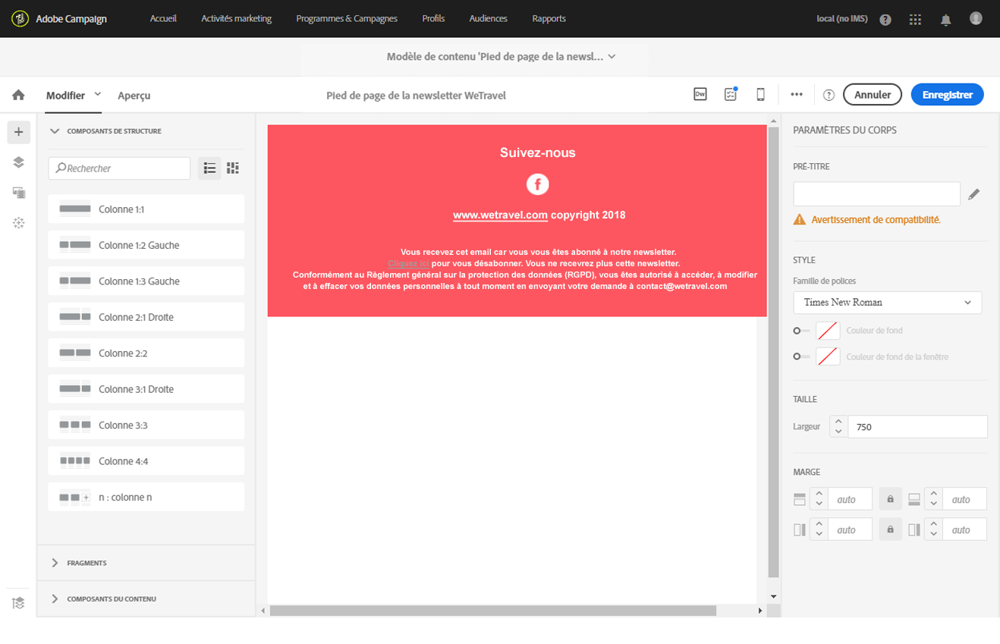

# A propos de la conception du contenu d'un email{#about-email-content-design}

Utilisez l'interface de type glisser-déposer du Concepteur d'email pour créer et modifier le contenu de vos emails dans Adobe Campaign.

Cette section décrit les caractéristiques du Concepteur d'email :

* [A propos du Concepteur d'email ](../../designing/using/about-email-content-design.md#about-the-email-designer)
* [Définir la structure d'un email](../../designing/using/defining-the-email-structure.md)
* [Editer les styles d'un email](../../designing/using/editing-email-styles.md)

Pour en savoir plus sur les actions qui sont communes à une ou plusieurs activités marketing, reportez-vous aux sections suivantes :

* Pour plus d'informations sur la personnalisation du contenu d'un email, voir les sections [Insertion d'un champ de personnalisation](../../designing/using/inserting-a-personalization-field.md) et [Ajouter un bloc de contenu](../../designing/using/adding-a-content-block.md).
* Pour plus d'informations sur l'import d'un autre contenu d'email, voir la section [Sélectionner du contenu existant](../../designing/using/selecting-an-existing-content.md).
* Pour plus d'informations sur la définition du contenu dynamique dans un email, voir la section [Définir le contenu dynamique dans un email](../../designing/using/defining-dynamic-content-in-an-email.md).
* Pour plus d'informations sur l'insertion de liens dans un email, voir la section [Insérer un lien](../../designing/using/inserting-a-link.md).
* Pour plus d'informations sur l'insertion d'images dans un email, voir la section [Insérer des images](../../designing/using/inserting-images.md).

Consultez également les [bonnes pratiques générales pour concevoir du contenu](../../designing/using/content-design-best-practices.md).

## A propos du Concepteur d'email  {#about-the-email-designer}

Le Concepteur d'email permet de créer du contenu d'email et des modèles de contenu d'email. Il est compatible avec les emails simples, les emails transactionnels, les emails de test A/B, les emails multilingues et les emails récurrents.

Pour commencer à utiliser le Concepteur d'email, regardez cet [ensemble de vidéos](https://helpx.adobe.com/campaign/kt/acs/using/acs-email-designer-tutorial.html#GettingStarted) qui expliquent la fonctionnalité générale de l'outil et qui décrivent comment créer entièrement un email ou le concevoir à l'aide de modèles.

### Page d'accueil du Concepteur d'email {#email-designer-home-page}

Lors de la [création d'un email](../../channels/using/creating-an-email.md), la page d'accueil du **[!UICONTROL Concepteur d'email]** s'affiche automatiquement lors de la sélection du contenu de l'email.


L'onglet **[!UICONTROL Propriétés]** permet de modifier les détails d'un email, tels que le libellé, l'adresse et le nom de l'expéditeur ou l'objet. Vous pouvez également accéder à cet onglet en cliquant sur le libellé de l'email en haut de l'écran.


L'onglet **[!UICONTROL Modèles]** permet d'effectuer une sélection parmi les contenus HTML d'usine ou les modèles que vous avez déjà créés pour commencer rapidement à concevoir votre email. Voir [Modèles de contenu](../../start/using/about-templates.md#content-templates).


L'onglet **[!UICONTROL Formation et support]** permet d'accéder facilement à la documentation et aux tutoriels connexes.


Si vous ne sélectionnez pas de modèle, la page d'accueil du Concepteur d'email vous permet également de choisir le mode de conception de votre contenu :

* Cliquez sur le bouton **[!UICONTROL Créer]** pour commencer à créer entièrement un contenu. Voir [Concevoir entièrement un contenu d'email](../../designing/using/about-email-content-design.md#designing-an-email-content-from-scratch).
* Cliquez sur le bouton **[!UICONTROL Télécharger]** pour télécharger un fichier à partir de votre ordinateur. Voir [Importer du contenu depuis un fichier](../../designing/using/importing-content-from-a-file.md).
* Cliquez sur le bouton **[!UICONTROL Importer depuis l'URL]** pour récupérer du contenu existant à partir d'une URL. Voir [Importer du contenu depuis une URL](../../designing/using/importing-content-from-a-url.md).

### Interface du Concepteur d'email {#email-designer-interface}

Le Concepteur d'email propose de nombreuses options qui permettent de créer, éditer et personnaliser tous les aspects de votre contenu.

L'interface est composée de plusieurs zones offrant des fonctionnalités différentes :


A partir des éléments disponibles dans la **palette** (1), déposez des composants de structure et des fragments de contenu dans l'**espace de travail** principal (2). Sélectionnez un composant ou un élément dans l'**espace de travail** (2) et personnalisez ses principales caractéristiques de style et d'affichage dans le volet **Paramètres** (3).

Accédez à des options et des paramètres plus généraux à partir de la **barre d'outils** principale (4).

>[!NOTE]
>
>Le volet **Paramètres** peut être déplacé vers la gauche selon la résolution et l'affichage de votre écran.


La **barre d'outils contextuelle** de l'interface de l'éditeur présente des fonctionnalités différentes selon la zone sélectionnée. Elle regroupe des boutons d'action et des boutons permettant de modifier le style du texte. Les modifications effectuées s'appliquent toujours sur la zone sélectionnée.

### Recommandations générales pour utiliser le Concepteur d'email  {#general-recommendations-for-using-the-email-designer}

Pour utiliser correctement le Concepteur d'email et créer des emails optimaux aussi simplement que possible, il est recommandé d'appliquer les principes suivants :

* Utilisez les styles intégrés plutôt qu'une feuille CSS distincte et une feuille CSS dans la section &lt;head&gt; du code HTML. En utilisant les styles intégrés, vous pourrez optimiser l'enregistrement et la réutilisation des fragments de contenu.

   Voir [Ajouter des attributs de style intégrés](../../designing/using/editing-email-styles.md#adding-inline-styling-attributes).

* Etablissez facilement votre marque en créant et en réutilisant des fragments de contenu pour assurer la cohérence de vos campagnes marketing.

   Voir [Créer un fragment de contenu](../../designing/using/defining-the-email-structure.md#creating-a-content-fragment).

Consultez également les [bonnes pratiques générales pour concevoir du contenu](../../designing/using/content-design-best-practices.md).

### Mode de compatibilité du Concepteur d'email  {#email-designer-compatibility-mode}

Lorsque vous téléchargez un contenu, il doit contenir des balises spécifiques pour être entièrement compatible et éditable à l'aide de l'éditeur WYSIWYG du Concepteur d'email.

Si tout ou partie du code HTML téléchargé n'est pas conforme avec le balisage attendu, le contenu est alors chargé en "mode de compatibilité", ce qui limite les possibilités d'édition via l'interface utilisateur.

Lorsqu'un contenu est chargé en mode de compatibilité, vous pouvez toujours effectuer les modifications suivantes via l'interface utilisateur (les actions indisponibles sont masquées) :

* changer le texte ou changer une image,
* insérer des liens et des champs de personnalisation,
* éditer quelques options de style dans le bloc HTML sélectionné
* Définir du contenu conditionnel


D'autres modifications telles que l'ajout de nouvelles sections à votre email ou des styles sophistiqués doivent être effectuées directement dans le code source de l'email via le mode HTML.

Pour plus d'informations sur la conversion d'un email existant en email compatible avec le Concepteur d'email, voir [cette section](../../designing/using/about-email-content-design.md#designing-an-email-using-existing-contents).

### Limitations du Concepteur d'email  {#email-designer-limitations}

* Vous ne pouvez pas utiliser de champs de personnalisation dans un fragment. Pour plus d'informations sur les fragments, voir [cette section](../../designing/using/defining-the-email-structure.md#about-fragments).
* Lors de l'édition de styles, seules les polices web officiellement prises en charge par la plupart des clients d'email sont disponibles.
* Les styles ne peuvent pas être enregistrés en tant que thème pour une réutilisation ultérieure. Le style CSS peut toutefois être enregistré dans un modèle de contenu ou dans un email. Pour plus d'informations sur les styles, voir [cette section](../../designing/using/editing-email-styles.md).

### Mises à jour de Designer {#email-designer-updates}

Le concepteur de courrier électronique est en cours d'amélioration continue. Si vous avez créé un contenu par courrier électronique, depuis un modèle prêt à l'emploi ou si vous avez créé des fragments, vous pouvez obtenir le message de mise à jour suivant lors de l'ouverture suivante du contenu :


Adobe recommande de mettre à jour votre contenu vers la dernière version afin d'éviter tout problème lié aux problèmes de collision CSS. Cliquez sur **[!UICONTROL Mettre à jour maintenant]**.

Si une erreur se produit pendant la mise à jour du contenu, vérifiez votre code HTML et corrigez-le avant d'exécuter cette mise à jour.

Pour les fragments, veuillez tenir compte des points suivants :

* Si vous souhaitez ajouter un fragment à un nouveau courrier électronique ou modèle et que vous obtenez ce message, vous devez d'abord mettre à jour ce fragment.

* Si vous disposez de plusieurs fragments, vous devez mettre à jour chaque fragment que vous souhaitez utiliser dans un contenu de courriel.

* Pour éviter tout impact sur les messages électroniques actuels qui ne sont pas encore préparés, vous pouvez choisir de ne pas mettre à jour certains fragments.

* Vous pouvez toujours envoyer des messages électroniques où un fragment qui n'est pas mis à jour est déjà utilisé, mais ce fragment n'est pas modifiable.

* La mise à jour des fragments utilisés dans les courriers électroniques déjà préparés n'a aucun impact sur ces courriers électroniques.

## Concevoir entièrement un contenu d'email {#designing-an-email-content-from-scratch}

Voici les principales étapes pour créer entièrement un contenu d'email à l'aide du Concepteur d'email :

1. Créez un email et ouvrez son contenu.
1. Ajoutez des composants de structure pour former l'email. Voir [Editer la structure de l'email](../../designing/using/defining-the-email-structure.md#editing-the-email-structure).
1. Insérez des composants de contenu et des fragments dans les composants de structure. Voir [Ajouter des fragments et des composants de contenu](../../designing/using/defining-the-email-structure.md#adding-fragments-and-content-components).
1. Ajoutez des images et éditez le texte de l'email. Voir [Insérer des images](../../designing/using/inserting-images.md).
1. Personnalisez votre email en ajoutant des champs de personnalisation, des liens, etc. Voir [Insertion d'un champ de personnalisation](../../designing/using/inserting-a-personalization-field.md), [Insérer un lien](../../designing/using/inserting-a-link.md) et [Définir du contenu dynamique dans un email](../../designing/using/defining-dynamic-content-in-an-email.md).
1. Définissez l'objet de l'email. Voir [Personnaliser l'objet d'un email](../../designing/using/personalizing-the-subject-line-of-an-email.md).
1. Prévisualisez l'email.
1. Enregistrez votre contenu et traitez votre message après avoir vérifié que vous avez défini une audience et correctement planifié l'envoi.

Vous pouvez également regarder cette [vidéo de présentation](https://video.tv.adobe.com/v/22771/?autoplay=true&hidetitle=true&captions=fre_fr).

>[!NOTE]
>
>Pour éviter de créer entièrement un contenu d'email, vous pouvez utiliser des modèles de contenu d'usine. Voir à ce propos la section [Modèles de contenu](../../start/using/about-templates.md#content-templates).

**Rubriques connexes** :

* [Créer un email](../../channels/using/creating-an-email.md)
* [Sélectionner un contenu existant](../../designing/using/selecting-an-existing-content.md)
* [Sélectionner une audience dans un message](../../audiences/using/selecting-an-audience-in-a-message.md)
* [Planification de l'envoi des messages](../../sending/using/about-scheduling-messages.md)
* [Prévisualiser un message](../../sending/using/previewing-messages.md)
* [Rendu des emails](../../sending/using/email-rendering.md)

## Concevoir un email à l'aide d'un contenu existant  {#designing-an-email-using-existing-contents}

Cette section explique comment convertir un email existant en un email compatible avec le Concepteur d'email.

Par défaut, si vous téléchargez uniquement du code HTML (voir [Importer du contenu à partir d'un fichier](../../designing/using/importing-content-from-a-file.md)), le contenu est chargé en '[mode de compatibilité](../../designing/using/about-email-content-design.md#email-designer-compatibility-mode)', ce qui limite les possibilités d'édition via l'interface utilisateur (à seulement l'édition locale, aucun glisser-déposer n'est permis).

Cependant, si vous voulez créer un framework de fragments et de modèles modulaires qui peuvent être associés afin d'être réutilisés dans plusieurs emails, vous devriez envisager de convertir le code HTML de votre email en modèle de Concepteur d'email.

Lors de la conception du contenu avec le Concepteur d'email, trois options s'offrent à vous :

* [Créer du contenu à partir d'un modèle d'usine ](../../designing/using/about-email-content-design.md#building-content-from-an-out-of-the-box-template)
* [En utilisant des fragments et des composants](../../designing/using/about-email-content-design.md#using-fragments-and-components), démarrer de zéro et recréer le design HTML
* [Convertir le contenu HTML de l'email](../../designing/using/about-email-content-design.md#converting-an-html-content) en contenu de Concepteur d'email modulaire

### Créer du contenu à partir d'un modèle d'usine  {#building-content-from-an-out-of-the-box-template}

1. Créez un email et ouvrez son contenu. Voir à ce propos [Créer un email](../../channels/using/creating-an-email.md).
1. Cliquez sur l'icône Accueil pour accéder à la page d'accueil du **[!UICONTROL Concepteur d'email]**.
1. Cliquez sur l'onglet **[!UICONTROL Modèles]**.
1. Choisissez un modèle HTML d'usine.

   Les différents modèles présentent de multiples combinaisons de plusieurs types d'éléments. Par exemple, les modèles 'Contour progressif' possèdent des marges, tandis que les modèles 'Astro' en sont dépourvus. Voir à ce propos la section [Modèles de contenu](../../start/using/about-templates.md#content-templates).

1. Vous pouvez associer ces éléments afin de créer plusieurs variantes d'emails. Par exemple, vous pouvez dupliquer une section d'email en sélectionnant un composant de structure et en cliquant sur **[!UICONTROL Dupliquer]** dans la barre d'outils contextuelle.
1. Vous pouvez déplacer les éléments au moyen de la flèche bleue située à gauche de façon à faire glisser un composant de structure au-dessus ou en dessous d'un autre. Voir à ce propos la section [Editer la structure de l'email](../../designing/using/defining-the-email-structure.md#editing-the-email-structure).
1. Vous pouvez également déplacer des composants afin de modifier l'organisation de chaque élément de structure. Voir à ce propos la section [Ajouter des fragments et des composants de contenu](../../designing/using/defining-the-email-structure.md#adding-fragments-and-content-components).
1. Modifiez le contenu de chaque élément selon vos besoins : images, texte et liens.
1. Adaptez les options de style à votre contenu, si nécessaire. Voir à ce propos la section [Editer les styles d'un email](../../designing/using/editing-email-styles.md).

### Utiliser des fragments et des composants  {#using-fragments-and-components}

Pour rendre un contenu externe compatible avec le Concepteur d'email, Adobe recommande de créer entièrement un message et de copier le contenu de votre email existant dans des fragments et des composants.

Si un contenu ne peut pas être recréé, vous pouvez copier et coller le code HTML de l'email d'origine à l'aide du composant de contenu **[!UICONTROL Html]**. Assurez-vous de bien connaître le langage HTML avant de poursuivre.

Un exemple complet est présenté ci-après.

>[!NOTE]
>
>Le nouveau contenu ne sera pas une copie exacte de votre email d'origine, mais les étapes ci-après vous guideront tout au long de la création d'un message qui sera aussi ressemblant que possible.

Supposons que vous voulez utiliser une newsletter existante qui a été créée hors d'Adobe Campaign.

Vous voulez que l'en-tête et le pied de page soient identiques dans tous les emails que vous envoyez à l'aide d'Adobe Campaign. Le corps de l'email changera en fonction du contenu que vous envisagez d'afficher dans chaque newsletter.

**Prérequis**

1. Dans votre email d'origine, identifiez les sections réutilisables et celles qui seront uniques à chaque email que vous enverrez.
1. Enregistrez toutes les images et les ressources que vous souhaitez utiliser.
1. Si vous maîtrisez le langage HTML, divisez votre contenu HTML d'origine en plusieurs parties différentes.

**Créer des fragments pour le contenu réutilisable**

A l'aide du Concepteur d'email, créez un fragment pour chaque section réutilisable. Dans cet exemple, vous allez créer deux fragments : un pour l'en-tête et un autre pour le pied de page. Vous pouvez ensuite copier les parties pertinentes de votre contenu existant dans ces fragments.

Pour ce faire, procédez comme suit :

1. Dans Adobe Campaign, accédez à **[!UICONTROL Ressources]** &gt; **[!UICONTROL Modèles et fragments de contenu]**, puis créez un fragment pour votre en-tête. Voir à ce propos la section [Créer un fragment de contenu](../../designing/using/defining-the-email-structure.md#creating-a-content-fragment).
1. Ajoutez autant de composants de structure que vous le souhaitez à votre fragment.

   

1. Ajoutez des composants d'image et de texte à votre structure.

   

1. Téléchargez l'image correspondante, saisissez votre texte et ajustez les paramètres.

   Pour plus d'informations sur la gestion des paramètres de style et les attributs intégrés, voir [Editer les styles d'un email](../../designing/using/editing-email-styles.md).

   

1. Enregistrez votre fragment.
1. Procédez de la même manière pour créer votre pied de page et enregistrez-le.

   

   Si vous maîtrisez le langage HTML, vous pouvez copier-coller le code HTML du pied de page d'origine à l'aide du composant de contenu **[!UICONTROL Html]**. Voir à ce propos la section [A propos des composants de contenu](../../designing/using/defining-the-email-structure.md#about-content-components).

   

Vos fragments peuvent maintenant être utilisés dans un modèle.

**Insérer des fragments et des composants dans votre modèle**

Vous pouvez maintenant créer un modèle d'email à l'aide du Concepteur d'email. Utilisez des composants de contenu pour représenter les différentes sections de votre email et ajustez les paramètres pour qu'ils ressemblent autant que possible à votre newsletter d'origine. Insérez enfin les fragments que vous venez de créer.

1. A l'aide du Concepteur d'email, créez un modèle. Voir à ce propos la section [Modèles de contenu](../../start/using/about-templates.md#content-templates).
1. Insérez plusieurs composants de structure dans votre modèle, correspondant à l'en-tête, au pied de page et au corps de votre email. Pour plus d'informations sur l'ajout de composants de structure, voir [Editer la structure d'un email à l'aide du Concepteur d'email](../../designing/using/defining-the-email-structure.md#editing-the-email-structure).
1. Insérez autant de composants de contenu que nécessaire pour créer le corps de votre newsletter. Il s'agit du contenu éditable de l'email que vous mettrez à jour tous les mois.

   

   Si vous maîtrisez le code HTML, Adobe recommande d'utiliser les composants **[!UICONTROL Html]** dans lesquels vous pouvez copier-coller les éléments les plus complexes de l'email d'origine. Utilisez d'autres composants comme **[!UICONTROL Button]**, **[!UICONTROL Image]** ou **[!UICONTROL Text]** pour le contenu restant. Voir à ce propos la section [A propos des composants de contenu](../../designing/using/defining-the-email-structure.md#about-content-components).

   >[!NOTE]
   >
   >L'utilisation du composant **[!UICONTROL Html]** entraîne la création de composants éditables avec des options limitées. Vous devez savoir gérer le code HTML pour sélectionner ce composant.

1. Ajustez les composants du contenu pour qu'ils correspondent autant que possible à l'email d'origine.

   

   Pour plus d'informations sur la gestion des paramètres de style et les attributs intégrés, voir [Editer les styles d'un email](../../designing/using/editing-email-styles.md).

1. Insérez les deux fragments (en-tête et pied de page) que vous avez précédemment créés dans les composants de structure de votre choix.

   

1. Enregistrez votre modèle.

Vous pouvez maintenant gérer entièrement ce modèle dans le Concepteur d'email afin de créer et mettre à jour la newsletter que vous enverrez tous les mois à vos destinataires.

Pour l'utiliser, créez un email et sélectionnez le modèle de contenu que vous venez de créer.

**Rubrique connexe** :

* [Créer un email](../../channels/using/creating-an-email.md)
* [Vidéo d'introduction au Concepteur d'email](https://video.tv.adobe.com/v/22771/?autoplay=true&hidetitle=true&captions=fre_fr)
* [Concevoir entièrement un contenu d'email](../../designing/using/about-email-content-design.md#designing-an-email-content-from-scratch)

### Convertir un contenu HTML  {#converting-an-html-content}

Ce cas pratique présente comment convertir rapidement le code HTML d'un email en composants du Concepteur d'email.

>[!CAUTION]
>
>Cette section est destinée aux utilisateurs avancés qui sont familiers avec le code HTML.

>[!NOTE]
>
>De la même manière que le mode de compatibilité, un composant HTML est éditable avec des options limitées : vous pouvez uniquement effectuer l'édition locale.

En dehors du Concepteur d'email, veillez à ce que le code HTML d'origine soit divisé en sections réutilisables.

Si tel n'est pas le cas, divisez les différents blocs de votre code HTML. Par exemple :

```
<!-- 3 COLUMN w/CTA (SCALED) -->
<table width="100%" align="center" cellspacing="0" cellpadding="0" border="0" role="presentation" style="max-width:680px;">
<tbody>
<tr>
<td class="padh10" align="center" valign="top" style="padding:0 5px 20px 5px;">
<table width="100%" cellspacing="0" cellpadding="0" border="0" role="presentation">
<tbody>
<tr>
...
</tr>
</tbody>
</table>
</td>
</tr>
</tbody>
</table>
<!-- //3 COLUMN w/CTA (SCALED) -->
```

Une fois tous vos blocs identifiés, répétez la procédure suivante dans le Concepteur d'email pour chaque section de votre email existant :

1. Ouvrez le Concepteur d'email pour créer un contenu d'email vide.
1. Définissez les attributs au niveau du corps : les couleurs de fond, la largeur, etc. Voir à ce propos la section [Editer les styles d'un email](../../designing/using/editing-email-styles.md).
1. Ajoutez un composant de structure. Voir à ce propos la section [Editer la structure de l'email](../../designing/using/defining-the-email-structure.md#editing-the-email-structure).
1. Ajoutez un composant HTML. Voir à ce propos la section [Ajouter des fragments et des composants de contenu](../../designing/using/defining-the-email-structure.md#adding-fragments-and-content-components).
1. Copiez votre code HTML et collez-le dans ce composant.
1. Passer en vue Mobile. Voir à ce propos [cette section](../../designing/using/about-email-content-design.md#switching-to-mobile-view).

   La vue en responsive design est endommagée, car il manque votre CSS.

1. Pour résoudre cela, passez en mode de code source, copiez votre section de style et collez-la dans une nouvelle section de style. Par exemple :

   ```
   <style type="text/css">
   a {text-decoration:none;}
   body {min-width:100% !important; margin:0 auto !important; padding:0 !important;}
   img {line-height:100%; text-decoration:none; -ms-interpolation-mode:bicubic;}
   ...
   </style>
   ```

   >[!NOTE]
   >
   >Ne modifiez pas le CSS généré par le Concepteur d'email : `<style acrite-template-css="true">`  et `<style acrite-custom-styles="" type="text/css">`. Veillez à ajouter votre style après.

1. Revenez à la vue mobile pour vérifier que votre contenu s'affiche correctement et enregistrez vos modifications.

## Passer en vue mobile {#switching-to-mobile-view}

Vous pouvez affiner le responsive design d'un email en éditant séparément toutes les options de style pour l'affichage mobile. Par exemple, vous pouvez adapter les marges et la marge intérieure, utiliser des polices de plus grande ou plus petite taille, modifier les boutons ou appliquer différentes couleurs de fond qui seront spécifiques à la version mobile de votre email.

Toutes les options de style sont disponibles dans la vue mobile. Les paramètres de style du Concepteur d'email sont présentés dans la section [Editer les styles d'un email](../../designing/using/editing-email-styles.md).

1. Créez un email et commencez à éditer le contenu. Voir à ce propos la section [Concevoir entièrement un contenu d'email](../../designing/using/about-email-content-design.md#designing-an-email-content-from-scratch).
1. Pour accéder à la vue mobile dédiée, cliquez sur le bouton **[!UICONTROL Passer en vue Mobile]**.

   

   La version mobile de l'email s'affiche. Elle contient tous les composants et styles définis dans la vue de poste de travail.

1. Editez indépendamment tous les paramètres de style tels que la couleur de fond, l'alignement, la marge intérieure, la marge, la famille de polices, la couleur du texte, etc.

   

1. Lorsque vous éditez un paramètre de style dans la vue mobile, les modifications ne s'appliquent qu'à l'affichage mobile.

   Par exemple, réduisez la taille d'une image, ajoutez un fond vert et modifiez la marge intérieure dans la vue mobile.

   

1. Vous pouvez masquer un composant lorsqu'il est affiché sur un périphérique mobile. Pour ce faire, sélectionnez **[!UICONTROL Afficher uniquement sur les périphériques]** de bureau à partir des options **[!UICONTROL d'affichage]**.
Vous pouvez également choisir de masquer ce composant sur les périphériques de bureau. Cela signifie qu'il s'affichera uniquement sur les périphériques mobiles. Pour ce faire, sélectionnez **[!UICONTROL Afficher uniquement sur les périphériques mobiles]**.
Par exemple, cette option vous permet d'afficher une image spécifique sur les périphériques mobiles et une autre image sur les périphériques de bureau.
Vous pouvez définir cette option à partir de la vue mobile ou de bureau.

   

1. Cliquez de nouveau sur le bouton **[!UICONTROL Passer en vue Mobile]** pour retourner à la vue de poste de travail standard. Les changements de style que vous venez d'effectuer ne sont pas pris en compte.

   

   >[!NOTE]
   >
   >La seule exception concerne les paramètres de **[!UICONTROL style intégré]**. Toute modification des paramètres de style intégré est également appliquée à la vue de poste de travail standard.

1. Toute autre modification apportée à la structure ou au contenu de l'email, telle que des modifications de texte, le téléchargement d'une nouvelle image, l'ajout d'un nouveau composant, etc. est également appliquée à la vue standard.

   Par exemple, passez en vue mobile, modifiez du texte et remplacez une image.

   

   Cliquez de nouveau sur le bouton **[!UICONTROL Passer en vue Mobile]** pour retourner à la vue de poste de travail standard. Les modifications sont prises en compte.

   

1. La suppression d'un style dans la vue mobile vous ramène au style appliqué en mode de poste de travail.

   Par exemple, dans la vue mobile, appliquez une couleur de fond verte à un bouton.

   

1. Passez en vue de poste de travail et appliquez un fond gris au même bouton.

   

1. Passez de nouveau en vue mobile, puis désactivez le paramètre **[!UICONTROL Couleur de fond]**.

   

   La couleur de fond définie dans la vue de poste de travail est maintenant appliquée : elle devient grise (non vide).

   La seule exception concerne le paramètre **[!UICONTROL Couleur de bordure]**. Lorsqu'il est désactivé dans la vue mobile, aucune bordure n'est plus appliquée, même si une couleur de bordure est définie dans la vue de poste de travail.

## Texte simple et modes HTML  {#plain-text-and-html-modes}

### Générer une version texte de l'email {#generating-a-text-version-of-the-email}

Par défaut, la version **[!UICONTROL Texte simple]** de votre email est automatiquement générée et synchronisée avec la version **[!UICONTROL Edition]**.

Les champs de personnalisation et les blocs de contenu ajoutés à la version HTML sont également synchronisés avec la version en texte brut.

>[!NOTE]
>
>Pour utiliser des blocs de contenu dans la version en texte brut, assurez-vous qu'ils ne contiennent pas de code HTML.

Pour disposer d'une version en texte brut différente de la version HTML, vous pouvez désactiver cette synchronisation en cliquant sur le sélecteur **[!UICONTROL Synchroniser avec le code HTML]** dans la vue **[!UICONTROL Texte brut]** de votre email.


Vous pouvez ensuite éditer la version en texte brut comme vous le souhaitez.

>[!NOTE]
>
>Si vous éditez la version **[!UICONTROL Texte brut]** alors que la synchronisation est désactivée, la prochaine fois que vous activerez l'option **[!UICONTROL Synchroniser avec le code HTML]**, toutes les modifications que vous avez apportées à la version en texte brut seront remplacées par la version HTML. Les modifications effectuées dans la vue **[!UICONTROL Texte brut]** ne peuvent pas être reflétées dans la vue **[!UICONTROL HTML]**.

### Editer la source de contenu en HTML d'un email {#editing-an-email-content-source-in-html}

Pour les utilisateurs les plus expérimentés et pour des raisons de débogage, vous pouvez afficher et éditer le contenu de l'email directement dans la version HTML.

Vous pouvez éditer la version HTML de l'email de deux façons différentes :

* Sélectionnez **[!UICONTROL Edition]** &gt; **[!UICONTROL HTML]** pour ouvrir la version HTML de l'ensemble de l'email.

   

* Dans l'interface WYSIWYG, sélectionnez un élément et cliquez sur l'icône **[!UICONTROL Code source]**.

   Seule la source de l'élément sélectionné s'affiche. Vous pouvez éditer le code source si l'élément sélectionné est un composant de contenu **[!UICONTROL HTML]**. D'autres composants sont en lecture seule, mais peuvent toujours être édités dans la version HTML complète de l'email.

   

Si vous modifiez le code HTML, la réactivité de l'email peut être altérée. Veillez à le tester à l'aide du bouton **[!UICONTROL Prévisualiser]**. Voir [Prévisualiser le message](../../sending/using/previewing-messages.md).

## Conception par le biais des intégrations d'Adobe Campaign {#design-through-adobe-campaign-integrations}

### Editer le contenu dans Dreamweaver {#editing-content-in-dreamweaver}

L'intégration d'Adobe Campaign Standard à Dreamweaver permet d'éditer le contenu d'un email dans l'interface de Dreamweaver. Vous avez accès à l'interface puissante de Dreamweaver pour concevoir du contenu d'email réactif.

* **Synchronisation bidirectionnelle**

   Dès qu'un élément est édité dans un produit, il est mis à jour en temps réel dans l'autre. Si vous voulez changer la couleur du texte dans Dreamweaver, dès que vous réalisez ce changement, la couleur du texte est synchronisée dans Campaign. En outre, lorsque vous sélectionnez du code dans Dreamweaver ou Campaign, la sélection demeure entre les deux produits, car les numéros de lignes sont identiques. Cela peut se révéler très utile lorsque vous recherchez un élément spécifique dans le code.

* **Télécharger des images locales vers AC via Dreamweaver**

   Lorsque vous créez ou éditez un email au sein de Dreamweaver, vous pouvez simplement sélectionner une image de votre ordinateur de bureau ou poste local. Même si Dreamweaver vous a toujours permis de le faire, quand Dreamweaver et Campaign sont connectés, le fichier local est immédiatement téléchargé vers le serveur Adobe Campaign. Par conséquent, il n'est pas nécessaire de télécharger les images à mesure que le contenu change. De plus, cela assure que les images les plus récentes sont toujours en ligne dans Campaign.

* **Ajouter la personnalisation de Campaign dans Dreamweaver**

   For the email developer there is no longer a need to add text like ```[[FIRSTNAME_PLACEHOLDER]]``` nor to look up the syntax of your data model’s tables. La barre d'outils Campaign dans Dreamweaver se connecte directement au modèle de données de votre instance Campaign. Cela signifie que vous pouvez extraire toutes les données que vous voulez pour les personnaliser, du prénom à l'adresse. Si vous avez créé des blocs de contenu au sein de Campaign, vous pouvez également les intégrer directement dans Dreamweaver.

Cette fonctionnalité est présentée dans la documentation de Dreamweaver, accessible [ici](https://helpx.adobe.com/dreamweaver/using/working-with-dreamweaver-and-campaign.html). Une [vidéo](https://helpx.adobe.com/campaign/kt/acs/using/acs-dreamweaver-integration-feature-video-use.html) de démonstration est également disponible.

### Editer le contenu dans Experience Manager {#editing-content-in-experience-manager}

Un contenu d'email peut être édité dans Experience Manager puis utilisé pour un ou plusieurs messages d'email dans Adobe Campaign Standard. Reportez-vous à [ce document](../../integrating/using/integrating-with-experience-manager.md).

### Comparaison des options de conception d'email  {#email-design-options-comparison}

Adobe Campaign propose plusieurs options de création d'email. Le tableau ci-après présente les possibilités, avantages et limites de chacune d'elles.

<table> 
 <thead> 
  <tr> 
   <th> </th> 
   <th> Concepteur d'email<br /> </th> 
   <th> Experience Manager<br /> </th> 
   <th> Dreamweaver<br /> </th> 
  </tr> 
 </thead> 
 <tbody> 
  <tr> 
   <td> <strong>Commencer à partir d'un email vide</strong><br /> </td> 
   <td> Pris en charge<br /> </td> 
   <td> Prise en charge<br /> </td> 
   <td> Pris en charge<br /> </td> 
  </tr> 
  <tr> 
   <td> <strong>Ecrire du code HTML</strong><br /> </td> 
   <td> Pris en charge<br /> </td> 
   <td> Pas pris en charge<br /> </td> 
   <td> Pris en charge<br /> </td> 
  </tr> 
  <tr> 
   <td> <strong>Mettre à jour le code HTML</strong><br /> </td> 
   <td> Uniquement à l'intérieur d'un composant HTML<br /> </td> 
   <td> Pas pris en charge<br /> </td> 
   <td> Pris en charge<br /> </td> 
  </tr> 
  <tr> 
   <td> <strong>Personnalisation de base</strong><br /> </td> 
   <td> Prise en charge<br /> </td> 
   <td> Prise en charge<br /> </td> 
   <td> Prise en charge<br /> </td> 
  </tr> 
  <tr> 
   <td> <strong>Personnalisation avancée</strong><br /> </td> 
   <td> Prise en charge<br /> </td> 
   <td> Pas prise en charge<br /> </td> 
   <td> Pas prise en charge<br /> </td> 
  </tr> 
  <tr> 
   <td> <strong>BAT/Prévisualisation</strong><br /> </td> 
   <td> Pris en charge<br /> </td> 
   <td> Prévisualisation dans AEM<br /> BAT dans Campaign<br /> </td> 
   <td> Prévisualisation et BAT dans Campaign<br /> </td> 
  </tr> 
  <tr> 
   <td> <strong>Listes de produits</strong><br /> </td> 
   <td> Prises en charge dans les emails transactionnels<br /> </td> 
   <td> Pas prises en charge<br /> </td> 
   <td> Pas prises en charge<br /> </td> 
  </tr> 
  <tr> 
   <td> <strong>Avantages</strong><br /> </td> 
   <td> 
     - Création facile d'emails grâce aux opérations de glisser-déposer<br/>
     - Fonctionnalités similaires à celles de l'ancien éditeur de contenu<br/>
     - Contenu réutilisable avec des fragments
  </td> 
   <td> 
     - Réutilisation des ressources du site web dans les emails<br/>
     - Utilisation des fonctionnalités d'Experience Manager dans les contenus d'email
    </td> 
   <td> 
    - Possibilité pour un développeur de coder directement un email<br/>
    - Synchronisation bidirectionnelle<br/>
    - Edition hors connexion dans Dreamweaver et synchronisation ultérieure<br/>
    - Chargement d'images dans Adobe Campaign via Dreamweaver
  </td> 
  </tr> 
  <tr> 
   <td> <strong>Limites</strong><br /> </td> 
   <td> 
     - Pas de contenu conditionnel dans les fragments<br/>
     - Utilisation impossible des fragments Experience Manager
  </td> 
   <td> 
     - Mise en œuvre difficile de la personnalisation avancée<br/>
     - Envoi de tests nécessaires dans Adobe Campaign
  </td> 
   <td> Contenu dynamique non pris en charge<br /> </td> 
  </tr> 
  <tr> 
   <td> <strong>Public visé</strong><br /> </td> 
   <td> Les marketeurs qui souhaitent conserver la possibilité d'utiliser des composants HTML avec des fonctionnalités de glisser-déposer.<br /> </td> 
   <td> Les marketeurs qui utilisent déjà Experience Manager et qui souhaitent utiliser des modèles d'email standard avec peu de personnalisation.<br /> </td> 
   <td> Les développeurs qui souhaitent coder des contenus d'email et s'intégrer directement avec Adobe Campaign.<br /> </td> 
  </tr> 
  <tr> 
   <td> <strong>Pour en savoir plus</strong><br /> </td> 
   <td> Voir <a href="../../designing/using/about-email-content-design.md#about-the-email-designer">A propos du Concepteur d'email</a><br /> </td> 
   <td> Voir <a href="../../integrating/using/integrating-with-experience-manager.md">Intégration avec Experience Manager</a><br /> </td> 
   <td> Consultez la section <a href="https://helpx.adobe.com/dreamweaver/using/working-with-dreamweaver-and-campaign.html">Dreamweaver et Campaign</a> et regardez cette <a href="https://helpx.adobe.com/campaign/kt/acs/using/acs-dreamweaver-integration-feature-video-use.html">vidéo</a><br /> </td> 
  </tr> 
 </tbody> 
</table>

