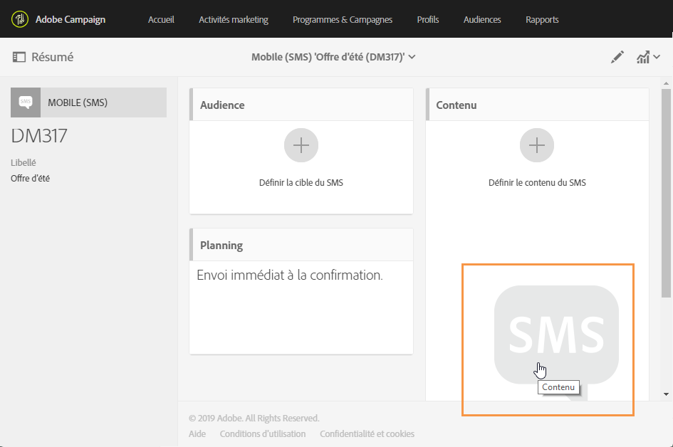
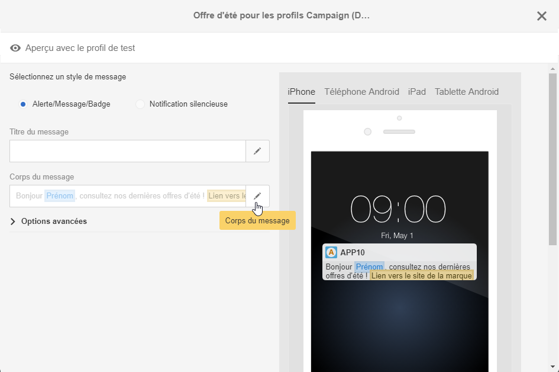

# A propos de la conception du contenu d'un SMS et d'une notification push{#about-sms-and-push-content-design}

Utilisez l'éditeur de contenu pour définir, modifier et personnaliser le contenu des SMS et des notifications push dans Adobe Campaign.

Cette section décrit les spécificités de l'éditeur de contenu de SMS et de notification push, notamment celles de l'[interface de l'éditeur](../../designing/using/sms-and-push-content-editor-interface.md).

Les actions qui sont communes à une ou plusieurs activités marketing sont présentées dans les sections suivantes :

* Pour plus d'informations sur la personnalisation du contenu d'un SMS ou d'une notification push, voir les sections [Insertion d'un champ de personnalisation](../../designing/using/inserting-a-personalization-field.md) et [Ajouter un bloc de contenu](../../designing/using/adding-a-content-block.md).
* Pour plus d'informations sur la définition du texte conditionnel dans un SMS ou une notification push, voir[Définir un texte dynamique](../../designing/using/defining-dynamic-text.md).

Pour accéder à l'éditeur de contenu de SMS et de notification push :

* Cliquez sur le bloc **[!UICONTROL Contenu]dans le tableau de bord d'un SMS.**

   

* Cliquez sur le crayon en regard du champ **[!UICONTROL Corps du message]dans le tableau de bord d'une notification push.**

   

**Rubriques connexes :**

* [Créer un SMS](../../channels/using/creating-an-sms-message.md)
* [Créer et envoyer une notification push](../../channels/using/preparing-and-sending-a-push-notification.md)

