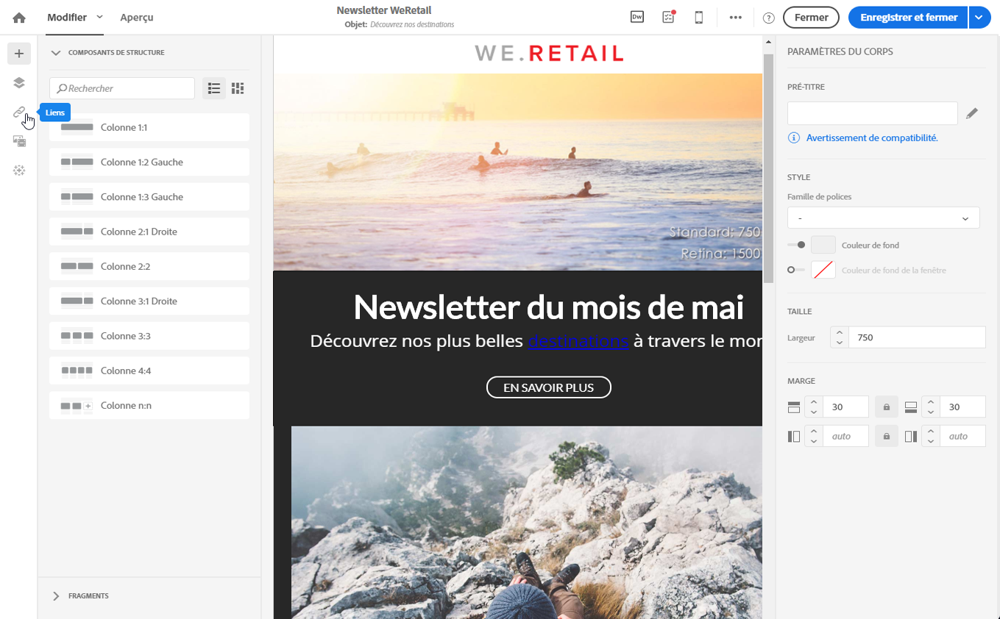
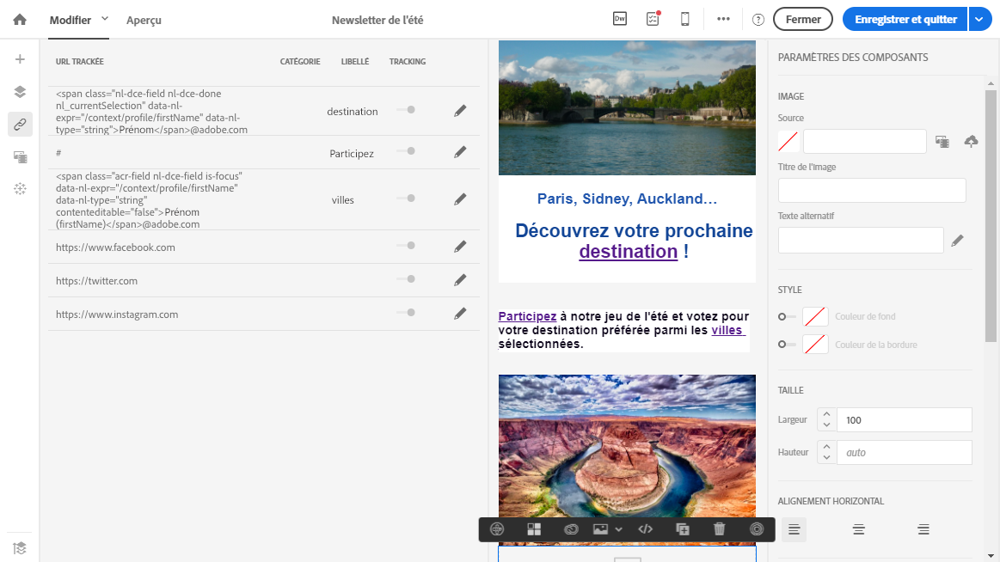
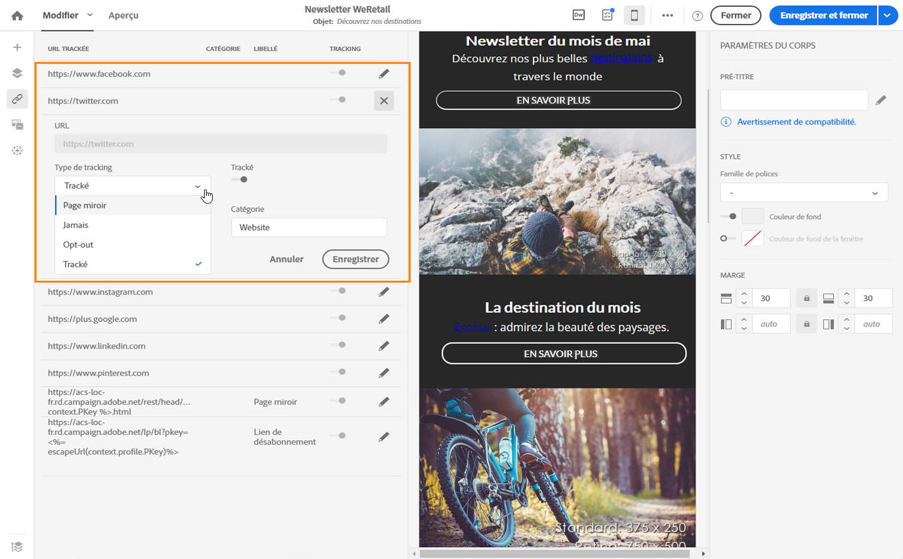
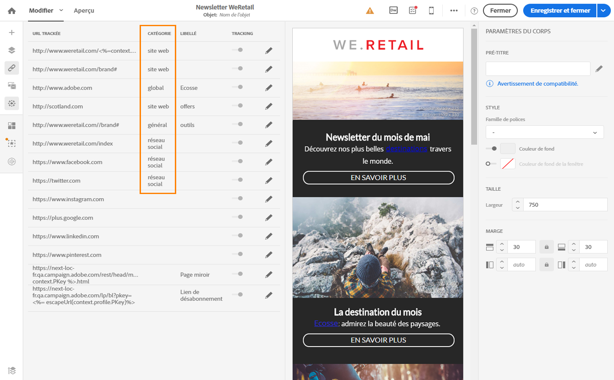
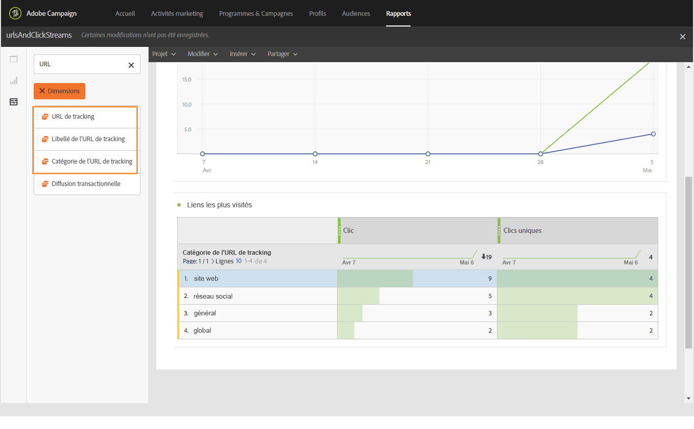

# A propos des URL trackées{#about-tracked-urls}

Adobe Campaign vous permet de tracker le comportement de vos destinataires lorsqu'ils cliquent sur une URL incluse dans un email. Pour plus d'informations sur le tracking, voir [cette section](../../sending/using/tracking-messages.md#about-tracking).

L'icône **[!UICONTROL Liens]de la barre d'action affiche automatiquement la liste des toutes les URL de votre contenu qui seront trackées.**

>[!NOTE]
>
>Par défaut, le tracking est activé. Cette fonctionnalité n'est disponible que pour les emails, même si le tracking a été activé dans Adobe Campaign. Pour plus d'informations sur les paramètres de tracking, voir [cette section](../../administration/using/configuring-email-channel.md#tracking-parameters).

L'URL, la catégorie, le libellé et le type de tracking de chaque lien peuvent être modifiés à partir de cette liste. Pour éditer un lien, cliquez sur l'icône de crayon correspondante.

Pour chaque URL trackée, vous pouvez définir le mode de tracking sur l'une des valeurs suivantes :

* **Tracké** : active le tracking sur cette URL.
* **Page miroir** : traite cette URL comme une URL de page miroir.
* **Jamais** : n'active jamais le tracking de cette URL. Ces informations sont enregistrées : si l'URL apparaît à nouveau dans un message futur, son tracking est automatiquement désactivé.
* **Opt-out** : traite cette URL comme une URL de désabonnement.

Vous pouvez aussi désactiver ou activer le tracking pour chaque URL.

>[!NOTE]
>
>Dans Adobe Campaign, toutes les URL de contenu sont trackées par défaut, à l'exception de l'**URL de la page miroir** et du lien de **désabonnement**.

Vous avez la possibilité de regrouper vos URL en éditant le champ **[!UICONTROL Catégorie]en fonction de l'utilisation des URL dans le message.** Ces catégories peuvent être des rapports affichés, comme dans le cas de [URL et flux de clics](../../reporting/using/urls-and-click-streams.md).

Lorsque vous créez un rapport, dans l'onglet **[!UICONTROL Composants]**, sélectionnez **Dimension]et faites défiler la liste vers le bas afin d'accéder aux composants de tracking.[!UICONTROL ** Par exemple, faites glisser **[!UICONTROL Catégorie de l'URL de tracking]et déposez-la dans l'espace de travail de façon à afficher les résultats en fonction de la catégorie de tracking de chaque URL faisant l'objet d'un clic.**

Pour plus d'informations sur la création de rapports personnalisés, voir [cette section](../../reporting/using/about-dynamic-reports.md).
