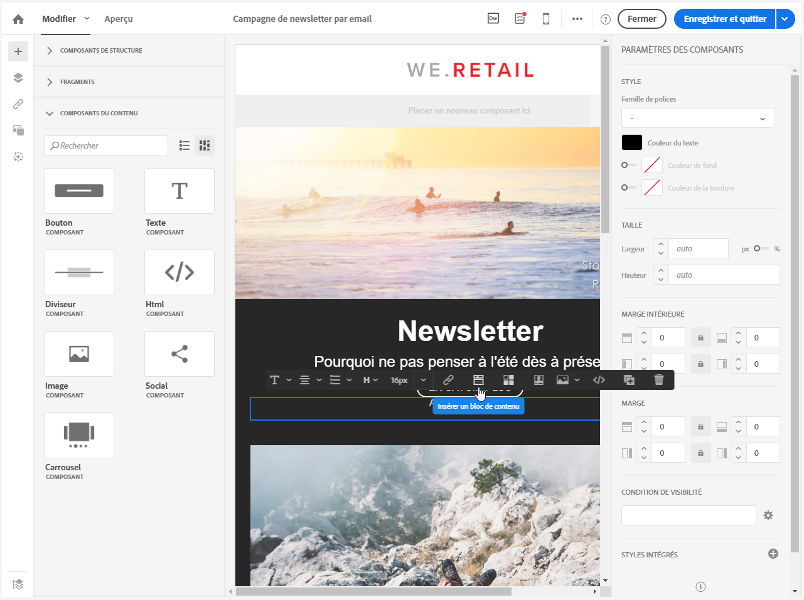
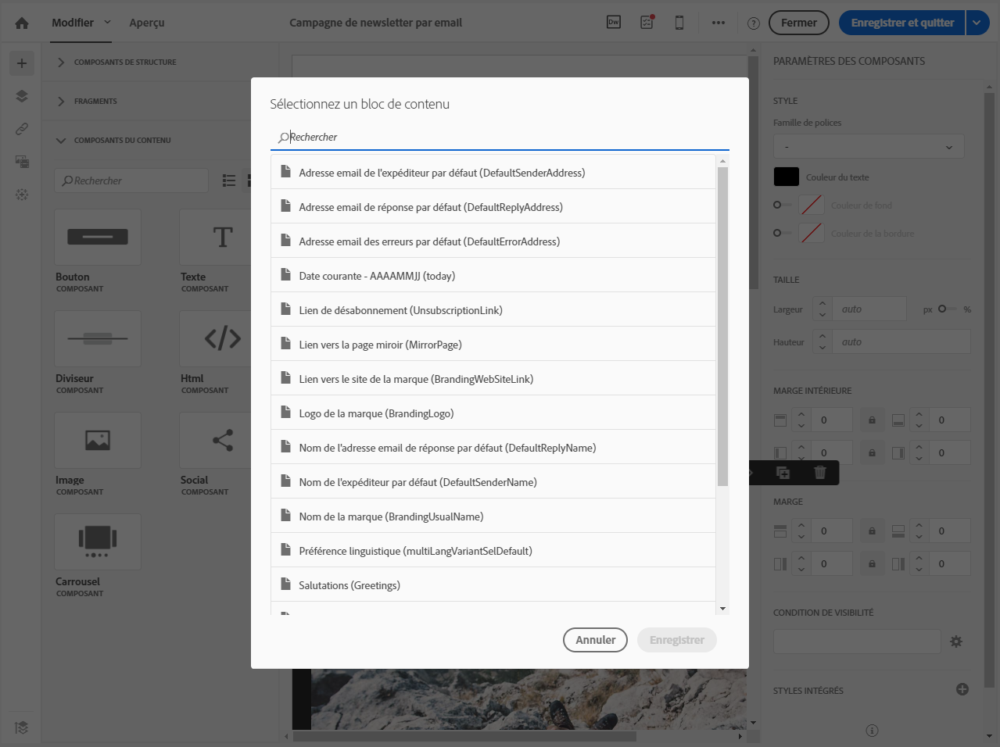
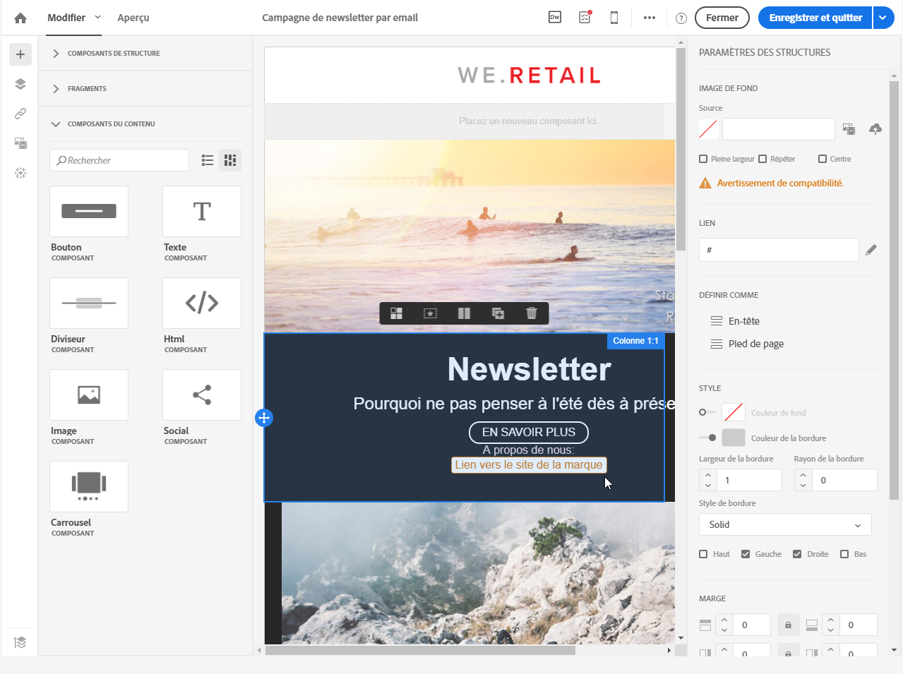
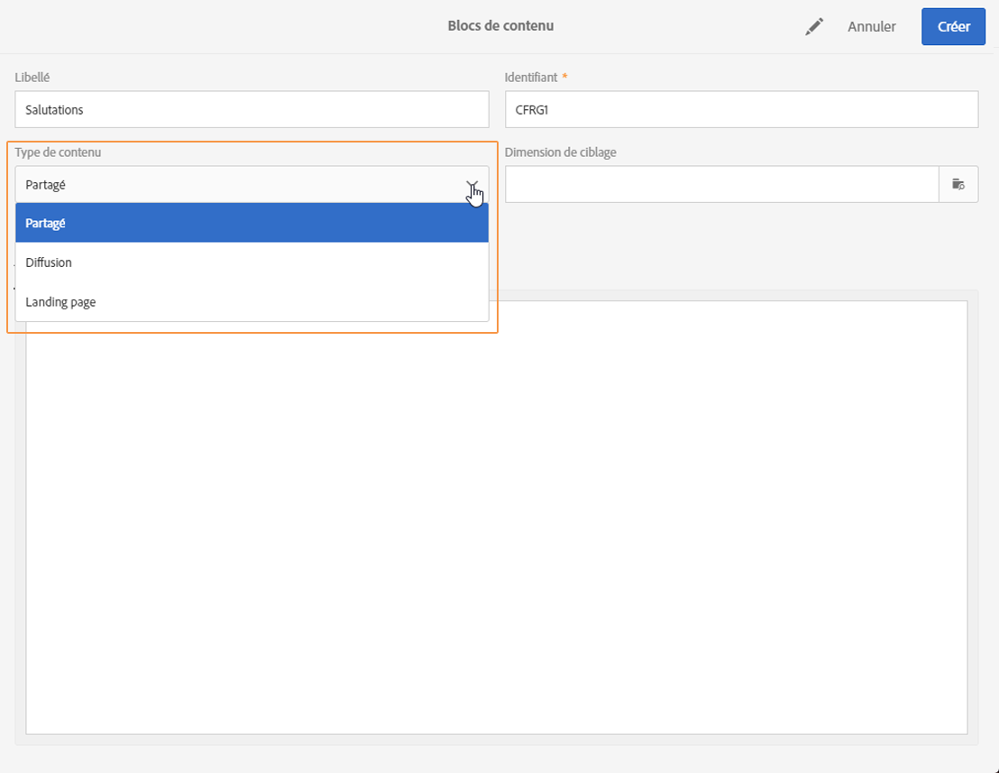
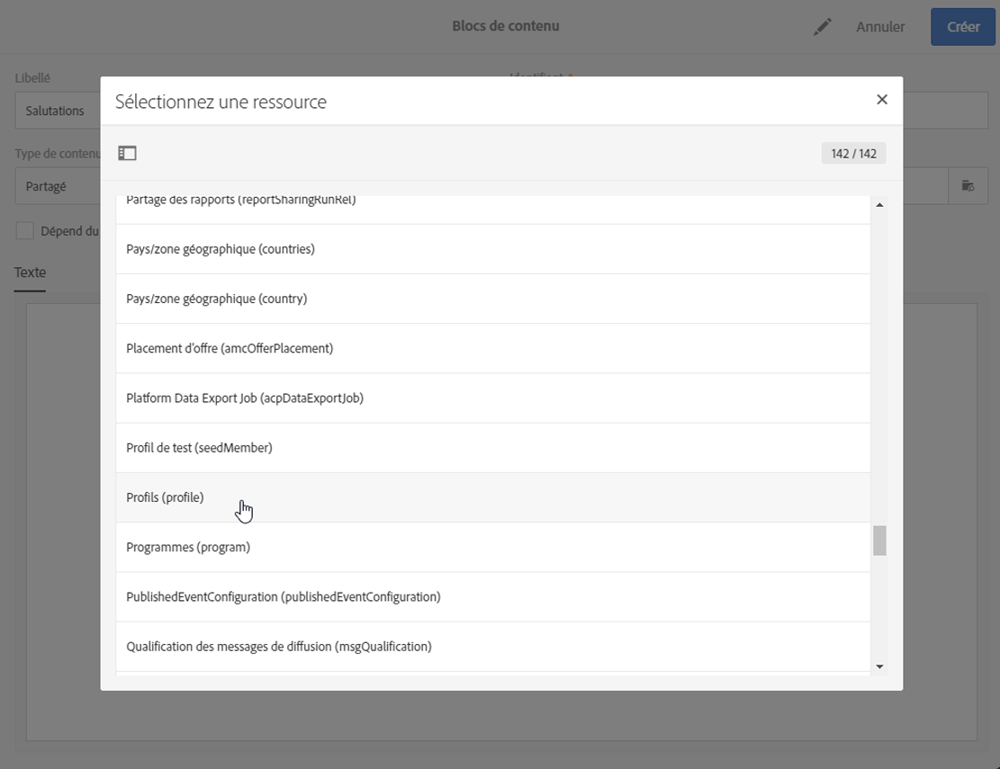
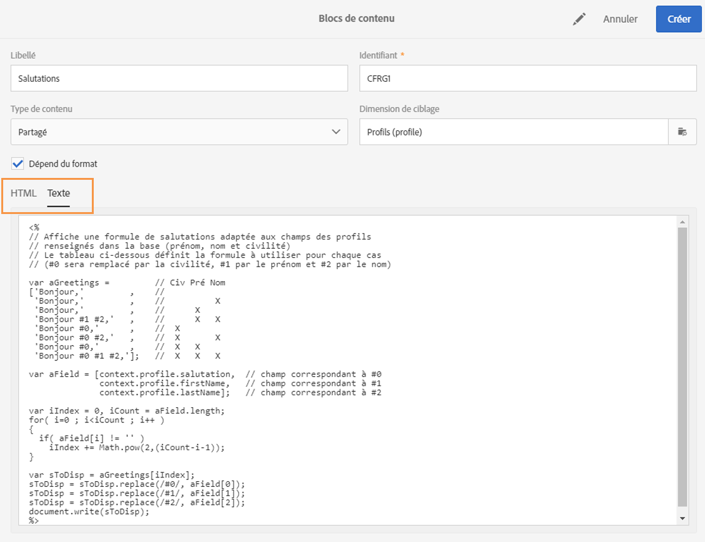

# Ajouter un bloc de contenu{#adding-a-content-block}

Adobe Campaign propose une liste de blocs de contenus pré-paramétrés. Ces blocs de contenu sont dynamiques, personnalisés et possèdent un rendu spécifique. Vous pouvez par exemple ajouter un message de salutations ou un lien vers la page miroir.

>[!NOTE]
>
>Les images ci-après illustrent l'insertion d'un bloc de contenu à l'aide du [Concepteur d'email](../../designing/using/about-email-content-design.md#about-the-email-designer).

Pour ajouter un bloc de contenu :

1. Cliquez dans un bloc de texte. Cliquez ensuite sur l'icône **[!UICONTROL Personnaliser]** dans la barre d'outils contextuelle et sélectionnez **[!UICONTROL Insérer un bloc de contenu]**. Pour plus d'informations sur l'interface du Concepteur d'email, consultez [cette section](../../designing/using/about-email-content-design.md#email-designer-interface).

   

1. Sélectionnez le bloc de contenu que vous souhaitez insérer. Les blocs disponibles varient en fonction du contexte (email ou landing page).

   

1. Cliquez sur **[!UICONTROL Enregistrer]**.

Le nom du bloc de contenu apparaît dans l'éditeur. Celui-ci est surligné en jaune. Il sera automatiquement adapté au profil lors de la génération de la personnalisation.

Les blocs de contenu d'usine sont les suivants :

* **[!UICONTROL URL de base dans les emails (EmailUrlBase)]** : ce bloc de contenu ne peut être utilisé que dans une **diffusion**.
* **[!UICONTROL URL de la page miroir (MirrorPageUrl)]** : ce bloc de contenu ne peut être utilisé que dans une **diffusion**.
* **[!UICONTROL Lien vers la page miroir (MirrorPage)]** : ce bloc de contenu ne peut être utilisé que dans une **diffusion**.
* **[!UICONTROL Salutations (Greetings)]**
* **[!UICONTROL Lien de désabonnement (UnsubscriptionLink)]** : ce bloc de contenu ne peut être utilisé que dans une **diffusion**.
* **[!UICONTROL Liens de partage vers réseaux sociaux (LandingPageViralLinks)]** : ce bloc de contenu ne peut être utilisé que dans une **landing page**.
* **[!UICONTROL Nom de l'expéditeur par défaut (DefaultSenderName)]** : ce bloc de contenu ne peut être utilisé que dans une **diffusion**.
* **[!UICONTROL Nom de l'adresse email de réponse par défaut (DefaultReplyName)]** : ce bloc de contenu ne peut être utilisé que dans une **diffusion**.
* **[!UICONTROL Adresse email de l'expéditeur par défaut (DefaultSenderAddress)]** : ce bloc de contenu ne peut être utilisé que dans une **diffusion**.
* **[!UICONTROL Adresse email des erreurs par défaut (DefaultErrorAddress)]** : ce bloc de contenu ne peut être utilisé que dans une **diffusion**.
* **[!UICONTROL Adresse email de réponse par défaut (DefaultReplyAddress)]** : ce bloc de contenu ne peut être utilisé que dans une **diffusion**.
* **[!UICONTROL Nom de la marque (BrandingUsualName)]**
* **[!UICONTROL Lien vers le site de la marque (BrandingWebSiteLink)]**
* **[!UICONTROL Logo de la marque (BrandingLogo)]**
* **[!UICONTROL Style de notification (notificationStyle)]**

## Créer des blocs de contenu personnalisés {#creating-custom-content-blocks}

Vous pouvez définir de nouveaux blocs de contenu qui pourront être insérés dans un message ou une landing page.

Pour créer un bloc de contenu, respectez les étapes suivantes :

1. Cliquez sur **[!UICONTROL Ressources &gt; Blocs de contenu]** depuis le menu avancé pour accéder à la liste des blocs de contenu.
1. Cliquez sur le bouton **[!UICONTROL Créer]** ou dupliquez un bloc de contenu déjà existant.

   

1. Saisissez un libellé.
1. Choisissez le **[!UICONTROL Type de contenu du bloc]**. Trois options sont disponibles :

   * **[!UICONTROL Partagé]** : le bloc de contenu peut être utilisé dans une diffusion ou une landing page.
   * **[!UICONTROL Diffusion]** : le bloc de contenu ne peut être utilisé que dans une diffusion.
   * **[!UICONTROL Landing page]** : le bloc de contenu ne peut être utilisé que dans une landing page.
   

1. Vous pouvez sélectionner une **[!UICONTROL Dimension de ciblage]**. Voir à ce propos la section [A propos de la dimension de ciblage](../../designing/using/adding-a-content-block.md#about-targeting-dimension).

   

1. Sélectionnez éventuellement l'option **[!UICONTROL Dépend du format]** pour définir deux blocs distincts : un pour les emails au format HTML et un autre pour les emails au format texte. Deux onglets seront alors affichés dans la section inférieure de cet éditeur (HTML et Texte) pour définir les contenus correspondants.

   

1. Saisissez le contenu du ou des blocs de contenu, et cliquez sur le bouton **[!UICONTROL Créer]**.

Votre bloc de contenu est désormais utilisable dans l'éditeur de contenu d'un message ou d'une landing page.

>[!CAUTION]
>
>Lorsque vous éditez le contenu d'un bloc, vérifiez qu'aucun espace blanc ne se trouve entre le début et la fin de vos instructions *if*. Dans le code HTML, les espaces blancs s'affichent à l'écran ; ils auront donc un impact sur la présentation de votre contenu.

## A propos de la dimension de ciblage   {#about-targeting-dimension}

La dimension de ciblage permet de définir dans quel type de message vous pouvez utiliser le bloc de contenu. Cela permet d'éviter d'utiliser des blocs inadéquats dans un message, ce qui peut entraîner des erreurs.

En effet, lors de l'édition d'un message, vous ne pouvez sélectionner que des blocs de contenu avec une dimension de ciblage compatible avec celle du message.

Par exemple, la dimension de ciblage du bloc **[!UICONTROL Lien de désabonnement]** est **[!UICONTROL Profils]**, car elle contient des champs de personnalisation spécifiques à la ressource **[!UICONTROL Profils]**. Par conséquent, vous ne pouvez pas utiliser de bloc **[!UICONTROL Lien de désabonnement]** dans un [message transactionnel basé sur un événement](../../channels/using/event-transactional-messages.md), car la dimension de ciblage de ce type de message est **[!UICONTROL Evénements temps réel]**. Vous pouvez toutefois utiliser un bloc **Lien de désabonnement** dans un [message transactionnel basé sur un profil](../../channels/using/profile-transactional-messages.md), car la dimension de ciblage de ce type de message est **Profils**. Enfin, le bloc **[!UICONTROL Lien vers la page miroir]** ne comporte pas de dimension de ciblage. Vous pouvez donc l'utiliser dans n'importe quel message.

Si vous laissez ce champ vide, le bloc de contenu sera compatible avec tous les messages, quelle que soit la dimension de ciblage. Si vous définissez une dimension de ciblage, ce bloc ne sera compatible qu'avec les messages ayant la même dimension de ciblage.

Voir à ce sujet [Dimensions de ciblage et ressources](../../automating/using/query.md#targeting-dimensions-and-resources).
