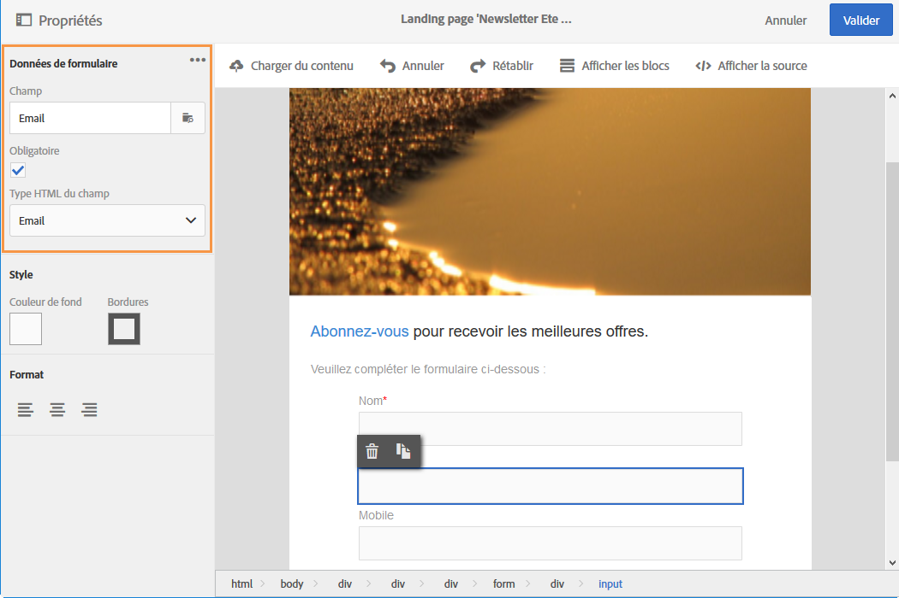

# Modifier les propriétés des données d'un formulaire pour une landing page{#changing-a-landing-page-form-data-properties}

Vous pouvez associer des champs de la base à des blocs de type zone de saisie, bouton radio ou case à cocher. Pour cela, sélectionnez le bloc et renseignez la partie **[!UICONTROL Données du formulaire]** dans la palette.

* La zone de sélection **Champ** permet de sélectionner un champ de la base de données à associer avec le champ du formulaire.
* L'option **Obligatoire** permet de n'autoriser la validation de la page que si l'utilisateur a renseigné le champ. Si un champ obligatoire n'est pas renseigné, un message d'erreur sera affiché.

