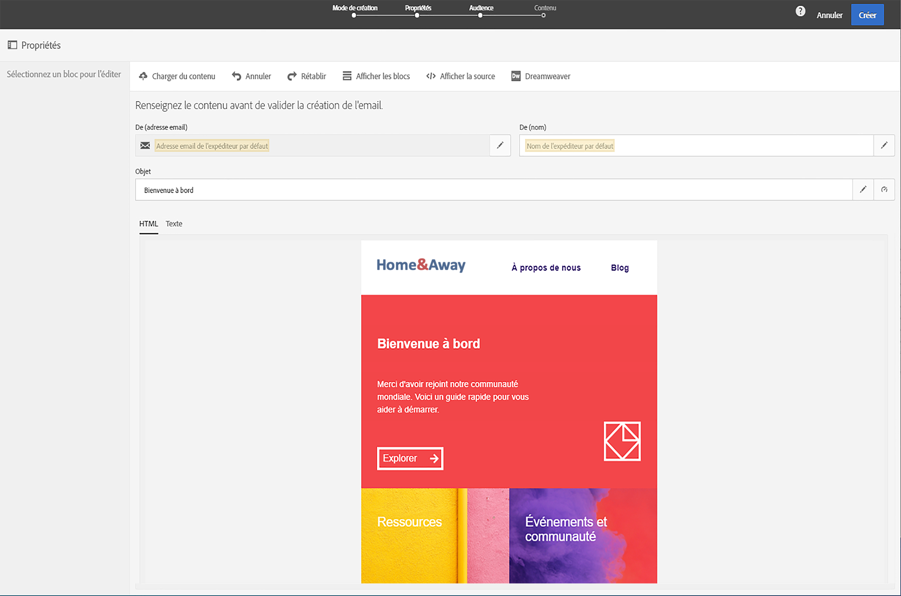
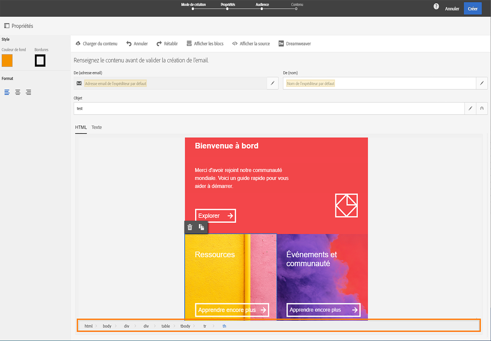
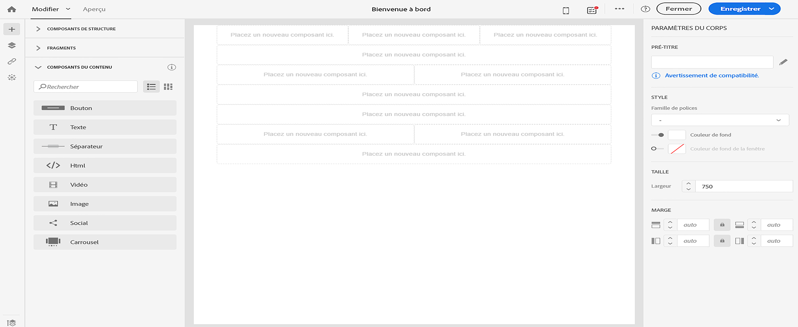
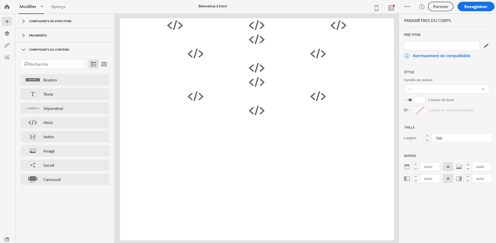
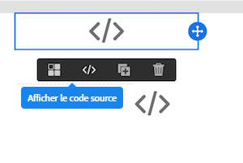
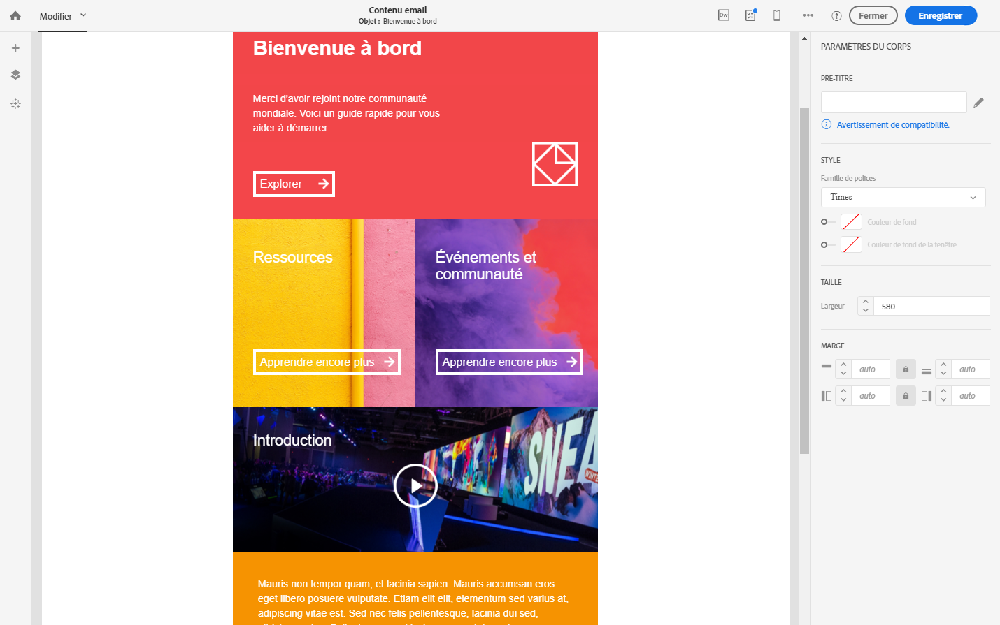

# Conversion du contenu des emails de l’ancien éditeur {#converting-an-html-content}

Ouvrez le Concepteur d’email et créez des modèles et des fragments réutilisables à partir du code HTML de l’email créé dans l’ancien éditeur.

Ce cas pratique permet de créer un modèle de Concepteur d’email à l’aide d’un email HTML et de le diviser en différents composants HTML dans le Concepteur d’email.

>[!NOTE]
>
>De la même manière que le mode de compatibilité, un composant HTML est éditable avec des options limitées : vous pouvez uniquement effectuer l’édition locale.

>[!IMPORTANT]
>
>Cette section est destinée aux utilisateurs avancés qui sont familiers avec le code HTML.

## Préparer le contenu de vos emails

1. Sélectionnez un email HTML.
1. Identifiez les sections pour diviser l’email HTML en plusieurs blocs.
1. Découpez les différents blocs de votre code HTML.

## Créer votre structure d’email

1. Ouvrez le **[!UICONTROL Concepteur d’email]** pour créer un contenu d’email vide.
1. Définissez les attributs au niveau du corps : les couleurs de fond, la largeur, etc. Voir à ce propos la section [Modifier les styles d’un email](../../designing/using/styles.md).
1. Ajoutez autant de composants de structure que vous avez de sections. Voir à ce propos la section [Editer la structure de l&#39;email](../../designing/using/designing-from-scratch.md#defining-the-email-structure).

## Ajouter du contenu HTML

1. Ajoutez un composant HTML à chaque composant de structure. Voir à ce propos la section [Ajouter des fragments et des composants de contenu](../../designing/using/designing-from-scratch.md#defining-the-email-structure).
1. Copiez votre code HTML et collez-le dans chaque composant.

## Gérer le style de votre email {#manage-the-style-of-your-email}

1. Passez en **[!UICONTROL vue Mobile]**. Voir à ce propos [cette section](../../designing/using/plain-text-html-modes.md#switching-to-mobile-view).

1. Pour résoudre cela, passez en mode de code source, copiez votre section de style et collez-la dans une nouvelle section de style. Par exemple :

   ```
   <style type="text/css">
   a {text-decoration:none;}
   body {min-width:100% !important; margin:0 auto !important; padding:0 !important;}
   img {line-height:100%; text-decoration:none; -ms-interpolation-mode:bicubic;}
   ...
   </style>
   ```

   >[!NOTE]
   >
   >Veillez à ajouter votre style après cette opération dans une autre balise de style personnalisée.
   >
   >Ne modifiez pas le CSS généré par le Concepteur d&#39;email :
   >
   >* `<style data-name="default" type="text/css">(##)</style>`
   >* `<style data-name="supportIOS10" type="text/css">(##)</style>`
   >* `<style data-name="mediaIOS8" type="text/css">(##)</style>`
   >* `<style data-name="media-default-max-width-500px" type="text/css">(##)</style>`
   >* `<style data-name="media-default--webkit-min-device-pixel-ratio-0" type="text/css">(##)</style>`


1. Revenez à la vue mobile pour vérifier que votre contenu s&#39;affiche correctement et enregistrez vos modifications.

## Cas pratique

Essayons de convertir cet email, créé dans l’ancien éditeur, en modèle **[!UICONTROL Concepteur d’email]**.

### Identifier la section de votre email

Nous pouvons identifier 11 sections dans cet email.



Pour identifier l’élément correspondant à la section du code HTML, vous pouvez le sélectionner.



Pour afficher la version HTML de l’email, cliquez sur **[!UICONTROL Afficher la source]**.

### Créer le modèle d’email et sa structure

1. Effectuez un glisser-déposer des **[!UICONTROL composants de structure]** reflétant la disposition de notre email.

1. Répétez cette opération autant de fois que nécessaire. Nous devons créer 11 composants de structure.

   

### Insérer les composants du contenu HTML

1. Insérez un **[!UICONTROL composant HTML]** dans chaque **[!UICONTROL composant de structure]**.

   

1. Pour chaque section, cliquez sur **[!UICONTROL Afficher le code source]**.

   

1. Insérez la section HTML.

1. Cliquez sur **[!UICONTROL Enregistrer]**.

Vous pouvez maintenant vérifier le rendu de votre email.



### Gestion des styles en fonction de la vue mobile

1. Insérez des éléments CSS pour vous assurer que votre email convient à un affichage sur mobile.

1. Passez en mode code source, copiez votre section de style et collez-la dans une nouvelle section de style.

Pour plus d’informations à ce sujet, voir la section [Gérer le style de votre email](#manage-the-style-of-your-email).

Votre ancien email est maintenant disponible dans le Concepteur d’email.