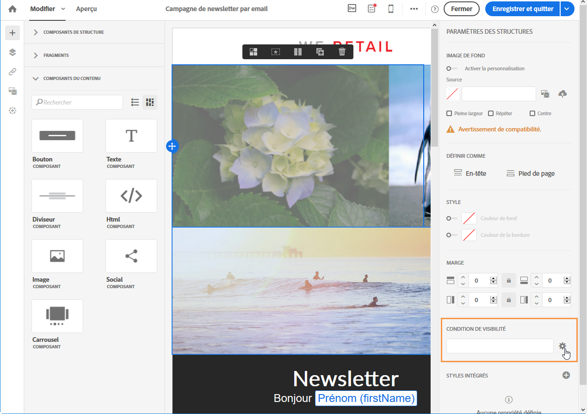

# Définir une condition de visibilité{#defining-a-visibility-condition}

Vous pouvez spécifier une condition de visibilité sur n'importe quel élément. Cet élément ne sera visible que si la condition de visibilité est respectée.

Pour ajouter une condition de visibilité, sélectionnez un bloc et saisissez la condition à remplir dans le champ **[!UICONTROL Condition de visibilité]** de ses paramètres.

Cette option est uniquement proposée pour les éléments suivants : ADDRESS, BLOCKQUOTE, CENTER, DIR, DIV, DL, FIELDSET, FORM, H1, H2, H3, H4, H5, H6, NOSCRIPT, OL, P, PRE, UL, TR, TD.

L'éditeur d'expression est présenté dans la section [Edition avancée d'expressions](../../automating/using/editing-queries.md#about-query-editor).

Ces conditions adoptent la syntaxe des expressions XTK (par ex : **context.profile.email !=''** ou **context.profile.status='0'**). Par défaut, tous les champs sont visibles.

>[!NOTE]
>
>Il n'est pas possible de définir une condition pour un bloc comprenant déjà un sous-élément avec un contenu dynamique ou un bloc faisant déjà partie d'un contenu dynamique. Les blocs dynamiques non visibles, tels que les menus déroulants, ne peuvent être édités.

