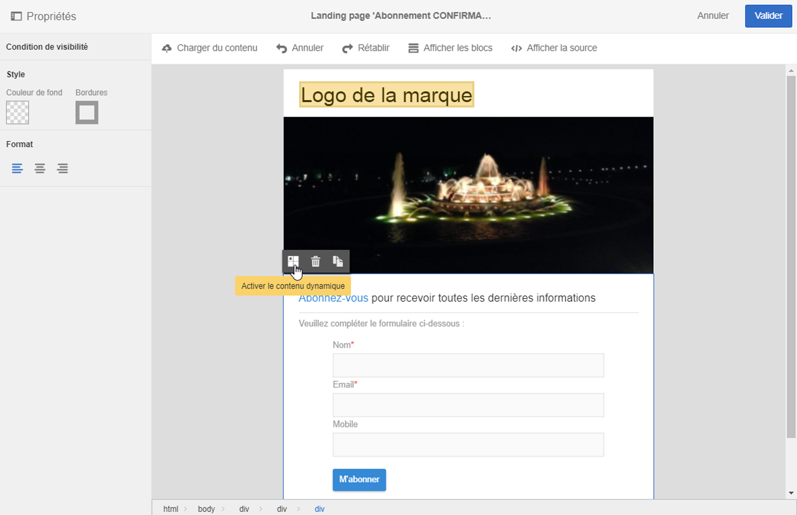
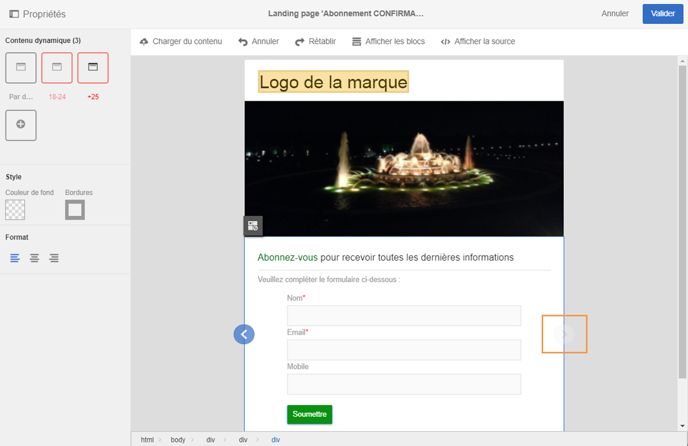
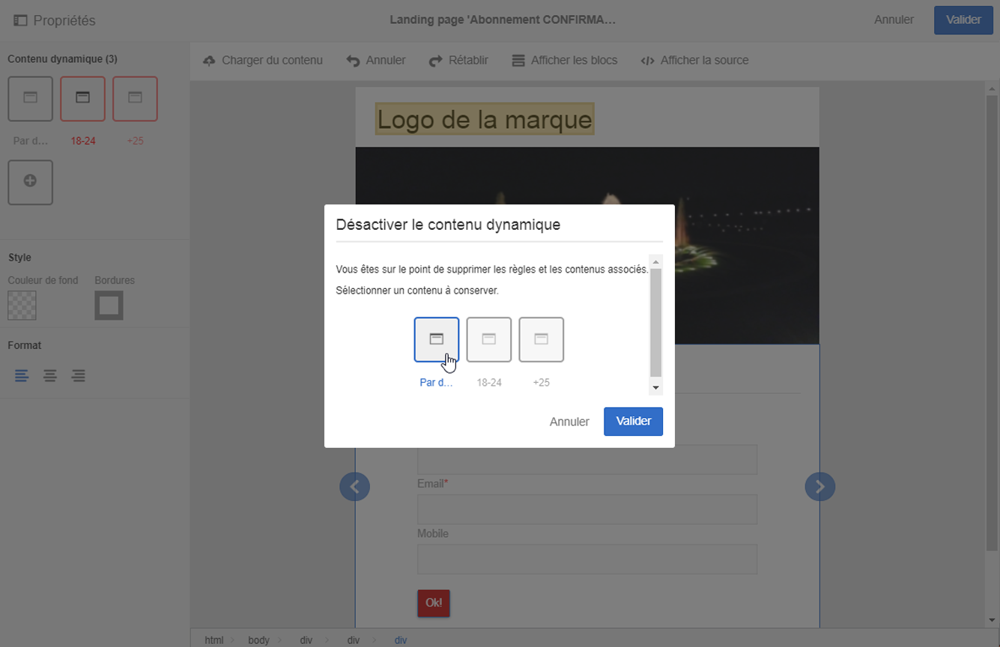
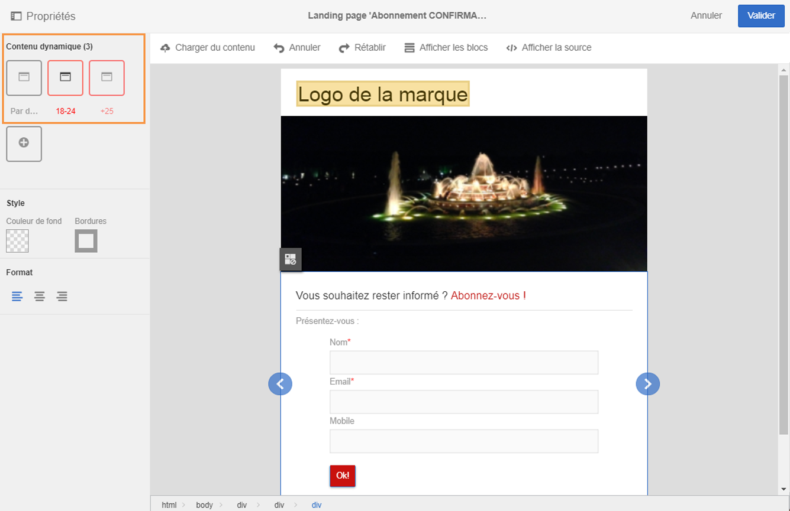

# Définir le contenu dynamique dans une landing page{#defining-dynamic-content-in-a-landing-page}

Pour définir du contenu dynamique dans une landing page, sélectionnez un bloc à l'aide du fil d'Ariane ou en cliquant directement sur un élément. 

Certains blocs, comme les images, ne peuvent pas être sélectionnés directement. Dans ce cas, sélectionnez le bloc parent à l'aide du fil d'Ariane. Vous pourrez alors modifier tous les éléments compris dans cet élément parent, y compris les images. La condition s'appliquera à tous les éléments enfants du bloc parent.

Le fil d'Ariane est présenté dans la section [Gestion des blocs](../../designing/using/managing-landing-page-structure-and-style.md).

Les étapes suivantes pour définir le contenu dynamique dans une landing page sont similaires à celles que vous devez suivre pour un email. Reportez-vous à [cette section](../../designing/using/defining-dynamic-content-in-an-email.md).

>[!NOTE]
>
>Les éléments de variante encadrés en rouge sont ceux pour lesquels une expression n'a pas encore été définie.

## Prévisualiser le contenu dynamique dans une landing page {#previewing-dynamic-content-in-a-landing-page}

Vous pouvez naviguer parmi les différents contenus dynamiques d'un bloc. Pour cela :

1. Sélectionnez le bloc.

   Des flèches apparaissent sur les bords gauche et droit de l'image.

1. Cliquez sur la flèche de droite pour naviguer.

   

   Le rendu des flèches est estompé lorsque vous avez navigué jusqu'au dernier contenu dynamique (ou jusqu'au premier pour la flèche de gauche).

   

1. Pour supprimer toutes les conditions appliquées à un bloc, sélectionnez celui-ci et cliquez de nouveau sur l'icône **[!UICONTROL Désactiver le contenu dynamique].**
1. Sélectionnez le contenu dynamique que vous souhaitez conserver.

   

Dans la palette :

* Les contenus pour lesquels une expression a été renseignée ne sont plus encadrés en rouge ; ils s'affichent en gris.
* Le contenu actuellement sélectionné s'affiche en bleu.

