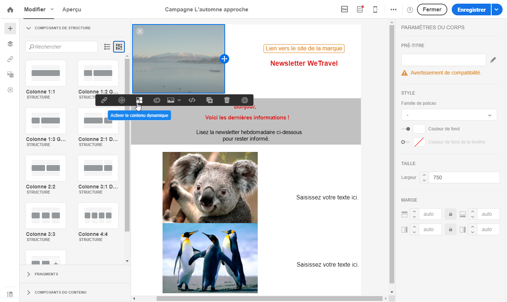
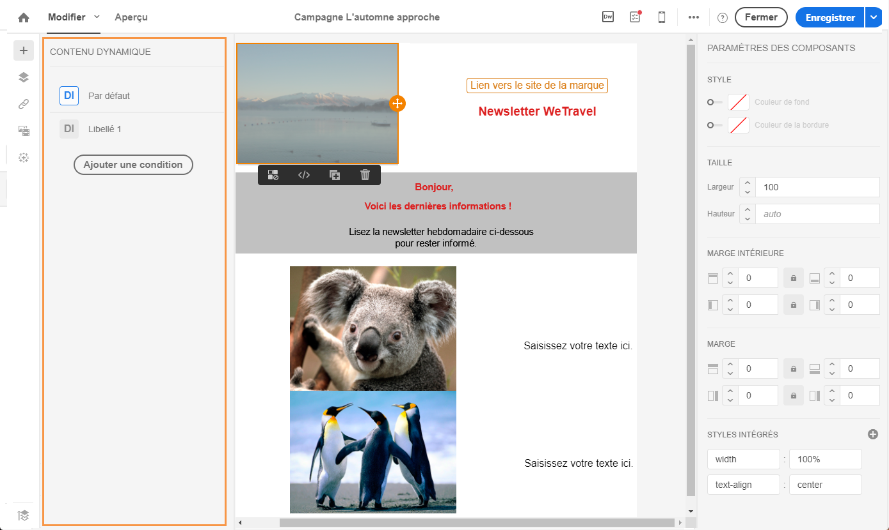
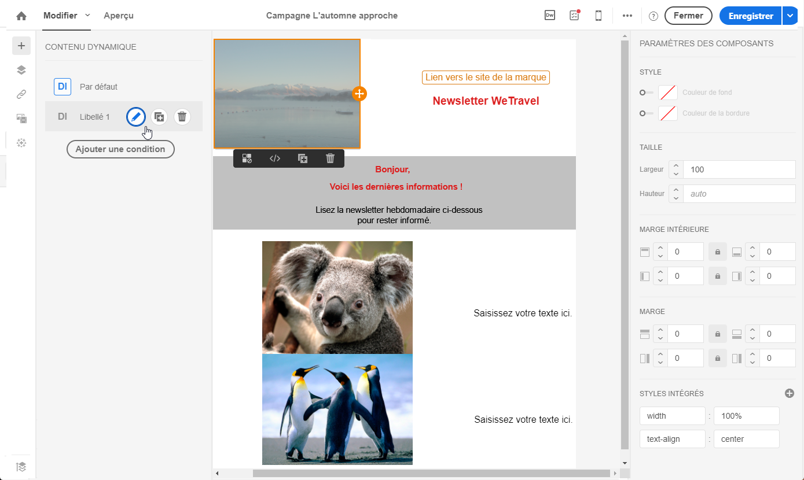
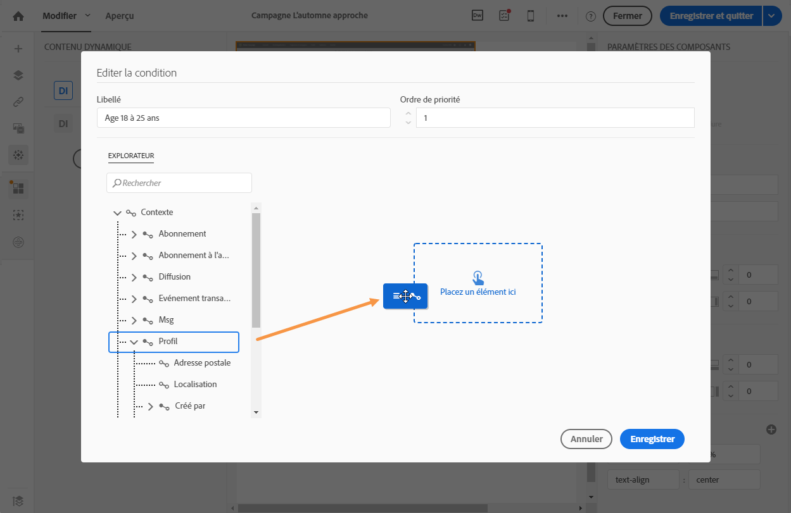
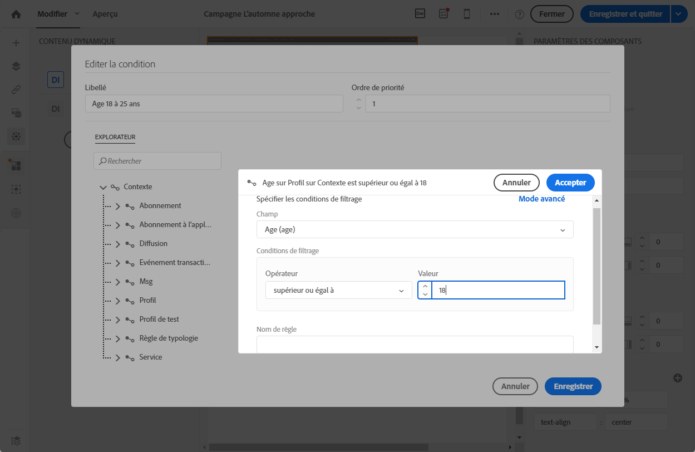
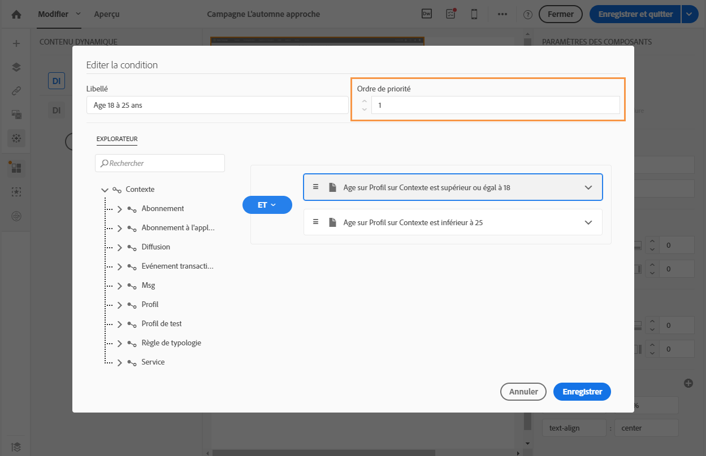
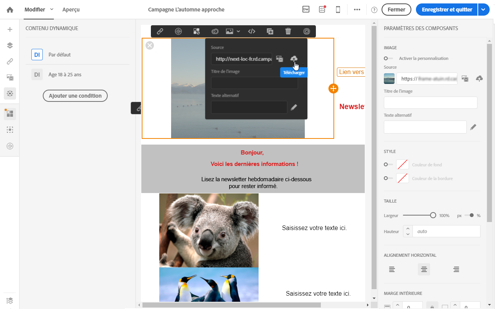
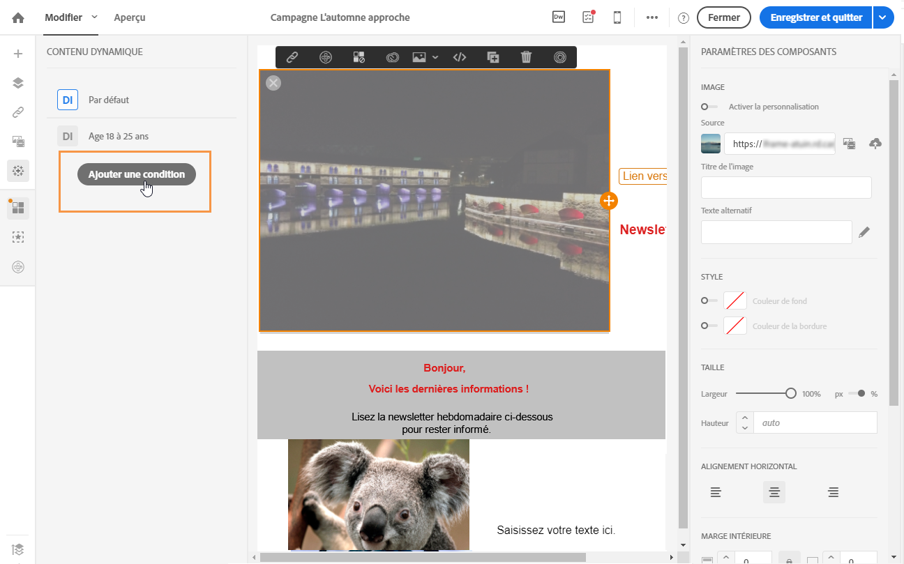
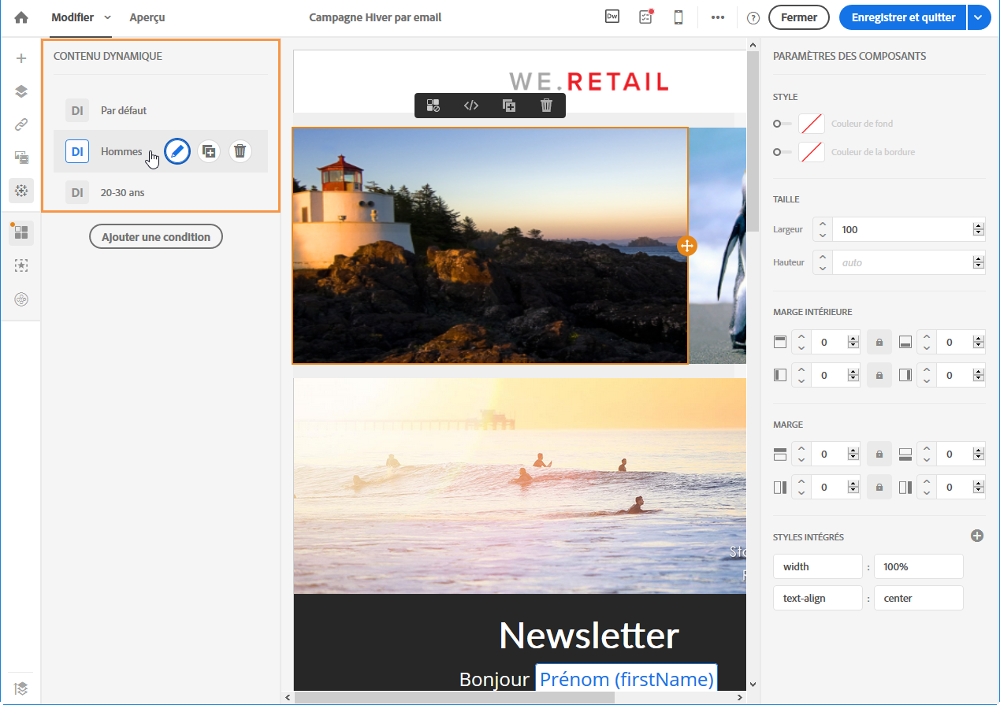
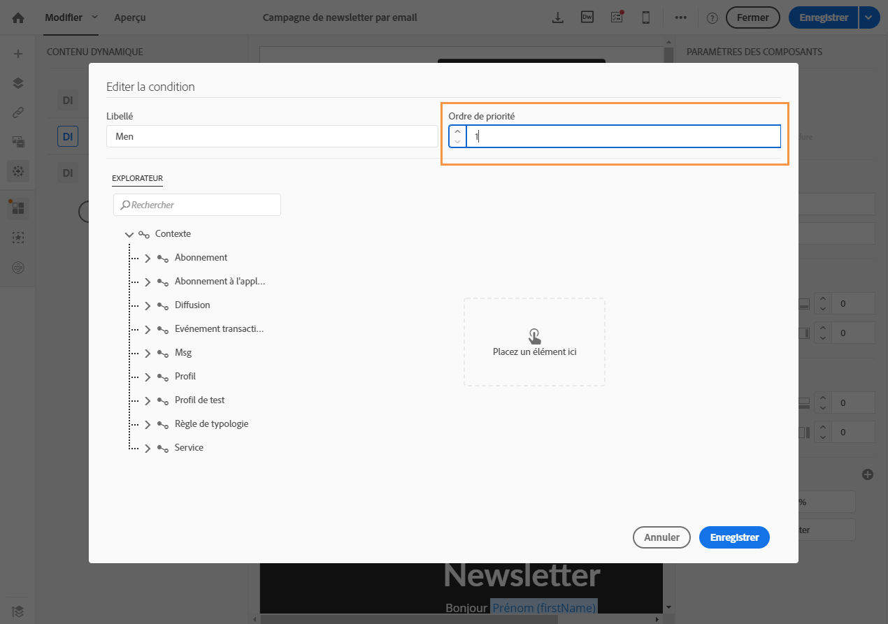

# Définir du contenu dynamique dans un email{#defining-dynamic-content-in-an-email}

Dans un email, vous pouvez définir différents contenus qui s'afficheront de manière dynamique aux destinataires selon les conditions définies au moyen de l'éditeur d'expression. Vous pouvez par exemple, à partir du même email, faire en sorte que chaque profil reçoive un message différent selon sa tranche d'âge.

La définition du contenu dynamique est différente de la [définition des conditions de visibilité](../../designing/using/defining-a-visibility-condition.md).

1. Sélectionnez un fragment, un composant ou un élément. Dans cet exemple, sélectionnez une image.
1. Cliquez sur l'icône **[!UICONTROL Contenu dynamique]dans la barre d'outils contextuelle.**

   

   La section **[!UICONTROL Contenu dynamique]s'affiche dans la palette de gauche.**

   

   Par défaut, cette section contient deux éléments : la variante par défaut et une nouvelle variante.

   >[!NOTE]
   >
   >Le contenu doit être toujours associé à une variante par défaut. Vous ne pouvez pas la supprimer.

1. Cliquez sur le bouton **[!UICONTROL Editer]pour définir les conditions d'affichage de la première variante.**

   

1. Indiquez un libellé et sélectionnez les champs que vous souhaitez définir comme conditions. Par exemple, dans le nœud **[!UICONTROL Général]**, sélectionnez le champ **Age[!UICONTROL .]**

   

1. Définissez les conditions de filtrage. Par exemple, vous souhaitez qu'un contenu différent soit affiché pour les personnes de 18 à 25 ans.

   

1. Une fois que toutes les conditions sont définies, définissez l'ordre de priorité dans lequel la condition sera appliquée et enregistrez vos modifications.

   

   Les contenus s'affichent par ordre de priorité dans la palette, de haut en bas. Pour plus d'informations sur les priorités, consultez [cette section](../../designing/using/defining-dynamic-content-in-an-email.md#order-of-priority).

1. Téléchargez une nouvelle image pour la variante que vous venez de définir.

   

   Les destinataires âgés de 18 à 25 ans verront la nouvelle image.

   

1. Cliquez sur **[!UICONTROL Ajouter une condition]pour ajouter un nouveau contenu et sa règle associée.**

   

   Par exemple, vous ajouter une image différente qui sera affichée pour les personnes de 26 à 35 ans.

1. Procédez de la même manière pour tout autre élément de votre email que vous souhaitez afficher de manière dynamique. Il peut s'agir d'un texte, d'un bouton, d'un fragment, etc. Enregistrez vos modifications.

>[!CAUTION]
>
>Une fois votre message préparé, testez-le à l'aide d'un bon à tirer avant de l'envoyer. Si vous ne le faites pas, certaines erreurs risquent de ne pas être détectées et l'email pourrait ne pas être envoyé.

**Rubriques connexes :**

* [Envoyer un bon à tirer](../../sending/using/managing-test-profiles-and-sending-proofs.md#sending-proofs)
* [Edition avancée d'expressions](../../automating/using/editing-queries.md#about-query-editor)

## Ordre de priorité {#order-of-priority}

Lorsque vous définissez un contenu dynamique dans l'éditeur d'expression, l'ordre de priorité est défini de la manière suivante :

1. Vous définissez deux contenus dynamiques différents avec **deux conditions différentes**, comme par exemple :

   **Condition 1 :** le genre du profil est masculin,

   **Condition 2 :** le profil a entre 20 et 30 ans.

   

   Des profils de votre base de données seront éligibles aux deux conditions mais un seul email avec un seul contenu dynamique peut être envoyé.

1. Vous devez donc définir la priorité des contenus dynamiques. Une condition avec un ordre de priorité **1** (et donc le contenu dynamique correspondant) sera envoyée à un profil même si ce dernier est en adéquation avec une condition dont l'ordre de priorité est **2** ou **3**.

   

Vous ne pouvez définir qu'un ordre de priorité par contenu dynamique.
