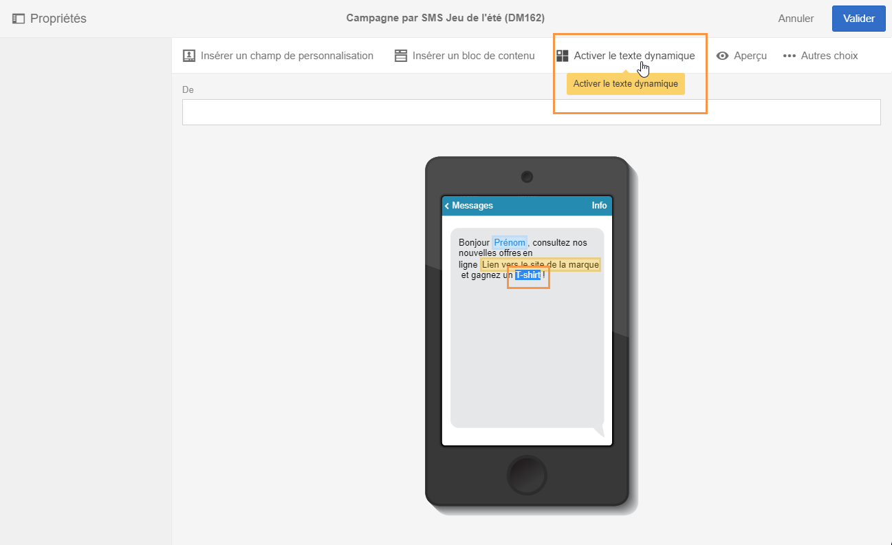
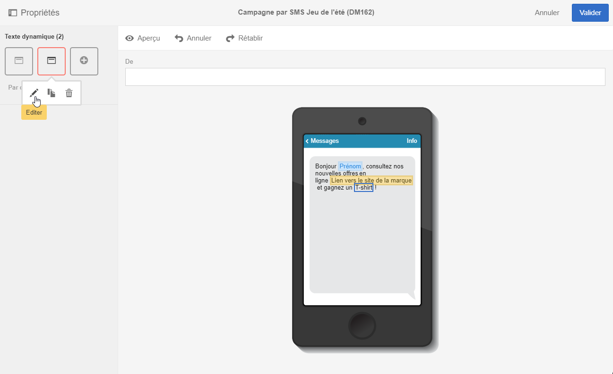
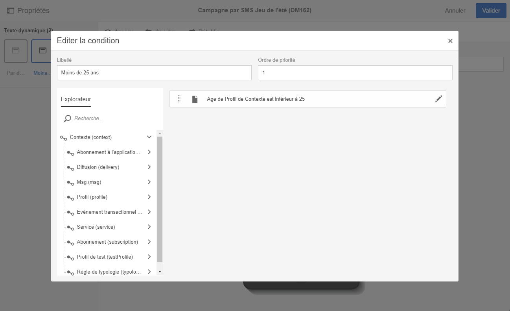

# Définir un texte dynamique{#defining-dynamic-text}

Le texte dynamique est défini de la même façon que le contenu dynamique. Reportez-vous à la section [Définir le contenu dynamique](../../designing/using/defining-dynamic-content-in-an-email.md).

>[!NOTE]
>
>Pour les SMS et les notifications push, vous pouvez uniquement définir le texte dynamique. Vous pouvez définir du contenu et du texte dynamiques dans une landing page. Si vous souhaitez définir du texte dynamique à l'aide du [Concepteur d'email](../../designing/using/about-email-content-design.md#about-the-email-designer), reportez-vous à la section [Définir du contenu dynamique dans un email](../../designing/using/defining-dynamic-content-in-an-email.md).

L'exemple ci-dessous montre comment définir du texte dynamique dans un SMS.

1. Sélectionnez du texte dans le corps de votre message ou landing page.
1. Cliquez sur **[!UICONTROL Activer le texte dynamique]**.

   

   L'option **[!UICONTROL Texte dynamique]apparaît dans la palette.** Son paramétrage est identique au contenu dynamique.

1. Sélectionnez une variante.

   

1. Définissez une condition pour cette variante.

   

Une fois qu'une condition est définie pour au moins une variante, un cadre violet s'affiche autour du texte dynamique.

