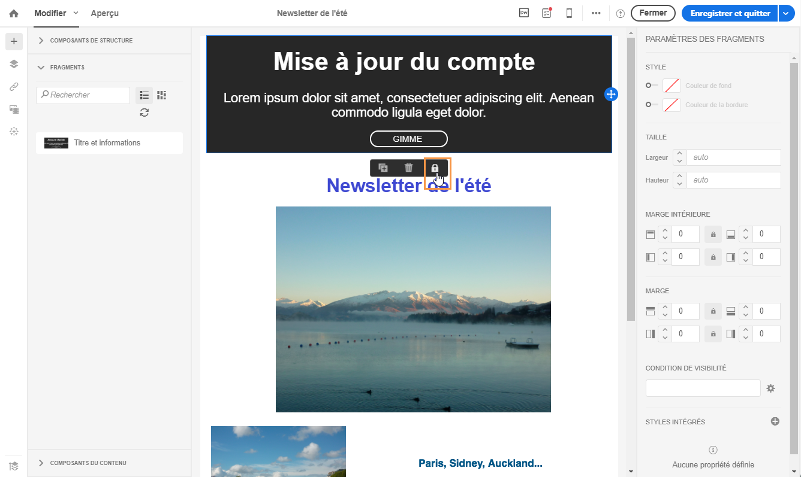
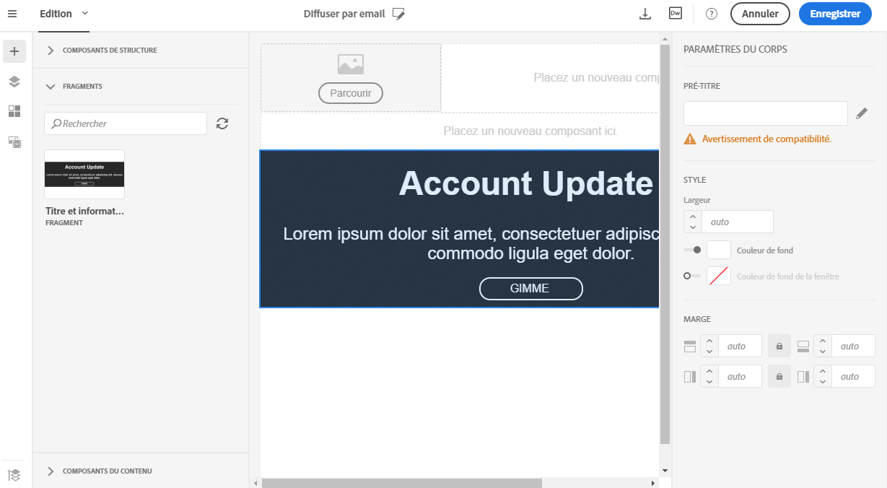
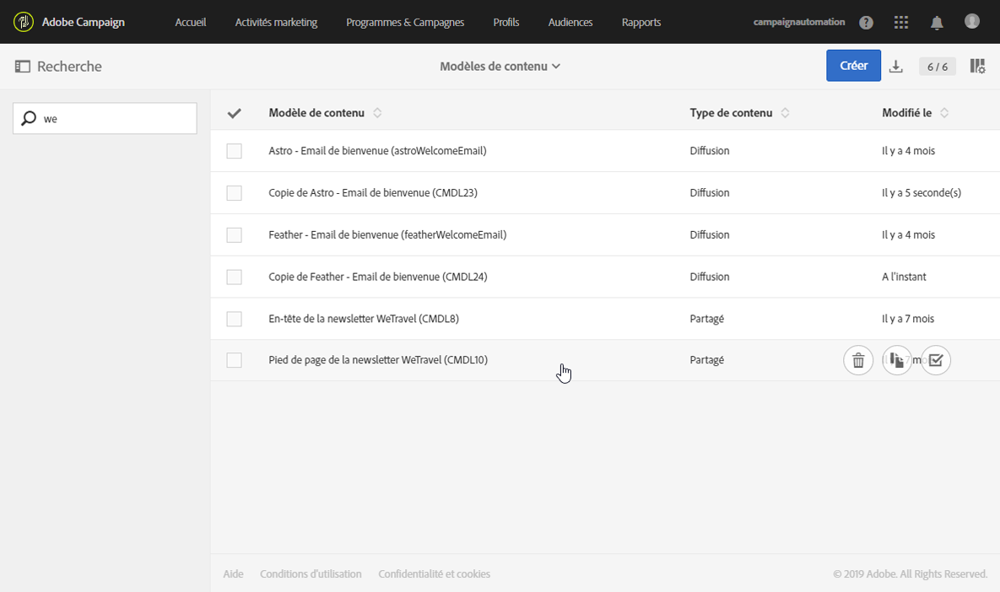

# Définir la structure d'un email{#defining-the-email-structure}

## Editer la structure de l'email {#editing-the-email-structure}

Le Concepteur d'email permet de définir facilement la structure de votre email. En ajoutant et en déplaçant des éléments structurels à l'aide de simples actions de glisser-déposer, vous pouvez concevoir la forme de votre email en quelques secondes.

Pour éditer la structure d'un email :

1. Ouvrez un contenu existant ou créez un contenu d'email.
1. Accédez aux **[!UICONTROL Composants de structure]** en sélectionnant l'icône **+** de gauche.

   

1. Déposez les composants de structure dont vous avez besoin pour former votre email.

   

   Une ligne bleue matérialise la position exacte des composants de structure avant de les déposer. Vous pouvez placer vos composants au-dessus, entre ou sous n'importe quel composant, mais pas à l'intérieur.

   >[!NOTE]
   >
   >Une fois qu'ils ont été placés dans l'email, vous ne pouvez pas déplacer ni supprimer vos composants, à moins qu'un composant de contenu ou un fragment ne soit déjà placé à l'intérieur.

1. Plusieurs composants de structure constitués d'une ou de plusieurs colonnes sont disponibles.

   Sélectionnez le composant **[!UICONTROL n:n colonne]** pour définir le nombre de colonnes de votre choix (entre 3 et 10). Vous pouvez aussi définir la largeur de chaque colonne en déplaçant les flèches situées au bas de celle-ci.

   

   >[!NOTE]
   >
   >La taille de chaque colonne ne peut pas être inférieure à 10 % de la largeur totale du composant de structure. Vous ne pouvez pas supprimer une colonne qui n'est pas vide.

Lorsque la structure est définie, vous pouvez ajouter des fragments de contenu et des composants à votre email.

## Ajouter des fragments et des composants de contenu  {#adding-fragments-and-content-components}

Avec le Concepteur d'email, après avoir ajouté des composants de structure à votre email, vous pouvez définir leur contenu. Pour cela, vous devez ajouter des éléments à l'intérieur de chaque composant de structure.

Vous pouvez utiliser deux catégories d'éléments de contenu : les **fragments** et les **composants de contenu**.

### A propos des fragments  {#about-fragments}

Un fragment est un composant réutilisable pouvant être référencé dans un ou plusieurs emails.

Pour optimiser les fragments dans le Concepteur d'email :

* Créez vos propres fragments. Voir [Créer un fragment de contenu](../../designing/using/defining-the-email-structure.md#creating-a-content-fragment) et [Enregistrer du contenu en tant que fragment](../../designing/using/defining-the-email-structure.md#saving-content-as-a-fragment).
* Utilisez-les autant de fois que nécessaire dans vos emails. Voir [Insérer des éléments dans un email](../../designing/using/defining-the-email-structure.md#inserting-elements-into-an-email).
* Lorsque vous éditez un fragment, les modifications sont synchronisées : elles sont automatiquement propagées à tous les emails (à condition qu'ils n'aient pas encore été préparés ou envoyés) contenant ce fragment.

Lorsqu'ils sont ajoutés à un email, les fragments sont verrouillés par défaut. Si vous souhaitez modifier un fragment pour un email spécifique, vous pouvez arrêter la synchronisation avec le fragment d'origine en le déverrouillant dans l'email dans lequel il est utilisé. Les modifications ne seront plus synchronisées.

Pour déverrouiller un fragment dans un email, sélectionnez-le et cliquez sur l'icône représentant un verrou dans la barre d'outils contextuelle.

Ce fragment devient alors un composant autonome qui n'est plus lié au fragment d'origine. Il peut ensuite être édité comme n'importe quel autre composant de contenu. Voir [A propos des composants de contenu](../../designing/using/defining-the-email-structure.md#about-content-components).

### A propos des composants de contenu  {#about-content-components}

Les composants de contenu sont des composants bruts et vides que vous pouvez éditer une fois qu'ils ont été placés dans un email.

Vous pouvez ajouter autant de composants de contenu que vous le souhaitez dans un composant de structure. Vous pouvez également les déplacer à l'intérieur du composant de structure ou vers un autre composant de structure.

Voici la liste des composants disponibles dans le Concepteur d'email :

* **[!UICONTROL Bouton]**

   Si vous avez besoin d'utiliser plusieurs boutons, plutôt que d'éditer chaque bouton à partir de zéro, vous pouvez dupliquer le composant **[!UICONTROL Bouton]** à l'aide de la barre d'outils contextuelle.

   Vous pouvez aussi enregistrer des boutons dans des fragments réutilisables. Voir à ce propos [Créer un fragment de contenu](../../designing/using/defining-the-email-structure.md#creating-a-content-fragment) et [Enregistrer du contenu en tant que fragment](../../designing/using/defining-the-email-structure.md#saving-content-as-a-fragment).

* **[!UICONTROL Carrousel]**

   Voir à ce propos la section [Utilisation du composant carrousel](../../designing/using/defining-the-email-structure.md#using-the-carousel-component).

* **[!UICONTROL Diviseur]**
* **[!UICONTROL Html]**

   Utilisez ce composant pour copier les différentes parties de votre HTML existant. Vous pouvez ainsi créer des composants HTML modulaires autonomes.

   >[!NOTE]
   >
   >Un composant HTML autonome est éditable avec des options limitées. Si tous les styles ne sont pas intégrés, veillez à ajouter le CSS adéquat dans la      section **head** du code HTML, sinon l'email ne sera pas réactif. Utilisez le bouton **[!UICONTROL Aperçu]** afin de tester la réactivité de votre contenu (voir [Prévisualiser des messages](../../sending/using/previewing-messages.md)).

* **[!UICONTROL Image]**
* **[!UICONTROL Social]**
* **[!UICONTROL Texte]**

#### Utilisation du composant carrousel {#using-the-carousel-component}

1. Placez le composant **[!UICONTROL Carrousel]** à l'intérieur d'un composant de structure.
1. Parcourez votre ordinateur pour sélectionner des images.

   

1. Dans le volet **[!UICONTROL Paramètres]**, définissez le nombre de vignettes souhaitées dans le carrousel.
1. Sélectionnez une image de remplacement à partir de votre ordinateur.

   

   Le composant carrousel n'est pas compatible avec tous les programmes de messagerie. Chargez une image de remplacement pour l'afficher lorsque le carrousel n'est pas pris en charge dans un email.

   >[!NOTE]
   >
   >Le composant carrousel est compatible avec les plateformes de messagerie suivantes : Apple Mail 7, Apple Mail 8, Outlook 2011 pour Mac, Outlook 2016 pour Mac, Mozilla Thunderbird, iPad et iPad mini iOS, iPhone iOS, Android, AOL (Chrome, Firefox et Safari).

1. Sélectionnez **[!UICONTROL Vue de la version de secours]** pour afficher l'image de remplacement dans le Concepteur d'email.

### Insérer des éléments dans un email {#inserting-elements-into-an-email}

Pour définir le contenu de votre email, vous pouvez ajouter des éléments de contenu aux composants de structure que vous avez préalablement placés. Voir [Editer la structure de l'email](../../designing/using/defining-the-email-structure.md#editing-the-email-structure).

1. Accédez aux éléments de contenu en sélectionnant l'icône **+** sur la gauche. Sélectionnez [Fragments](../../designing/using/defining-the-email-structure.md#about-fragments) ou [Composants du contenu](../../designing/using/defining-the-email-structure.md#about-content-components).
1. Si vous connaissez déjà tout ou partie du libellé du fragment que vous souhaitez ajouter, vous pouvez le rechercher.

   

1. Déposez un composant de contenu ou un fragment depuis la palette dans un composant de structure de l'email.

   

   Une fois un élément ajouté à l'email, il peut être déplacé à l'intérieur du composant de structure ou vers un autre composant de structure de l'email.

   

1. Editez l'élément pour répondre aux besoins de cet email. Vous pouvez ajouter du texte, des liens, des images, etc.

   >[!NOTE]
   >
   >Les fragments sont verrouillés par défaut lorsqu'ils sont ajoutés à un email. Vous pouvez arrêter la synchronisation avec le fragment d'origine si vous souhaitez modifier le fragment d'un email spécifique. Vous pouvez aussi directement apporter votre modification dans le fragment. Voir [A propos des fragments](../../designing/using/defining-the-email-structure.md#about-fragments).

1. Répétez cette procédure pour tous les éléments que vous devez ajouter à votre email.
1. Enregistrez votre email.

Maintenant que la structure de l'email est remplie, vous pouvez modifier le style de chaque élément de contenu. Voir [Editer un élément](../../designing/using/editing-email-styles.md#editing-an-element).

>[!NOTE]
>
>Si un fragment est modifié, les changements sont automatiquement propagés dans les emails dans lequel il est utilisé. Voir à ce propos la section [A propos des fragments](../../designing/using/defining-the-email-structure.md#about-fragments).

### Créer un fragment de contenu  {#creating-a-content-fragment}

Vous pouvez créer vos propres fragments de contenu pour les utiliser selon vos besoins dans un ou plusieurs emails.

1. Accédez à **[!UICONTROL Ressources]** &gt; **[!UICONTROL Modèles et fragments de contenu]**, puis cliquez sur **[!UICONTROL Créer]**.
1. Cliquez sur le libellé d'email de façon à accéder à l'onglet **[!UICONTROL Propriétés]** du Concepteur d'email.
1. Spécifiez une étiquette reconnaissable et sélectionnez les paramètres suivants pour trouver le fragment lors de l'édition du contenu de courriel :

   * Les fragments étant uniquement compatibles avec les emails, sélectionnez **[!UICONTROL Diffusion]** dans la liste déroulante **[!UICONTROL Type de contenu]**.
   * Select **[!UICONTROL Fragment]** from the **[!UICONTROL HTML type]** drop-down list to be able to use this content as a fragment.
   

1. Si nécessaire, vous pouvez définir une image qui sera utilisée comme miniature du fragment. Sélectionnez-la dans l'onglet **[!UICONTROL Miniature]** des propriétés de modèle.

   

   Cette miniature apparaîtra en regard du libellé du fragment lorsque vous éditez un email.

1. Fermez l'onglet **[!UICONTROL Propriétés]** pour retourner à l'espace de travail principal.
1. Ajoutez des composants de structure et des composants de contenu que vous pouvez personnaliser au besoin.

   >[!NOTE]
   >
   >Les fragments ne peuvent pas inclure des champs de personnalisation, un contenu dynamique ou un autre fragment.
   >La vue [mobile n](../../designing/using/about-email-content-design.md#switching-to-mobile-view) 'est pas disponible en fragments.

1. Une fois le fragment édité, enregistrez-le.

Ce fragment peut maintenant être utilisé dans n'importe quel email construit avec le concepteur email. Il apparaît sous la section **[!UICONTROL Fragments]** de la palette.

>[!NOTE]
>
>Vous ne pouvez pas insérer de champs de personnalisation à l'intérieur d'un fragment à moins qu'il ne soit utilisé dans un email et déverrouillé. Voir [A propos des fragments](../../designing/using/defining-the-email-structure.md#about-fragments).

### Enregistrer du contenu en tant que fragment  {#saving-content-as-a-fragment}

Lors de l'édition d'un email avec le concepteur email, vous pouvez enregistrer directement une partie de ce courriel comme un fragment.

* Vous ne pouvez pas sauvegarder comme fragmenter une structure contenant des champs de personnalisation, un contenu dynamique ou un autre fragment.
* Vous ne pouvez sélectionner que des structures adjacentes.
<!--* You cannot select an empty structure.-->

1. Lors de l'édition d'un courriel dans le concepteur de courriels, sélectionnez **[!UICONTROL Enregistrer sous forme de fragment]** dans la barre d'outils principale.

   

1. À partir de l'espace de travail, sélectionnez les structures qui composent le fragment.

   

   >[!NOTE]
   >
   >Assurez-vous de sélectionner des structures qui sont voisines les unes des autres et qui ne comprennent pas les champs de personnalisation, le contenu dynamique ou un autre fragment.
   <!--You cannot select an empty structure.-->

1. Cliquez sur **[!UICONTROL Créer]**.

1. Ajoutez une étiquette et une description si nécessaire, puis cliquez **[!UICONTROL sur Enregistrer]**.

   

1. Pour trouver le fragment que vous venez de créer, allez aux **[!UICONTROL Ressources]** &gt; **[!UICONTROL Modèles et fragments de contenu]**.

   

1. Pour utiliser le nouveau fragment, ouvrez tout contenu email et sélectionnez-le à partir de la liste des fragments.

>[!NOTE]
>La vue [mobile n](../../designing/using/about-email-content-design.md#switching-to-mobile-view) 'est pas disponible en fragments. Si vous souhaitez modifier une vue mobile, faites-le avant de sauvegarder votre contenu comme un fragment.

<!--You need to copy-paste the HTML corresponding to the section that you want to save into a new fragment.

>[!NOTE]
>
>To do this, you need to be familiar with HTML code.

To save as a fragment some email content that you created, follow the steps below.

1. When editing an email in the Email Designer, select **[!UICONTROL Edit]** > **[!UICONTROL HTML]** to open the HTML version of that email.
1. Select and copy the HTML corresponding to the part that you want to save.
1. Go to **[!UICONTROL Resources]** > **[!UICONTROL Content templates & fragments]** and click **[!UICONTROL Create]**.
1. Click the email label to access the **[!UICONTROL Properties]** tab of the Email Designer and select **[!UICONTROL Fragment]** from the **[!UICONTROL HTML type]** drop-down list.
1. Select **[!UICONTROL Edit]** > **[!UICONTROL HTML]** to open the HTML version of the fragment.
1. Paste the HTML that you copied where appropriate.
1. Switch back to the **[!UICONTROL Edit]** view to check the result and save the new fragment.-->

