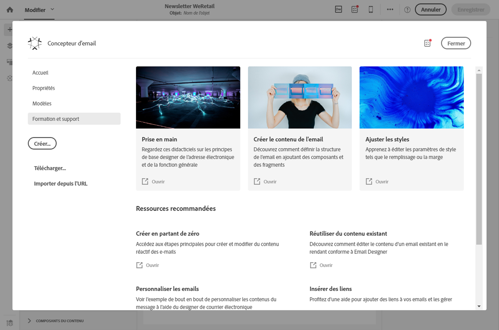
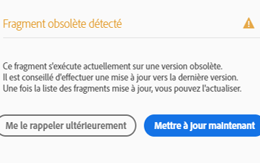

# Concepteur d'email de Campaign{#designing-content-in-adobe-campaign}

Une fois que vous avez créé un email dans Adobe Campaign, vous devez en définir le contenu.

Le concepteur de courriers électroniques vous permet de créer des courriers électroniques personnalisés et captivants grâce à une interface de glisser-déplacer, complétée par des intégrations natives à Creative Cloud. Que vous commenciez par une ardoise vide ou que vous utilisiez des fragments ou des modèles de contenu existants, concevez et affinez tout le contenu pour chaque courrier électronique, qu’il soit promotionnel ou transactionnel.

Conçu pour offrir du code HTML optimisé pour une conception adaptée, le concepteur de courrier électronique vous permet de définir et d’appliquer facilement des conditions de visibilité et du contenu dynamique à un courrier électronique, un modèle ou un fragment directement via l’interface utilisateur. Vous pouvez basculer facilement entre l’interface glisser-déposer et le code HTML en cliquant sur un bouton.

Le Concepteur d'email permet de créer du contenu d'email et des modèles de contenu d'email. Il est compatible avec les courriers électroniques simples, les courriers électroniques transactionnels, les courriers électroniques de test A/B, les courriers électroniques multilingues et les courriers électroniques récurrents.

Pour commencer à utiliser le Concepteur d'email, regardez cet [ensemble de vidéos](https://helpx.adobe.com/campaign/kt/acs/using/acs-email-designer-tutorial.html#GettingStarted) qui expliquent la fonctionnalité générale de l'outil et qui décrivent comment créer entièrement un email ou le concevoir à l'aide de modèles.

<!--The Email Designer has more features than the Legacy Editor and is backward compatible.-->

* Pour savoir comment créer du contenu de courrier électronique, voir [Prise en main du concepteur](../../designing/using/quick-start.md)de courrier électronique.
* Pour une présentation du Concepteur d'email, voir [Utilisation du Concepteur d'email](../../designing/using/overview.md).
* Pour en savoir plus sur la création de contenu :
   * En partant de zéro, voir [Conception d'emails à partir de zéro](../../designing/using/designing-from-scratch.md).
   * A l'aide d'un contenu existant, voir [Conception à l'aide d'un contenu existant](../../designing/using/using-existing-content.md).
   * A l’aide des intégrations, reportez-vous à la page Conception [de courriers électroniques](../../designing/using/using-integrations.md)multisolution.
* Pour plus d'informations sur la personnalisation, voir [Personnalisation](../../designing/using/personalization.md).

Lorsque vous créez un email, vous pouvez choisir d'utiliser un modèle prédéfini ou de charger un contenu existant à partir d'une autre source. See [Selecting an existing content](../../designing/using/using-existing-content.md#selecting-an-existing-content).

Pour augmenter l'efficacité de vos campagnes marketing, personnalisez votre contenu. Voir [Insertion d’un champ](../../designing/using/personalization.md#inserting-a-personalization-field) de personnalisation et [Ajout d’un bloc](../../designing/using/personalization.md#adding-a-content-block)de contenu.

Vous pouvez également définir un contenu dynamique qui varie en fonction de chaque profil. Voir [Définition de contenu dynamique dans un courrier électronique](../../designing/using/personalization.md#defining-dynamic-content-in-an-email) et [Définition de contenu dynamique dans une page](../../channels/using/designing-a-landing-page.md#defining-dynamic-content-in-a-landing-page)d’entrée.

Améliorez vos messages et landing pages avec des liens et des images. Voir [Insertion d’un lien](../../designing/using/links.md#inserting-a-link) et [Insertion d’images](../../designing/using/images.md#inserting-images).

## Interface du Concepteur d'email {#email-designer-interface}

Le concepteur de courrier électronique propose de nombreuses options qui vous permettent de créer, de modifier et de personnaliser chaque aspect de votre contenu.

L’interface se compose de plusieurs zones offrant différentes fonctionnalités :

A partir des éléments disponibles dans la **palette** (1), déposez des composants de structure et des fragments de contenu dans l'**espace de travail** principal (2). Sélectionnez un composant ou un élément dans **Workspace** (2) et personnalisez son style principal et ses caractéristiques d’affichage dans le volet **Paramètres** (3).

Accédez à des options et paramètres plus généraux à partir de la barre d' **outils** principale (4).

>[!NOTE]
>
>Le volet **Paramètres** peut se déplacer vers la gauche en fonction de la résolution et de l’affichage de l’écran.

La **barre d'outils contextuelle** de l'interface de l'éditeur présente des fonctionnalités différentes selon la zone sélectionnée. Il contient des boutons d’action et des boutons qui vous permettent de modifier le style du texte. Les modifications effectuées s'appliquent toujours à la zone sélectionnée.

### Page d'accueil du Concepteur d'email {#email-designer-home-page}

Lors de la [création d'un email](../../channels/using/creating-an-email.md), la page d'accueil du **[!UICONTROL Concepteur d'email]** s'affiche automatiquement lors de la sélection du contenu de l'email.

L'onglet **[!UICONTROL Propriétés]** permet de modifier les détails d'un email, tels que le libellé, l'adresse et le nom de l'expéditeur ou l'objet. Vous pouvez également accéder à cet onglet en cliquant sur le libellé de l'email en haut de l'écran.

L'onglet **[!UICONTROL Modèles]** permet d'effectuer une sélection parmi les contenus HTML d'usine ou les modèles que vous avez déjà créés pour commencer rapidement à concevoir votre email. Voir [Modèles de contenu](../../designing/using/using-reusable-content.md#content-templates).

L'onglet **[!UICONTROL Formation et support]** permet d'accéder facilement à la documentation et aux tutoriels connexes.

Si vous ne sélectionnez pas de modèle, la page d'accueil du Concepteur d'email vous permet également de choisir le mode de conception de votre contenu :

* Cliquez sur le bouton **[!UICONTROL Créer]** pour commencer à créer entièrement un contenu. Voir [Concevoir entièrement un contenu d'email](../../designing/using/designing-from-scratch.md#designing-an-email-content-from-scratch).
* Cliquez sur le bouton **[!UICONTROL Télécharger]** pour télécharger un fichier à partir de votre ordinateur. Voir [Importer du contenu depuis un fichier](../../designing/using/using-existing-content.md#importing-content-from-a-file).
* Cliquez sur le bouton **[!UICONTROL Importer depuis l'URL]** pour récupérer du contenu existant à partir d'une URL. Voir [Importer du contenu depuis une URL](../../designing/using/using-existing-content.md#importing-content-from-a-url).

## Terminologie {#terminology}

**Modèles** : les modèles sont des structures d'email que vous pouvez créer et réutiliser pour plusieurs diffusions.

**Fragments** : un fragment est un composant réutilisable pouvant être référencé dans un ou plusieurs emails.

**Composants de structure** : éléments structurels définissant la disposition de l'email..

**Composants de contenu** : les composants de contenu sont des composants bruts et vides que vous pouvez éditer une fois qu'ils ont été placés dans un email.

## Bonnes pratiques relatives à la conception de contenu {#content-design-best-practices}

Pour utiliser correctement le concepteur de courrier électronique et créer les meilleurs courriers électroniques le plus simplement possible, nous vous recommandons d’appliquer les principes suivants :

* Utilisez les styles intégrés plutôt qu'une feuille CSS distincte et une feuille CSS dans la section &lt;head&gt; du code HTML. En utilisant le style intégré, vous pouvez optimiser l’enregistrement et la réutilisation des fragments de contenu.

   See [Adding inline styling attributes](../../designing/using/styles.md#adding-inline-styling-attributes).

* Si vous importez des fichiers ZIP comportant le contenu HTML, utilisez une feuille CSS standard. Les feuilles de style SCSS ne sont pas prises en charge.

* Réglez facilement votre marque en créant et en réutilisant des fragments de contenu pour garantir la cohérence entre vos campagnes marketing.

   See [Creating a content fragment](../../designing/using/using-reusable-content.md#creating-a-content-fragment).

* Lors de la modification du contenu **du** courrier électronique :

   Prévisualisez vos messages avant de les envoyer. Adobe Campaign permet de tester le rendu des courriers électroniques à l’aide de Litmus. Voir à ce propos la section [Rendu des emails](../../sending/using/email-rendering.md).

D'autres bonnes pratiques générales et de conception relatives aux messages sont présentées dans le guide pas à pas Adobe Campaign suivant : [Bonnes pratiques de diffusion avec Adobe Campaign](https://docs.campaign.adobe.com/doc/standard/getting_started/en/ACS_DeliveryBestPractices.html).

### Mise à jour des fragments {#email-designer-updates}

Le Concepteur d'email est sans cesse amélioré. Si vous avez créé un contenu d'email entièrement ou à partir d'un modèle d'usine ou si vous avez créé des fragments, le message de mise à jour suivant peut s'afficher lors de la prochaine ouverture du contenu :

Adobe recommande de mettre à jour votre contenu vers la dernière version pour éviter les problèmes comme ceux des collisions CSS. Cliquez sur **[!UICONTROL Mettre à jour maintenant]**.

Si une erreur se produit lors de la mise à jour du contenu, vérifiez votre code HTML et corrigez-le avant d'effectuer à nouveau cette mise à jour.

En ce qui concerne les fragments, tenez compte des points suivants :

* Si vous souhaitez ajouter un fragment à un nouvel email ou à un modèle et que ce message s'affiche, vous devez d'abord mettre à jour ce fragment.

* Si vous disposez de plusieurs fragments, vous devez mettre à jour ceux que vous souhaitez utiliser dans le contenu d'un email.

* Pour éviter tout impact sur les emails en cours qui ne sont pas encore préparés, vous pouvez choisir de ne pas mettre à jour certains fragments.

* Vous pouvez toujours envoyer des emails dans lequel un fragment n'étant pas à jour est déjà utilisé, mais celui-ci n'est pas modifiable.

* La mise à jour des fragments utilisés dans des emails déjà préparés n'a aucun impact sur ces derniers.

## Limitations du Concepteur d'email {#email-designer-limitations}

* Vous ne pouvez pas utiliser de champs de personnalisation dans un fragment. For more on fragments, see [this section](../../designing/using/using-reusable-content.md#about-fragments).

<!--* You cannot save directly as a fragment some content of an email that you are editing within the Email Designer. You need to copy-paste the HTML corresponding to that content into a new fragment. For more on this, see [Saving content as a fragment](../../designing/using/using-reusable-content.md#saving-content-as-a-fragment).-->

* Lors de la modification des styles, seules les polices Web officiellement prises en charge par la plupart des clients de messagerie sont disponibles.
* Les styles ne peuvent pas être enregistrés en tant que thème pour une réutilisation ultérieure. Toutefois, le style CSS peut être enregistré dans un modèle de contenu ou dans un courrier électronique. For more on styles, see [this section](../../designing/using/styles.md).

**Rubriques connexes** :

* Vidéo [Créer un email](../../channels/using/creating-an-email.md)
* [Concevoir une landing page](../../channels/using/designing-a-landing-page.md)
* [Créer un SMS](../../channels/using/creating-an-sms-message.md)
* [Création et envoi d’une notification Push](../../channels/using/preparing-and-sending-a-push-notification.md)
