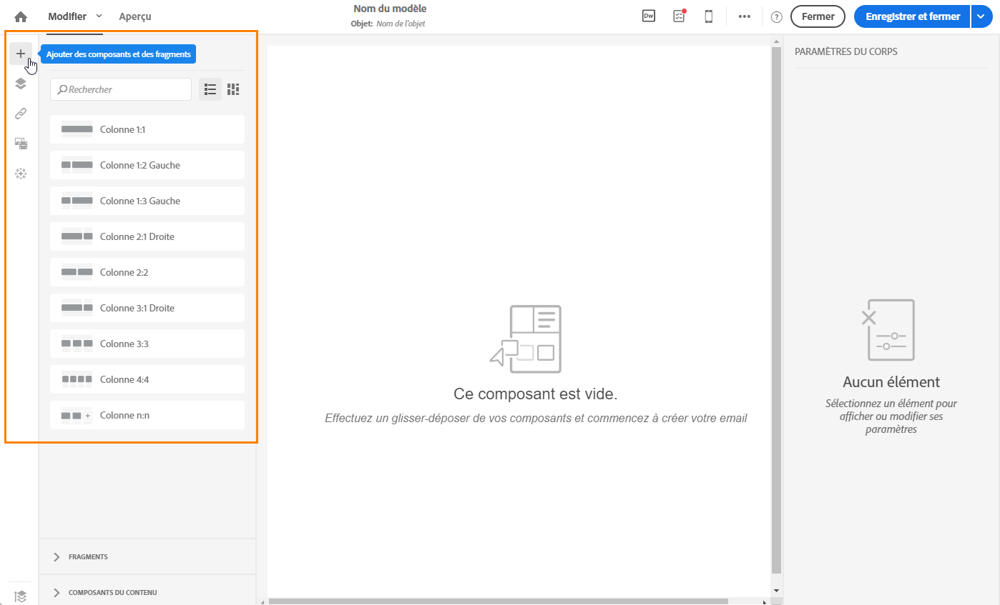
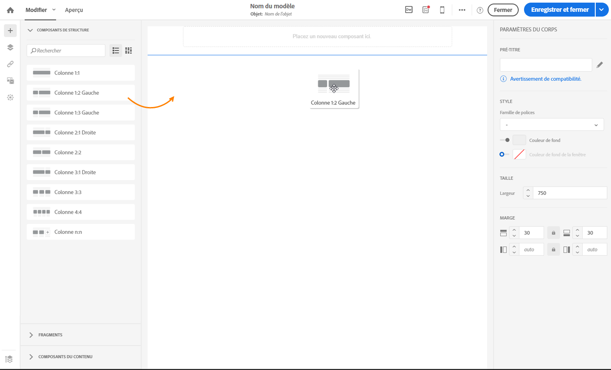
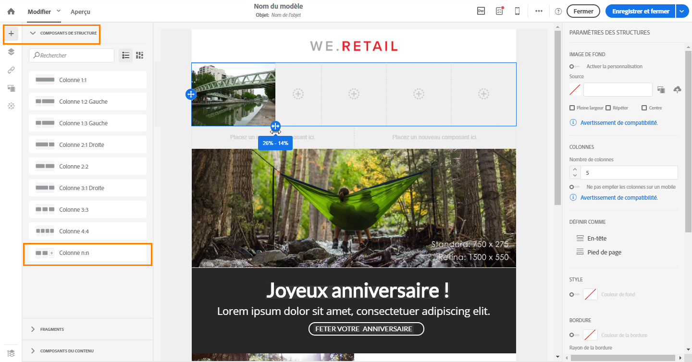
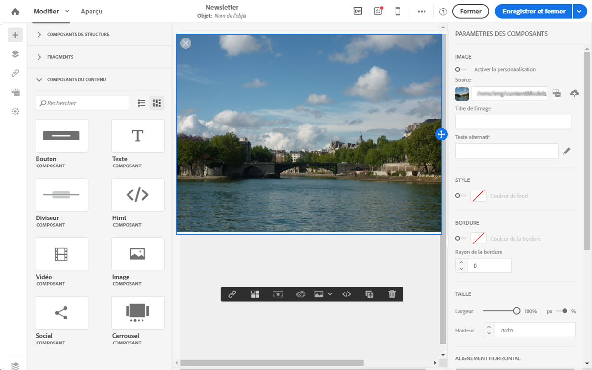

# Conception d&#39;emails à partir de zéro {#designing-an-email-content-from-scratch}

Découvrez comment maîtriser l&#39;édition de contenu d&#39;email. Avec le Concepteur d&#39;email, vous pouvez créer des emails et des modèles avec ou sans votre propre contenu prédéfini.

Voici les principales étapes pour créer entièrement un contenu d&#39;email à l&#39;aide du Concepteur d&#39;email :

1. Créez un email et ouvrez son contenu.
1. Ajoutez des composants de structure pour former l&#39;email. Voir [Editer la structure de l&#39;email](#defining-the-email-structure).
1. Insérez des composants de contenu et des fragments dans les composants de structure. Voir [Ajouter des fragments et des composants de contenu](#defining-the-email-structure).
1. Ajoutez des images et éditez le texte de l&#39;email. Voir [Insérer des images](../../designing/using/images.md#inserting-images).
1. Personnalisez votre email en ajoutant des champs de personnalisation, des liens, etc. Voir [Insertion d&#39;un champ de personnalisation](../../designing/using/personalization.md#inserting-a-personalization-field), [Insérer un lien](../../designing/using/links.md#inserting-a-link) et [Définir du contenu dynamique dans un email](../../designing/using/personalization.md#defining-dynamic-content-in-an-email).
1. Définissez l&#39;objet de l&#39;email. Voir [Personnaliser l&#39;objet d&#39;un email](../../designing/using/subject-line.md#defining-the-subject-line-of-an-email).
1. Prévisualisez l&#39;email.
1. Enregistrez votre contenu et traitez votre message après avoir vérifié que vous avez défini une audience et correctement planifié l&#39;envoi.

Vous pouvez également regarder cette [vidéo de présentation](https://video.tv.adobe.com/v/22771/?autoplay=true&hidetitle=true&captions=fre_fr).

>[!NOTE]
>
>Pour éviter de créer entièrement un contenu d&#39;email, vous pouvez utiliser des modèles de contenu d&#39;usine. Voir à ce propos la section [Modèles de contenu](../../designing/using/using-reusable-content.md#content-templates).

## Définition de la structure d&#39;un email {#defining-the-email-structure}

>[!CONTEXTUALHELP]
>id="ac_structure_components"
>title="A propos des composants Structure"
>abstract="Les composants de structure définissent la disposition du courrier électronique."

>[!CONTEXTUALHELP]
>id="ac_edition_columns"
>title="Définition des colonnes de courrier électronique"
>abstract="Le Concepteur de courriers électroniques vous permet de définir facilement la disposition de votre courrier électronique en définissant la structure des colonnes."

Le Concepteur d&#39;email permet de définir facilement la structure de votre email. En ajoutant et en déplaçant des éléments structurels à l&#39;aide de simples actions de glisser-déposer, vous pouvez concevoir la forme de votre email en quelques secondes.

Pour éditer la structure d&#39;un email :

1. Ouvrez un contenu existant ou créez un contenu d&#39;email.
1. Accédez aux **[!UICONTROL Composants de structure]** en sélectionnant l&#39;icône **+** de gauche.

   

1. Déposez les composants de structure dont vous avez besoin pour former votre email.

   

   Une ligne bleue matérialise la position exacte des composants de structure avant de les déposer. Vous pouvez placer vos composants au-dessus, entre ou sous n&#39;importe quel composant, mais pas à l&#39;intérieur.

   >[!NOTE]
   >
   >Les colonnes empilées ne sont pas compatibles avec tous les programmes de messagerie. Lorsqu&#39;elles ne sont pas prises en charge, les colonnes ne sont pas empilées.
   >
   >Une fois qu&#39;ils ont été placés dans l&#39;email, vous ne pouvez pas déplacer ni supprimer vos composants, à moins qu&#39;un composant de contenu ou un fragment ne soit déjà placé à l&#39;intérieur.

1. Plusieurs composants de structure constitués d&#39;une ou de plusieurs colonnes sont disponibles.

   Sélectionnez le composant **[!UICONTROL n:n colonne]** pour définir le nombre de colonnes de votre choix (entre 3 et 10). Vous pouvez aussi définir la largeur de chaque colonne en déplaçant les flèches situées au bas de celle-ci.

   

   >[!NOTE]
   >
   >La taille de chaque colonne ne peut pas être inférieure à 10 % de la largeur totale du composant de structure. Vous ne pouvez pas supprimer une colonne qui n&#39;est pas vide.

Lorsque la structure est définie, vous pouvez ajouter des fragments de contenu et des composants à votre email.

## Utilisation d’un en-tête prédéfini {#preheader}

>[!CONTEXTUALHELP]
>id="ac_edition_preheader"
>title="Utilisation d’un en-tête prédéfini"
>abstract="L’en-tête permet de configurer un texte de résumé court qui vous permettra de bénéficier d’un taux d’ouverture plus élevé pour votre courrier électronique."

Un préen-tête est un texte de résumé court qui suit l’objet d’un message lorsque vous le visualisez à partir de votre boîte de réception. Le préen-tête offre un taux d’ouverture plus élevé.

Sélectionnez la zone de modification de l’ **[!UICONTROL en-tête]** prédéfini et complétez le contenu.

Vous pouvez ajouter un bloc **[!UICONTROL de]** contenu, un contenu **** dynamique ou un **[!UICONTROL Champs de personnalisation]** dans le contenu de l’en-tête.

>[!NOTE]
>
>Le pré-titre n&#39;est pas compatible avec tous les programmes de messagerie. Lorsqu&#39;il n&#39;est pas pris en charge, le pré-titre ne s&#39;affiche pas.

## Utilisation des composants de contenu {#about-content-components}

>[!CONTEXTUALHELP]
>id="ac_content_components"
>title="A propos des composants Contenu"
>abstract="Les composants de contenu sont des espaces réservés de contenu vides que vous pouvez modifier pour créer un message électronique."

Les composants de contenu sont des composants bruts et vides que vous pouvez éditer une fois qu&#39;ils ont été placés dans un email.

Vous pouvez ajouter autant de composants de contenu que vous le souhaitez dans un composant de structure. Vous pouvez également les déplacer à l&#39;intérieur du composant de structure ou vers un autre composant de structure.

Voici la liste des composants disponibles dans le Concepteur d&#39;email :

### **[!UICONTROL Bouton]**

Si vous avez besoin d&#39;utiliser plusieurs boutons, plutôt que d&#39;éditer chaque bouton à partir de zéro, vous pouvez dupliquer le composant **[!UICONTROL Bouton]** à l&#39;aide de la barre d&#39;outils contextuelle.

Vous pouvez aussi enregistrer des boutons dans des fragments réutilisables. Voir à ce propos [Créer un fragment de contenu](../../designing/using/using-reusable-content.md#creating-a-content-fragment) et [Enregistrer du contenu en tant que fragment](../../designing/using/using-reusable-content.md#saving-content-as-a-fragment).

Sélectionnez **[!UICONTROL Vue de la version de secours]** pour afficher l&#39;image de remplacement dans le Concepteur d&#39;email.

### **[!UICONTROL Texte]**

    Utilisez ce composant pour insérer du texte dans votre email. You can adjust the color, style and size of your text in **[!UICONTROL Component Settings]**.

### **[!UICONTROL Diviseur]**

    Utilisez ce composant pour insérer une ligne de séparation dans votre email. You can select the color, style and size of the breaking line in **[!UICONTROL Component Settings]**.

### **[!UICONTROL Html]**

Utilisez ce composant pour copier-coller les différentes parties de votre code HTML existant. Vous pouvez ainsi créer des composants HTML modulaires autonomes.

>[!NOTE]
>
>Un composant HTML autonome est éditable avec des options limitées. Si tous les styles ne sont pas intégrés, veillez à ajouter le CSS adéquat dans la  section **head** du code HTML, sinon l&#39;email ne sera pas réactif. Utilisez le bouton **[!UICONTROL Aperçu]** afin de tester la réactivité de votre contenu (voir [Prévisualiser des messages](../../sending/using/previewing-messages.md)).

Pour rendre un contenu externe compatible avec le Concepteur d&#39;email, Adobe recommande de créer entièrement un message et de copier le contenu de votre email existant dans des fragments et des composants.

Si un contenu ne peut pas être recréé, vous pouvez copier et coller le code HTML de l&#39;email d&#39;origine à l&#39;aide du composant de contenu **[!UICONTROL Html]**. Assurez-vous de bien connaître le langage HTML avant de poursuivre.

<!-- A full example is presented below. -->

>[!NOTE]
>
>Le nouveau contenu ne sera pas une copie exacte de votre email d&#39;origine, mais les étapes ci-après vous guideront tout au long de la création d&#39;un message qui sera aussi ressemblant que possible.

    **Avant de copier votre contenu**
    
    1. Dans votre email d&#39;origine, identifiez les sections réutilisables et celles qui seront uniques à chaque email que vous enverrez.
    1. Enregistrez toutes les images et les ressources que vous souhaitez utiliser.
    1. Si vous maîtrisez le langage HTML, divisez votre contenu HTML d&#39;origine en plusieurs parties différentes.

### Vidéo {#video-settings}

>[!CONTEXTUALHELP]
>id="ac_edition_video"
>title="Paramètres vidéo"
>abstract="Utilisez ce composant pour insérer une vidéo dans votre email. Notez que les vidéos ne fonctionnent pas sur tous les clients de messagerie. Nous vous conseillons de définir une image de secours."
>additional-url="https://www.emailonacid.com/blog/article/email-development/a_how_to_guide_to_embedding_html5_video_in_email/" text="Informations supplémentaires"

Insérez le composant vidéo dans un composant de structure de votre email et saisissez le lien vidéo dans **[!UICONTROL Paramètres des composants]**.

>[!NOTE]
>
>Remarque : la vidéo n&#39;est pas compatible avec tous les programmes de messagerie. Lorsqu&#39;elle n&#39;est pas prise en charge, la version de secours est affichée.

### Image

Utilisez ce composant pour insérer une image dans votre email.

Insérez le composant d&#39;image dans un composant de structure, puis cliquez sur Parcourir pour télécharger un fichier image depuis votre ordinateur.

### **[!UICONTROL Social]**

Utilisez ce composant pour insérer des liens vers des pages de réseaux sociaux dans votre email. Vous pouvez sélectionner les liens à afficher et la taille de leur icône dans **[!UICONTROL Paramètres des composants]**.

### Carrousel {#carousel-settings}

>[!CONTEXTUALHELP]
>id="ac_edition_carousel"
>title="Paramètres du carrousel"
>abstract="Découvrez comment insérer et configurer un carrousel dans votre contenu.Notez que le carrousel ne fonctionne pas sur tous les clients de messagerie et que l&#39;image de secours s&#39;affichera au cas où elle ne serait pas prise en charge."

1. Placez le composant **[!UICONTROL Carrousel]** à l&#39;intérieur d&#39;un composant de structure.
1. Parcourez votre ordinateur pour sélectionner des images.

   

1. Dans le volet **[!UICONTROL Paramètres]**, définissez le nombre de vignettes souhaitées dans le carrousel.
1. Sélectionnez une image de remplacement à partir de votre ordinateur.

   

Le composant carrousel n&#39;est pas compatible avec tous les programmes de messagerie. Chargez une image de remplacement pour l&#39;afficher lorsque le carrousel n&#39;est pas pris en charge dans un email.

>[!NOTE]
>
>Le composant carrousel est compatible avec les plateformes de messagerie suivantes : Apple Mail 7, Apple Mail 8, Outlook 2011 pour Mac, Outlook 2016 pour Mac, Mozilla Thunderbird, iPad et iPad mini iOS, iPhone iOS, Android, AOL (Chrome, Firefox et Safari).

**Rubriques connexes** :

- [Créer un email](../../channels/using/creating-an-email.md)
- [Sélectionner une audience dans un message](../../audiences/using/selecting-an-audience-in-a-message.md)
- [Planification de l’envoi des messages](../../sending/using/about-scheduling-messages.md)
- [Prévisualiser un message](../../sending/using/previewing-messages.md)
- [Rendu des emails](../../sending/using/email-rendering.md)
