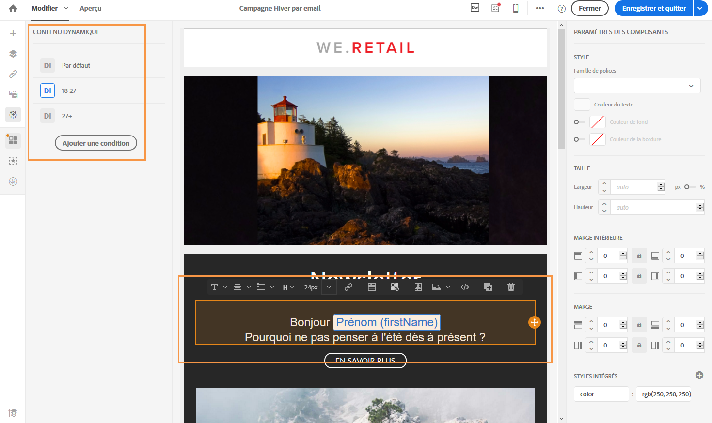
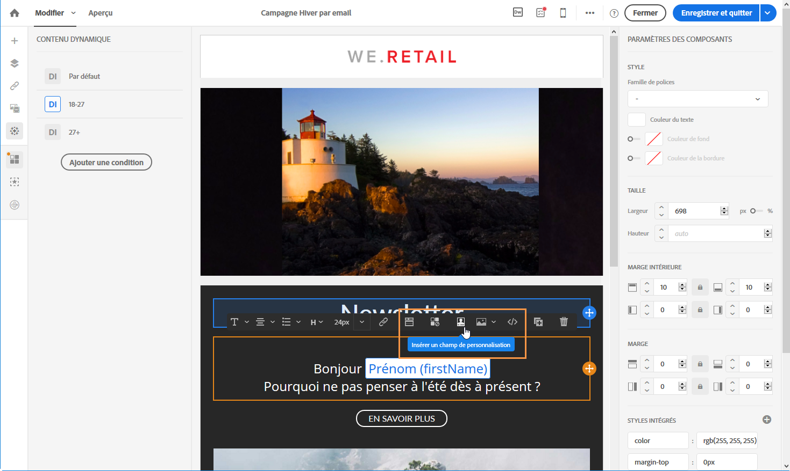

# Exemple : personnalisation d'un email{#example-email-personalization}

Dans cet exemple, une personne du service marketing a créé un email pour faire part à certains de ses clients qu'une offre promotionnelle leur est destinée. Il a été décidé de personnaliser l'email en fonction de l'âge des clients. Entre 18 et 27 ans, ils recevront un email contenant une illustration et une accroche différentes des clients âgés de plus de 27 ans.

L'email est donc créé comme suit :

* des contenus dynamiques sont appliqués sur l'illustration et paramétrés en fonction de l'âge.

   

   L'insertion et le paramétrage des contenus dynamiques sont décrits dans la section [Définir le contenu dynamique dans un email](../../designing/using/defining-dynamic-content-in-an-email.md).

* des champs de personnalisation et des contenus dynamiques sont appliqués sur le texte. En fonction de l'âge, l'email commence par le prénom du profil, ou par sa civilité et son nom.

   

   L'ajout et le paramétrage de champs de personnalisation sont présentés dans la section [Insertion d'un champ de personnalisation](../../designing/using/inserting-a-personalization-field.md).

## Paramétrer les illustrations {#configuring-images}

Dans cet exemple, les contenus dynamiques appliqués aux illustrations sont paramétrés comme suit :

**Pour cibler les 18-27 ans :**

1. Sélectionnez le contenu dynamique dans la palette **[!UICONTROL Propriétés]** et cliquez sur le bouton **Editer[!UICONTROL .]**

   

1. Editez son libellé puis sélectionnez le champ **[!UICONTROL Age]** depuis le nœud **Profil[!UICONTROL .]**

   

1. Sélectionnez l'opérateur **Supérieur ou égal à** puis entrez **18** pour créer l'expression **égal ou plus de 18 ans**.

   

1. Ajoutez une nouvelle condition **[!UICONTROL Age].**

   Sélectionnez l'opérateur **Inférieur ou égal** puis 27 pour créer l'expression **égal ou moins de 27 ans**.

   

1. Validez vos modifications.

**Pour cibler les profils de plus de 27 ans :**

1. Sélectionnez le contenu dynamique depuis la palette et éditez-le.
1. Editez son libellé puis sélectionnez le champ **[!UICONTROL Age]** depuis le nœud **Profil[!UICONTROL .]**
1. Ajoutez l'opérateur **Supérieur à** puis 27 pour créer l'expression **plus de 27 ans**.

   

1. Validez vos modifications.

Vos contenus dynamiques sont correctement paramétrés.

## Paramétrer le texte {#configuring-text}

Dans cet exemple, les contenus dynamiques appliqués aux textes sont paramétrés comme suit :

**Pour cibler les profils qui ont entre 18 et 27 ans :**

1. Sélectionnez le composant de structure voulu et ajoutez un contenu dynamique.
1. Editez le contenu dynamique et paramétrez les expressions de ciblage. Voir [Paramétrer les illustrations](../../designing/using/example--email-personalization.md#configuring-images).
1. Dans le composant de structure, à l'emplacement désiré, cliquez sur l'icône **[!UICONTROL Personnaliser]** depuis la barre d'outils contextuelle et sélectionnez **[!UICONTROL Insérer un champ de personnalisation]**.

   

1. Dans la liste qui s'affiche à l'écran, sélectionnez le champ **[!UICONTROL Prénom]et validez.**

   

1. Votre champ de personnalisation est parfaitement inséré dans le contenu dynamique sélectionné.

**Pour cibler les profils de plus de 27 ans :**

1. Sélectionnez le composant de structure voulu et ajoutez un contenu dynamique.
1. Editez le contenu dynamique et paramétrez les expressions de ciblage. Voir [Paramétrer les illustrations](../../designing/using/example--email-personalization.md#configuring-images).
1. Dans le composant de structure, à l'emplacement désiré, cliquez sur l'icône **[!UICONTROL Personnaliser]** depuis la barre d'outils contextuelle et sélectionnez **[!UICONTROL Insérer un champ de personnalisation]**.
1. Dans la liste déroulante, sélectionnez le champ **[!UICONTROL Civilité].**
1. Procédez de la même manière pour ajouter le champ **[!UICONTROL Nom].**

   

Vos champs de personnalisation sont correctement insérés dans le contenu dynamique choisi.

## Prévisualiser l'email {#previewing-emails}

La prévisualisation permet de vérifier que les champs de personnalisation et les contenus dynamiques sont paramétrés correctement avant d'envoyer les **[!UICONTROL Bons à tirer]**. Différents profils de test qui correspondent aux cibles de l'email peuvent être sélectionnés lors de la prévisualisation.

Sans profil de test, l'email qui apparaît par défaut est le suivant :

L'email ne propose pas de champs de personnalisation dans le texte d'accroche, et l'image est celle définie par défaut.

Un premier profil de test correspond aux 18-27 ans. En sélectionnant ce profil, l'email suivant apparaît :

Le champ de personnalisation qui correspond aux 18-27 ans (le prénom du profil) est correctement paramétré, et l'image est elle aussi modifiée en fonction du profil.

Un deuxième profil correspond aux plus de 27 ans génère l'email suivant :

L'image est modifiée grâce au contenu dynamique, et le texte accroche correspond à celui paramétré pour le public ciblé.

**Rubriques connexes :**

* [Création d'une audience](../../audiences/using/creating-audiences.md)
* [Préparer l'envoi](../../sending/using/preparing-the-send.md)

