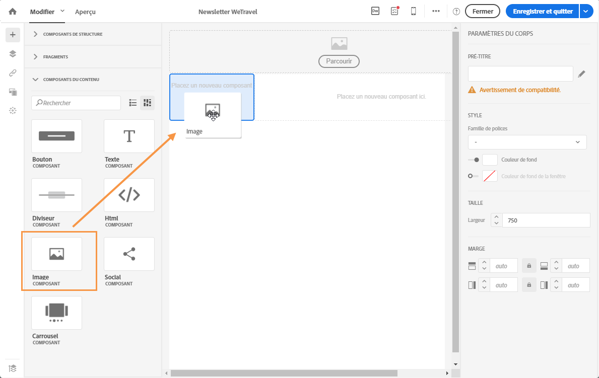
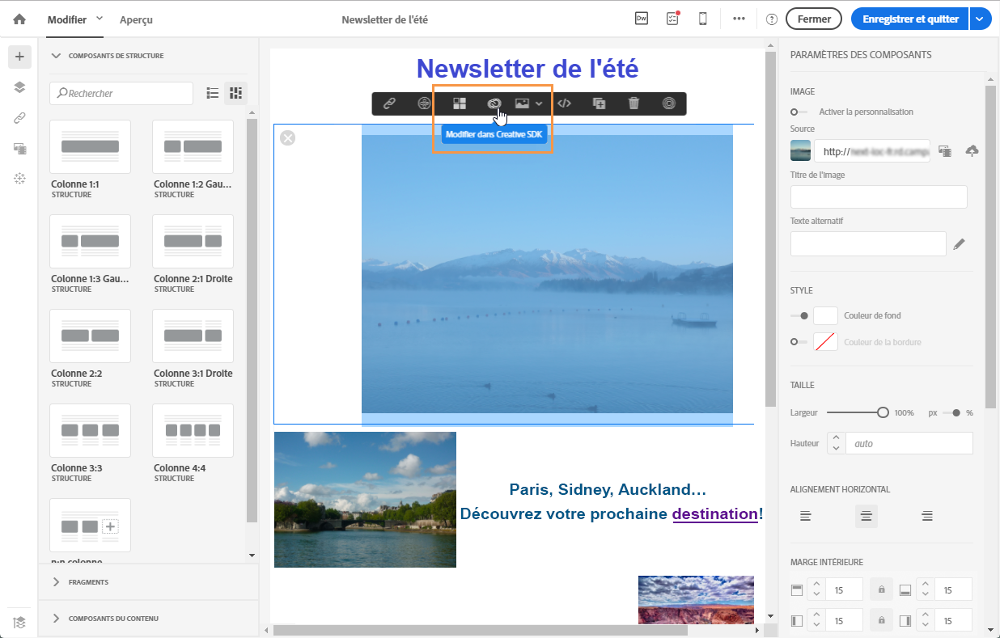

# Images {#images}

## Insérer des images{#inserting-images}

Vous pouvez insérer des images dans vos emails et landing pages.

Selon votre configuration, les types d'images suivants sont disponibles :

* images locales,
* images partagées depuis Adobe Experience Cloud (voir [Utilisation de Campaign et Assets Core Service](../../integrating/using/working-with-campaign-and-assets-core-service.md)/Assets On Demand),
* images dynamiques d'Adobe Target (voir [Utilisation de Campaign et Target](../../integrating/using/about-campaign-target-integration.md)).

Si cette fonctionnalité est activée, vous pouvez modifier les images avec le SDK Adobe Creative. Voir [Modifier des images avec Adobe Creative SDK](../../designing/using/images.md#modifying-images-with-the-adobe-creative-sdk).

>[!CAUTION]
>
>Si vous choisissez d'ajouter une image directement en éditant la version HTML de l'email, vous ne devez pas appeler les **fichiers externes dans une balise &lt;script&gt;** de la page HTML. Ces fichiers ne seront pas importés sur le serveur Adobe Campaign.

### Insérer des images dans un email   {#inserting-images-in-an-email}

1. Ajoutez un composant de structure. Voir à ce propos la section [Editer la structure de l'email](../../designing/using/designing-from-scratch.md#defining-the-email-structure).
1. Dans le composant de structure, ajoutez un composant de contenu **[!UICONTROL Image]**.

   

1. Cliquez sur **[!UICONTROL Parcourir]**. Placez une image à l'aide d'une opération glisser-déposer ou cliquez pour sélectionner un fichier sur votre ordinateur.

   

1. Sélectionnez le composant de contenu que vous venez d'ajouter.
1. Vérifiez les propriétés des images et modifiez-les au besoin.

   

## Configurer les propriétés d'une image{#setting-up-image-properties}

Lorsque vous sélectionnez un bloc contenant une image, les propriétés suivantes sont proposées dans la palette :

* **Activer la personnalisation** permet de personnaliser la source de l'image. Voir [Personnaliser la source d'une image](../../designing/using/personalization.md#personalizing-an-image-source).
* **Titre de l'image** permet de définir un titre pour l'image.
* **Texte alternatif** (email) ou **Légende** (landing page) permet de définir la légende associée à l'image (correspond à l'attribut HTML **alt**).
* Lors de l'édition d'un email, **Style** permet d'indiquer la taille, l'arrière-plan et la bordure de l'image.
* Lors de l'édition d'une landing page, **Dimensions** permet de spécifier la taille de l'image en pixels.

L'éditeur permet de travailler avec **tous types d'images** dont le format est compatible avec les navigateurs. Pour être compatible avec l'éditeur, les **animations de type "Flash"** doivent être insérées dans une page HTML de la manière suivante :      

```
<object type="application/x-shockwave-flash" data="http://www.mydomain.com/flash/your_animation.swf" width="200" height="400">
 <param name="movie" value="http://www.mydomain.com/flash/your_animation.swf" />
 <param name="quality" value="high" />
 <param name="play" value="true"/>
 <param name="loop" value="true"/> 
</object>
```

## Modifier des images avec le SDK Adobe Creative{#modifying-images-with-the-adobe-creative-sdk}

Vous pouvez éditer des images et utiliser un ensemble complet de fonctionnalités fourni par le SDK Adobe Creative afin d'améliorer vos images directement dans l'éditeur de contenu lors de l'édition des emails ou des landing pages.

L'éditeur d'images est un composant d'interface utilisateur puissant et complet pour éditer les images. Il permet d'appliquer des effets et des trames, des autocollants de grande qualité et de magnifiques superpositions, d'utiliser des fonctionnalités amusantes telles que les fonctionnalités de bascule et de décentrement et d'éclaboussures de couleur, d'effectuer des ajustements de niveau professionnel, etc.

Pour modifier une image avec Adobe Creative SDK :

1. Sélectionnez l'image.
1. Dans la barre d'outils, cliquez sur l'icône Creative Cloud.

   

1. Sélectionnez l'outil à utiliser pour modifier l'image parmi les icônes situées en haut de la fenêtre.

   

1. Lorsque les modifications sont terminées, cliquez sur **[!UICONTROL Enregistrer]**. L'image mise à jour est enregistrée sur le serveur Adobe Campaign et prête à être utilisée.

>[!NOTE]
Il n'est pas possible de personnaliser les outils proposés dans l'éditeur d'images.
