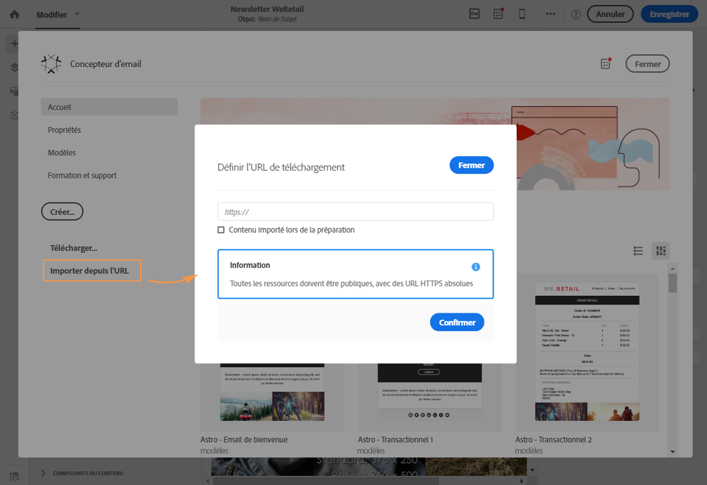
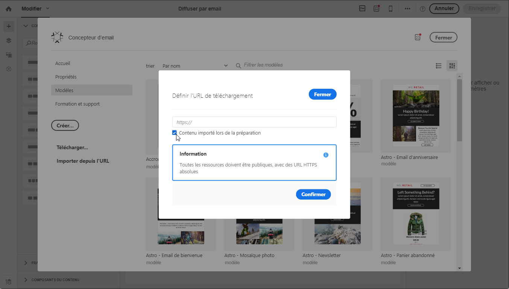
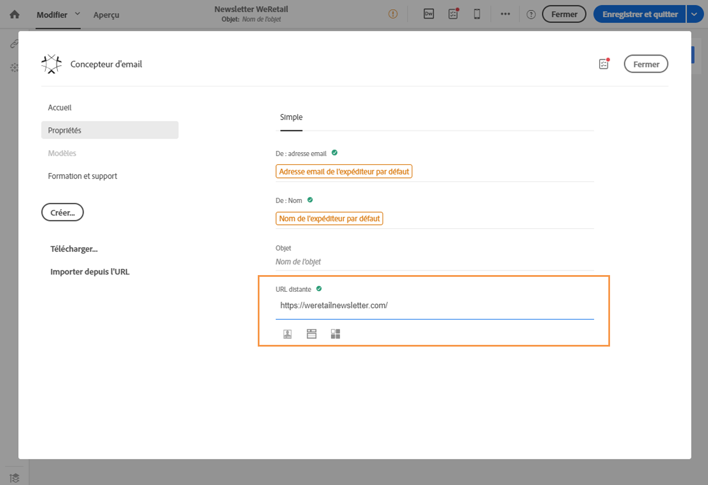

# Importer du contenu depuis une URL{#importing-content-from-a-url}

Avant d'importer du contenu depuis une URL, vérifiez que les exigences suivantes sont respectées :

* Le contenu doit être publiquement disponible via cette URL.
* Pour des raisons de sécurité, seules les URL commençant par **[!UICONTROL https]sont autorisées.**
* Vérifiez que toutes les ressources (images, CSS) sont définies dans des liens absolus et HTTPS. Sinon, après l'envoi de l'email, la page miroir serait affichée sans ses ressources. Voici un exemple de définition d'un lien absolu :

   ```
   <a href="https://www.mywebsite.com/images/myimage.png">
   ```

>[!NOTE]
>
>Le chargement de contenu depuis une URL n'est possible que pour le canal email.

Pour récupérer du contenu existant depuis une URL, procédez comme suit :

1. Dans la page d'accueil du Concepteur d'email, cliquez sur le bouton **[!UICONTROL Importer depuis l'URL].**

   

1. Définissez l'URL à partir de laquelle le contenu sera récupéré.
1. Cliquez sur **[!UICONTROL Confirmer]**.

**Rubrique connexe :**

Vidéo [Importer du contenu depuis une URL](https://helpx.adobe.com/campaign/kt/acs/using/acs-email-designer-tutorial.html#Workingwithexistingcontent)

## Récupérer automatiquement du contenu depuis une URL au moment de la préparation {#retrieving-content-from-a-url-automatically-at-preparation-time}

L'import de contenu à partir d'une URL lors de la préparation du message permet de récupérer le contenu HTML le plus récent à chaque préparation. Ainsi, le contenu des emails récurrents est toujours mis à jour au moment de l'envoi. Cette fonctionnalité permet également de créer un message planifié à une date spécifique, même si le contenu n'est pas encore prêt.

Pour récupérer du contenu au moment de la préparation d'une diffusion, procédez comme suit :

1. Sélectionnez l'option **[!UICONTROL Contenu importé lors de la préparation].**

   

1. Le contenu de l'URL s'affiche en lecture seule dans l'éditeur.

   >[!CAUTION]
   >
   >A ce stade, l'affichage HTML dans l'éditeur de contenu ne doit pas être pris en compte. Il sera récupéré pendant la phase de préparation.

1. Pour prévisualiser le contenu de l'URL récupéré, ouvrez le message une fois qu'il a été créé, puis cliquez sur le bouton **[!UICONTROL Prévisualiser].**

Il est possible de personnaliser l'URL distante à partir de laquelle le contenu sera récupéré. Pour ce faire, procédez comme suit :

1. Cliquez sur le libellé de l'email en haut de l'écran pour accéder à l'onglet **[!UICONTROL Propriétés]du Concepteur d'email.**
1. Recherchez le champ **[!UICONTROL URL distante].**

   

1. Insérez le champ de personnalisation, le bloc de contenu ou le texte dynamique de votre choix.

   Le bloc de contenu **[!UICONTROL Date actuelle - YYYYMMDD], par exemple, permet d'insérer la date du jour.**

   >[!NOTE]
   >
   >Les champs de personnalisation disponibles sont uniquement liés aux attributs de **diffusion** (date de création de l'email, statut, libellé de la campagne, etc.).

