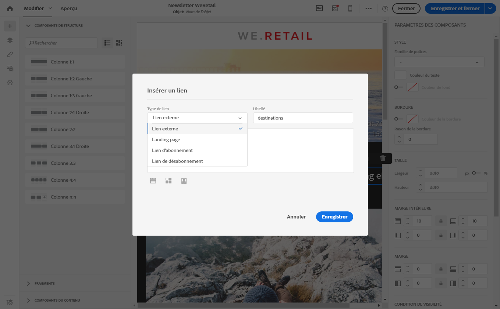
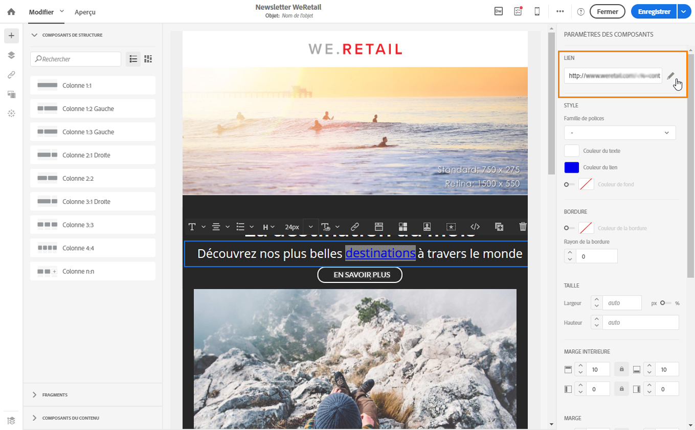
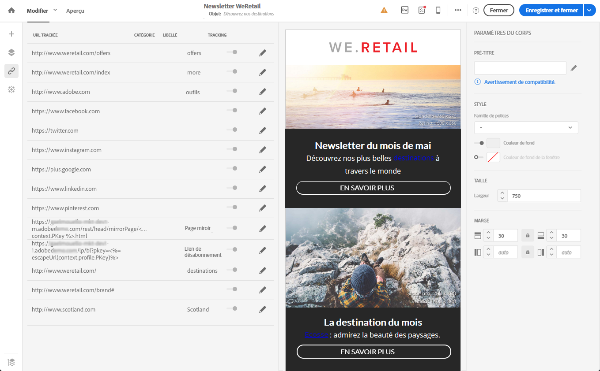

# Insérer un lien{#inserting-a-link}

L'éditeur vous permet de personnaliser un email ou une landing page en insérant des liens dans les éléments du contenu HTML.

Vous pouvez insérer un lien sur tout élément de la page : image, mot, groupe de mots, bloc de texte, etc.

>[!NOTE]
>
>Les images ci-après illustrent l'insertion d'un lien à l'aide du [Concepteur d'email](../../designing/using/about-email-content-design.md#about-the-email-designer).

1. Sélectionnez un élément et cliquez sur **[!UICONTROL Insérer un lien]dans la barre d'outils contextuelle.**

   

1. Sélectionnez le type de lien que vous souhaitez créer :

   * **Lien externe** : insérez un lien vers une URL externe.

      Vous pouvez définir la personnalisation des URL. Voir [Personnaliser une URL](../../designing/using/personalizing-urls.md).

   * **Landing page** : donnez accès à une landing page Adobe Campaign.
   * **Lien d'abonnement** : insérez un lien pour s'abonner à un service Adobe Campaign.
   * **Lien de désabonnement** : insérez un lien pour se désabonner d'un service Adobe Campaign.
   * **Lien définissant une action** : définissez une action qui se produit lors d'un clic sur la landing page.

      >[!NOTE]
      >
      >Ce type de lien est uniquement disponible pour les landing pages.

1. Vous pouvez modifier le texte qui s'affiche pour le destinataire.
1. Vous pouvez définir le comportement du navigateur lorsque l'utilisateur clique sur le lien (ouverture d'une nouvelle fenêtre, par exemple).

   >[!NOTE]
   >
   >La définition du comportement du navigateur s'applique uniquement aux landing pages.

1. Enregistrez vos modifications.

Une fois le lien créé, vous pouvez encore le modifier dans le volet Paramètres. Cliquez sur l'icône de crayon pour éditer ses paramètres.

Lorsque vous éditez un email à l'aide du [Concepteur d'email](../../designing/using/about-email-content-design.md#about-the-email-designer), vous pouvez facilement accéder aux liens créés à partir du tableau répertoriant toutes les URL incluses dans l'email et les modifier. Cette liste permet d'avoir une vue centrale et de localiser chaque URL dans le contenu de l'email. Pour y accéder, reportez-vous à la section [A propos des URL trackées](../../designing/using/about-tracked-urls.md).

>[!NOTE]
>
>Les URL personnalisées telles que l'**URL de la page miroir** ou le lien de **désabonnement** ne peuvent pas être modifiées depuis cette liste. Tous les autres liens sont modifiables.

