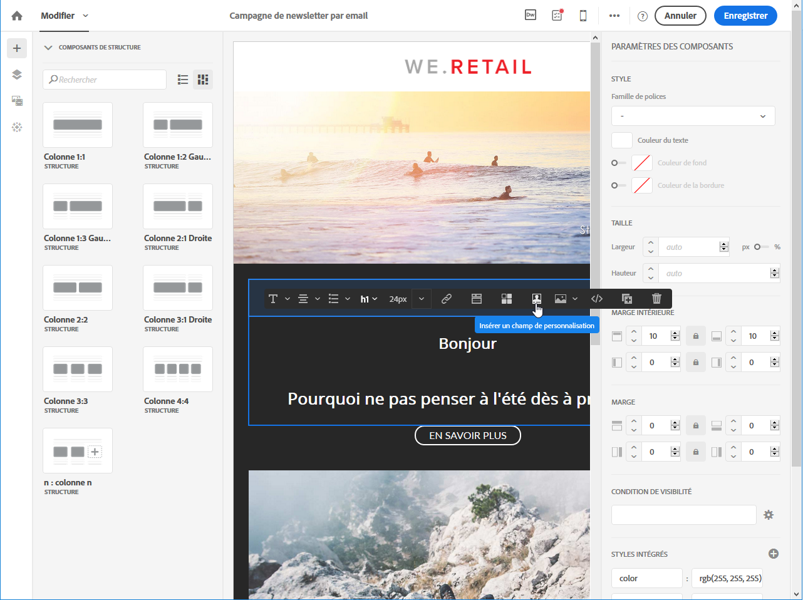
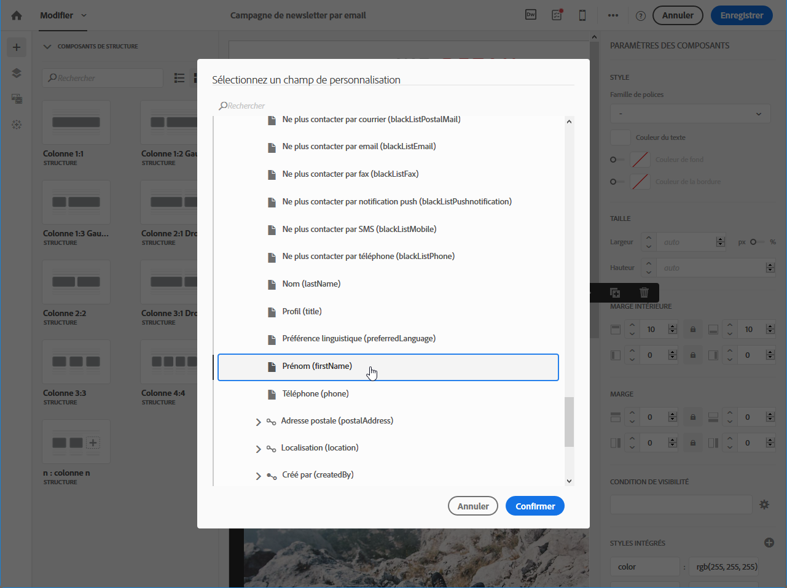
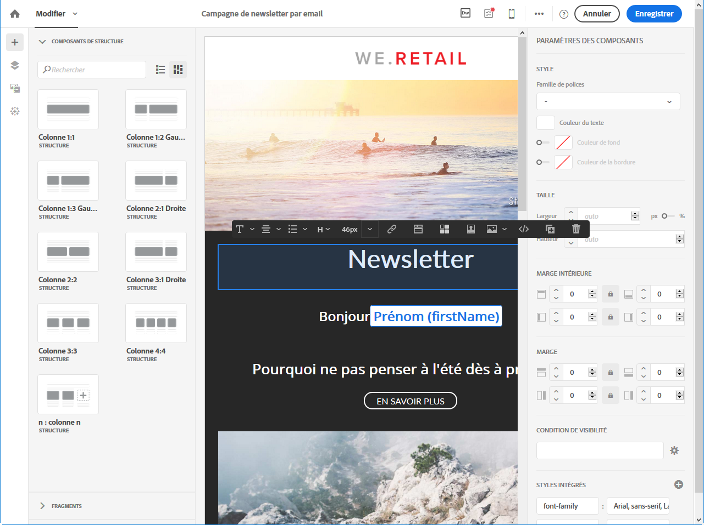

# Insertion d'un champ de personnalisation{#inserting-a-personalization-field}

Adobe Campaign vous permet d'insérer dans votre page un champ provenant de la base de données, par exemple le prénom du profil.

>[!NOTE]
>
>Les images ci-après illustrent l'insertion d'un champ de personnalisation à l'aide du [Concepteur d'email](../../designing/using/about-email-content-design.md#about-the-email-designer).

Pour ajouter un champ de personnalisation au contenu :

1. Cliquez dans un bloc de texte. Cliquez ensuite sur l'icône **[!UICONTROL Personnaliser]** dans la barre d'outils contextuelle et sélectionnez **[!UICONTROL Insérer un champ de personnalisation]**. Pour plus d'informations sur l'interface du Concepteur d'email, consultez [cette section](../../designing/using/about-email-content-design.md#email-designer-interface).

   

1. Sélectionnez le champ à insérer dans le contenu de votre page.

   

1. Cliquez sur **[!UICONTROL Confirmer]**.

Le nom du champ apparaît dans l'éditeur et est surligné.

Une fois la personnalisation générée (lors de la prévisualisation et de la préparation de l'email, par exemple), ce champ est remplacé par la valeur qui correspond au profil ciblé.

>[!NOTE]
>
>Si l'email est créé depuis un workflow, les données additionnelles calculées dans le workflow sont aussi disponibles dans les champs de personnalisation. Pour plus d'informations sur l'ajout de données additionnelles depuis un workflow, consultez la section [Enrichir les données](../../automating/using/targeting-data.md#enriching-data).

