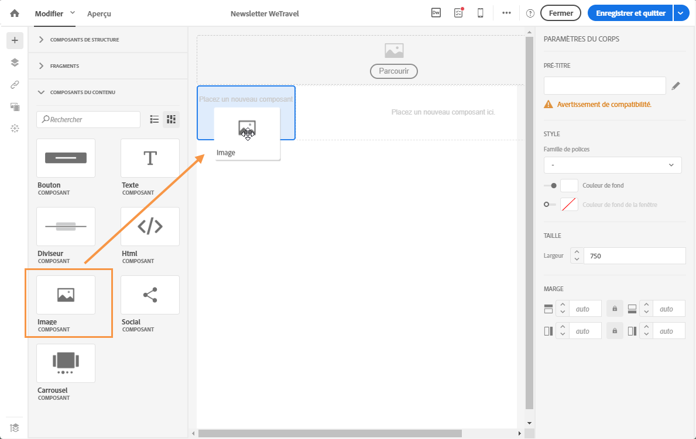
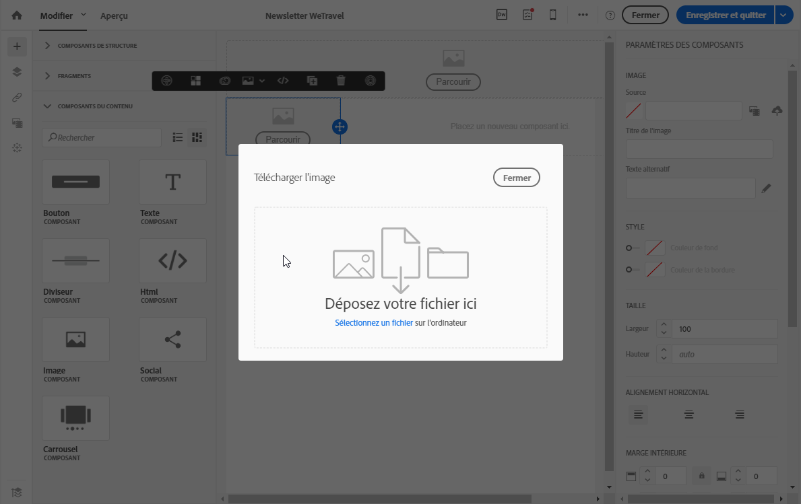
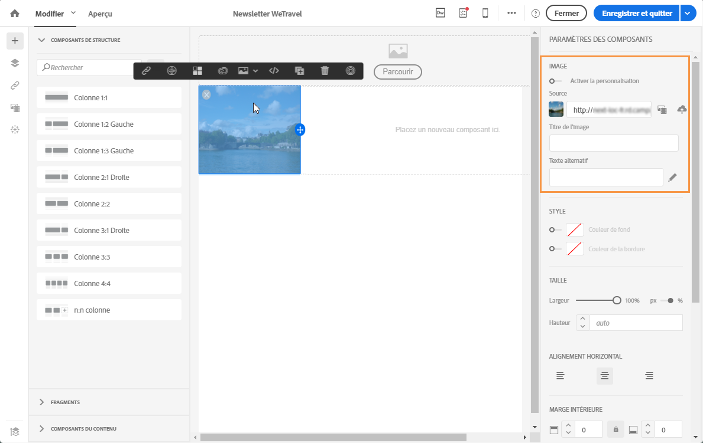
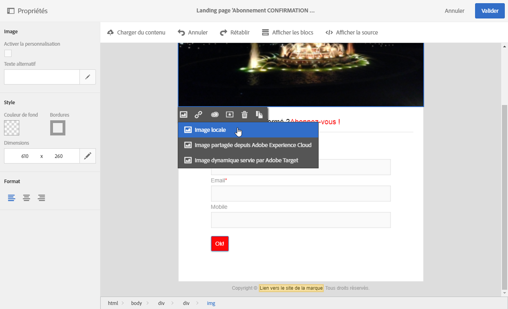
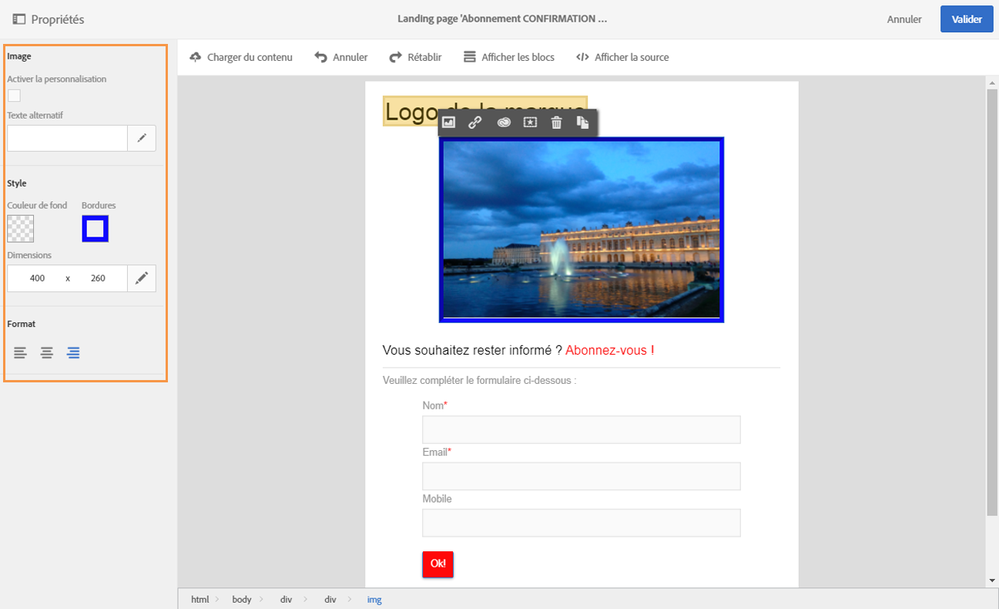

# Insérer des images{#inserting-images}

Vous pouvez insérer des images dans vos emails et landing pages.

Selon votre configuration, les types d'images suivants sont disponibles :

* images locales,
* images partagées depuis Adobe Experience Cloud (voir [Utilisation de Campaign et Assets Core Service](../../integrating/using/working-with-campaign-and-assets-core-service.md)/Assets On Demand),
* images dynamiques d'Adobe Target (voir [Utilisation de Campaign et Target](../../integrating/using/about-campaign-target-integration.md)).

Si cette fonctionnalité est activée, vous pouvez modifier les images avec le SDK Adobe Creative. Voir [Modifier des images avec Adobe Creative SDK](../../designing/using/modifying-images-with-the-adobe-creative-sdk.md).

>[!CAUTION]
>
>Si vous choisissez d'ajouter une image directement en éditant la version HTML de l'email, vous ne devez pas appeler les **fichiers externes dans une balise &lt;script&gt;** de la page HTML. Ces fichiers ne seront pas importés sur le serveur Adobe Campaign.

## Insérer des images dans un email  {#inserting-images-in-an-email}

1. Ajoutez un composant de structure. Voir à ce propos la section [Editer la structure de l'email](../../designing/using/defining-the-email-structure.md#editing-the-email-structure).
1. Dans le composant de structure, ajoutez un composant de contenu **[!UICONTROL Image]**.

   

1. Cliquez sur **[!UICONTROL Parcourir]**. Placez une image à l'aide d'une opération glisser-déposer ou cliquez pour sélectionner un fichier sur votre ordinateur.

   

1. Sélectionnez le composant de contenu que vous venez d'ajouter.
1. Vérifiez les propriétés des images et modifiez-les au besoin.

   

## Insérer des images dans une landing page  {#inserting-images-in-a-landing-page}

1. Dans le contenu d'une landing page, sélectionnez un bloc contenant une image.
1. Sélectionnez le bouton **[!UICONTROL Insérer]**.

   

1. Sélectionnez **[!UICONTROL Image locale]** dans la barre d'outils contextuelle.

   

1. Sélectionnez un fichier.

   

1. Ajustez les propriétés de l'image selon les besoins.

   

