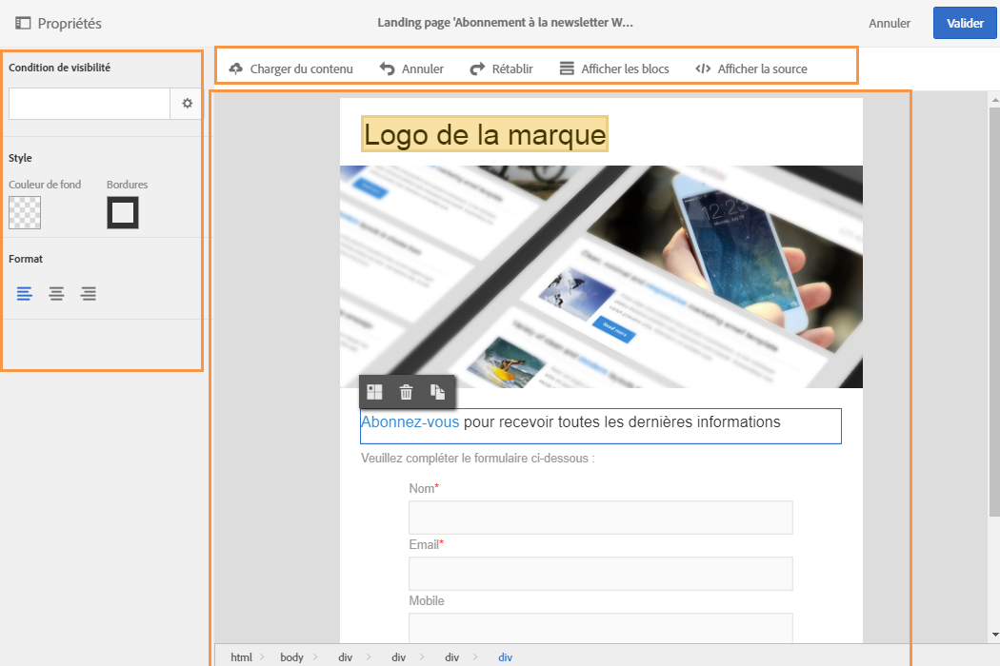
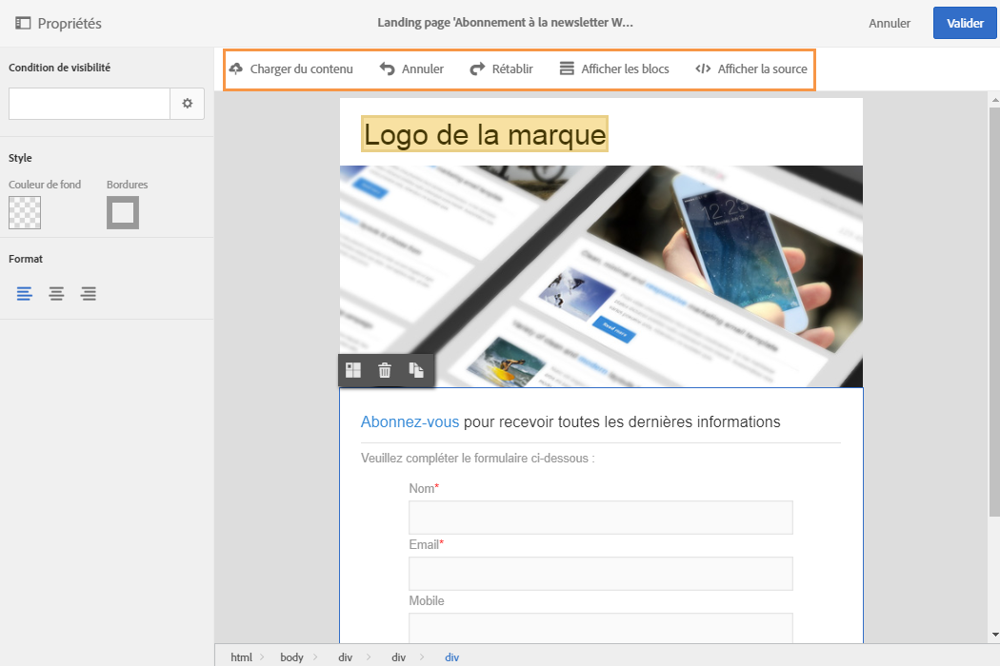
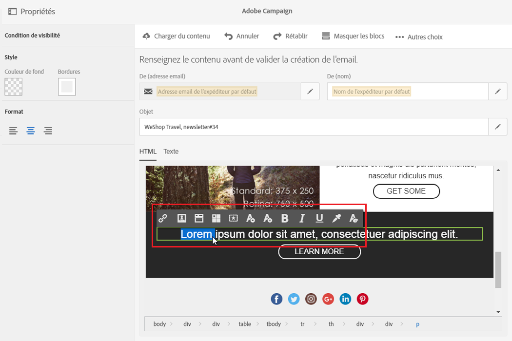

# Interface de l'éditeur de contenu de landing page{#landing-page-content-editor-interface}

L'éditeur de contenu de landing page permet de définir, modifier et personnaliser facilement du contenu dans Adobe Campaign. Pour y accéder, cliquez sur le bloc **[!UICONTROL Contenu]** dans le tableau de bord des landing pages.

L'éditeur de contenu est organisé en trois sections distinctes. Elles permettent de visualiser le contenu et de le modifier.

1. La **palette** située à gauche de l'écran permet de modifier les paramètres du bloc sélectionné. Les options pouvant être modifiées sont les suivantes : couleur de fond, bordure, alignement du texte, condition de visibilité, etc. Voir [Insertion d'un champ de personnalisation](../../designing/using/inserting-a-personalization-field.md).
1. La **barre d'actions** regroupe les options générales de la page. Vous pouvez sélectionner un modèle et changer le mode d'affichage. Voir [Barre d'actions de l'éditeur de landing page](../../designing/using/landing-page-content-editor-interface.md#landing-page-editor-action-bar).
1. La **zone d'édition** principale permet d'interagir directement avec le contenu, grâce à la barre d'outils contextuelle : insérer un lien sur une image, modifier la police de caractères, supprimer un champ, etc. Voir [Barre d'outils de l'éditeur de landing page](../../designing/using/landing-page-content-editor-interface.md#landing-page-editor-toolbar).

## Barre d'actions de l'éditeur de landing page  {#landing-page-editor-action-bar}

La barre d'actions contient différents boutons permettant d'agir sur le contenu en cours de création.

<table> 
 <thead> 
  <tr> 
   <th> Icône  </th> 
   <th> Nom du bouton  </th> 
   <th> Canal  </th> 
   <th> Description  </th> 
  </tr> 
 </thead> 
 <tbody> 
  <tr> 
   <td>    </td> 
   <td> Charger du contenu   </td> 
   <td> Landing page et email  </td> 
   <td> Permet de sélectionner un contenu d'usine ou d'importer votre propre contenu HTML. Reportez-vous à <a href="../../designing/using/selecting-an-existing-content.md">Charger un contenu existant</a>.  </td> 
  </tr> 
  <tr> 
   <td>    </td> 
   <td> Annuler   </td> 
   <td> Tous  </td> 
   <td> Annule la dernière action effectuée.  </td> 
  </tr> 
  <tr> 
   <td>    </td> 
   <td> Rétablir   </td> 
   <td> Tous  </td> 
   <td> Rétablit la dernière action que vous avez annulée.  </td> 
  </tr> 
  <tr> 
   <td>    </td> 
   <td> Afficher les blocs   </td> 
   <td> Landing page et email  </td> 
   <td> Permet d'afficher des cadres autour des blocs de contenu (correspond à la balise HTML <strong>&lt;div&gt;</strong>).  </td> 
  </tr> 
  <tr> 
   <td>    </td> 
   <td> Voir la source   </td> 
   <td> Landing page et email  </td> 
   <td> Permet d'afficher le code source HTML de la page.  </td> 
  </tr> 
 </tbody> 
</table>

## Barre d'outils de l'éditeur de landing page  {#landing-page-editor-toolbar}

La barre d'outils est un **élément contextuel** de l'interface de l'éditeur qui présente des fonctionnalités différentes selon la zone sélectionnée. Elle regroupe des boutons d'action et des boutons permettant de modifier le style du texte. Les modifications effectuées s'appliquent toujours sur la zone sélectionnée. Lorsque vous sélectionnez un bloc, vous pouvez par exemple le supprimer ou le dupliquer. Lorsque vous sélectionnez du texte à l'intérieur d'un bloc, vous pouvez le transformer en lien ou le mettre en gras.

>[!CAUTION]
>
>Certaines fonctionnalités de la barre d'outils permettent de mettre en forme le contenu HTML. Cependant, si la page contient une feuille de style CSS, les **instructions** provenant de la feuille de style peuvent s'avérer **prioritaires** par rapport aux instructions spécifiées avec la barre d'outils.

<table> 
 <thead> 
  <tr> 
   <th> Icône  </th> 
   <th> Nom du bouton  </th> 
   <th> Contexte  </th> 
   <th> Description  </th> 
  </tr> 
 </thead> 
 <tbody> 
  <tr> 
   <td>    </td> 
   <td> Lien vers une URL externe   </td> 
   <td> Tout élément  </td> 
   <td> Permet d'ajouter un lien vers une URL. Le paramétrage d'un lien est présenté dans la section <a href="../../designing/using/inserting-a-link.md">Insérer un lien</a>.  </td> 
  </tr> 
  <tr> 
   <td>    </td> 
   <td> Lien vers une landing page   </td> 
   <td> Tout élément  </td> 
   <td> Permet d'accéder à une landing page Adobe Campaign. Le paramétrage d'un lien est présenté dans la section <a href="../../designing/using/inserting-a-link.md">Insérer un lien</a>.  </td> 
  </tr> 
  <tr> 
   <td>    </td> 
   <td> Lien d'abonnement   </td> 
   <td> Tout élément  </td> 
   <td> Permet d'insérer un lien d'abonnement à un service. Le paramétrage d'un lien est présenté dans la section <a href="../../designing/using/inserting-a-link.md">Insérer un lien</a>.  </td> 
  </tr> 
  <tr> 
   <td>    </td> 
   <td> Lien de désabonnement   </td> 
   <td> Tout élément  </td> 
   <td> Permet d'insérer un lien de désabonnement à un service. Le paramétrage d'un lien est présenté dans la section <a href="../../designing/using/inserting-a-link.md">Insérer un lien</a>.  </td> 
  </tr> 
  <tr> 
   <td>    </td> 
   <td> Supprimer le lien   </td> 
   <td> Lien  </td> 
   <td> Permet de supprimer, après confirmation, le lien ainsi que tous les paramétrages liés.  </td> 
  </tr> 
  <tr> 
   <td>    </td> 
   <td> Insérer un champ de personnalisation   </td> 
   <td> Elément de texte  </td> 
   <td> Permet d'ajouter un champ de la base de données dans le contenu. Voir <a href="../../designing/using/inserting-a-personalization-field.md">Insertion d'un champ de personnalisation</a>.  </td> 
  </tr> 
  <tr> 
   <td>    </td> 
   <td> Insérer un bloc de contenu   </td> 
   <td> Elément de texte  </td> 
   <td> Permet d'insérer un bloc de personnalisation dans le contenu. Voir <a href="../../designing/using/adding-a-content-block.md">Ajouter un bloc de contenu</a>.  </td> 
  </tr> 
  <tr> 
   <td>    </td> 
   <td> Activer le contenu dynamique   </td> 
   <td> Elément de texte  </td> 
   <td> Permet d'insérer un contenu dynamique dans le contenu. Voir <a href="../../designing/using/defining-dynamic-content-in-a-landing-page.md">Définir le contenu dynamique</a>.  </td> 
  </tr> 
  <tr> 
   <td>    </td> 
   <td> Désactiver le contenu dynamique   </td> 
   <td> Elément de texte  </td> 
   <td> Permet de supprimer un contenu dynamique.  </td> 
  </tr> 
  <tr> 
   <td>    </td> 
   <td> Agrandir la police   </td> 
   <td> Elément de texte  </td> 
   <td> Augmente la taille du texte sélectionné (ajoute <strong>&lt;span style="font-size:"&gt;</strong>).  </td> 
  </tr> 
  <tr> 
   <td>    </td> 
   <td> Diminuer la police   </td> 
   <td> Elément de texte  </td> 
   <td> Réduit la taille du texte sélectionné (ajoute <strong>&lt;span style="font-size:"&gt;</strong>).  </td> 
  </tr> 
  <tr> 
   <td>    </td> 
   <td> Gras   </td> 
   <td> Elément de texte  </td> 
   <td> Ajoute le style gras au texte sélectionné (entoure le texte de la balise <strong>&lt;strong&gt;</strong><strong>&lt;/strong&gt;</strong>).  </td> 
  </tr> 
  <tr> 
   <td>    </td> 
   <td> Italique   </td> 
   <td> Elément de texte  </td> 
   <td> Ajoute le style italique au texte sélectionné (entoure le texte de la balise <strong>&lt;em&gt;</strong><strong>&lt;/em&gt;</strong>).  </td> 
  </tr> 
  <tr> 
   <td>    </td> 
   <td> Souligner   </td> 
   <td> Elément de texte  </td> 
   <td> Ajoute le style souligné au texte sélectionné (entoure le texte de la balise <strong>&lt;span style="text-decoration: underline;"&gt;</strong>).  </td> 
  </tr> 
  <tr> 
   <td>    </td> 
   <td> Changer la couleur de fond   </td> 
   <td> Elément de texte  </td> 
   <td> Permet de changer la couleur de fond du bloc sélectionné (ajoute style="background-color: rgba(170, 86, 255, 0.87)).  </td> 
  </tr> 
  <tr> 
   <td>    </td> 
   <td> Changer la couleur du texte   </td> 
   <td> Elément de texte  </td> 
   <td> Permet de changer la couleur de tout le texte dans le bloc ou seulement celle du texte sélectionné (<strong>&lt;span style="color: #56ff56;"&gt;</strong>).  </td> 
  </tr> 
  <tr> 
   <td>    </td> 
   <td> Image   </td> 
   <td> Bloc contenant une image  </td> 
   <td> Permet d'insérer une image à partir d'un fichier enregistré en local.  </td> 
  </tr> 
  <tr> 
   <td>    </td> 
   <td> Effacer   </td> 
   <td> Tout bloc  </td> 
   <td> Supprime le bloc et tout son contenu.  </td> 
  </tr> 
  <tr> 
   <td>    </td> 
   <td> Doublon   </td> 
   <td> Tout bloc  </td> 
   <td> Duplique le bloc et également tous les styles associés au bloc.  </td> 
  </tr> 
 </tbody> 
</table>

