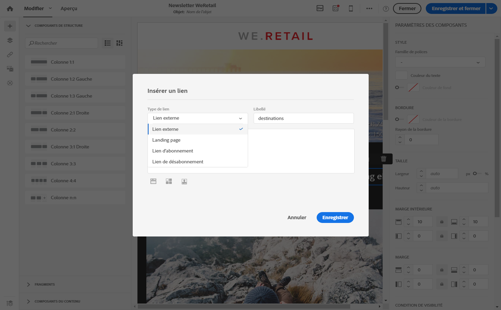
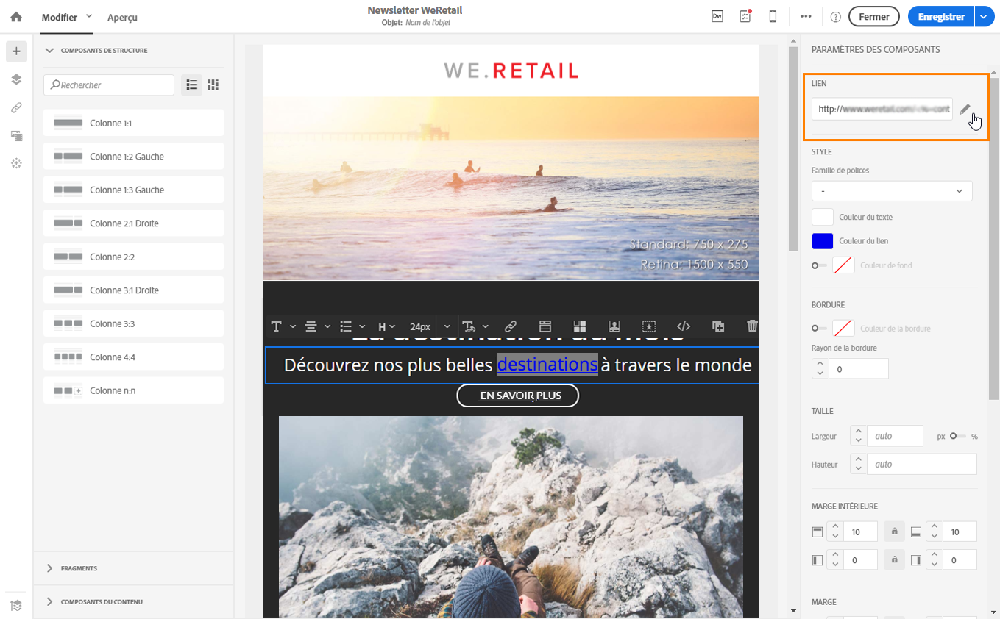
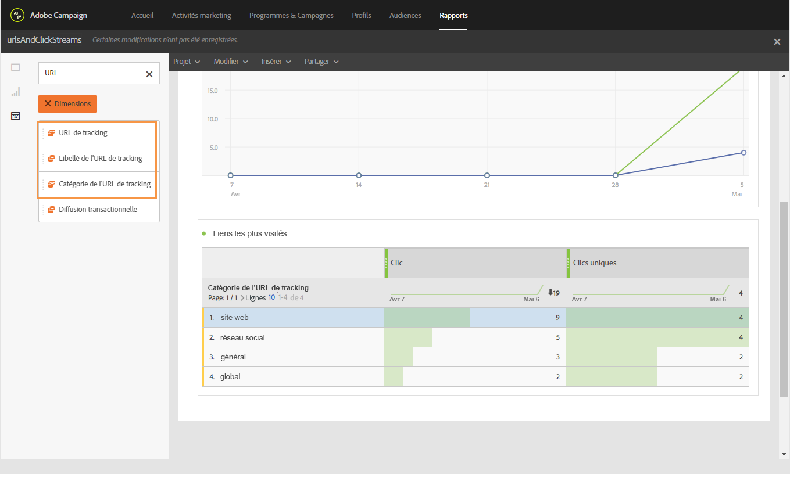

# Liens {#links}

## Insérer un lien {#inserting-a-link}

L'éditeur vous permet de personnaliser un email ou une landing page en insérant des liens dans les éléments du contenu HTML.

Vous pouvez insérer un lien sur tout élément de la page : image, mot, groupe de mots, bloc de texte, etc.

>[!NOTE]
>
>Les images ci-après illustrent l'insertion d'un lien à l'aide du [Concepteur d'email](../../designing/using/overview.md).

1. Sélectionnez un élément et cliquez sur **[!UICONTROL Insérer un lien]** dans la barre d'outils contextuelle.

   

1. Sélectionnez le type de lien que vous souhaitez créer :

   * **Lien externe** : insérez un lien vers une URL externe.

      Vous pouvez définir la personnalisation des URL. Voir [Personnaliser une URL](../../designing/using/using-reusable-content.md#creating-a-content-fragment).

   * **Landing page** : donnez accès à une landing page Adobe Campaign.
   * **Lien d'abonnement** : insérez un lien pour s'abonner à un service Adobe Campaign.
   * **Lien de désabonnement** : insérez un lien pour se désabonner d'un service Adobe Campaign.
   * **Lien définissant une action** : définissez une action qui se produit lors d'un clic sur la landing page.

      >[!NOTE]
      >
      >Ce type de lien est uniquement disponible pour les landing pages.

1. Vous pouvez modifier le texte qui s'affiche pour le destinataire.
1. Vous pouvez définir le comportement du navigateur lorsque l'utilisateur clique sur le lien (ouverture d'une nouvelle fenêtre, par exemple).

   >[!NOTE]
   >
   >La définition du comportement du navigateur s'applique uniquement aux landing pages.

1. Enregistrez vos modifications.

Une fois le lien créé, vous pouvez encore le modifier dans le volet Paramètres. Cliquez sur l'icône de crayon pour éditer ses paramètres.

Lorsque vous éditez un email à l'aide du [Concepteur d'email](../../designing/using/overview.md), vous pouvez facilement accéder aux liens créés à partir du tableau répertoriant toutes les URL incluses dans l'email et les modifier. Cette liste permet d'avoir une vue centrale et de localiser chaque URL dans le contenu de l'email. Pour y accéder, reportez-vous à la section [A propos des URL trackées](../../designing/using/links.md#about-tracked-urls).

>[!NOTE]
>
>Les URL personnalisées telles que l'**URL de la page miroir** ou le lien de **désabonnement** ne peuvent pas être modifiées depuis cette liste. Tous les autres liens sont modifiables.

**Rubriques connexes** :

* [Insertion d'un champ de personnalisation](../../designing/using/personalization.md#inserting-a-personalization-field)
* [Ajouter un bloc de contenu](../../designing/using/personalization.md#adding-a-content-block)
* [Définir un contenu dynamique](../../designing/using/personalization.md#defining-dynamic-content-in-an-email)

## A propos des URL trackées {#about-tracked-urls}

Adobe Campaign vous permet de tracker le comportement de vos destinataires lorsqu'ils cliquent sur une URL incluse dans un email. Pour plus d'informations sur le tracking, voir [cette section](../../sending/using/tracking-messages.md#about-tracking).

L'icône **[!UICONTROL Liens]** de la barre d'action affiche automatiquement la liste des toutes les URL de votre contenu qui seront trackées.

>[!NOTE]
>
>Par défaut, le tracking est activé. Cette fonctionnalité n'est disponible que pour les emails, même si le tracking a été activé dans Adobe Campaign. Pour plus d'informations sur les paramètres de tracking, voir [cette section](../../administration/using/configuring-email-channel.md#tracking-parameters).

L'URL, la catégorie, le libellé et le type de tracking de chaque lien peuvent être modifiés à partir de cette liste. Pour éditer un lien, cliquez sur l'icône de crayon correspondante.

Pour chaque URL trackée, vous pouvez définir le mode de tracking sur l'une des valeurs suivantes :

* **Tracké** : active le tracking sur cette URL.
* **Page miroir** : traite cette URL comme une URL de page miroir.
* **Jamais** : n'active jamais le tracking de cette URL. Ces informations sont enregistrées : si l'URL apparaît à nouveau dans un message futur, son tracking est automatiquement désactivé.
* **Opt-out** : traite cette URL comme une URL de désabonnement.

Vous pouvez aussi désactiver ou activer le tracking pour chaque URL.

>[!NOTE]
>
>Dans Adobe Campaign, toutes les URL de contenu sont trackées par défaut, à l'exception de l'**URL de la page miroir** et du lien de **désabonnement**.

Vous avez la possibilité de regrouper vos URL en éditant le champ **[!UICONTROL Catégorie]** en fonction de l'utilisation des URL dans le message. Ces catégories peuvent être des rapports affichés, comme dans le cas de [URL et flux de clics](../../reporting/using/urls-and-click-streams.md).

Lorsque vous créez un rapport, dans l'onglet **[!UICONTROL Composants]**, sélectionnez **[!UICONTROL Dimension]** et faites défiler la liste vers le bas afin d'accéder aux composants de tracking. Par exemple, faites glisser **[!UICONTROL Catégorie de l'URL de tracking]** et déposez-la dans l'espace de travail de façon à afficher les résultats en fonction de la catégorie de tracking de chaque URL faisant l'objet d'un clic.

Pour plus d'informations sur la création de rapports personnalisés, voir [cette section](../../reporting/using/about-dynamic-reports.md).
