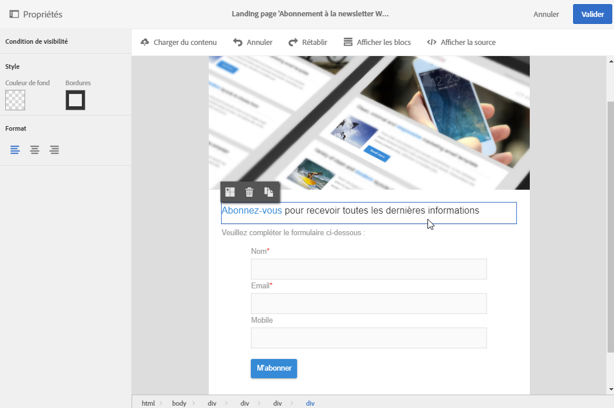
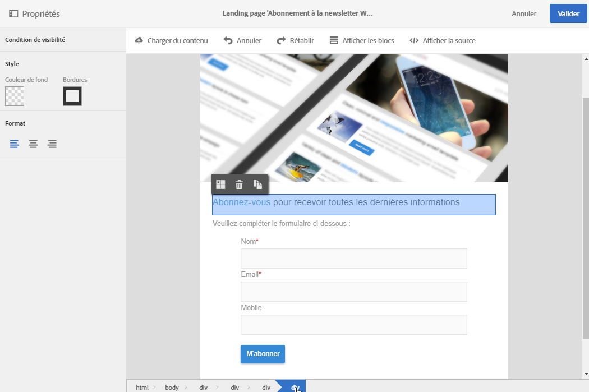
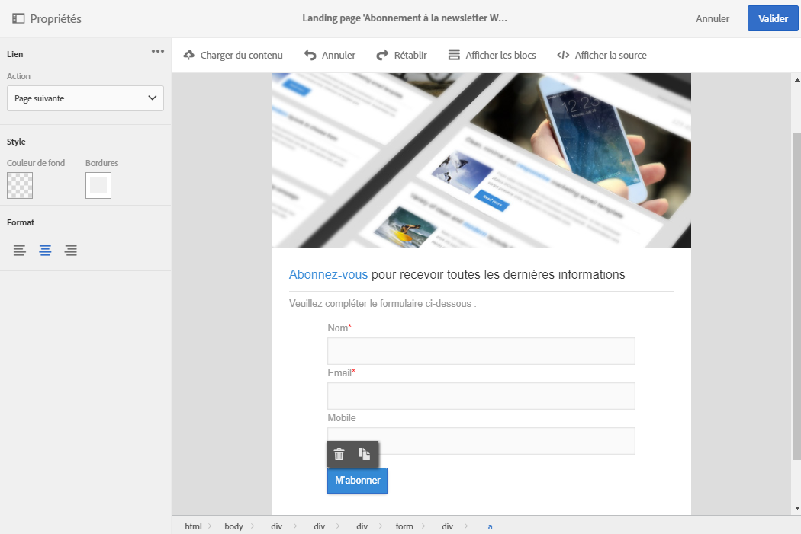
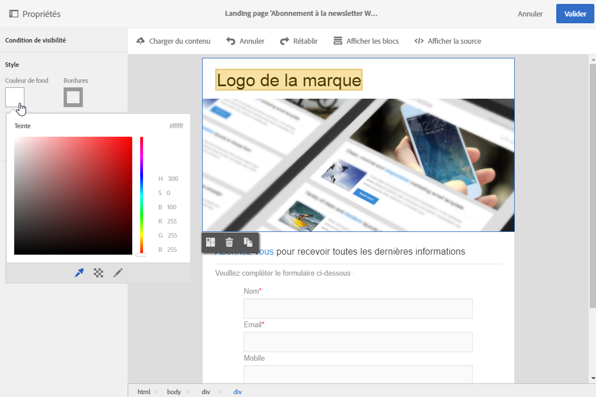
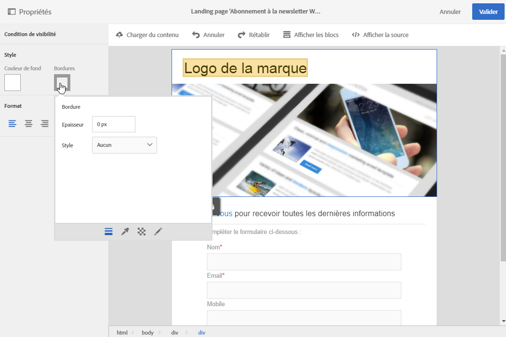
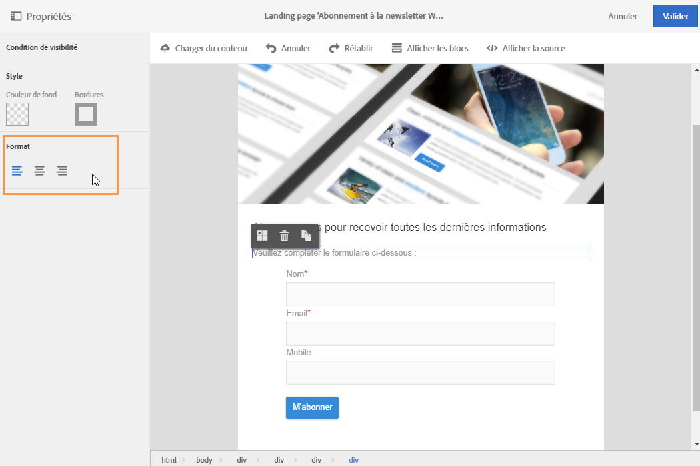

# Gérer la structure et le style d'une landing page{#managing-landing-page-structure-and-style}

## Gérer les blocs dans l'éditeur de contenu {#managing-blocks-in-the-content-editor}

The different HTML content elements are displayed in the landing page as blocks, corresponding to the **&lt;div&gt;** **&lt;/div&gt;** tag.

Pour agir sur un bloc, sélectionnez-le. Celui-ci est alors entouré d'un cadre de couleur bleue.

Quand un bloc est sélectionné, les objets parents de l'élément HTML correspondant s'affichent dans un fil d'Ariane situé au bas de la zone d'édition.

Au survol de la souris sur un élément de ce fil d'Ariane, l'élément est mis en surbrillance. Vous pouvez ainsi facilement naviguer entre les divers blocs et sélectionner précisément l'élément HTML que vous souhaitez modifier.

Utilisez les options disponibles dans la palette et la barre d'outils contextuelle pour modifier le bloc, le supprimer ou le dupliquer.

Pour les blocs contenant du texte, cliquez une seconde fois dans le bloc pour activer le mode d'édition du texte. Le contour du bloc devient vert. Vous pouvez alors sélectionner ou saisir du texte. Utilisez les options disponibles dans la palette et la barre d'outils contextuelle pour ajouter un lien ou modifier le formatage du texte.

Les paramètres définis pour un élément d'un bloc (liens, champs de personnalisation, blocs de contenu, etc.) peuvent être modifiés à tout moment à partir de la palette.

## Ajouter une bordure et un arrière-plan dans l'éditeur de contenu {#adding-a-border-and-a-background-in-the-content-editor}

Vous pouvez définir une **couleur de fond** en sélectionnant une couleur dans le nuancier. Cette couleur sera appliquée au bloc sélectionné.

Vous pouvez ajouter une **bordure** au bloc sélectionné.

## Changer le style du texte dans l'éditeur de contenu {#changing-the-text-style-in-the-content-editor}

Pour modifier le style du texte, vous devez vous placer à l'intérieur d'un bloc de texte.

Pour modifier l'alignement du texte, sélectionnez l'une des trois icônes suivantes dans la palette de gauche :

* **Aligner à gauche** : aligne le texte à gauche du bloc sélectionné (ajoute style="text-align: left;").
* **Centrer** : centre le texte du bloc sélectionné (ajoute style="text-align: center;").
* **Aligner à droite** : aligne le texte à droite du bloc sélectionné (ajoute style="text-align: right;").

Vous pouvez également utiliser la barre d'outils pour modifier les attributs de la police : changer la taille de la police, mettre le texte en gras ou en italique, le souligner ou changer la couleur du texte. Reportez-vous à [cette section](../../designing/using/landing-page-content-editor-interface.md#landing-page-editor-toolbar).
