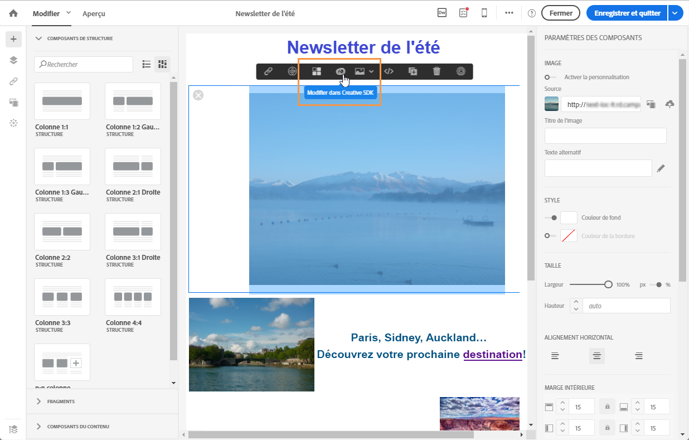
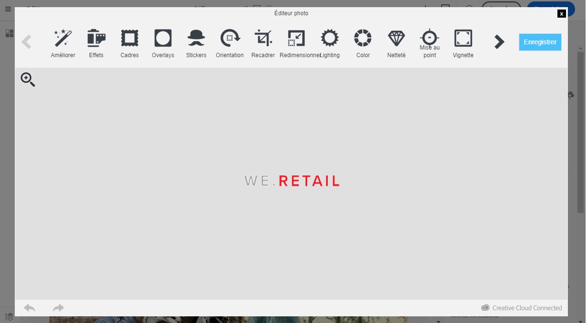

# Modifier des images avec le SDK Adobe Creative{#modifying-images-with-the-adobe-creative-sdk}

Vous pouvez éditer des images et utiliser un ensemble complet de fonctionnalités fourni par le SDK Adobe Creative afin d'améliorer vos images directement dans l'éditeur de contenu lors de l'édition des emails ou des landing pages.

L'éditeur d'images est un composant d'interface utilisateur puissant et complet pour éditer les images. Il permet d'appliquer des effets et des trames, des autocollants de grande qualité et de magnifiques superpositions, d'utiliser des fonctionnalités amusantes telles que les fonctionnalités de bascule et de décentrement et d'éclaboussures de couleur, d'effectuer des ajustements de niveau professionnel, etc.

Pour modifier une image avec Adobe Creative SDK :

1. Sélectionnez l'image.
1. Dans la barre d'outils, cliquez sur l'icône Creative Cloud.

   

1. Sélectionnez l'outil à utiliser pour modifier l'image parmi les icônes situées en haut de la fenêtre.

   

1. Lorsque les modifications sont terminées, cliquez sur **[!UICONTROL Enregistrer.]** L'image mise à jour est enregistrée sur le serveur Adobe Campaign et prête à être utilisée.

>[!NOTE]
>
>Il n'est pas possible de personnaliser les outils proposés dans l'éditeur d'images.

