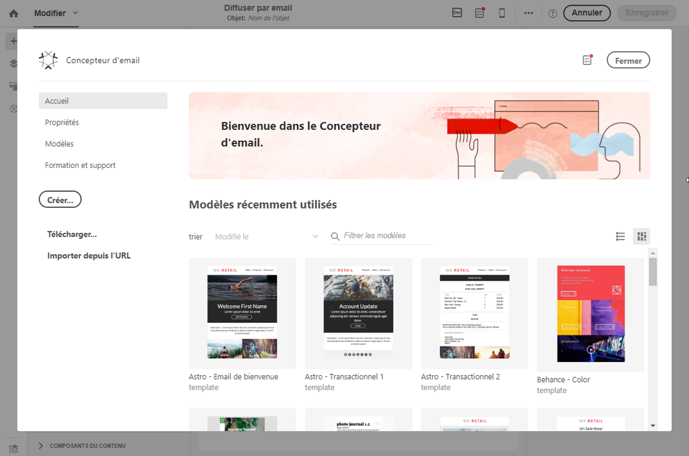
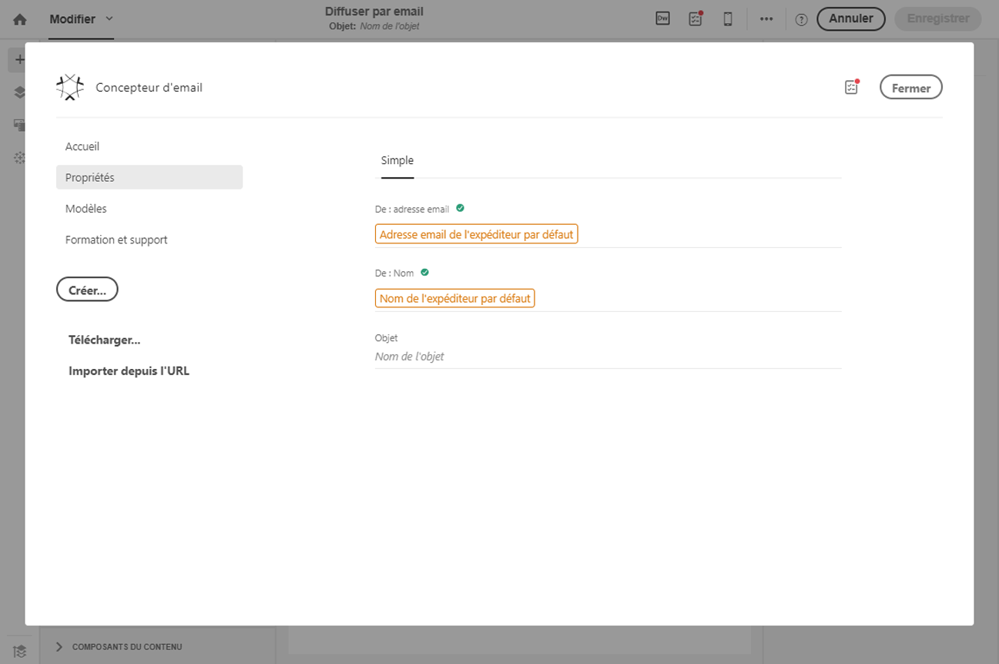
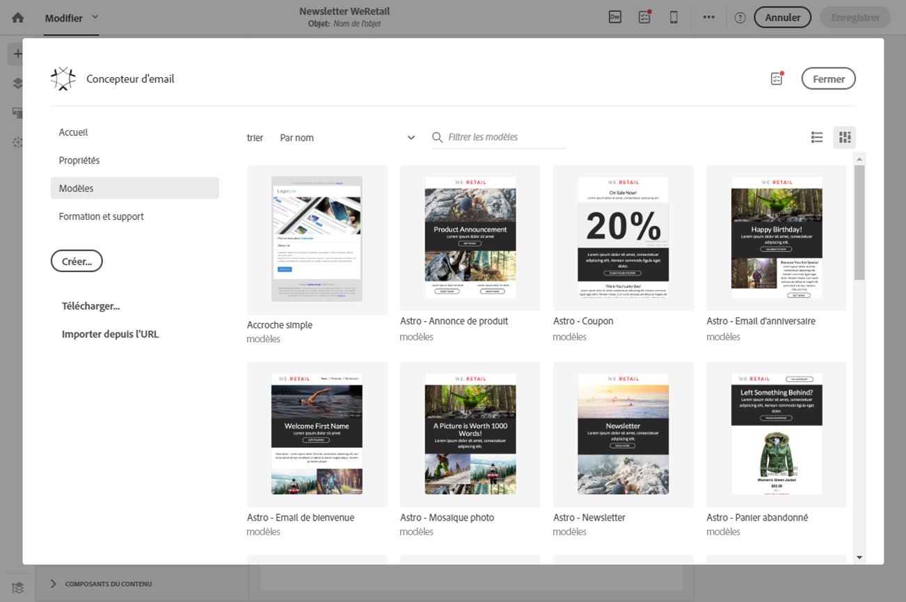

# Utiliser le Concepteur d'email {#email-designer}

## Présentation du Concepteur d'email {#about-the-email-designer}

Le Concepteur d'email permet de créer du contenu d'email et des modèles de contenu d'email. Il est compatible avec les emails simples, les emails transactionnels, les emails de test A/B, les emails multilingues et les emails récurrents.

Pour commencer à utiliser le Concepteur d'email, regardez cet [ensemble de vidéos](https://helpx.adobe.com/campaign/kt/acs/using/acs-email-designer-tutorial.html#GettingStarted) qui expliquent la fonctionnalité générale de l'outil et qui décrivent comment créer entièrement un email ou le concevoir à l'aide de modèles.

### Page d'accueil du Concepteur d'email {#email-designer-home-page}

Lors de la [création d'un email](../../channels/using/creating-an-email.md), la page d'accueil du **[!UICONTROL Concepteur d'email]** s'affiche automatiquement lors de la sélection du contenu de l'email.

L'onglet **[!UICONTROL Propriétés]** permet de modifier les détails d'un email, tels que le libellé, l'adresse et le nom de l'expéditeur ou l'objet. Vous pouvez également accéder à cet onglet en cliquant sur le libellé de l'email en haut de l'écran.

L'onglet **[!UICONTROL Modèles]** permet d'effectuer une sélection parmi les contenus HTML d'usine ou les modèles que vous avez déjà créés pour commencer rapidement à concevoir votre email. Voir [Modèles de contenu](../../designing/using/using-reusable-content.md#content-templates).

L'onglet **[!UICONTROL Formation et support]** permet d'accéder facilement à la documentation et aux tutoriels connexes.

Si vous ne sélectionnez pas de modèle, la page d'accueil du Concepteur d'email vous permet également de choisir le mode de conception de votre contenu :

* Cliquez sur le bouton **[!UICONTROL Créer]** pour commencer à créer entièrement un contenu. Voir [Concevoir entièrement un contenu d'email](../../designing/using/designing-from-scratch.md#designing-an-email-content-from-scratch).
* Cliquez sur le bouton **[!UICONTROL Télécharger]** pour télécharger un fichier à partir de votre ordinateur. Voir [Importer du contenu depuis un fichier](../../designing/using/using-existing-content.md#importing-content-from-a-file).
* Cliquez sur le bouton **[!UICONTROL Importer depuis l'URL]** pour récupérer du contenu existant à partir d'une URL. Voir [Importer du contenu depuis une URL](../../designing/using/using-existing-content.md#importing-content-from-a-url).

### Interface du Concepteur d'email {#email-designer-interface}

Le Concepteur d'email propose de nombreuses options qui permettent de créer, éditer et personnaliser tous les aspects de votre contenu.

L'interface est composée de plusieurs zones offrant des fonctionnalités différentes :

A partir des éléments disponibles dans la **palette** (1), déposez des composants de structure et des fragments de contenu dans l'**espace de travail** principal (2). Sélectionnez un composant ou un élément dans l'**espace de travail** (2) et personnalisez ses principales caractéristiques de style et d'affichage dans le volet **Paramètres** (3).

Accédez à des options et des paramètres plus généraux à partir de la **barre d'outils** principale (4).

>[!NOTE]
>
>Le volet **Paramètres** peut être déplacé vers la gauche selon la résolution et l'affichage de votre écran.

La **barre d'outils contextuelle** de l'interface de l'éditeur présente des fonctionnalités différentes selon la zone sélectionnée. Elle regroupe des boutons d'action et des boutons permettant de modifier le style du texte. Les modifications effectuées s'appliquent toujours sur la zone sélectionnée.

### Terminologie {#terminology}

**Modèles** : les modèles sont des structures d'email que vous pouvez créer et réutiliser pour plusieurs diffusions.

**Fragments** : un fragment est un composant réutilisable pouvant être référencé dans un ou plusieurs emails.

**Composants de structure** : éléments structurels définissant la disposition de l'email.

**Composants de contenu** : les composants de contenu sont des composants bruts et vides que vous pouvez éditer une fois qu'ils ont été placés dans un email.

### Bonnes pratiques relatives à la conception de contenu {#content-design-best-practices}

Pour utiliser correctement le Concepteur d'email et créer des emails optimaux aussi simplement que possible, il est recommandé d'appliquer les principes suivants :

* Utilisez les styles intégrés plutôt qu'une feuille CSS distincte et une feuille CSS dans la section &lt;head&gt; du code HTML. En utilisant les styles intégrés, vous pourrez optimiser l'enregistrement et la réutilisation des fragments de contenu.

   Voir [Ajouter des attributs de style intégrés](../../designing/using/styles.md#adding-inline-styling-attributes).

* Si vous importez des fichiers ZIP comportant le contenu HTML, utilisez une feuille CSS standard. Les feuilles de style SCSS ne sont pas prises en charge.

* Etablissez facilement votre marque en créant et en réutilisant des fragments de contenu pour assurer la cohérence de vos campagnes marketing.

   Voir [Créer un fragment de contenu](../../designing/using/using-reusable-content.md#creating-a-content-fragment).

* Lors de l'édition du **contenu d'un email** :

   Prévisualisez vos messages avant de les envoyer. Adobe Campaign permet de tester le rendu des emails à l'aide de Litmus. Voir à ce propos la section [Rendu des emails](../../sending/using/email-rendering.md).

D'autres bonnes pratiques générales et de conception relatives aux messages sont présentées dans le guide pas à pas Adobe Campaign suivant : [Bonnes pratiques de diffusion avec Adobe Campaign](https://docs.campaign.adobe.com/doc/standard/getting_started/en/ACS_DeliveryBestPractices.html).

### Limitations du Concepteur d'email  {#email-designer-limitations}

* Vous ne pouvez pas utiliser de champs de personnalisation dans un fragment. Pour plus d'informations sur les fragments, voir [cette section](../../designing/using/using-reusable-content.md#about-fragments).
<!--* You cannot save directly as a fragment some content of an email that you are editing within the Email Designer. You need to copy-paste the HTML corresponding to that content into a new fragment. For more on this, see [Saving content as a fragment](../../designing/using/using-reusable-content.md#saving-content-as-a-fragment).-->
* Lors de l'édition de styles, seules les polices web officiellement prises en charge par la plupart des clients d'email sont disponibles.
* Les styles ne peuvent pas être enregistrés en tant que thème pour une réutilisation ultérieure. Le style CSS peut toutefois être enregistré dans un modèle de contenu ou dans un email. Pour plus d'informations sur les styles, voir [cette section](../../designing/using/styles.md).

### Mise à jour des fragments {#email-designer-updates}

Le Concepteur d'email est sans cesse amélioré. Si vous avez créé un contenu d'email entièrement ou à partir d'un modèle d'usine ou si vous avez créé des fragments, le message de mise à jour suivant peut s'afficher lors de la prochaine ouverture du contenu :

Adobe recommande de mettre à jour votre contenu vers la dernière version pour éviter les problèmes comme ceux des collisions CSS. Cliquez sur **[!UICONTROL Mettre à jour maintenant]**.

Si une erreur se produit lors de la mise à jour du contenu, vérifiez votre code HTML et corrigez-le avant d'effectuer à nouveau cette mise à jour.

En ce qui concerne les fragments, tenez compte des points suivants :

* Si vous souhaitez ajouter un fragment à un nouvel email ou à un modèle et que ce message s'affiche, vous devez d'abord mettre à jour ce fragment.

* Si vous disposez de plusieurs fragments, vous devez mettre à jour ceux que vous souhaitez utiliser dans le contenu d'un email.

* Pour éviter tout impact sur les emails en cours qui ne sont pas encore préparés, vous pouvez choisir de ne pas mettre à jour certains fragments.

* Vous pouvez toujours envoyer des emails dans lequel un fragment n'étant pas à jour est déjà utilisé, mais celui-ci n'est pas modifiable.

* La mise à jour des fragments utilisés dans des emails déjà préparés n'a aucun impact sur ces derniers.